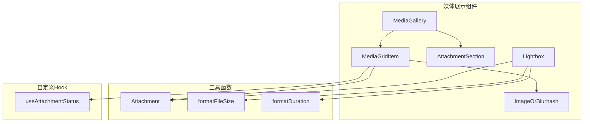
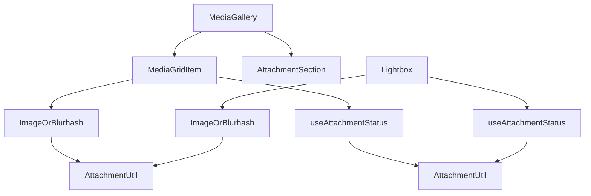
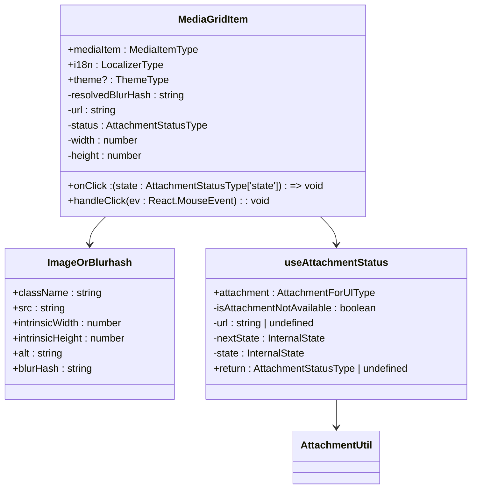
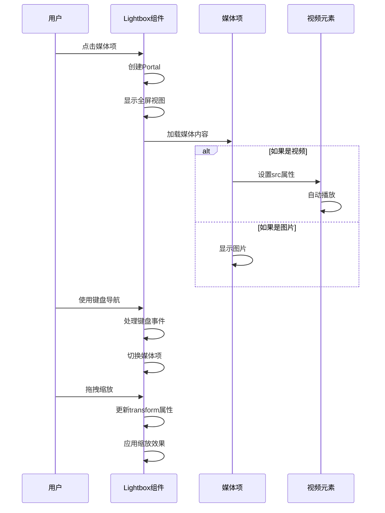
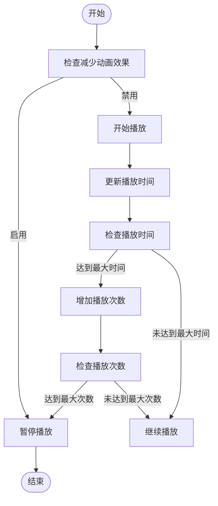
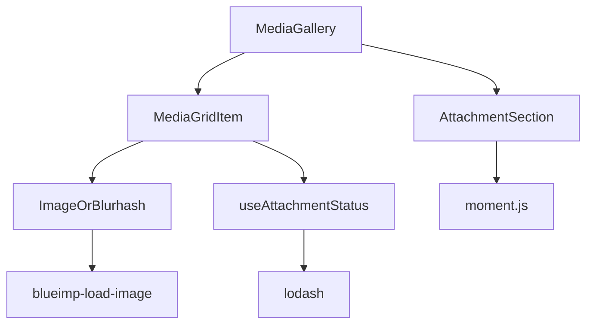

# 媒体展示

<cite>
**本文档引用的文件**   
- [MediaGallery.dom.tsx](file://ts/components/conversation/media-gallery/MediaGallery.dom.tsx)
- [MediaGridItem.dom.tsx](file://ts/components/conversation/media-gallery/MediaGridItem.dom.tsx)
- [Lightbox.dom.tsx](file://ts/components/Lightbox.dom.tsx)
- [GIF.dom.tsx](file://ts/components/conversation/GIF.dom.tsx)
- [ImageGrid.dom.tsx](file://ts/components/conversation/ImageGrid.dom.tsx)
- [useAttachmentStatus.std.ts](file://ts/hooks/useAttachmentStatus.std.ts)
- [Attachment.std.js](file://ts/util/Attachment.std.js)
- [VisualAttachment.dom.ts](file://ts/types/VisualAttachment.dom.ts)
</cite>

## 目录
1. [简介](#简介)
2. [项目结构](#项目结构)
3. [核心组件](#核心组件)
4. [架构概述](#架构概述)
5. [详细组件分析](#详细组件分析)
6. [依赖分析](#依赖分析)
7. [性能考虑](#性能考虑)
8. [故障排除指南](#故障排除指南)
9. [结论](#结论)

## 简介
本文档详细介绍了Signal-Desktop中媒体展示功能的实现，重点分析了MediaGallery组件如何管理和展示对话中的图片、视频和GIF文件。文档深入探讨了ImageGrid的响应式布局算法、Lightbox的全屏查看体验、以及GIF播放控制机制。同时，文档还记录了媒体文件的缩略图生成、懒加载策略、和内存管理优化。此外，还提供了组件的配置选项、事件回调接口，以及与附件下载系统的集成。最后，文档包含了性能优化建议，特别是针对大量媒体文件的虚拟滚动实现和缓存策略。

## 项目结构
Signal-Desktop的媒体展示功能主要集中在`ts/components/conversation`目录下，特别是`media-gallery`子目录。该目录包含了MediaGallery、MediaGridItem、AttachmentSection等核心组件。此外，`ts/components`目录下还有Lightbox、ImageOrBlurhash等通用组件。`ts/hooks`目录下提供了useAttachmentStatus等自定义Hook，用于管理附件状态。`ts/util`目录下包含了Attachment、formatFileSize等工具函数，用于处理附件相关的逻辑。

**Diagram sources**
- [MediaGallery.dom.tsx](file://ts/components/conversation/media-gallery/MediaGallery.dom.tsx)
- [MediaGridItem.dom.tsx](file://ts/components/conversation/media-gallery/MediaGridItem.dom.tsx)
- [Lightbox.dom.tsx](file://ts/components/Lightbox.dom.tsx)
- [Attachment.std.js](file://ts/util/Attachment.std.js)
- [formatFileSize.std.js](file://ts/util/formatFileSize.std.js)
- [formatDuration.std.js](file://ts/util/formatDuration.std.js)
- [useAttachmentStatus.std.ts](file://ts/hooks/useAttachmentStatus.std.ts)

**Section sources**
- [MediaGallery.dom.tsx](file://ts/components/conversation/media-gallery/MediaGallery.dom.tsx)
- [MediaGridItem.dom.tsx](file://ts/components/conversation/media-gallery/MediaGridItem.dom.tsx)
- [Lightbox.dom.tsx](file://ts/components/Lightbox.dom.tsx)
- [Attachment.std.js](file://ts/util/Attachment.std.js)
- [formatFileSize.std.js](file://ts/util/formatFileSize.std.js)
- [formatDuration.std.js](file://ts/util/formatDuration.std.js)
- [useAttachmentStatus.std.ts](file://ts/hooks/useAttachmentStatus.std.ts)

## 核心组件
MediaGallery组件是Signal-Desktop中媒体展示的核心，负责管理和展示对话中的图片、视频和GIF文件。它通过MediaGridItem组件来渲染每个媒体项，并使用Lightbox组件提供全屏查看体验。MediaGridItem组件利用ImageOrBlurhash组件来显示媒体的缩略图或模糊哈希，同时通过useAttachmentStatus Hook来管理附件的下载状态。Lightbox组件则提供了全屏查看、缩放、导航等功能，支持图片、视频和GIF的播放。

**Section sources**
- [MediaGallery.dom.tsx](file://ts/components/conversation/media-gallery/MediaGallery.dom.tsx)
- [MediaGridItem.dom.tsx](file://ts/components/conversation/media-gallery/MediaGridItem.dom.tsx)
- [Lightbox.dom.tsx](file://ts/components/Lightbox.dom.tsx)
- [ImageOrBlurhash.dom.js](file://ts/components/ImageOrBlurhash.dom.js)
- [useAttachmentStatus.std.ts](file://ts/hooks/useAttachmentStatus.std.ts)

## 架构概述
Signal-Desktop的媒体展示功能采用了分层架构，将UI组件、状态管理和工具函数分离。MediaGallery组件作为顶层容器，负责组织和管理媒体项的展示。它通过props将数据和回调函数传递给子组件，如MediaGridItem和AttachmentSection。MediaGridItem组件负责渲染单个媒体项，利用ImageOrBlurhash组件显示缩略图或模糊哈希，并通过useAttachmentStatus Hook获取附件的下载状态。Lightbox组件则提供全屏查看功能，支持图片、视频和GIF的播放，并通过动画和过渡效果提升用户体验。

**Diagram sources**
- [MediaGallery.dom.tsx](file://ts/components/conversation/media-gallery/MediaGallery.dom.tsx)
- [MediaGridItem.dom.tsx](file://ts/components/conversation/media-gallery/MediaGridItem.dom.tsx)
- [AttachmentSection.dom.js](file://ts/components/conversation/media-gallery/AttachmentSection.dom.js)
- [ImageOrBlurhash.dom.js](file://ts/components/ImageOrBlurhash.dom.js)
- [useAttachmentStatus.std.ts](file://ts/hooks/useAttachmentStatus.std.ts)
- [Attachment.std.js](file://ts/util/Attachment.std.js)

## 详细组件分析

### MediaGallery组件分析
MediaGallery组件是媒体展示的入口点，负责组织和管理媒体项的展示。它接收来自父组件的媒体数据和回调函数，并通过props传递给子组件。MediaGallery组件使用groupMediaItemsByDate函数将媒体项按日期分组，并通过AttachmentSection组件渲染每个分组。此外，MediaGallery组件还通过useIntersectionObserver Hook实现懒加载，当用户滚动到页面底部时，自动加载更多媒体项。

**Section sources**
- [MediaGallery.dom.tsx](file://ts/components/conversation/media-gallery/MediaGallery.dom.tsx)
- [groupMediaItemsByDate.std.js](file://ts/components/conversation/media-gallery/groupMediaItemsByDate.std.js)
- [useIntersectionObserver.std.js](file://ts/hooks/useIntersectionObserver.std.js)

### MediaGridItem组件分析
MediaGridItem组件负责渲染单个媒体项，利用ImageOrBlurhash组件显示媒体的缩略图或模糊哈希。它通过useAttachmentStatus Hook获取附件的下载状态，并根据状态显示相应的UI元素，如下载按钮、进度条等。MediaGridItem组件还通过onClick回调函数处理用户的点击事件，如打开Lightbox、开始或取消下载等。

**Diagram sources**
- [MediaGridItem.dom.tsx](file://ts/components/conversation/media-gallery/MediaGridItem.dom.tsx)
- [ImageOrBlurhash.dom.js](file://ts/components/ImageOrBlurhash.dom.js)
- [useAttachmentStatus.std.ts](file://ts/hooks/useAttachmentStatus.std.ts)
- [Attachment.std.js](file://ts/util/Attachment.std.js)

### Lightbox组件分析
Lightbox组件提供全屏查看体验，支持图片、视频和GIF的播放。它通过createPortal将内容渲染到body元素下，确保全屏效果。Lightbox组件支持键盘导航、鼠标拖拽缩放、触摸手势等交互方式。它还通过动画和过渡效果提升用户体验，如淡入淡出、滑动等。Lightbox组件通过onNextAttachment和onPrevAttachment回调函数处理媒体项的导航，并通过onSelectAttachment回调函数处理媒体项的选择。

**Diagram sources**
- [Lightbox.dom.tsx](file://ts/components/Lightbox.dom.tsx)
- [MediaGridItem.dom.tsx](file://ts/components/conversation/media-gallery/MediaGridItem.dom.tsx)

### GIF播放控制机制
GIF播放控制机制通过GIF组件实现，该组件利用HTML5的video元素来播放GIF文件。GIF组件通过useReducedMotion Hook检测用户的偏好设置，如果用户启用了减少动画效果，则自动暂停GIF播放。GIF组件还通过useState Hook管理播放状态，如播放次数、播放时间等。当GIF播放完成指定次数后，自动暂停播放。

**Diagram sources**
- [GIF.dom.tsx](file://ts/components/conversation/GIF.dom.tsx)
- [useReducedMotion.dom.js](file://ts/hooks/useReducedMotion.dom.js)

## 依赖分析
MediaGallery组件依赖于多个子组件和工具函数，如MediaGridItem、AttachmentSection、ImageOrBlurhash等。这些组件通过props接收数据和回调函数，并通过自定义Hook如useAttachmentStatus获取附件状态。此外，MediaGallery组件还依赖于第三方库如moment.js进行日期格式化，lodash进行函数式编程等。

**Diagram sources**
- [MediaGallery.dom.tsx](file://ts/components/conversation/media-gallery/MediaGallery.dom.tsx)
- [MediaGridItem.dom.tsx](file://ts/components/conversation/media-gallery/MediaGridItem.dom.tsx)
- [AttachmentSection.dom.js](file://ts/components/conversation/media-gallery/AttachmentSection.dom.js)
- [ImageOrBlurhash.dom.js](file://ts/components/ImageOrBlurhash.dom.js)
- [useAttachmentStatus.std.ts](file://ts/hooks/useAttachmentStatus.std.ts)
- [moment.js](file://node_modules/moment/moment.js)
- [lodash](file://node_modules/lodash/lodash.js)
- [blueimp-load-image](file://components/blueimp-load-image)

## 性能考虑
为了优化性能，Signal-Desktop采用了多种策略。首先，通过useIntersectionObserver Hook实现懒加载，只有当媒体项进入视口时才加载其内容。其次，通过useDelayedValue Hook延迟更新附件状态，避免频繁的UI重绘。此外，通过ImageOrBlurhash组件显示模糊哈希，减少初始加载时间。最后，通过虚拟滚动和缓存策略，减少内存占用和提高渲染性能。

**Section sources**
- [useIntersectionObserver.std.js](file://ts/hooks/useIntersectionObserver.std.js)
- [useDelayedValue.std.js](file://ts/hooks/useDelayedValue.std.js)
- [ImageOrBlurhash.dom.js](file://ts/components/ImageOrBlurhash.dom.js)

## 故障排除指南
在使用媒体展示功能时，可能会遇到一些常见问题。例如，媒体项无法加载，可能是由于网络问题或附件状态错误。此时，可以检查附件的url属性是否正确，以及pending和path属性是否符合预期。如果GIF无法播放，可能是由于浏览器不支持或用户启用了减少动画效果。此时，可以检查GIF组件的_isForceTapToPlay属性是否正确设置。

**Section sources**
- [MediaGridItem.dom.tsx](file://ts/components/conversation/media-gallery/MediaGridItem.dom.tsx)
- [GIF.dom.tsx](file://ts/components/conversation/GIF.dom.tsx)

## 结论
Signal-Desktop的媒体展示功能通过分层架构和组件化设计，实现了高效、灵活的媒体管理和展示。通过懒加载、虚拟滚动、缓存等策略，优化了性能和用户体验。未来可以进一步优化GIF播放控制机制，支持更多格式和交互方式。