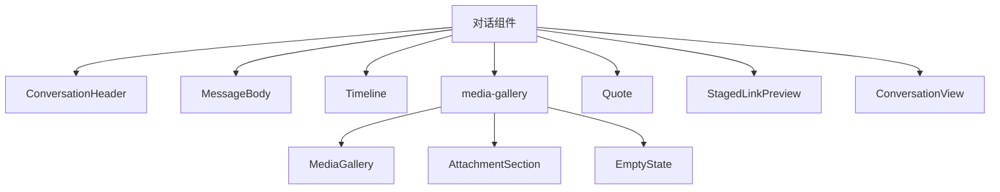
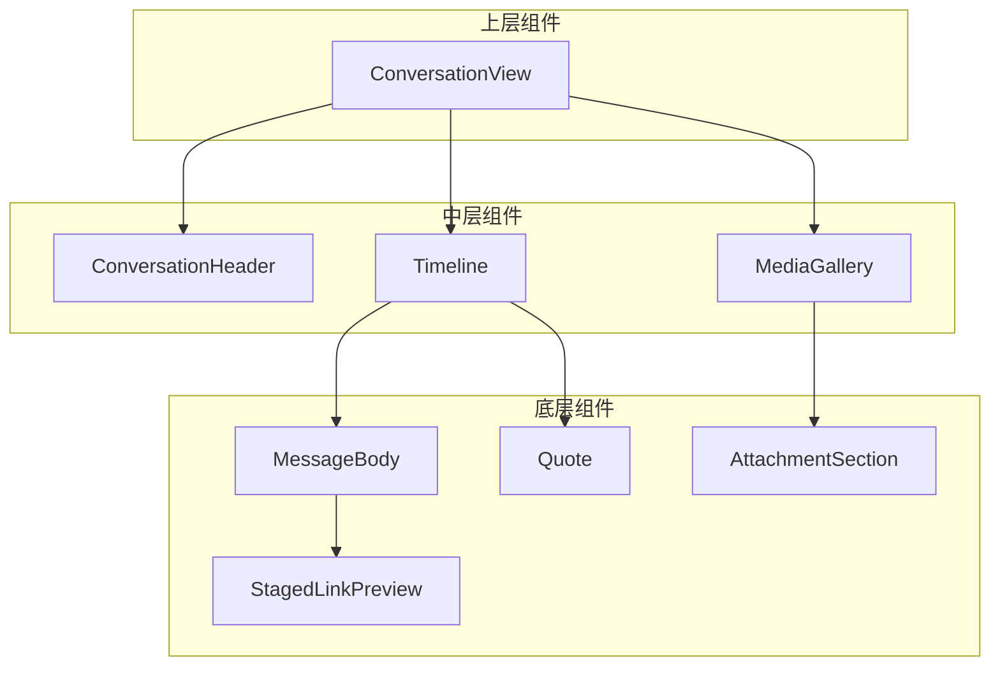
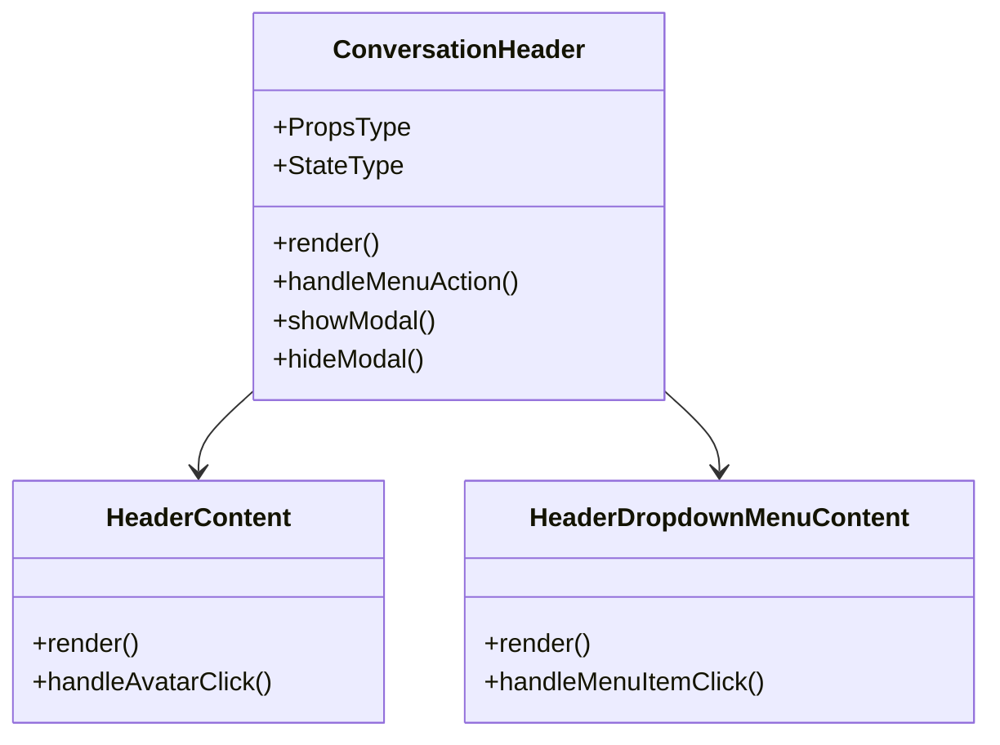
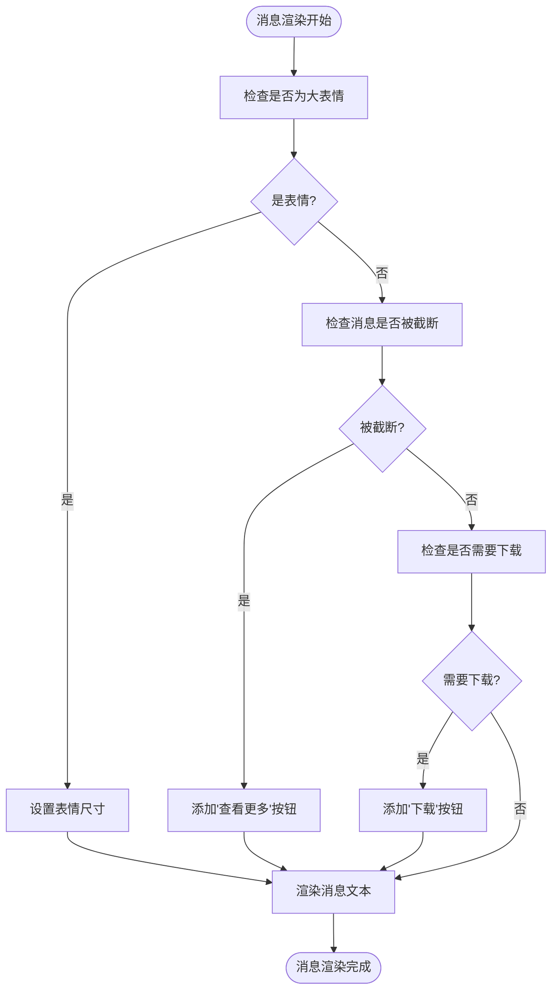
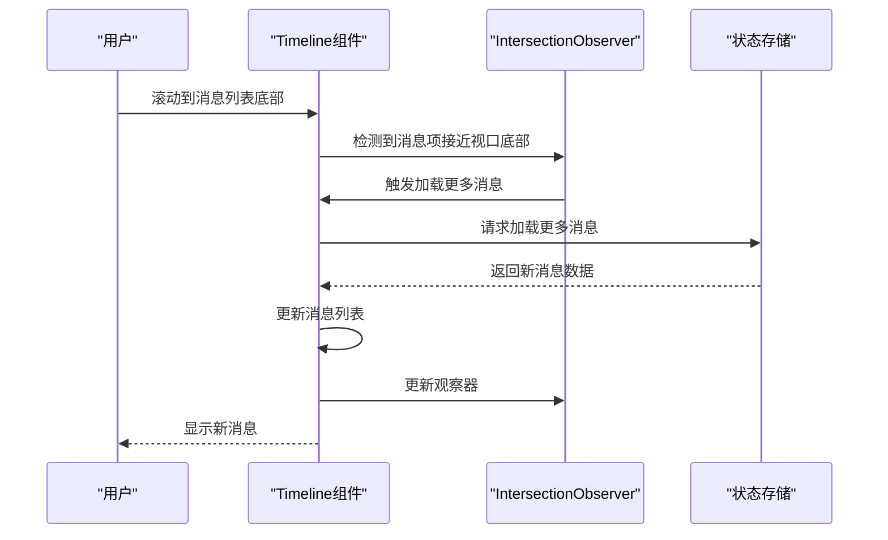
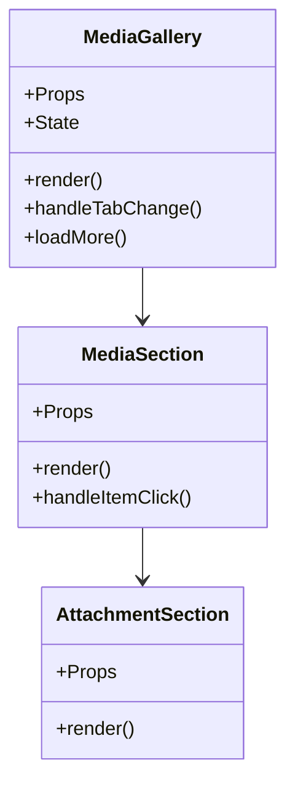
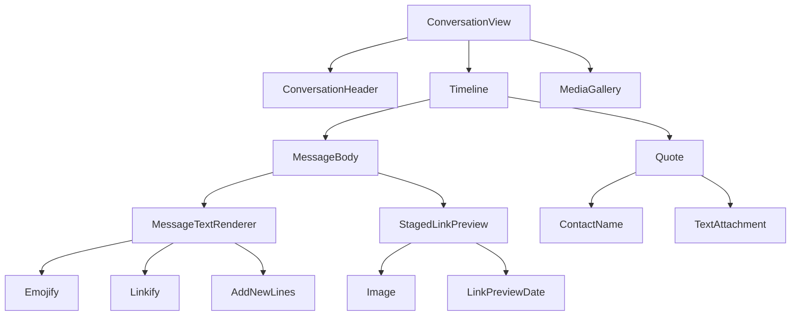

# 对话组件

<cite>
**本文档中引用的文件**  
- [ConversationHeader.dom.tsx](file://ts/components/conversation/ConversationHeader.dom.tsx)
- [MessageBody.dom.tsx](file://ts/components/conversation/MessageBody.dom.tsx)
- [Timeline.dom.tsx](file://ts/components/conversation/Timeline.dom.tsx)
- [MediaGallery.dom.tsx](file://ts/components/conversation/media-gallery/MediaGallery.dom.tsx)
- [MessageTextRenderer.dom.tsx](file://ts/components/conversation/MessageTextRenderer.dom.tsx)
- [Quote.dom.tsx](file://ts/components/conversation/Quote.dom.tsx)
- [StagedLinkPreview.dom.tsx](file://ts/components/conversation/StagedLinkPreview.dom.tsx)
- [ConversationView.dom.tsx](file://ts/components/conversation/ConversationView.dom.tsx)
</cite>

## 目录
1. [简介](#简介)
2. [项目结构](#项目结构)
3. [核心组件](#核心组件)
4. [架构概述](#架构概述)
5. [详细组件分析](#详细组件分析)
6. [依赖关系分析](#依赖关系分析)
7. [性能考虑](#性能考虑)
8. [故障排除指南](#故障排除指南)
9. [结论](#结论)

## 简介
本文档深入分析Signal-Desktop应用中的对话组件，涵盖消息渲染、媒体展示、投票消息、对话详情等核心功能的实现。详细解释ConversationHeader组件的标题渲染逻辑、MessageBody组件的消息内容解析与显示、Timeline组件的消息时间线布局，以及media-gallery中的媒体预览功能。提供每个组件的props接口定义、事件处理机制和状态管理策略。记录消息气泡、引用回复、链接预览等复杂UI元素的实现细节。包含实际使用示例和性能优化建议，特别是针对长对话的虚拟滚动实现。

## 项目结构
Signal-Desktop的对话组件主要位于`ts/components/conversation/`目录下，包含多个子组件和功能模块。核心组件包括ConversationHeader、MessageBody、Timeline等，而媒体相关功能则组织在media-gallery子目录中。组件采用TypeScript编写，遵循React函数式组件和类组件混合的模式，通过props传递数据和行为。

**图表来源**
- [ConversationHeader.dom.tsx](file://ts/components/conversation/ConversationHeader.dom.tsx)
- [MessageBody.dom.tsx](file://ts/components/conversation/MessageBody.dom.tsx)
- [Timeline.dom.tsx](file://ts/components/conversation/Timeline.dom.tsx)
- [MediaGallery.dom.tsx](file://ts/components/conversation/media-gallery/MediaGallery.dom.tsx)

**章节来源**
- [ConversationHeader.dom.tsx](file://ts/components/conversation/ConversationHeader.dom.tsx)
- [MessageBody.dom.tsx](file://ts/components/conversation/MessageBody.dom.tsx)
- [Timeline.dom.tsx](file://ts/components/conversation/Timeline.dom.tsx)
- [MediaGallery.dom.tsx](file://ts/components/conversation/media-gallery/MediaGallery.dom.tsx)

## 核心组件
Signal-Desktop的对话组件由多个核心组件构成，每个组件负责特定的功能。ConversationHeader组件处理对话标题和操作按钮的渲染，MessageBody组件负责消息内容的解析和显示，Timeline组件管理消息时间线的布局和滚动行为，而media-gallery则专门处理媒体文件的预览和展示。

**章节来源**
- [ConversationHeader.dom.tsx](file://ts/components/conversation/ConversationHeader.dom.tsx)
- [MessageBody.dom.tsx](file://ts/components/conversation/MessageBody.dom.tsx)
- [Timeline.dom.tsx](file://ts/components/conversation/Timeline.dom.tsx)
- [MediaGallery.dom.tsx](file://ts/components/conversation/media-gallery/MediaGallery.dom.tsx)

## 架构概述
对话组件的整体架构采用分层设计，上层组件如ConversationView负责整合各个子组件，形成完整的对话界面。底层组件如MessageBody和Timeline则专注于特定功能的实现。组件间通过props传递数据和回调函数，实现松耦合的通信机制。状态管理主要依赖React的useState和useEffect钩子，部分复杂状态通过Redux进行管理。

**图表来源**
- [ConversationView.dom.tsx](file://ts/components/conversation/ConversationView.dom.tsx)
- [ConversationHeader.dom.tsx](file://ts/components/conversation/ConversationHeader.dom.tsx)
- [Timeline.dom.tsx](file://ts/components/conversation/Timeline.dom.tsx)
- [MediaGallery.dom.tsx](file://ts/components/conversation/media-gallery/MediaGallery.dom.tsx)

## 详细组件分析

### ConversationHeader组件分析
ConversationHeader组件负责渲染对话的标题区域，包括联系人头像、名称、状态信息以及操作按钮。组件根据对话类型（个人或群组）和当前状态（是否归档、静音等）动态调整UI元素的显示。

#### Props接口定义
- `conversation`: 对话的基本信息，包括ID、类型、标题、头像URL等
- `conversationName`: 联系人名称数据
- `outgoingCallButtonStyle`: 外出通话按钮的显示样式
- `onConversationAccept`: 接受对话请求的回调函数
- `onConversationArchive`: 归档对话的回调函数
- `onConversationBlock`: 屏蔽联系人的回调函数
- `onConversationDelete`: 删除对话的回调函数
- `onOutgoingAudioCall`: 发起音频通话的回调函数
- `onOutgoingVideoCall`: 发起视频通话的回调函数

#### 事件处理机制
组件使用React的useCallback钩子创建记忆化的回调函数，避免不必要的重新渲染。通过AxoDropdownMenu组件实现下拉菜单的交互，用户点击更多按钮时显示包含各种操作选项的菜单。

#### 状态管理策略
使用useState钩子管理多个局部状态，如`hasCustomDisappearingTimeoutModal`（是否显示自定义消失时间模态框）、`hasDeleteMessagesConfirmation`（是否显示删除消息确认对话框）等。这些状态控制着各种模态框和确认对话框的显示与隐藏。

**图表来源**
- [ConversationHeader.dom.tsx](file://ts/components/conversation/ConversationHeader.dom.tsx)

**章节来源**
- [ConversationHeader.dom.tsx](file://ts/components/conversation/ConversationHeader.dom.tsx)

### MessageBody组件分析
MessageBody组件负责解析和渲染消息内容，支持文本、表情、链接、提及等多种内容类型。组件通过MessageTextRenderer子组件实现复杂的内容渲染逻辑。

#### 消息内容解析与显示
组件首先检查消息内容是否包含大表情（jumbomoji），如果是单个或少量表情，则使用特殊的大尺寸显示。然后根据消息是否被截断或需要下载，决定是否显示"查看更多"或"下载完整消息"按钮。

#### Props接口定义
- `text`: 消息的原始文本内容
- `bodyRanges`: 消息中的格式化范围，如提及、链接等
- `direction`: 消息方向（incoming/outgoing）
- `disableJumbomoji`: 是否禁用大表情显示
- `disableLinks`: 是否禁用链接交互
- `onExpandSpoiler`: 展开隐藏内容的回调函数
- `onIncreaseTextLength`: 增加文本长度的回调函数

#### 复杂UI元素实现
- **消息气泡**: 通过CSS类名控制不同方向消息的样式
- **引用回复**: 使用MessageTextRenderer组件解析并显示引用内容
- **链接预览**: 通过shouldLinkifyMessage函数判断是否显示链接预览

**图表来源**
- [MessageBody.dom.tsx](file://ts/components/conversation/MessageBody.dom.tsx)
- [MessageTextRenderer.dom.tsx](file://ts/components/conversation/MessageTextRenderer.dom.tsx)

**章节来源**
- [MessageBody.dom.tsx](file://ts/components/conversation/MessageBody.dom.tsx)

### Timeline组件分析
Timeline组件负责管理对话消息的时间线布局和滚动行为，支持长对话的虚拟滚动和性能优化。

#### 消息时间线布局
组件使用IntersectionObserver API来检测消息项的可见性，从而实现虚拟滚动。只有当消息项进入视口时，才会触发加载更多消息的逻辑。通过getScrollAnchorBeforeUpdate函数在组件更新前保存滚动位置，确保用户体验的连续性。

#### 虚拟滚动实现
- **IntersectionObserver**: 监听消息项的交叉状态，当消息项接近视口底部时加载更多消息
- **ScrollLock**: 防止在内容变化时发生意外的滚动
- **Throttling**: 对标记消息已读的操作进行节流，避免频繁调用

#### 性能优化建议
- 使用memo和useCallback钩子避免不必要的重新渲染
- 通过discardMessages函数在消息过多时丢弃旧消息，保持内存使用效率
- 利用requestAnimationFrame优化滚动动画

**图表来源**
- [Timeline.dom.tsx](file://ts/components/conversation/Timeline.dom.tsx)

**章节来源**
- [Timeline.dom.tsx](file://ts/components/conversation/Timeline.dom.tsx)

### media-gallery组件分析
media-gallery组件专门处理对话中的媒体文件预览和展示，支持图片、音频、文档和链接等多种媒体类型。

#### 媒体预览功能
组件根据当前选中的标签页（tab）显示相应类型的媒体文件。使用groupMediaItemsByDate函数按日期对媒体项进行分组，并为每个日期组创建附件部分（AttachmentSection）。

#### Props接口定义
- `media`: 图片媒体项数组
- `audio`: 音频媒体项数组
- `documents`: 文档媒体项数组
- `links`: 链接预览项数组
- `tab`: 当前选中的标签页
- `showLightbox`: 显示图片灯箱的回调函数
- `playAudio`: 播放音频的回调函数
- `saveAttachment`: 保存附件的回调函数

#### 交互机制
- **图片预览**: 点击图片缩略图打开灯箱查看大图
- **音频播放**: 点击音频项开始播放
- **文档保存**: 点击文档项触发下载保存
- **链接打开**: 点击链接预览在浏览器中打开

**图表来源**
- [MediaGallery.dom.tsx](file://ts/components/conversation/media-gallery/MediaGallery.dom.tsx)
- [AttachmentSection.dom.tsx](file://ts/components/conversation/media-gallery/AttachmentSection.dom.tsx)

**章节来源**
- [MediaGallery.dom.tsx](file://ts/components/conversation/media-gallery/MediaGallery.dom.tsx)

## 依赖关系分析
对话组件之间存在明确的依赖关系，上层组件依赖底层组件实现具体功能。通过分析组件间的导入关系，可以清晰地看到整个对话界面的构建层次。

**图表来源**
- [ConversationView.dom.tsx](file://ts/components/conversation/ConversationView.dom.tsx)
- [ConversationHeader.dom.tsx](file://ts/components/conversation/ConversationHeader.dom.tsx)
- [Timeline.dom.tsx](file://ts/components/conversation/Timeline.dom.tsx)
- [MessageBody.dom.tsx](file://ts/components/conversation/MessageBody.dom.tsx)
- [MessageTextRenderer.dom.tsx](file://ts/components/conversation/MessageTextRenderer.dom.tsx)
- [Quote.dom.tsx](file://ts/components/conversation/Quote.dom.tsx)
- [StagedLinkPreview.dom.tsx](file://ts/components/conversation/StagedLinkPreview.dom.tsx)

## 性能考虑
对话组件在设计时充分考虑了性能优化，特别是在处理长对话和大量媒体文件时。主要的性能优化策略包括：

1. **虚拟滚动**: Timeline组件使用IntersectionObserver实现虚拟滚动，只渲染视口内的消息项
2. **记忆化**: 广泛使用React.memo、useMemo和useCallback避免不必要的重新渲染
3. **节流**: 对频繁触发的操作（如标记消息已读）进行节流处理
4. **懒加载**: 媒体文件和链接预览按需加载，减少初始加载时间
5. **状态管理**: 合理使用局部状态和全局状态，避免状态过度共享

对于长对话的虚拟滚动实现，建议：
- 保持消息项的高度相对一致，便于计算滚动位置
- 使用requestAnimationFrame优化滚动动画
- 在消息过多时适时清理旧消息，防止内存占用过高
- 利用浏览器的will-change CSS属性提示渲染优化

**章节来源**
- [Timeline.dom.tsx](file://ts/components/conversation/Timeline.dom.tsx)
- [MessageBody.dom.tsx](file://ts/components/conversation/MessageBody.dom.tsx)
- [MediaGallery.dom.tsx](file://ts/components/conversation/media-gallery/MediaGallery.dom.tsx)

## 故障排除指南
在使用对话组件时可能遇到的常见问题及解决方案：

1. **消息未及时标记为已读**
   - 检查`markMessageRead`函数的调用频率，确保没有被节流过度
   - 确认IntersectionObserver正确配置，能够检测到消息项的可见性

2. **媒体文件无法预览**
   - 检查媒体文件的URL是否有效
   - 确认文件类型是否被支持
   - 检查网络连接状态

3. **长对话滚动卡顿**
   - 确保虚拟滚动正确实现
   - 检查是否有不必要的重新渲染
   - 考虑增加消息项的缓存机制

4. **链接预览不显示**
   - 检查链接是否符合预览条件
   - 确认服务器能够正确获取链接元数据
   - 检查网络请求是否被阻止

**章节来源**
- [Timeline.dom.tsx](file://ts/components/conversation/Timeline.dom.tsx)
- [MessageBody.dom.tsx](file://ts/components/conversation/MessageBody.dom.tsx)
- [StagedLinkPreview.dom.tsx](file://ts/components/conversation/StagedLinkPreview.dom.tsx)

## 结论
Signal-Desktop的对话组件设计精良，功能完整，性能优化到位。通过模块化的组件设计，实现了高内聚低耦合的架构。组件间的职责划分清晰，通过props和回调函数实现灵活的通信机制。在处理复杂功能如消息渲染、媒体预览和长对话管理时，采用了先进的前端技术如IntersectionObserver和虚拟滚动，确保了良好的用户体验。建议在实际使用中遵循文档中的最佳实践，充分利用组件提供的扩展点和配置选项，以满足不同的业务需求。