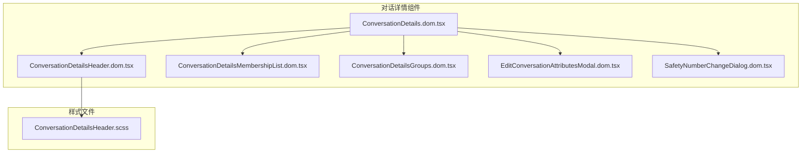
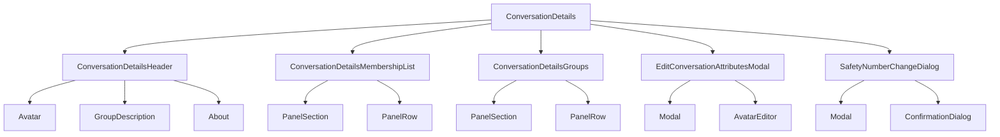
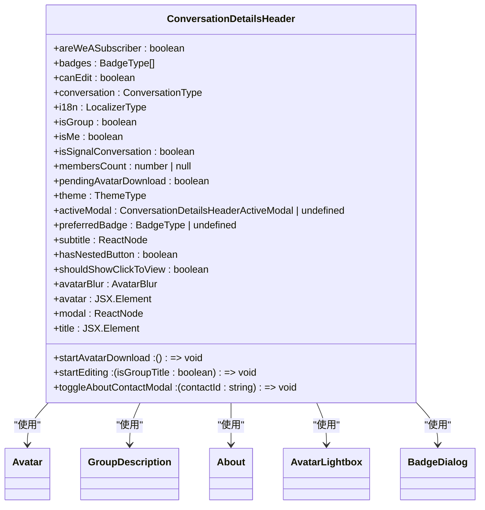
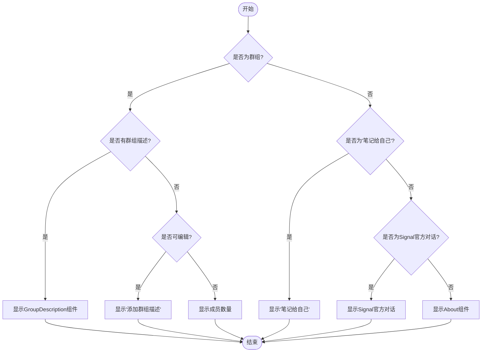
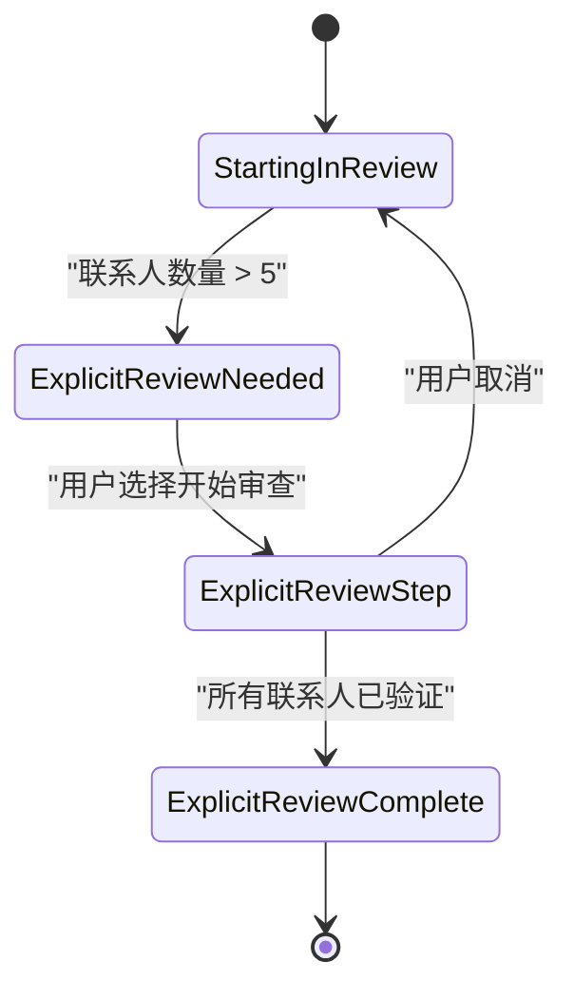
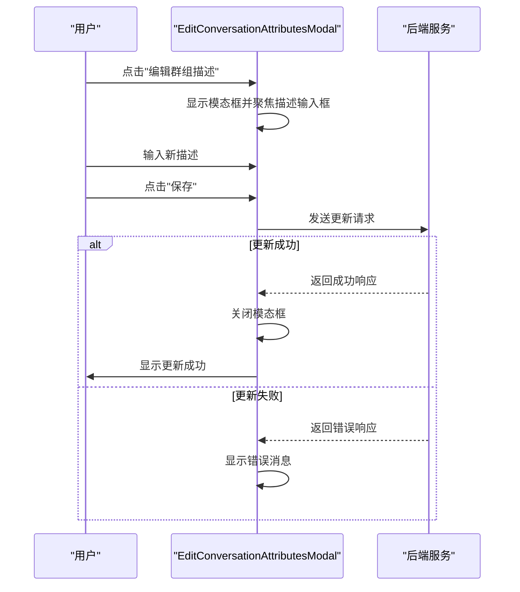
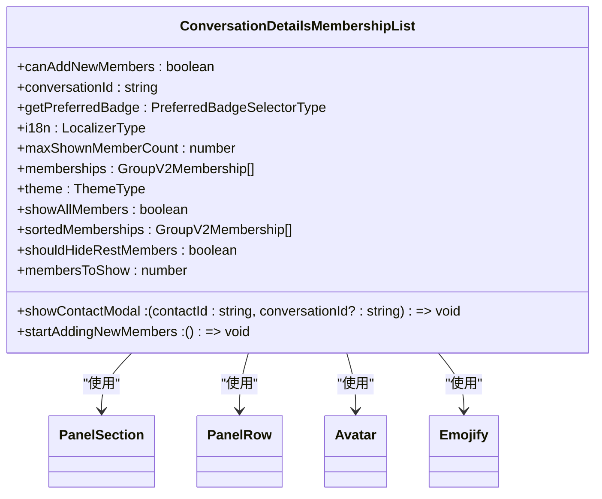
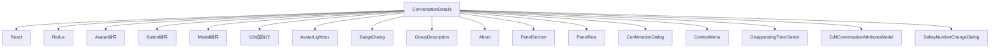

# 对话详情

<cite>
**本文档引用的文件**   
- [ConversationDetails.dom.tsx](file://ts/components/conversation/conversation-details/ConversationDetails.dom.tsx)
- [ConversationDetailsHeader.dom.tsx](file://ts/components/conversation/conversation-details/ConversationDetailsHeader.dom.tsx)
- [ConversationDetailsHeader.scss](file://stylesheets/components/ConversationDetailsHeader.scss)
- [ConversationDetailsMembershipList.dom.tsx](file://ts/components/conversation/conversation-details/ConversationDetailsMembershipList.dom.tsx)
- [ConversationDetailsGroups.dom.tsx](file://ts/components/conversation/conversation-details/ConversationDetailsGroups.dom.tsx)
- [SafetyNumberChangeDialog.dom.tsx](file://ts/components/SafetyNumberChangeDialog.dom.tsx)
- [EditConversationAttributesModal.dom.tsx](file://ts/components/conversation/conversation-details/EditConversationAttributesModal.dom.tsx)
</cite>

## 目录
1. [简介](#简介)
2. [项目结构](#项目结构)
3. [核心组件](#核心组件)
4. [架构概述](#架构概述)
5. [详细组件分析](#详细组件分析)
6. [依赖分析](#依赖分析)
7. [性能考虑](#性能考虑)
8. [故障排除指南](#故障排除指南)
9. [结论](#结论)
10. [附录](#附录)（如有必要）

## 简介
本文档深入分析Signal-Desktop应用程序中的对话详情组件，重点介绍`ConversationDetailsHeader`的布局结构、联系人信息展示逻辑，以及安全号码变更提示的集成。文档详细解释了群组对话的描述管理、成员列表展示和权限设置界面，记录了联系人名称的国际化处理、头像显示逻辑以及对话安全状态的可视化表示。此外，还提供了组件的响应式设计策略、状态管理机制以及与用户隐私设置的集成方式。

## 项目结构
对话详情组件位于Signal-Desktop项目的`ts/components/conversation/conversation-details/`目录下，包含多个核心文件。该组件采用模块化设计，将不同功能分离到独立的文件中，便于维护和扩展。主要文件包括`ConversationDetails.dom.tsx`（主组件）、`ConversationDetailsHeader.dom.tsx`（头部组件）、`ConversationDetailsMembershipList.dom.tsx`（成员列表组件）等。样式文件位于`stylesheets/components/`目录下，使用SCSS进行样式定义，并通过BEM命名规范组织CSS类。

**图表来源**
- [ConversationDetails.dom.tsx](file://ts/components/conversation/conversation-details/ConversationDetails.dom.tsx)
- [ConversationDetailsHeader.dom.tsx](file://ts/components/conversation/conversation-details/ConversationDetailsHeader.dom.tsx)
- [ConversationDetailsMembershipList.dom.tsx](file://ts/components/conversation/conversation-details/ConversationDetailsMembershipList.dom.tsx)
- [ConversationDetailsGroups.dom.tsx](file://ts/components/conversation/conversation-details/ConversationDetailsGroups.dom.tsx)
- [EditConversationAttributesModal.dom.tsx](file://ts/components/conversation/conversation-details/EditConversationAttributesModal.dom.tsx)
- [SafetyNumberChangeDialog.dom.tsx](file://ts/components/SafetyNumberChangeDialog.dom.tsx)
- [ConversationDetailsHeader.scss](file://stylesheets/components/ConversationDetailsHeader.scss)

**章节来源**
- [ConversationDetails.dom.tsx](file://ts/components/conversation/conversation-details/ConversationDetails.dom.tsx)
- [ConversationDetailsHeader.dom.tsx](file://ts/components/conversation/conversation-details/ConversationDetailsHeader.dom.tsx)

## 核心组件
对话详情组件是Signal-Desktop中用于展示和管理对话详细信息的核心模块。它由多个子组件组成，每个子组件负责特定的功能。主组件`ConversationDetails`负责协调各个子组件的显示和交互，而`ConversationDetailsHeader`则专注于展示对话的基本信息，如头像、标题和副标题。对于群组对话，`ConversationDetailsMembershipList`组件负责展示成员列表，并提供添加新成员的功能。`ConversationDetailsGroups`组件则用于展示与当前联系人共同所在的群组。

**章节来源**
- [ConversationDetails.dom.tsx](file://ts/components/conversation/conversation-details/ConversationDetails.dom.tsx)
- [ConversationDetailsHeader.dom.tsx](file://ts/components/conversation/conversation-details/ConversationDetailsHeader.dom.tsx)
- [ConversationDetailsMembershipList.dom.tsx](file://ts/components/conversation/conversation-details/ConversationDetailsMembershipList.dom.tsx)
- [ConversationDetailsGroups.dom.tsx](file://ts/components/conversation/conversation-details/ConversationDetailsGroups.dom.tsx)

## 架构概述
对话详情组件采用React函数式组件和Hooks的现代React架构。组件的状态管理主要通过React的`useState`和`useEffect` Hooks实现，确保了组件的响应性和可维护性。该组件与Signal-Desktop的全局状态管理系统紧密集成，通过props接收来自Redux store的数据和回调函数。组件的UI设计遵循Signal的设计语言，使用一致的字体、颜色和间距，确保了用户体验的一致性。

**图表来源**
- [ConversationDetails.dom.tsx](file://ts/components/conversation/conversation-details/ConversationDetails.dom.tsx)
- [ConversationDetailsHeader.dom.tsx](file://ts/components/conversation/conversation-details/ConversationDetailsHeader.dom.tsx)
- [ConversationDetailsMembershipList.dom.tsx](file://ts/components/conversation/conversation-details/ConversationDetailsMembershipList.dom.tsx)
- [ConversationDetailsGroups.dom.tsx](file://ts/components/conversation/conversation-details/ConversationDetailsGroups.dom.tsx)
- [EditConversationAttributesModal.dom.tsx](file://ts/components/conversation/conversation-details/EditConversationAttributesModal.dom.tsx)
- [SafetyNumberChangeDialog.dom.tsx](file://ts/components/SafetyNumberChangeDialog.dom.tsx)

## 详细组件分析

### ConversationDetailsHeader 分析
`ConversationDetailsHeader`组件负责展示对话的头部信息，包括头像、标题和副标题。该组件根据对话类型（个人或群组）动态调整其显示内容。对于群组对话，如果存在群组描述，则显示`GroupDescription`组件；否则，根据用户权限显示"添加群组描述"或成员数量。对于个人对话，则显示用户的"关于"信息。

#### 布局结构

**图表来源**
- [ConversationDetailsHeader.dom.tsx](file://ts/components/conversation/conversation-details/ConversationDetailsHeader.dom.tsx)

#### 联系人信息展示逻辑

**图表来源**
- [ConversationDetailsHeader.dom.tsx](file://ts/components/conversation/conversation-details/ConversationDetailsHeader.dom.tsx)

#### 安全号码变更提示集成
安全号码变更提示通过`SafetyNumberChangeDialog`组件实现。当检测到联系人的安全号码发生变化时，系统会触发此对话框。该组件支持多种状态，包括初始审查、显式审查需要和审查完成。用户可以逐个查看每个联系人的安全号码，并选择确认或取消操作。

**图表来源**
- [SafetyNumberChangeDialog.dom.tsx](file://ts/components/SafetyNumberChangeDialog.dom.tsx)

### 群组对话管理分析
群组对话的管理功能主要由`ConversationDetailsMembershipList`和`EditConversationAttributesModal`组件实现。

#### 群组描述管理
群组描述的编辑通过`EditConversationAttributesModal`组件完成。该模态框允许管理员编辑群组头像、标题和描述。组件实现了防丢失确认功能，当用户尝试在未保存更改的情况下关闭模态框时，会提示用户确认是否放弃更改。

**图表来源**
- [EditConversationAttributesModal.dom.tsx](file://ts/components/conversation/conversation-details/EditConversationAttributesModal.dom.tsx)

#### 成员列表展示
`ConversationDetailsMembershipList`组件负责展示群组成员列表。成员按照特定顺序排序：自己、管理员、其他成员。列表支持分页显示，当成员数量超过5个时，只显示前5个成员，并提供"显示全部"按钮。

**图表来源**
- [ConversationDetailsMembershipList.dom.tsx](file://ts/components/conversation/conversation-details/ConversationDetailsMembershipList.dom.tsx)

#### 权限设置界面
权限设置界面通过导航到`GroupPermissions`面板实现。该功能仅对群组管理员可见，允许管理员管理群组的加入权限、消息发送权限等。

**章节来源**
- [ConversationDetails.dom.tsx](file://ts/components/conversation/conversation-details/ConversationDetails.dom.tsx)
- [ConversationDetailsMembershipList.dom.tsx](file://ts/components/conversation/conversation-details/ConversationDetailsMembershipList.dom.tsx)
- [EditConversationAttributesModal.dom.tsx](file://ts/components/conversation/conversation-details/EditConversationAttributesModal.dom.tsx)

### 国际化与隐私设置分析
#### 联系人名称的国际化处理
联系人名称的国际化处理通过`UserText`组件实现。该组件接收原始文本，并根据当前语言环境进行适当的格式化和显示。所有用户可见的文本都通过`i18n`函数进行国际化处理，确保了多语言支持。

#### 头像显示逻辑
头像显示逻辑在`ConversationDetailsHeader`组件中实现。组件根据对话是否有头像URL、是否为"笔记给自己"以及头像下载状态来决定如何显示头像。如果头像需要下载，则显示模糊效果，并提供点击以查看的提示。

#### 对话安全状态的可视化表示
对话安全状态通过安全号码变更提示和验证徽章进行可视化表示。当联系人的安全号码发生变化时，系统会显示安全号码变更对话框，提醒用户验证新的安全号码。

#### 响应式设计策略
组件采用响应式设计，通过CSS媒体查询和Flexbox布局适应不同屏幕尺寸。关键元素如头像、标题和按钮在不同设备上保持良好的可读性和可操作性。

#### 状态管理机制
组件的状态管理主要依赖于React的本地状态（useState）和来自父组件的props。复杂的状态逻辑（如对话状态、用户信息）由Signal-Desktop的全局状态管理器处理，并通过props传递给组件。

#### 与用户隐私设置的集成
组件与用户隐私设置紧密集成。例如，当用户选择阻止某个联系人时，`ConversationDetailsActions`组件会相应地更新其显示和功能。隐私相关的操作（如阻止、取消阻止）通过回调函数与应用程序的隐私设置系统通信。

**章节来源**
- [ConversationDetailsHeader.dom.tsx](file://ts/components/conversation/conversation-details/ConversationDetailsHeader.dom.tsx)
- [ConversationDetails.dom.tsx](file://ts/components/conversation/conversation-details/ConversationDetails.dom.tsx)
- [SafetyNumberChangeDialog.dom.tsx](file://ts/components/SafetyNumberChangeDialog.dom.tsx)

## 依赖分析
对话详情组件依赖于Signal-Desktop项目中的多个核心模块和第三方库。主要依赖包括：

**图表来源**
- [ConversationDetails.dom.tsx](file://ts/components/conversation/conversation-details/ConversationDetails.dom.tsx)
- [ConversationDetailsHeader.dom.tsx](file://ts/components/conversation/conversation-details/ConversationDetailsHeader.dom.tsx)
- [go.mod](file://go.mod)

**章节来源**
- [ConversationDetails.dom.tsx](file://ts/components/conversation/conversation-details/ConversationDetails.dom.tsx)
- [ConversationDetailsHeader.dom.tsx](file://ts/components/conversation/conversation-details/ConversationDetailsHeader.dom.tsx)

## 性能考虑
对话详情组件在设计时考虑了性能优化。组件使用React的`memo`和`useCallback`等优化技术，避免不必要的重新渲染。对于大型群组，成员列表采用分页显示，减少了DOM元素的数量。头像图片采用懒加载策略，只有在需要时才开始下载，减少了初始加载时间。

## 故障排除指南
### 常见问题
1. **头像无法显示**：检查网络连接，确保可以访问头像URL。如果头像需要下载，确保用户已点击"点击以查看"。
2. **安全号码变更提示未显示**：确认联系人的安全号码确实发生了变化，并检查应用程序的通知设置。
3. **成员列表不完整**：对于大型群组，成员列表默认只显示前5个成员，点击"显示全部"以查看所有成员。

### 调试技巧
- 使用开发者工具检查组件的props和state，确认数据是否正确传递。
- 检查网络请求，确保与服务器的通信正常。
- 查看控制台日志，寻找可能的错误或警告信息。

**章节来源**
- [ConversationDetails.dom.tsx](file://ts/components/conversation/conversation-details/ConversationDetails.dom.tsx)
- [ConversationDetailsHeader.dom.tsx](file://ts/components/conversation/conversation-details/ConversationDetailsHeader.dom.tsx)
- [SafetyNumberChangeDialog.dom.tsx](file://ts/components/SafetyNumberChangeDialog.dom.tsx)

## 结论
Signal-Desktop的对话详情组件是一个功能丰富、设计精良的UI模块，它有效地整合了多种功能，为用户提供了一个直观、安全的对话管理界面。通过模块化设计和清晰的组件分离，该组件易于维护和扩展。其对国际化、隐私保护和用户体验的关注体现了Signal应用程序的核心价值观。未来可以考虑进一步优化大型群组的性能，并增加更多自定义选项以满足不同用户的需求。