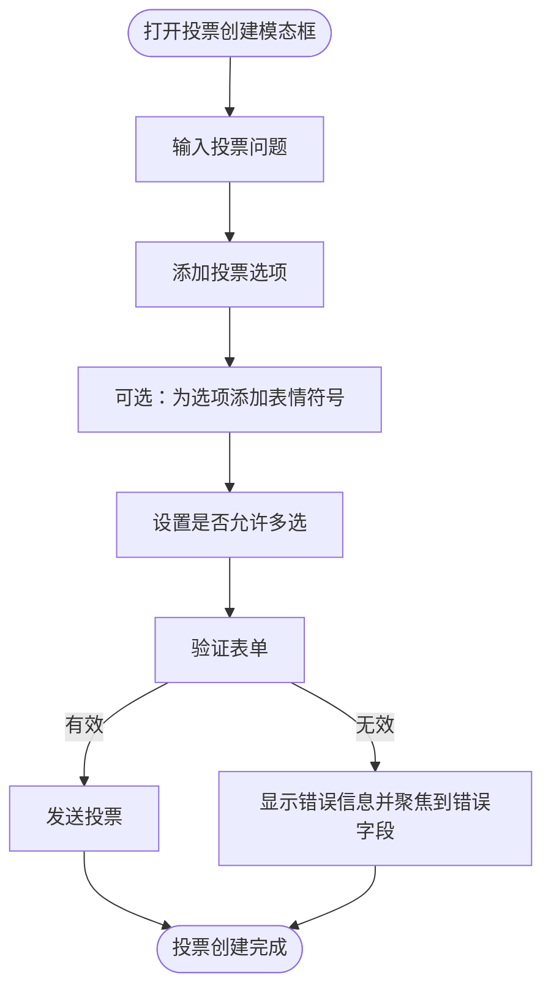
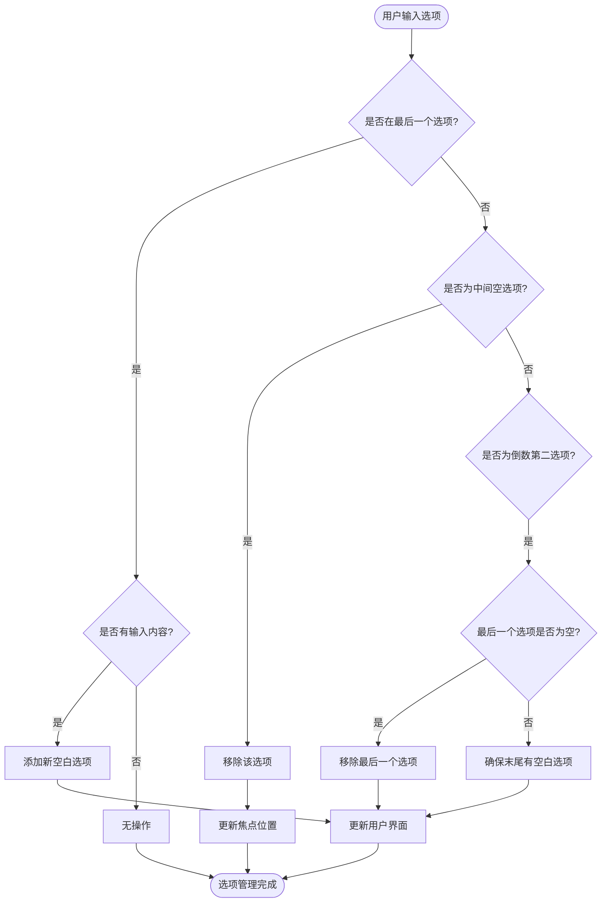
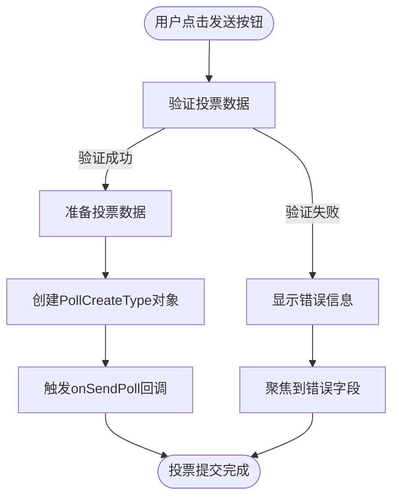
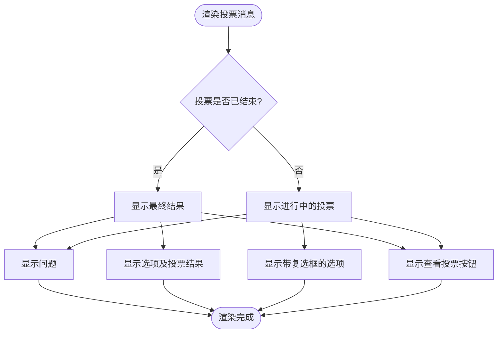
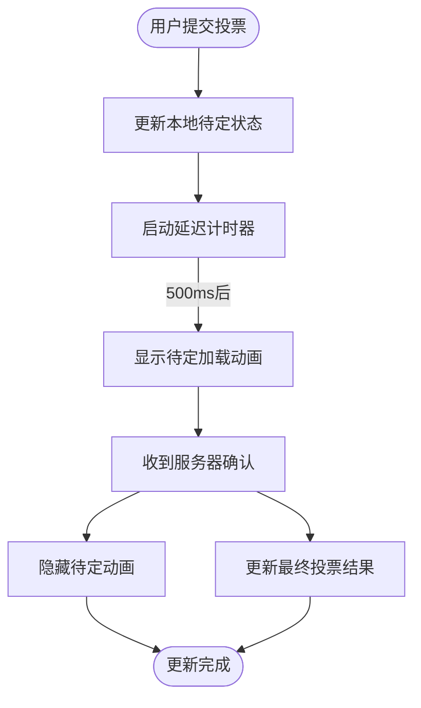
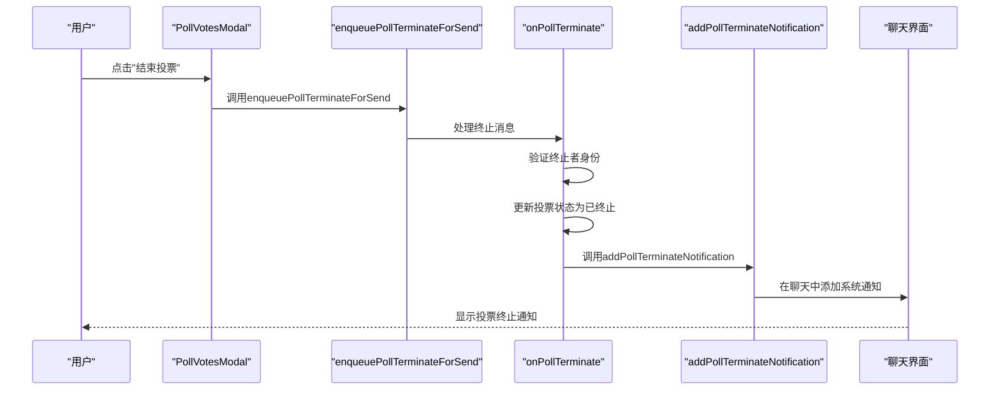
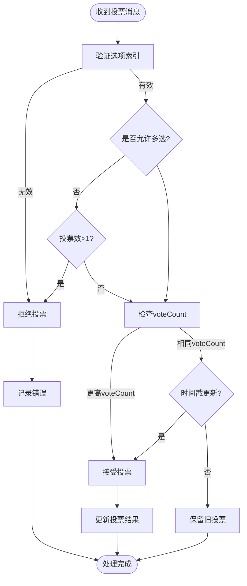

# 投票系统

<cite>
**本文档中引用的文件**  
- [PollCreateModal.dom.tsx](file://ts/components/PollCreateModal.dom.tsx)
- [PollMessageContents.dom.tsx](file://ts/components/conversation/poll-message/PollMessageContents.dom.tsx)
- [PollVotesModal.dom.tsx](file://ts/components/conversation/poll-message/PollVotesModal.dom.tsx)
- [PollTerminateNotification.dom.tsx](file://ts/components/conversation/PollTerminateNotification.dom.tsx)
- [enqueuePollVoteForSend.preload.ts](file://ts/polls/enqueuePollVoteForSend.preload.ts)
- [enqueuePollTerminateForSend.preload.ts](file://ts/polls/enqueuePollTerminateForSend.preload.ts)
- [Polls.preload.ts](file://ts/messageModifiers/Polls.preload.ts)
- [polls.util.std.ts](file://ts/polls/util.std.ts)
- [conversations.preload.ts](file://ts/models/conversations.preload.ts)
- [Polls.dom.ts](file://ts/types/Polls.dom.ts)
</cite>

## 目录
1. [介绍](#介绍)
2. [投票创建界面](#投票创建界面)
3. [投票选项管理](#投票选项管理)
4. [投票提交流程](#投票提交流程)
5. [投票消息渲染](#投票消息渲染)
6. [实时投票结果更新机制](#实时投票结果更新机制)
7. [投票终止通知实现](#投票终止通知实现)
8. [投票数据加密存储与同步](#投票数据加密存储与同步)
9. [API接口与状态管理](#api接口与状态管理)
10. [群组对话中的特殊处理](#群组对话中的特殊处理)
11. [安全考虑](#安全考虑)

## 介绍
Signal-Desktop的投票系统为用户提供了一种安全、加密的群组决策机制。该系统允许用户创建投票、参与投票、查看实时结果，并在投票结束后收到通知。整个流程在端到端加密的环境中进行，确保了用户隐私和数据安全。本文档将深入分析投票系统的各个组件，包括投票创建、管理、渲染和安全机制。

## 投票创建界面
投票创建界面由`PollCreateModal`组件实现，提供了一个直观的模态窗口，用户可以在其中定义投票问题、添加选项，并选择是否允许多选。界面设计注重用户体验，支持通过回车键在选项间快速导航，并集成了表情符号选择器，允许用户在选项中添加表情符号以增强表达力。

界面包含以下主要元素：
- **问题输入框**：用于输入投票主题，支持自动调整高度的文本区域。
- **选项列表**：动态列表，用户可以输入选项，系统会自动管理选项的增删。
- **多选开关**：允许创建者选择是否允许多选投票。
- **验证反馈**：提供实时的表单验证，确保问题和选项符合长度和数量要求。



**Diagram sources**
- [PollCreateModal.dom.tsx](file://ts/components/PollCreateModal.dom.tsx#L287-L408)

**Section sources**
- [PollCreateModal.dom.tsx](file://ts/components/PollCreateModal.dom.tsx#L1-L409)

## 投票选项管理
投票选项管理采用动态增删策略，确保用户界面始终保持简洁和高效。当用户在最后一个选项中输入内容时，系统会自动创建一个新的空白选项。当用户删除中间或倒数第二个选项的内容时，系统会自动移除该选项，以避免出现多余的空白行。

选项管理的关键特性包括：
- **自动扩展**：在最后一个非空选项后输入内容时，自动添加新选项。
- **智能删除**：删除中间或倒数第二个空选项时，自动移除该选项。
- **焦点管理**：当选项被删除时，系统会自动将焦点转移到下一个合适的选项，确保键盘导航的流畅性。
- **表情符号集成**：每个选项都集成了表情符号选择器，用户可以通过点击按钮打开表情符号面板并选择表情符号插入到选项文本中。



**Diagram sources**
- [PollCreateModal.dom.tsx](file://ts/components/PollCreateModal.dom.tsx#L65-L113)

**Section sources**
- [PollCreateModal.dom.tsx](file://ts/components/PollCreateModal.dom.tsx#L1-L409)

## 投票提交流程
投票提交流程从用户点击"发送"按钮开始，经过严格的验证后，将投票数据封装并发送到群组。流程确保了数据的完整性和一致性，同时提供了错误处理机制。

提交流程的关键步骤：
1. **表单验证**：检查问题是否为空，选项是否至少有两个非空选项，以及内容长度是否超出限制。
2. **数据准备**：将用户输入的问题、选项和多选设置整理成`PollCreateType`对象。
3. **回调触发**：通过`onSendPoll`回调将准备好的投票数据传递给父组件进行后续处理。



**Diagram sources**
- [PollCreateModal.dom.tsx](file://ts/components/PollCreateModal.dom.tsx#L246-L284)

**Section sources**
- [PollCreateModal.dom.tsx](file://ts/components/PollCreateModal.dom.tsx#L1-L409)

## 投票消息渲染
投票消息的渲染由`PollMessageContents`组件负责，该组件根据投票的当前状态（进行中或已结束）动态显示不同的UI元素。渲染过程包括投票问题、选项列表、投票进度条和查看投票结果按钮。

主要渲染特性：
- **状态文本**：根据投票是否结束和是否允许多选，显示相应的提示文本（如"选择一项"或"最终结果"）。
- **选项显示**：为每个选项显示复选框（进行中）或选中标志（已结束），并显示投票数和进度条。
- **交互元素**：在投票进行中时，用户可以点击选项进行投票；在投票结束后，可以点击查看详细结果。



**Diagram sources**
- [PollMessageContents.dom.tsx](file://ts/components/conversation/poll-message/PollMessageContents.dom.tsx#L158-L411)

**Section sources**
- [PollMessageContents.dom.tsx](file://ts/components/conversation/poll-message/PollMessageContents.dom.tsx#L1-L411)

## 实时投票结果更新机制
实时投票结果更新机制通过监听投票状态的变化来实现。当用户提交投票后，系统会立即更新本地UI，显示"待定"状态的加载动画，然后在收到确认后更新最终结果。

更新机制的关键组件：
- **待定状态管理**：使用`pendingVoteDiff`跟踪待处理的投票变更，并在延迟后显示加载动画。
- **状态同步**：通过`useEffect`监听`hasPendingVotes`的变化，管理加载状态的显示和隐藏。
- **动画效果**：使用Framer Motion库实现平滑的过渡动画，提升用户体验。



**Diagram sources**
- [PollMessageContents.dom.tsx](file://ts/components/conversation/poll-message/PollMessageContents.dom.tsx#L178-L194)

**Section sources**
- [PollMessageContents.dom.tsx](file://ts/components/conversation/poll-message/PollMessageContents.dom.tsx#L1-L411)

## 投票终止通知实现
投票终止通知由`PollTerminateNotification`组件实现，当投票被创建者终止后，系统会向群组发送一条系统消息通知。该通知包含终止者信息和投票主题，并提供查看原始投票的链接。

实现流程：
1. **终止请求**：用户通过`PollVotesModal`中的"结束投票"按钮发起终止请求。
2. **发送终止消息**：调用`enqueuePollTerminateForSend`将终止请求加入发送队列。
3. **处理终止**：`onPollTerminate`函数处理终止消息，更新投票状态。
4. **生成通知**：`addPollTerminateNotification`在群组中创建系统消息通知。



**Diagram sources**
- [PollVotesModal.dom.tsx](file://ts/components/conversation/poll-message/PollVotesModal.dom.tsx#L162-L165)
- [enqueuePollTerminateForSend.preload.ts](file://ts/polls/enqueuePollTerminateForSend.preload.ts#L21-L77)
- [Polls.preload.ts](file://ts/messageModifiers/Polls.preload.ts#L260-L333)
- [conversations.preload.ts](file://ts/models/conversations.preload.ts#L3519-L3559)

**Section sources**
- [PollVotesModal.dom.tsx](file://ts/components/conversation/poll-message/PollVotesModal.dom.tsx#L1-L175)
- [enqueuePollTerminateForSend.preload.ts](file://ts/polls/enqueuePollTerminateForSend.preload.ts#L1-L77)
- [Polls.preload.ts](file://ts/messageModifiers/Polls.preload.ts#L260-L333)
- [conversations.preload.ts](file://ts/models/conversations.preload.ts#L3519-L3559)

## 投票数据加密存储与同步
投票数据在Signal-Desktop中以端到端加密的方式存储和同步。所有投票相关数据都包含在消息对象的`poll`字段中，并通过Signal的加密协议在设备间同步。

存储格式：
```typescript
interface PollData {
  question: string;           // 投票问题
  options: Array<string>;     // 选项列表
  allowMultiple: boolean;     // 是否允许多选
  votes?: Array<PollVote>;    // 投票记录
  terminatedAt?: number;      // 终止时间戳
}
```

同步策略：
- **增量同步**：只同步发生变化的投票数据，减少网络传输量。
- **冲突解决**：使用`voteCount`和时间戳解决投票冲突，确保数据一致性。
- **缓存机制**：使用`pollVoteCache`和`pollTerminateCache`缓存待处理的投票和终止消息，确保消息不丢失。

**Section sources**
- [Polls.dom.ts](file://ts/types/Polls.dom.ts)
- [Polls.preload.ts](file://ts/messageModifiers/Polls.preload.ts#L30-L62)

## API接口与状态管理
投票系统提供了清晰的API接口和状态管理机制，确保组件间的通信高效且可靠。

主要API接口：
- `onSendPoll`: 从`PollCreateModal`向父组件传递创建的投票数据。
- `sendPollVote`: 从`PollMessageContents`向父组件发送投票请求。
- `endPoll`: 从`PollVotesModal`向父组件发送结束投票请求。

状态管理特性：
- **不可变更新**：使用函数式编程模式更新状态，确保状态变化可预测。
- **上下文隔离**：每个投票消息维护独立的状态，避免组件间状态污染。
- **生命周期管理**：正确处理组件的挂载和卸载，清理定时器等资源。

**Section sources**
- [PollCreateModal.dom.tsx](file://ts/components/PollCreateModal.dom.tsx#L33-L37)
- [PollMessageContents.dom.tsx](file://ts/components/conversation/poll-message/PollMessageContents.dom.tsx#L144-L155)

## 群组对话中的特殊处理
投票系统专门设计用于群组对话，包含多项针对群组场景的特殊处理逻辑。

特殊处理包括：
- **群组验证**：在发送投票、投票和终止操作前，验证目标对话是否为群组。
- **成员权限**：只有群组成员才能参与投票，只有投票创建者才能终止投票。
- **通知机制**：当他人投票时，投票创建者会收到未读通知，确保及时了解投票进展。

```mermaid
flowchart TD
Start([投票相关操作]) --> CheckGroup{"是否为群组?"}
CheckGroup --> |否| Reject["拒绝操作"]
CheckGroup --> |是| CheckOperation{"操作类型"}
CheckOperation --> Vote["投票"]
CheckOperation --> Terminate["终止"]
Vote --> CheckMember{"是否为群组成员?"}
CheckMember --> |否| Reject
CheckMember --> |是| AllowVote["允许投票"]
Terminate --> CheckCreator{"是否为投票创建者?"}
CheckCreator --> |否| Reject
CheckCreator --> |是| AllowTerminate["允许终止"]
AllowVote --> End([操作完成])
AllowTerminate --> End
Reject --> End
```



**Diagram sources**
- [enqueuePollVoteForSend.preload.ts](file://ts/polls/enqueuePollVoteForSend.preload.ts#L41-L44)
- [enqueuePollTerminateForSend.preload.ts](file://ts/polls/enqueuePollTerminateForSend.preload.ts#L36-L38)
- [Polls.preload.ts](file://ts/messageModifiers/Polls.preload.ts#L542-L557)

**Section sources**
- [enqueuePollVoteForSend.preload.ts](file://ts/polls/enqueuePollVoteForSend.preload.ts#L1-L98)
- [enqueuePollTerminateForSend.preload.ts](file://ts/polls/enqueuePollTerminateForSend.preload.ts#L1-L77)
- [Polls.preload.ts](file://ts/messageModifiers/Polls.preload.ts#L1-L622)

## 安全考虑
投票系统实现了多项安全机制，防止滥用并确保投票结果的公正性。

主要安全措施：
- **防重复投票**：通过`voteCount`机制跟踪用户的投票次数，防止同一用户多次投票影响结果。
- **投票验证**：服务器端验证投票的合法性，包括选项索引的有效性和多选限制。
- **身份验证**：严格验证终止投票请求的发送者是否为投票创建者。
- **数据完整性**：使用端到端加密保护投票数据，防止中间人攻击。



**Diagram sources**
- [Polls.preload.ts](file://ts/messageModifiers/Polls.preload.ts#L359-L375)

**Section sources**
- [Polls.preload.ts](file://ts/messageModifiers/Polls.preload.ts#L1-L622)