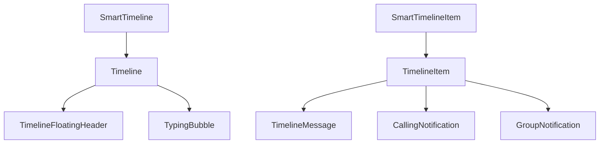
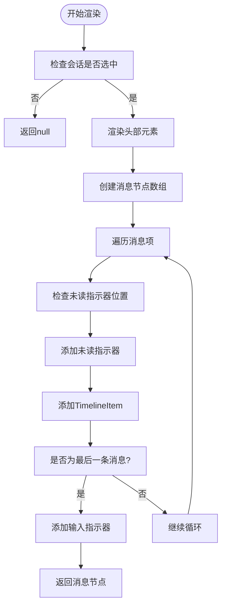
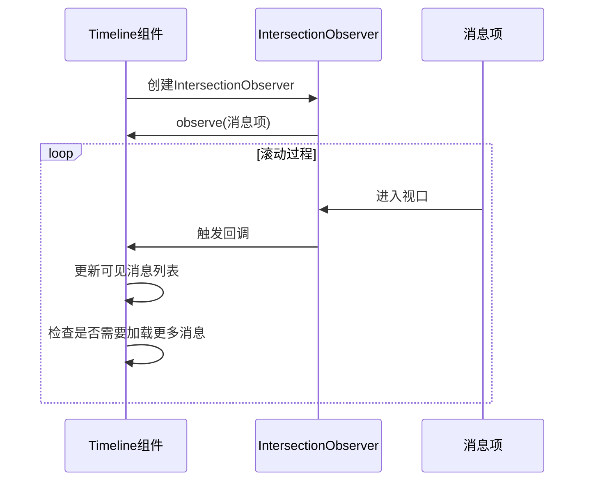
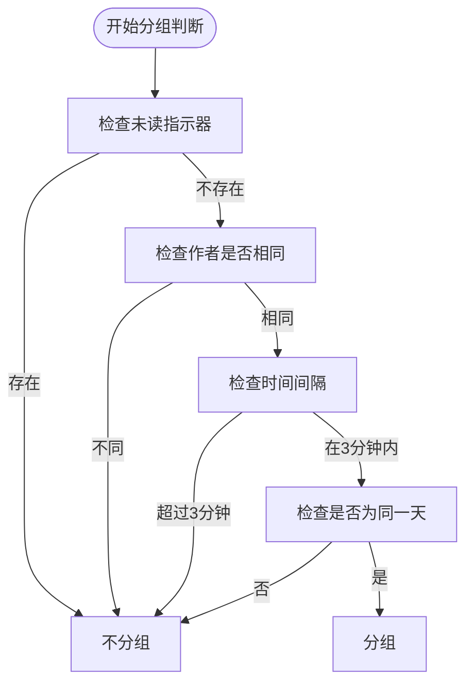
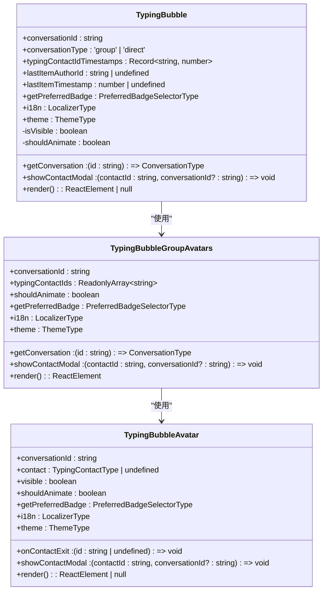
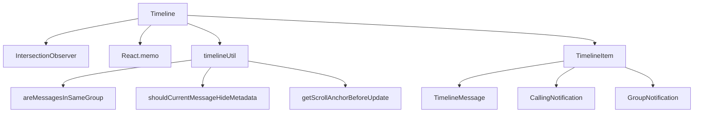

# 时间线管理

<cite>
**本文档引用的文件**   
- [Timeline.dom.tsx](file://ts/components/conversation/Timeline.dom.tsx)
- [TimelineItem.dom.tsx](file://ts/components/conversation/TimelineItem.dom.tsx)
- [TimelineMessage.dom.tsx](file://ts/components/conversation/TimelineMessage.dom.tsx)
- [Timeline.preload.tsx](file://ts/state/smart/Timeline.preload.tsx)
- [TimelineItem.preload.tsx](file://ts/state/smart/TimelineItem.preload.tsx)
- [timelineUtil.std.ts](file://ts/util/timelineUtil.std.ts)
- [TypingBubble.dom.tsx](file://ts/components/conversation/TypingBubble.dom.tsx)
- [TimelineDateHeader.scss](file://stylesheets/components/TimelineDateHeader.scss)
</cite>

## 目录
1. [简介](#简介)
2. [项目结构](#项目结构)
3. [核心组件](#核心组件)
4. [架构概述](#架构概述)
5. [详细组件分析](#详细组件分析)
6. [依赖分析](#依赖分析)
7. [性能考虑](#性能考虑)
8. [故障排除指南](#故障排除指南)
9. [结论](#结论)

## 简介
本文档详细介绍了Signal-Desktop应用程序中时间线管理组件的实现。该组件负责消息列表的布局、虚拟滚动、无限滚动加载、消息分组、日期分隔符插入以及实时输入状态显示。文档深入分析了其性能优化技术，如React.memo使用、列表项缓存和大规模消息集的高效渲染，并记录了与消息同步系统的集成方式和离线状态处理。

## 项目结构
时间线管理组件主要位于`ts/components/conversation/`目录下，包括`Timeline.dom.tsx`、`TimelineItem.dom.tsx`和`TimelineMessage.dom.tsx`等文件。相关的智能组件位于`ts/state/smart/`目录下，如`Timeline.preload.tsx`和`TimelineItem.preload.tsx`。工具函数和常量定义在`ts/util/timelineUtil.std.ts`中。

**Section sources**
- [Timeline.dom.tsx](file://ts/components/conversation/Timeline.dom.tsx#L1-L1365)
- [TimelineItem.dom.tsx](file://ts/components/conversation/TimelineItem.dom.tsx#L1-L501)
- [TimelineMessage.dom.tsx](file://ts/components/conversation/TimelineMessage.dom.tsx#L1-L645)

## 核心组件
时间线管理的核心组件包括`Timeline`、`TimelineItem`和`TimelineMessage`。`Timeline`组件负责整体布局和滚动管理，`TimelineItem`组件处理单个消息项的渲染和分组逻辑，`TimelineMessage`组件则负责具体消息内容的展示和交互。

**Section sources**
- [Timeline.dom.tsx](file://ts/components/conversation/Timeline.dom.tsx#L203-L1365)
- [TimelineItem.dom.tsx](file://ts/components/conversation/TimelineItem.dom.tsx#L241-L501)
- [TimelineMessage.dom.tsx](file://ts/components/conversation/TimelineMessage.dom.tsx#L105-L645)

## 架构概述
时间线管理组件采用分层架构，由智能组件和展示组件组成。智能组件（如`SmartTimeline`）负责从Redux状态中获取数据并传递给展示组件。展示组件（如`Timeline`）则专注于UI渲染和用户交互。这种分离使得组件更易于测试和维护。

**Diagram sources **
- [Timeline.preload.tsx](file://ts/state/smart/Timeline.preload.tsx#L164-L316)
- [Timeline.dom.tsx](file://ts/components/conversation/Timeline.dom.tsx#L203-L1365)

## 详细组件分析

### Timeline组件分析
`Timeline`组件是时间线管理的主控组件，负责消息列表的整体布局和滚动行为。它使用IntersectionObserver来检测可见消息，并根据滚动位置决定是否加载更多消息。

#### 消息列表布局算法
`Timeline`组件通过`render`方法生成消息列表。它遍历`items`数组，为每个消息创建一个`TimelineItem`组件。消息项之间通过`data-item-index`属性进行索引，便于滚动定位。

**Diagram sources **
- [Timeline.dom.tsx](file://ts/components/conversation/Timeline.dom.tsx#L914-L1319)

#### 虚拟滚动实现
`Timeline`组件通过IntersectionObserver实现虚拟滚动。`#updateIntersectionObserver`方法创建一个IntersectionObserver实例，用于监控消息项的可见性。当消息项进入视口时，它们会被标记为可见，并触发相关回调。

**Diagram sources **
- [Timeline.dom.tsx](file://ts/components/conversation/Timeline.dom.tsx#L372-L525)

#### 无限滚动加载策略
无限滚动加载通过IntersectionObserver的回调函数实现。当最旧的可见消息项是列表中的第一条消息时，触发`loadOlderMessages`；当最新的可见消息项接近列表末尾时，触发`loadNewerMessages`。

**Section sources**
- [Timeline.dom.tsx](file://ts/components/conversation/Timeline.dom.tsx#L484-L496)
- [timelineUtil.std.ts](file://ts/util/timelineUtil.std.ts#L157-L209)

### TimelineItem组件分析
`TimelineItem`组件负责单个消息项的渲染，包括消息分组和日期分隔符插入。

#### 消息分组逻辑
`TimelineItem`组件通过`areMessagesInSameGroup`函数判断相邻消息是否属于同一组。该函数检查消息作者、时间间隔和是否为同一天等条件。

**Diagram sources **
- [timelineUtil.std.ts](file://ts/util/timelineUtil.std.ts#L114-L141)

#### 日期分隔符插入机制
日期分隔符的插入由`shouldRenderDateHeader`属性控制。当消息项是列表中的第一条消息，或与前一条消息不在同一天时，插入日期分隔符。

**Section sources**
- [TimelineItem.preload.tsx](file://ts/state/smart/TimelineItem.preload.tsx#L116-L124)

### TypingBubble组件分析
`TypingBubble`组件负责显示实时输入状态。

#### 实时输入状态显示
`TypingBubble`组件通过`typingContactIdTimestamps`属性获取正在输入的联系人列表，并使用动画效果显示输入状态。

**Diagram sources **
- [TypingBubble.dom.tsx](file://ts/components/conversation/TypingBubble.dom.tsx#L262-L426)

## 依赖分析
时间线管理组件依赖于多个其他组件和工具函数。主要依赖包括`IntersectionObserver`用于虚拟滚动，`React.memo`用于性能优化，以及`timelineUtil`中的各种工具函数。

**Diagram sources **
- [Timeline.dom.tsx](file://ts/components/conversation/Timeline.dom.tsx#L1-L1365)
- [timelineUtil.std.ts](file://ts/util/timelineUtil.std.ts#L1-L220)

## 性能考虑
时间线管理组件采用了多种性能优化技术，包括使用`React.memo`避免不必要的重渲染，通过`IntersectionObserver`实现虚拟滚动，以及使用`throttle`节流函数减少频繁的读取操作。

**Section sources**
- [Timeline.dom.tsx](file://ts/components/conversation/Timeline.dom.tsx#L568-L575)
- [TimelineItem.dom.tsx](file://ts/components/conversation/TimelineItem.dom.tsx#L241-L501)

## 故障排除指南
常见问题包括滚动定位不准确、消息分组错误和输入指示器显示异常。这些问题通常与IntersectionObserver的配置或状态管理有关。

**Section sources**
- [Timeline.dom.tsx](file://ts/components/conversation/Timeline.dom.tsx#L661-L701)
- [timelineUtil.std.ts](file://ts/util/timelineUtil.std.ts#L157-L209)

## 结论
Signal-Desktop的时间线管理组件是一个复杂而高效的系统，它通过精心设计的架构和多种性能优化技术，实现了流畅的消息列表体验。组件的模块化设计使其易于维护和扩展，为用户提供了一个稳定可靠的消息界面。