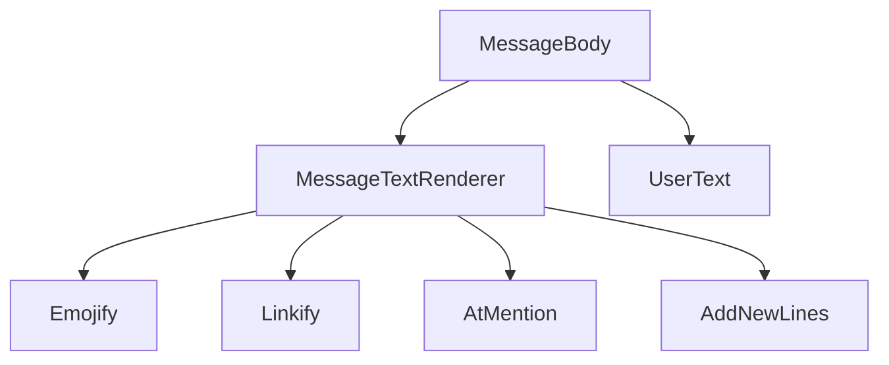
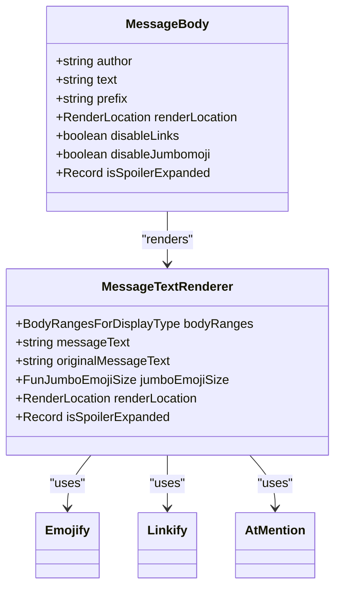
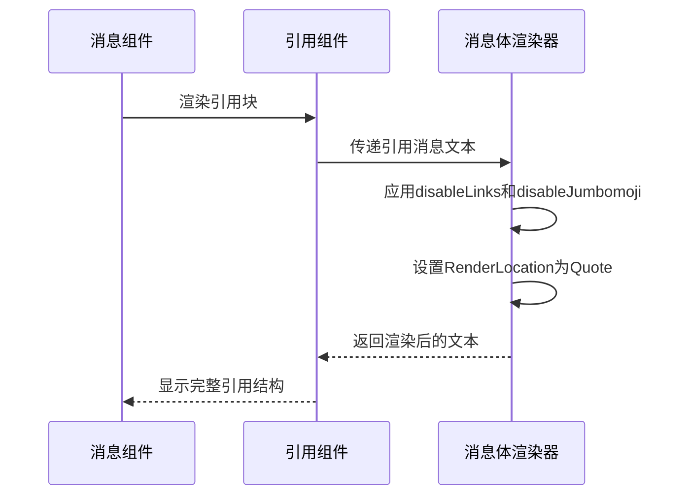
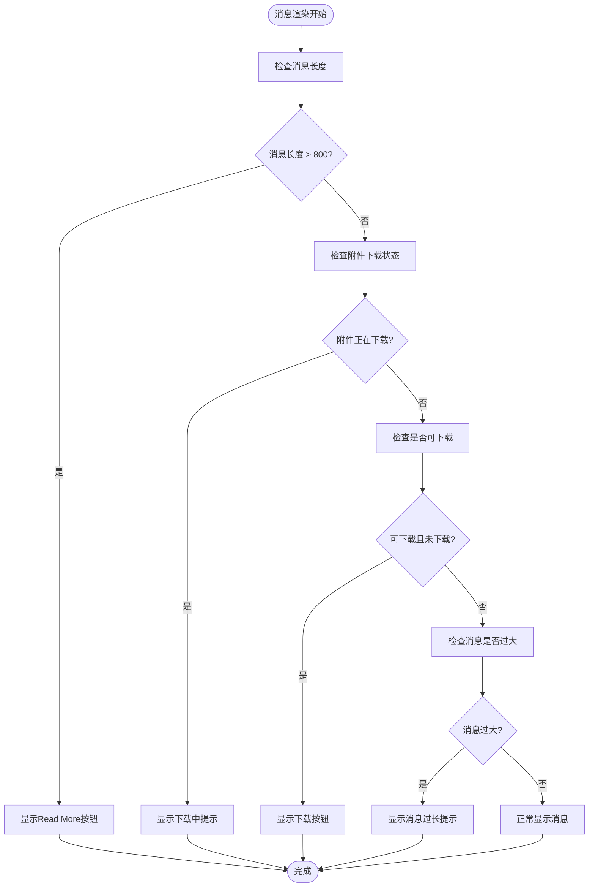
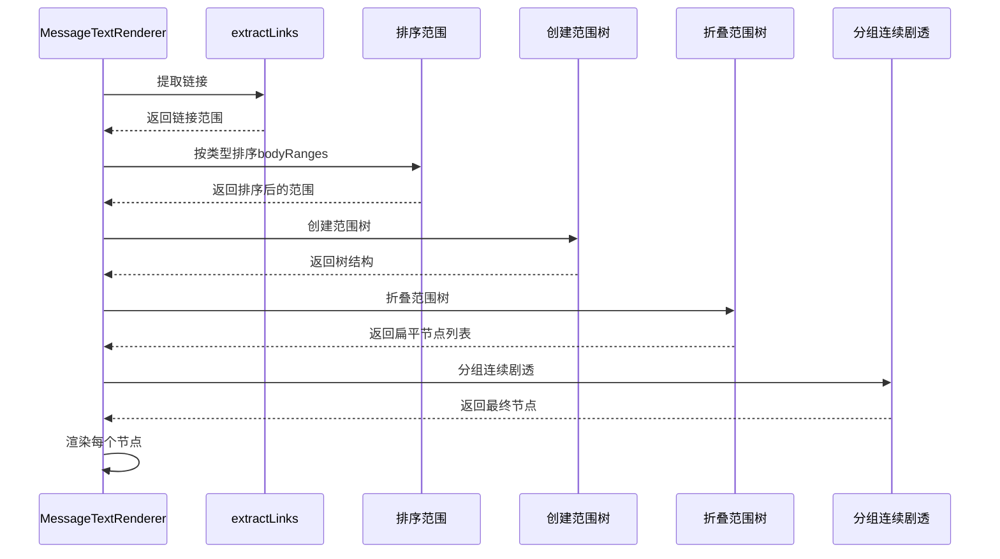
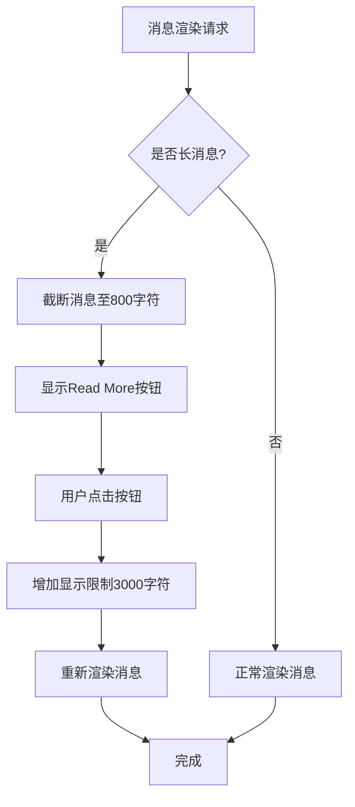
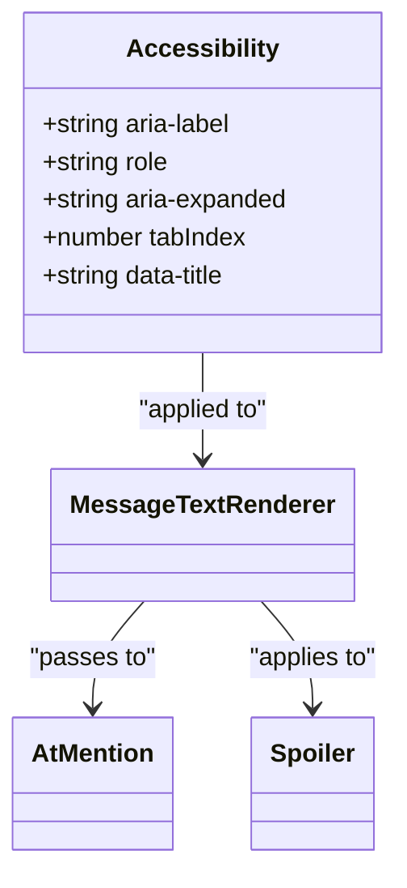

# 消息渲染

<cite>
**本文档中引用的文件**  
- [MessageBody.dom.tsx](file://ts/components/conversation/MessageBody.dom.tsx)
- [MessageTextRenderer.dom.tsx](file://ts/components/conversation/MessageTextRenderer.dom.js)
- [MessageBody.scss](file://stylesheets/components/MessageBody.scss)
- [MessageTextRenderer.scss](file://stylesheets/components/MessageTextRenderer.scss)
- [AtMention.dom.tsx](file://ts/components/conversation/AtMention.dom.tsx)
- [Emojify.dom.tsx](file://ts/components/conversation/Emojify.dom.tsx)
- [Linkify.dom.tsx](file://ts/components/conversation/Linkify.dom.tsx)
</cite>

## 目录
1. [介绍](#介绍)
2. [核心组件概述](#核心组件概述)
3. [消息气泡样式系统](#消息气泡样式系统)
4. [引用回复的嵌套结构实现](#引用回复的嵌套结构实现)
5. [消息状态指示器显示逻辑](#消息状态指示器显示逻辑)
6. [MessageTextRenderer中的内容处理机制](#messagetextrenderer中的内容处理机制)
7. [组件Props接口定义](#组件props接口定义)
8. [性能优化策略](#性能优化策略)
9. [与端到端加密元数据的集成](#与端到端加密元数据的集成)
10. [实际使用示例](#实际使用示例)
11. [可访问性考虑](#可访问性考虑)

## 介绍
Signal-Desktop的消息渲染系统负责将不同类型的消息内容（包括纯文本、富文本、表情符号和特殊格式）正确地解析和呈现给用户。该系统通过一系列组件协同工作，确保消息在各种上下文中都能以一致且安全的方式显示。本文档深入分析了MessageBody和MessageTextRenderer组件的核心功能，以及它们如何处理链接检测、@提及和表情符号转换等关键特性。

**Section sources**
- [MessageBody.dom.tsx](file://ts/components/conversation/MessageBody.dom.tsx#L1-L196)

## 核心组件概述
消息渲染系统由多个核心组件构成，其中MessageBody是主要的容器组件，负责组装和协调其他子组件的工作。MessageTextRenderer则专注于文本内容的解析和渲染，处理包括格式化、链接、提及和表情符号在内的各种文本元素。这些组件共同实现了Signal消息界面的核心功能。

**Diagram sources**
- [MessageBody.dom.tsx](file://ts/components/conversation/MessageBody.dom.tsx#L72-L196)
- [MessageTextRenderer.dom.tsx](file://ts/components/conversation/MessageTextRenderer.dom.tsx#L59-L134)

**Section sources**
- [MessageBody.dom.tsx](file://ts/components/conversation/MessageBody.dom.tsx#L72-L196)
- [MessageTextRenderer.dom.tsx](file://ts/components/conversation/MessageTextRenderer.dom.tsx#L59-L134)

## 消息气泡样式系统
消息气泡的样式系统通过CSS类和React组件属性的结合来实现。MessageBody组件根据消息方向（incoming/outgoing）和其他状态属性应用不同的CSS类。样式文件MessageBody.scss和MessageTextRenderer.scss定义了各种视觉效果，包括高亮、下载状态和提及样式的具体表现。

**Diagram sources**
- [MessageBody.scss](file://stylesheets/components/MessageBody.scss#L1-L74)
- [MessageTextRenderer.scss](file://stylesheets/components/MessageTextRenderer.scss#L1-L113)

**Section sources**
- [MessageBody.scss](file://stylesheets/components/MessageBody.scss#L1-L74)
- [MessageTextRenderer.scss](file://stylesheets/components/MessageTextRenderer.scss#L1-L113)

## 引用回复的嵌套结构实现
引用回复的嵌套结构通过Quote组件实现，该组件能够显示被引用消息的作者、内容和附件信息。引用结构支持多种消息类型，包括文本、媒体文件和支付信息。当引用的消息无法找到时，系统会显示相应的警告提示。引用回复的样式根据消息方向和会话颜色进行调整，确保视觉一致性。

**Diagram sources**
- [Quote.dom.tsx](file://ts/components/conversation/Quote.dom.tsx#L151-L594)
- [MessageBody.dom.tsx](file://ts/components/conversation/MessageBody.dom.tsx#L72-L196)

**Section sources**
- [Quote.dom.tsx](file://ts/components/conversation/Quote.dom.tsx#L151-L594)

## 消息状态指示器显示逻辑
消息状态指示器的显示逻辑由MessageBody组件中的endNotification机制实现。根据消息的不同状态（如正在下载、需要下载完整消息、消息过长等），组件会显示相应的提示按钮或文本。这些状态指示器提供了用户交互功能，例如点击"Read More"按钮可以加载完整消息内容。

**Diagram sources**
- [MessageBody.dom.tsx](file://ts/components/conversation/MessageBody.dom.tsx#L100-L156)

**Section sources**
- [MessageBody.dom.tsx](file://ts/components/conversation/MessageBody.dom.tsx#L100-L156)

## MessageTextRenderer中的内容处理机制
MessageTextRenderer组件实现了复杂的内容处理机制，包括链接检测、@提及处理和表情符号转换。链接检测通过linkify库实现，支持多种协议并过滤可疑链接。@提及处理将提及转换为可点击的元素，表情符号转换则使用Emojify组件将文本表情符号替换为图形化表情。

**Diagram sources**
- [MessageTextRenderer.dom.tsx](file://ts/components/conversation/MessageTextRenderer.dom.tsx#L73-L114)

**Section sources**
- [MessageTextRenderer.dom.tsx](file://ts/components/conversation/MessageTextRenderer.dom.tsx#L73-L114)

## 组件Props接口定义
消息渲染组件通过明确定义的Props接口与外部系统交互。MessageBody组件接收消息文本、方向、作者等基本信息，以及控制链接和表情符号显示的标志。MessageTextRenderer则处理更细粒度的文本格式化信息，包括bodyRanges、jumboEmojiSize和renderLocation等属性。

**MessageBody组件Props定义**
| 属性 | 类型 | 描述 |
|------|------|------|
| text | string | 消息文本内容 |
| direction | 'incoming' \| 'outgoing' | 消息方向 |
| disableLinks | boolean | 是否禁用链接 |
| disableJumbomoji | boolean | 是否禁用大表情符号 |
| isSpoilerExpanded | Record<string, boolean> | 剧透内容展开状态 |
| renderLocation | RenderLocation | 渲染位置上下文 |
| bodyRanges | HydratedBodyRangesType | 文本范围信息 |

**MessageTextRenderer组件Props定义**
| 属性 | 类型 | 描述 |
|------|------|------|
| bodyRanges | BodyRangesForDisplayType | 显示用的范围信息 |
| jumboEmojiSize | FunJumboEmojiSize \| null | 大表情符号尺寸 |
| disableLinks | boolean | 是否禁用链接 |
| renderLocation | RenderLocation | 渲染位置 |
| messageText | string | 要渲染的消息文本 |
| originalMessageText | string | 原始消息文本 |

**Section sources**
- [MessageBody.dom.tsx](file://ts/components/conversation/MessageBody.dom.tsx#L42-L64)
- [MessageTextRenderer.dom.tsx](file://ts/components/conversation/MessageTextRenderer.dom.tsx#L43-L57)

## 性能优化策略
消息渲染系统采用了多种性能优化策略，包括使用React.useMemo进行计算结果缓存、对长消息进行分块处理以及避免不必要的重新渲染。对于包含大量文本的消息，系统会自动截断并提供"Read More"功能，这不仅提高了渲染性能，也改善了用户体验。

**Diagram sources**
- [MessageBodyReadMore.dom.tsx](file://ts/components/conversation/MessageBodyReadMore.dom.tsx#L30-L32)
- [MessageBody.dom.tsx](file://ts/components/conversation/MessageBody.dom.tsx#L90-L118)

**Section sources**
- [MessageBodyReadMore.dom.tsx](file://ts/components/conversation/MessageBodyReadMore.dom.tsx#L30-L89)

## 与端到端加密元数据的集成
消息渲染系统与端到端加密系统紧密集成，确保加密消息的元数据能够正确地影响渲染行为。虽然具体的加密处理在其他组件中完成，但消息渲染器会根据解密后的元数据调整显示方式，例如在消息状态指示器中反映加密验证结果。

**Section sources**
- [MessageBody.dom.tsx](file://ts/components/conversation/MessageBody.dom.tsx#L72-L196)

## 实际使用示例
消息渲染组件在Signal-Desktop中有多种使用场景，包括会话列表、消息时间线、搜索结果和故事查看器。每个场景都通过设置不同的renderLocation属性来调整渲染样式，确保消息在不同上下文中都能以最合适的方式显示。

**Section sources**
- [MessageBody.dom.stories.tsx](file://ts/components/conversation/MessageBody.dom.stories.tsx#L1-L83)
- [Quote.dom.tsx](file://ts/components/conversation/Quote.dom.tsx#L379-L388)

## 可访问性考虑
消息渲染系统充分考虑了可访问性需求，为屏幕阅读器用户提供了适当的ARIA标签和角色。剧透内容具有明确的aria-label和aria-expanded状态，提及元素被标记为role="link"，确保辅助技术能够正确识别和处理这些交互元素。

**Diagram sources**
- [MessageTextRenderer.dom.tsx](file://ts/components/conversation/MessageTextRenderer.dom.tsx#L196-L198)
- [AtMention.dom.tsx](file://ts/components/conversation/AtMention.dom.tsx#L62-L64)

**Section sources**
- [MessageTextRenderer.dom.tsx](file://ts/components/conversation/MessageTextRenderer.dom.tsx#L196-L198)
- [AtMention.dom.tsx](file://ts/components/conversation/AtMention.dom.tsx#L62-L64)