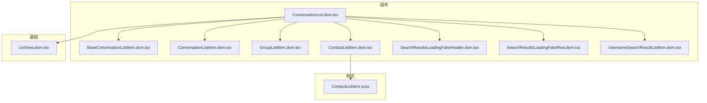
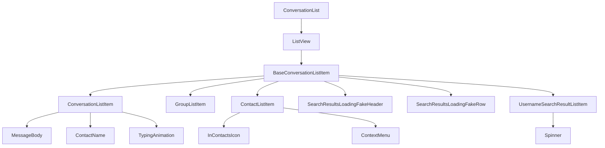
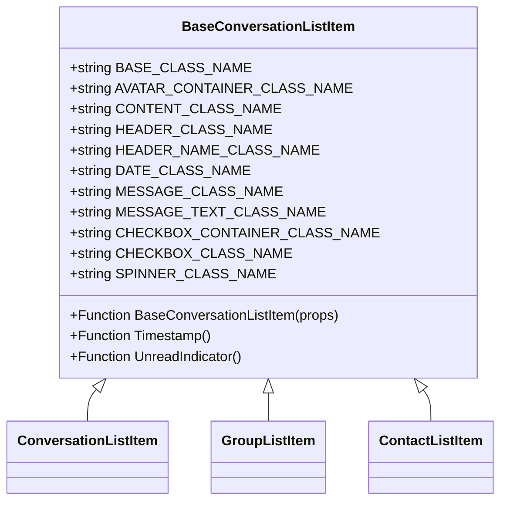
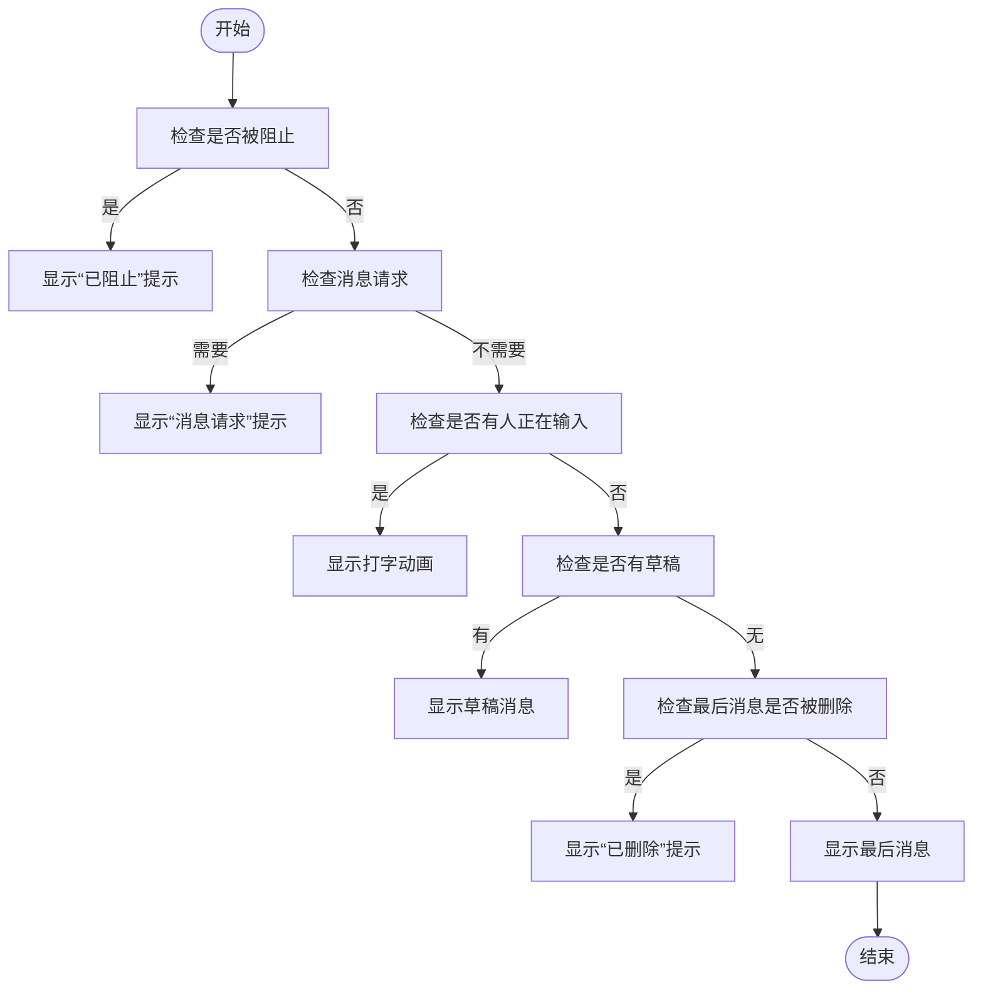
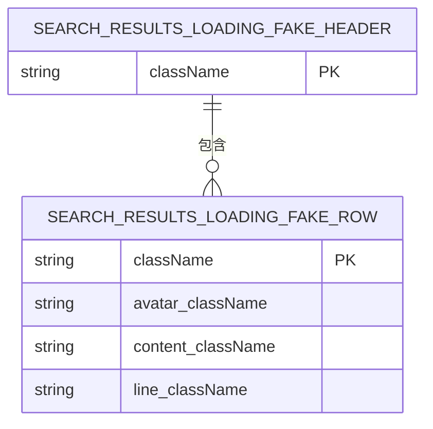
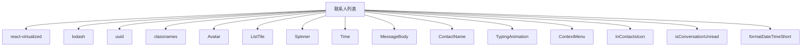

# 联系人列表

<cite>
**本文档中引用的文件**  
- [BaseConversationListItem.dom.tsx](file://ts/components/conversationList/BaseConversationListItem.dom.tsx)
- [ConversationListItem.dom.tsx](file://ts/components/conversationList/ConversationListItem.dom.tsx)
- [GroupListItem.dom.tsx](file://ts/components/conversationList/GroupListItem.dom.tsx)
- [ContactListItem.dom.tsx](file://ts/components/conversationList/ContactListItem.dom.tsx)
- [ConversationList.dom.tsx](file://ts/components/ConversationList.dom.tsx)
- [SearchResultsLoadingFakeHeader.dom.tsx](file://ts/components/conversationList/SearchResultsLoadingFakeHeader.dom.tsx)
- [SearchResultsLoadingFakeRow.dom.tsx](file://ts/components/conversationList/SearchResultsLoadingFakeRow.dom.tsx)
- [UsernameSearchResultListItem.dom.tsx](file://ts/components/conversationList/UsernameSearchResultListItem.dom.tsx)
- [ListView.dom.tsx](file://ts/components/ListView.dom.tsx)
- [ContactListItem.scss](file://stylesheets/components/ContactListItem.scss)
</cite>

## 目录
1. [简介](#简介)
2. [项目结构](#项目结构)
3. [核心组件](#核心组件)
4. [架构概述](#架构概述)
5. [详细组件分析](#详细组件分析)
6. [依赖分析](#依赖分析)
7. [性能考虑](#性能考虑)
8. [故障排除指南](#故障排除指南)
9. [结论](#结论)

## 简介
本文档详细介绍了Signal-Desktop应用程序中联系人列表组件的实现。该组件负责渲染会话列表项、管理分组、展示搜索结果，并处理未读消息计数、最后消息预览和会话排序等关键功能。文档深入分析了`BaseConversationListItem`基础组件的设计模式、`ConversationListItem`的会话状态显示、`GroupListItem`的群组特殊处理，以及搜索结果加载占位符的实现。此外，还提供了组件的API文档，包括数据绑定方式、事件回调机制和自定义渲染选项。

## 项目结构
联系人列表相关组件主要位于`ts/components/conversationList`目录下，样式文件位于`stylesheets/components`目录。组件采用React函数式组件和TypeScript类型定义，通过`react-virtualized`库实现列表虚拟化以优化滚动性能。



**图源**
- [BaseConversationListItem.dom.tsx](file://ts/components/conversationList/BaseConversationListItem.dom.tsx)
- [ConversationListItem.dom.tsx](file://ts/components/conversationList/ConversationListItem.dom.tsx)
- [GroupListItem.dom.tsx](file://ts/components/conversationList/GroupListItem.dom.tsx)
- [ContactListItem.dom.tsx](file://ts/components/conversationList/ContactListItem.dom.tsx)
- [ConversationList.dom.tsx](file://ts/components/ConversationList.dom.tsx)
- [SearchResultsLoadingFakeHeader.dom.tsx](file://ts/components/conversationList/SearchResultsLoadingFakeHeader.dom.tsx)
- [SearchResultsLoadingFakeRow.dom.tsx](file://ts/components/conversationList/SearchResultsLoadingFakeRow.dom.tsx)
- [UsernameSearchResultListItem.dom.tsx](file://ts/components/conversationList/UsernameSearchResultListItem.dom.tsx)
- [ListView.dom.tsx](file://ts/components/ListView.dom.tsx)
- [ContactListItem.scss](file://stylesheets/components/ContactListItem.scss)

**节源**
- [BaseConversationListItem.dom.tsx](file://ts/components/conversationList/BaseConversationListItem.dom.tsx)
- [ConversationListItem.dom.tsx](file://ts/components/conversationList/ConversationListItem.dom.tsx)
- [GroupListItem.dom.tsx](file://ts/components/conversationList/GroupListItem.dom.tsx)
- [ContactListItem.dom.tsx](file://ts/components/conversationList/ContactListItem.dom.tsx)
- [ConversationList.dom.tsx](file://ts/components/ConversationList.dom.tsx)

## 核心组件
联系人列表的核心组件包括`BaseConversationListItem`、`ConversationListItem`、`GroupListItem`和`ContactListItem`。这些组件通过组合和继承的方式构建出完整的联系人列表UI，支持会话、联系人、群组和搜索结果的渲染。

**节源**
- [BaseConversationListItem.dom.tsx](file://ts/components/conversationList/BaseConversationListItem.dom.tsx#L1-L415)
- [ConversationListItem.dom.tsx](file://ts/components/conversationList/ConversationListItem.dom.tsx#L1-L250)
- [GroupListItem.dom.tsx](file://ts/components/conversationList/GroupListItem.dom.tsx#L1-L85)
- [ContactListItem.dom.tsx](file://ts/components/conversationList/ContactListItem.dom.tsx#L1-L309)

## 架构概述
联系人列表采用分层架构设计，`ConversationList`作为顶层容器组件，负责管理列表数据和滚动逻辑。`ListView`组件封装了`react-virtualized`的`List`组件，提供虚拟滚动功能。各个列表项组件（如`ConversationListItem`、`GroupListItem`等）负责具体UI的渲染，并通过props接收数据和回调函数。



**图源**
- [ConversationList.dom.tsx](file://ts/components/ConversationList.dom.tsx#L1-L698)
- [ListView.dom.tsx](file://ts/components/ListView.dom.tsx#L1-L80)
- [BaseConversationListItem.dom.tsx](file://ts/components/conversationList/BaseConversationListItem.dom.tsx#L1-L415)

## 详细组件分析

### BaseConversationListItem 分析
`BaseConversationListItem`是所有列表项的基础组件，提供统一的布局结构和通用功能，如头像、标题、消息预览、未读指示器和复选框。



**图源**
- [BaseConversationListItem.dom.tsx](file://ts/components/conversationList/BaseConversationListItem.dom.tsx#L1-L415)

**节源**
- [BaseConversationListItem.dom.tsx](file://ts/components/conversationList/BaseConversationListItem.dom.tsx#L1-L415)

### ConversationListItem 分析
`ConversationListItem`组件负责渲染会话列表项，显示会话的最后消息、打字状态、草稿消息等信息，并根据会话状态（如被阻止、消息请求等）显示相应的提示文本。



**图源**
- [ConversationListItem.dom.tsx](file://ts/components/conversationList/ConversationListItem.dom.tsx#L1-L250)

**节源**
- [ConversationListItem.dom.tsx](file://ts/components/conversationList/ConversationListItem.dom.tsx#L1-L250)

### GroupListItem 分析
`GroupListItem`组件专门用于渲染群组列表项，显示群组成员数量和成员身份信息，并根据用户是否已加入或正在加入群组显示不同的禁用原因。

```mermaid
stateDiagram-v2
[*] --> Initial
Initial --> AlreadyMember : disabledReason = AlreadyMember
Initial --> Pending : disabledReason = Pending
Initial --> Default : 其他情况
AlreadyMember --> ShowAlreadyMemberMessage : 显示“已加入”消息
Pending --> ShowPendingMessage : 显示“等待中”消息
Default --> ShowDefaultMessage : 显示默认消息含成员数量
ShowAlreadyMemberMessage --> [*]
ShowPendingMessage --> [*]
ShowDefaultMessage --> [*]
```

**图源**
- [GroupListItem.dom.tsx](file://ts/components/conversationList/GroupListItem.dom.tsx#L1-L85)

**节源**
- [GroupListItem.dom.tsx](file://ts/components/conversationList/GroupListItem.dom.tsx#L1-L85)

### 搜索结果加载占位符分析
搜索结果加载时，使用`SearchResultsLoadingFakeHeader`和`SearchResultsLoadingFakeRow`组件显示占位符UI，提供良好的用户体验。



**图源**
- [SearchResultsLoadingFakeHeader.dom.tsx](file://ts/components/conversationList/SearchResultsLoadingFakeHeader.dom.tsx#L1-L11)
- [SearchResultsLoadingFakeRow.dom.tsx](file://ts/components/conversationList/SearchResultsLoadingFakeRow.dom.tsx#L1-L20)

**节源**
- [SearchResultsLoadingFakeHeader.dom.tsx](file://ts/components/conversationList/SearchResultsLoadingFakeHeader.dom.tsx#L1-L11)
- [SearchResultsLoadingFakeRow.dom.tsx](file://ts/components/conversationList/SearchResultsLoadingFakeRow.dom.tsx#L1-L20)

## 依赖分析
联系人列表组件依赖多个内部和外部库。内部依赖包括`Avatar`、`ListTile`、`Spinner`等UI组件，以及`isConversationUnread`、`formatDateTimeShort`等工具函数。外部依赖包括`react-virtualized`用于列表虚拟化，`lodash`用于实用函数，`uuid`用于生成唯一标识符。



**图源**
- [BaseConversationListItem.dom.tsx](file://ts/components/conversationList/BaseConversationListItem.dom.tsx#L1-L415)
- [ConversationListItem.dom.tsx](file://ts/components/conversationList/ConversationListItem.dom.tsx#L1-L250)
- [GroupListItem.dom.tsx](file://ts/components/conversationList/GroupListItem.dom.tsx#L1-L85)
- [ContactListItem.dom.tsx](file://ts/components/conversationList/ContactListItem.dom.tsx#L1-L309)
- [ConversationList.dom.tsx](file://ts/components/ConversationList.dom.tsx#L1-L698)

**节源**
- [BaseConversationListItem.dom.tsx](file://ts/components/conversationList/BaseConversationListItem.dom.tsx#L4-L8)
- [ConversationListItem.dom.tsx](file://ts/components/conversationList/ConversationListItem.dom.tsx#L4-L24)
- [GroupListItem.dom.tsx](file://ts/components/conversationList/GroupListItem.dom.tsx#L4-L11)
- [ContactListItem.dom.tsx](file://ts/components/conversationList/ContactListItem.dom.tsx#L4-L21)
- [ConversationList.dom.tsx](file://ts/components/ConversationList.dom.tsx#L4-L43)

## 性能考虑
联系人列表通过多种方式优化性能：
1. 使用`React.memo`对组件进行记忆化，避免不必要的重新渲染
2. 采用`react-virtualized`实现列表虚拟化，只渲染可见区域的列表项
3. 使用`useCallback`和`useMemo`优化回调函数和计算值
4. 通过`shouldRecomputeRowHeights`控制行高重新计算
5. 使用`useLayoutEffect`在布局阶段处理DOM操作

**节源**
- [BaseConversationListItem.dom.tsx](file://ts/components/conversationList/BaseConversationListItem.dom.tsx#L89)
- [ConversationListItem.dom.tsx](file://ts/components/conversationList/ConversationListItem.dom.tsx#L77)
- [ContactListItem.dom.tsx](file://ts/components/conversationList/ContactListItem.dom.tsx#L62)
- [ListView.dom.tsx](file://ts/components/ListView.dom.tsx#L41-L46)

## 故障排除指南
常见问题及解决方案：
- **列表滚动卡顿**：检查是否正确实现了`shouldRecomputeRowHeights`，避免频繁重新计算行高
- **组件重复渲染**：确保使用`React.memo`并正确处理props的引用相等性
- **搜索结果占位符不显示**：检查`RowType`枚举是否包含`SearchResultsLoadingFakeHeader`和`SearchResultsLoadingFakeRow`
- **上下文菜单不显示**：确保`hasContextMenu` prop正确传递，并检查`menuOptions`数组是否为空

**节源**
- [ConversationList.dom.tsx](file://ts/components/ConversationList.dom.tsx#L327-L671)
- [ListView.dom.tsx](file://ts/components/ListView.dom.tsx#L41-L46)

## 结论
Signal-Desktop的联系人列表组件通过精心设计的分层架构和性能优化策略，实现了高效、可维护的UI渲染。`BaseConversationListItem`作为基础组件提供了统一的布局和功能，而具体的列表项组件则根据不同的使用场景进行定制化渲染。通过`react-virtualized`的虚拟滚动技术，即使在处理大量联系人时也能保持流畅的滚动体验。整体设计体现了组件化、可复用和性能优先的开发理念。