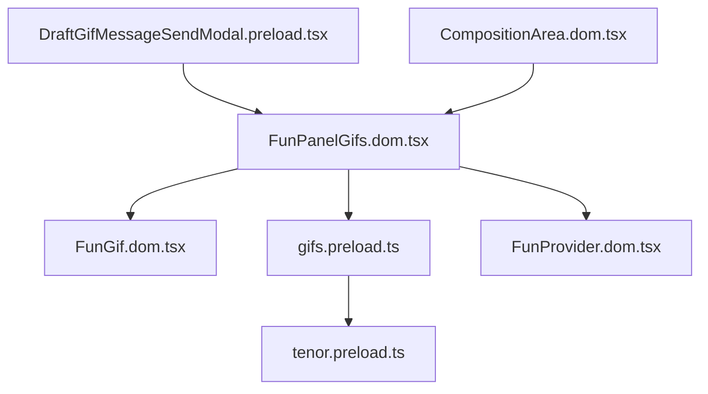
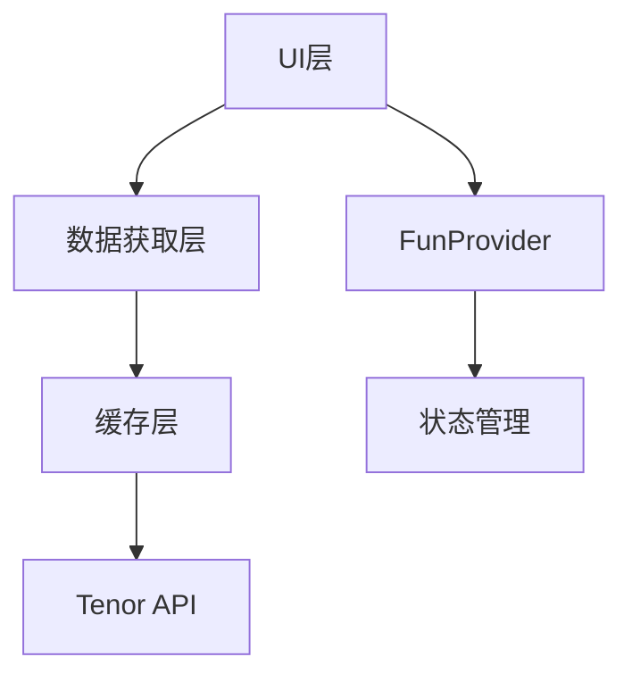
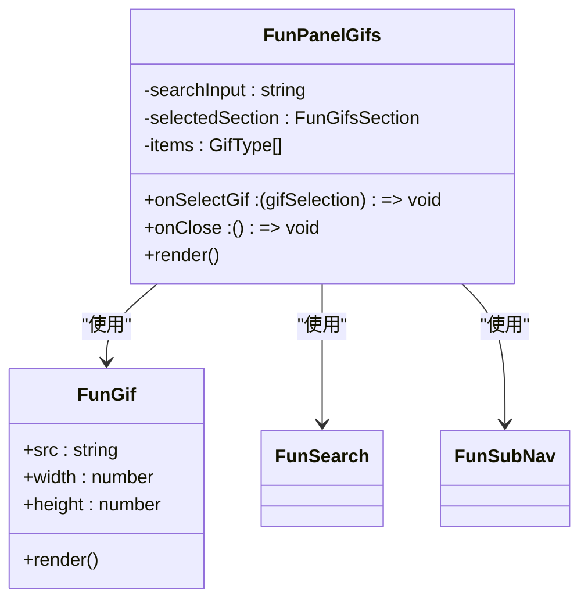
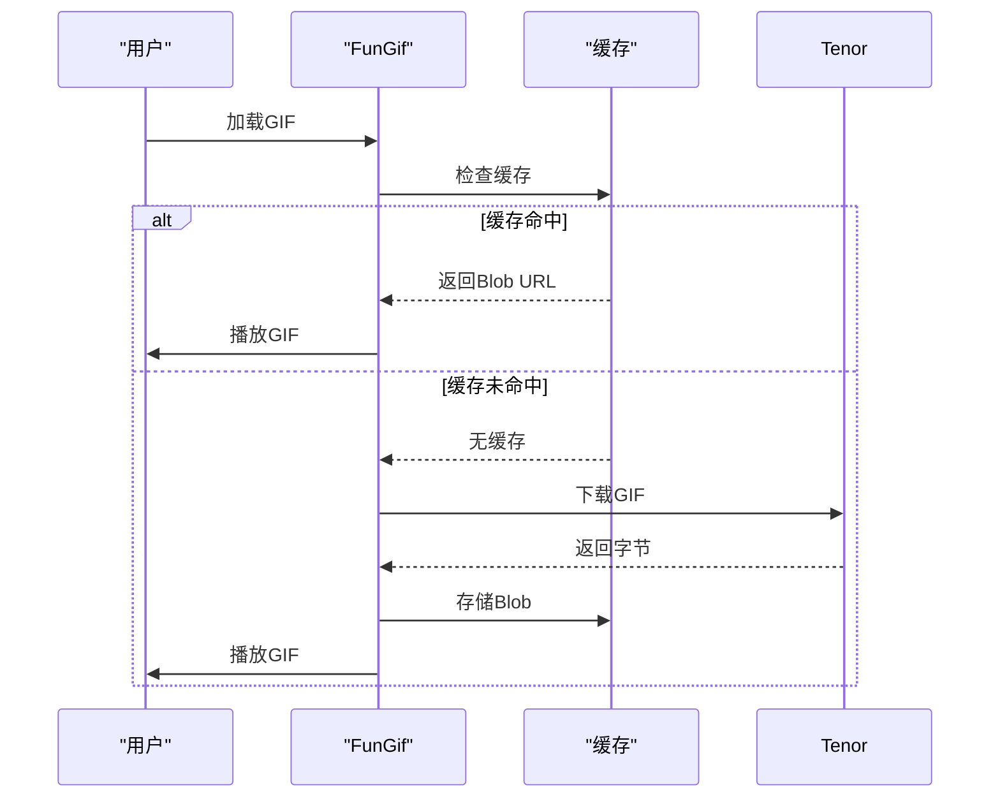
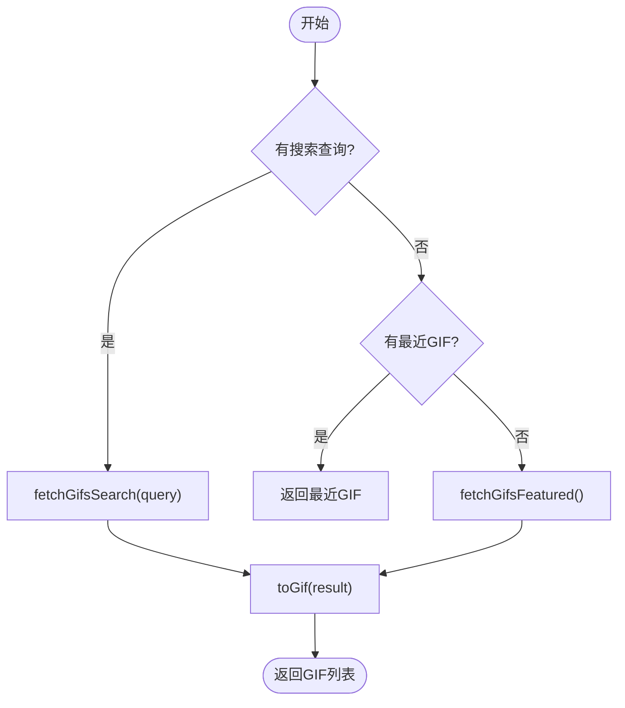

# GIF集成

<cite>
**本文档引用的文件**  
- [FunGif.dom.tsx](file://ts/components/fun/FunGif.dom.tsx)
- [FunPanelGifs.dom.tsx](file://ts/components/fun/panels/FunPanelGifs.dom.tsx)
- [gifs.preload.ts](file://ts/components/fun/data/gifs.preload.ts)
- [tenor.preload.ts](file://ts/components/fun/data/tenor.preload.ts)
- [FunProvider.dom.tsx](file://ts/components/fun/FunProvider.dom.tsx)
- [DraftGifMessageSendModal.preload.tsx](file://ts/state/smart/DraftGifMessageSendModal.preload.tsx)
- [CompositionArea.dom.tsx](file://ts/components/CompositionArea.dom.tsx)
- [gifs.preload.ts](file://ts/state/ducks/gifs.preload.ts)
</cite>

## 目录
1. [简介](#简介)
2. [项目结构](#项目结构)
3. [核心组件](#核心组件)
4. [架构概述](#架构概述)
5. [详细组件分析](#详细组件分析)
6. [依赖分析](#依赖分析)
7. [性能考虑](#性能考虑)
8. [故障排除指南](#故障排除指南)
9. [结论](#结论)

## 简介
Signal-Desktop的GIF集成功能为用户提供了一种直观、高效的方式来搜索、预览和发送GIF。该功能通过与Tenor API集成，支持搜索建议、趋势GIF、分类浏览和最近使用记录。系统实现了智能缓存策略、响应式布局和无障碍访问，确保在各种设备和网络条件下都能提供流畅的用户体验。

## 项目结构
GIF功能主要位于`ts/components/fun`目录下，采用模块化设计，将UI组件、数据获取和状态管理分离。核心文件包括`FunPanelGifs.dom.tsx`（主面板）、`FunGif.dom.tsx`（GIF播放组件）和`data/gifs.preload.ts`（数据获取逻辑）。



**图示来源**  
- [FunPanelGifs.dom.tsx](file://ts/components/fun/panels/FunPanelGifs.dom.tsx)
- [FunGif.dom.tsx](file://ts/components/fun/FunGif.dom.tsx)
- [gifs.preload.ts](file://ts/components/fun/data/gifs.preload.ts)

**本节来源**  
- [FunPanelGifs.dom.tsx](file://ts/components/fun/panels/FunPanelGifs.dom.tsx)
- [FunGif.dom.tsx](file://ts/components/fun/FunGif.dom.tsx)

## 核心组件
GIF功能的核心组件包括`FunPanelGifs`（主面板）、`FunGif`（播放组件）和`FunProvider`（上下文提供者）。这些组件协同工作，提供完整的GIF搜索和发送体验。

**本节来源**  
- [FunPanelGifs.dom.tsx](file://ts/components/fun/panels/FunPanelGifs.dom.tsx)
- [FunGif.dom.tsx](file://ts/components/fun/FunGif.dom.tsx)
- [FunProvider.dom.tsx](file://ts/components/fun/FunProvider.dom.tsx)

## 架构概述
GIF功能采用分层架构，包括UI层、数据获取层和缓存层。UI层负责展示和用户交互，数据获取层处理与Tenor API的通信，缓存层优化性能和用户体验。



**图示来源**  
- [FunPanelGifs.dom.tsx](file://ts/components/fun/panels/FunPanelGifs.dom.tsx)
- [gifs.preload.ts](file://ts/components/fun/data/gifs.preload.ts)
- [FunProvider.dom.tsx](file://ts/components/fun/FunProvider.dom.tsx)

## 详细组件分析

### FunPanelGifs分析
`FunPanelGifs`组件是GIF功能的主界面，负责管理搜索、分类浏览和结果展示。

#### 组件结构


**图示来源**  
- [FunPanelGifs.dom.tsx](file://ts/components/fun/panels/FunPanelGifs.dom.tsx)
- [FunGif.dom.tsx](file://ts/components/fun/FunGif.dom.tsx)

**本节来源**  
- [FunPanelGifs.dom.tsx](file://ts/components/fun/panels/FunPanelGifs.dom.tsx)

### FunGif分析
`FunGif`组件负责GIF的播放和预览，支持减少动画偏好设置。

#### 播放流程


**图示来源**  
- [FunGif.dom.tsx](file://ts/components/fun/FunGif.dom.tsx)
- [FunPanelGifs.dom.tsx](file://ts/components/fun/panels/FunPanelGifs.dom.tsx)

**本节来源**  
- [FunGif.dom.tsx](file://ts/components/fun/FunGif.dom.tsx)

### 数据获取分析
GIF数据获取通过`gifs.preload.ts`和`tenor.preload.ts`实现，封装了与Tenor API的通信。

#### 数据获取流程


**图示来源**  
- [gifs.preload.ts](file://ts/components/fun/data/gifs.preload.ts)
- [tenor.preload.ts](file://ts/components/fun/data/tenor.preload.ts)

**本节来源**  
- [gifs.preload.ts](file://ts/components/fun/data/gifs.preload.ts)

## 依赖分析
GIF功能依赖于多个内部和外部组件，包括Tenor API、React虚拟化库和缓存机制。

```mermaid
graph TD
A[FunPanelGifs] --> B[@tanstack/react-virtual]
A --> C[LRUCache]
A --> D[Tenor API]
A --> E[FunProvider]
D --> F[Google API]
```

**图示来源**  
- [FunPanelGifs.dom.tsx](file://ts/components/fun/panels/FunPanelGifs.dom.tsx)
- [tenor.preload.ts](file://ts/components/fun/data/tenor.preload.ts)

**本节来源**  
- [FunPanelGifs.dom.tsx](file://ts/components/fun/panels/FunPanelGifs.dom.tsx)
- [tenor.preload.ts](file://ts/components/fun/data/tenor.preload.ts)

## 性能考虑
GIF功能通过多种策略优化性能，包括虚拟滚动、智能缓存和延迟加载。

### 缓存策略
- **LRU缓存**: 50MB大小限制，基于Blob大小计算
- **弱引用缓存**: 针对活动GIF的短期缓存
- **对象URL管理**: 及时释放不再需要的URL

### 虚拟滚动
- **水fall布局**: 2列布局，自适应高度
- **虚拟化**: 仅渲染可见项目，提高滚动性能
- **预加载**: 接近底部时预加载更多项目

**本节来源**  
- [FunPanelGifs.dom.tsx](file://ts/components/fun/panels/FunPanelGifs.dom.tsx)

## 故障排除指南
### 常见问题
1. **GIF无法加载**
   - 检查网络连接
   - 验证Tenor API密钥
   - 清除缓存

2. **搜索无结果**
   - 检查搜索查询格式
   - 验证API响应
   - 检查内容过滤设置

3. **性能问题**
   - 监控内存使用
   - 检查缓存命中率
   - 优化虚拟滚动配置

### 监控指标
- API请求延迟
- 缓存命中率
- 内存使用情况
- 错误率

**本节来源**  
- [FunPanelGifs.dom.tsx](file://ts/components/fun/panels/FunPanelGifs.dom.tsx)
- [FunGif.dom.tsx](file://ts/components/fun/FunGif.dom.tsx)
- [tenor.preload.ts](file://ts/components/fun/data/tenor.preload.ts)

## 结论
Signal-Desktop的GIF集成功能通过精心设计的架构和优化策略，为用户提供了一个高效、流畅的GIF体验。系统通过与Tenor API的集成、智能缓存和虚拟滚动技术，确保了在各种条件下的良好性能。未来可以考虑增加更多个性化功能，如用户偏好学习和智能推荐。