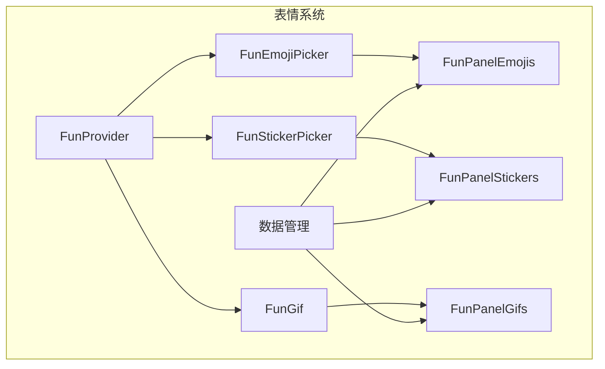
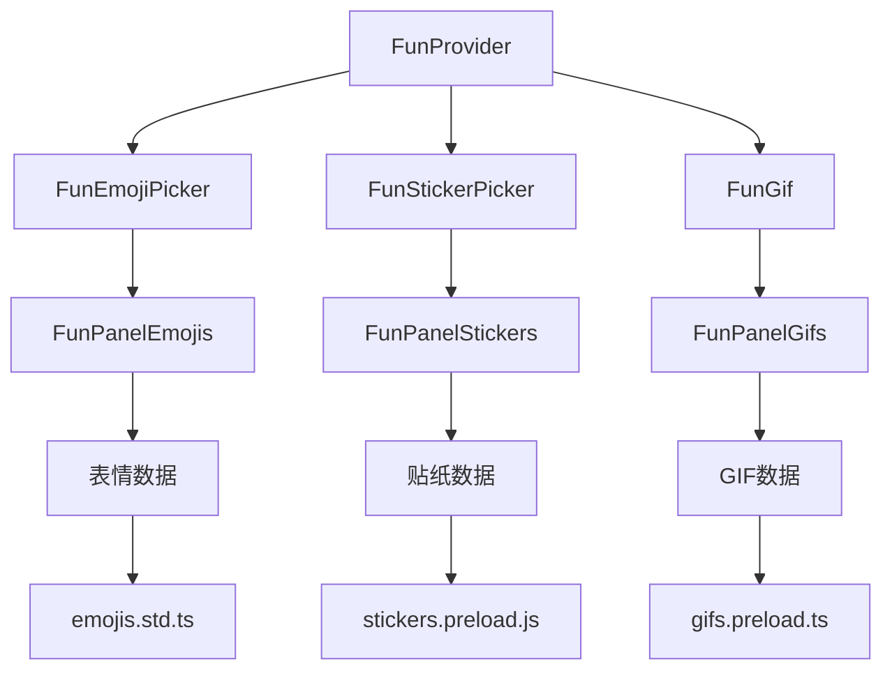
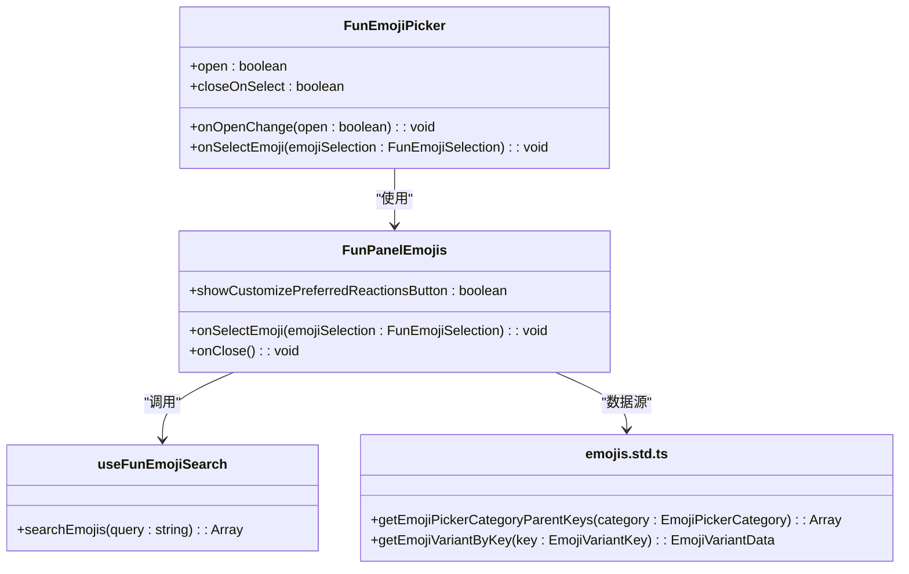
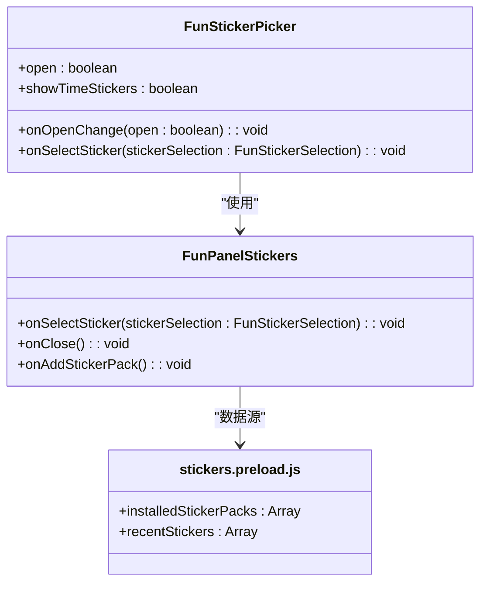
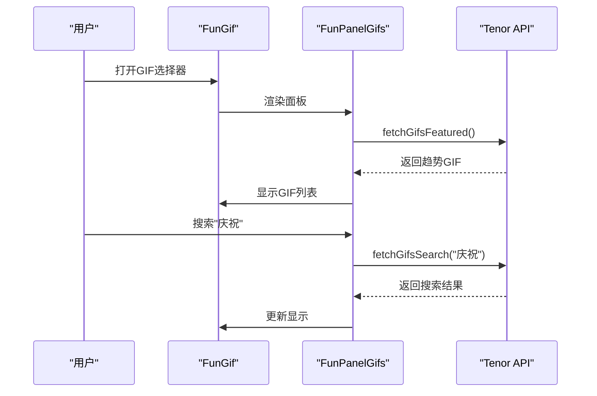

# 表情系统

<cite>
**本文档引用的文件**   
- [FunEmojiPicker.dom.tsx](file://ts/components/fun/FunEmojiPicker.dom.tsx)
- [FunStickerPicker.dom.tsx](file://ts/components/fun/FunStickerPicker.dom.tsx)
- [FunPanelGifs.dom.tsx](file://ts/components/fun/panels/FunPanelGifs.dom.tsx)
- [FunProvider.dom.tsx](file://ts/components/fun/FunProvider.dom.tsx)
- [FunPanelEmojis.dom.tsx](file://ts/components/fun/panels/FunPanelEmojis.dom.tsx)
- [FunPanelStickers.dom.tsx](file://ts/components/fun/panels/FunPanelStickers.dom.tsx)
- [gifs.preload.ts](file://ts/components/fun/data/gifs.preload.ts)
- [emojis.std.ts](file://ts/components/fun/data/emojis.std.ts)
- [FunGif.dom.tsx](file://ts/components/fun/FunGif.dom.tsx)
</cite>

## 目录
1. [简介](#简介)
2. [项目结构](#项目结构)
3. [核心组件](#核心组件)
4. [架构概述](#架构概述)
5. [详细组件分析](#详细组件分析)
6. [依赖分析](#依赖分析)
7. [性能考虑](#性能考虑)
8. [故障排除指南](#故障排除指南)
9. [结论](#结论)

## 简介
Signal-Desktop的表情系统提供了一套完整的表情、贴纸和GIF选择功能，旨在增强用户在消息交流中的表达能力。该系统由多个核心组件构成，包括表情选择器（FunEmojiPicker）、贴纸选择器（FunStickerPicker）和GIF搜索（FunGif），并通过FunProvider进行统一的状态管理。系统支持表情皮肤色调选择、最近使用记录、搜索建议等用户体验功能，并通过懒加载和缓存机制优化性能。

## 项目结构
表情系统的主要代码位于`ts/components/fun/`目录下，采用模块化设计，将不同功能分离到独立的文件中。核心组件包括表情面板、贴纸面板和GIF面板，每个面板负责特定的用户交互。数据管理通过`data/`子目录中的文件处理，而状态管理则由`FunProvider`统一协调。该结构确保了代码的可维护性和可扩展性。



**图表来源**
- [FunProvider.dom.tsx](file://ts/components/fun/FunProvider.dom.tsx#L1-L170)
- [FunEmojiPicker.dom.tsx](file://ts/components/fun/FunEmojiPicker.dom.tsx#L1-L65)
- [FunStickerPicker.dom.tsx](file://ts/components/fun/FunStickerPicker.dom.tsx#L1-L62)
- [FunPanelGifs.dom.tsx](file://ts/components/fun/panels/FunPanelGifs.dom.tsx#L1-L707)

**章节来源**
- [FunProvider.dom.tsx](file://ts/components/fun/FunProvider.dom.tsx#L1-L170)
- [FunEmojiPicker.dom.tsx](file://ts/components/fun/FunEmojiPicker.dom.tsx#L1-L65)
- [FunStickerPicker.dom.tsx](file://ts/components/fun/FunStickerPicker.dom.tsx#L1-L62)
- [FunPanelGifs.dom.tsx](file://ts/components/fun/panels/FunPanelGifs.dom.tsx#L1-L707)

## 核心组件
表情系统的核心组件包括表情选择器、贴纸选择器和GIF搜索功能。这些组件通过`FunProvider`进行状态管理，并通过`FunPanel`系列组件实现具体的用户界面。表情选择器支持分类浏览和搜索，贴纸选择器管理用户安装的贴纸包，而GIF搜索则集成了第三方API（如Tenor）以提供丰富的动态图内容。

**章节来源**
- [FunEmojiPicker.dom.tsx](file://ts/components/fun/FunEmojiPicker.dom.tsx#L1-L65)
- [FunStickerPicker.dom.tsx](file://ts/components/fun/FunStickerPicker.dom.tsx#L1-L62)
- [FunPanelGifs.dom.tsx](file://ts/components/fun/panels/FunPanelGifs.dom.tsx#L1-L707)

## 架构概述
表情系统的架构采用分层设计，顶层是`FunProvider`，负责管理全局状态，如当前选项卡、搜索输入和皮肤色调偏好。中间层是各种Picker组件，它们通过`FunProvider`获取状态并触发状态更新。底层是Panel组件，负责渲染具体的UI元素，如表情网格、贴纸列表和GIF瀑布流。这种分层架构确保了状态的一致性和组件的可复用性。



**图表来源**
- [FunProvider.dom.tsx](file://ts/components/fun/FunProvider.dom.tsx#L1-L170)
- [FunEmojiPicker.dom.tsx](file://ts/components/fun/FunEmojiPicker.dom.tsx#L1-L65)
- [FunStickerPicker.dom.tsx](file://ts/components/fun/FunStickerPicker.dom.tsx#L1-L62)
- [FunPanelGifs.dom.tsx](file://ts/components/fun/panels/FunPanelGifs.dom.tsx#L1-L707)
- [emojis.std.ts](file://ts/components/fun/data/emojis.std.ts#L1-L776)
- [gifs.preload.ts](file://ts/components/fun/data/gifs.preload.ts#L1-L86)

## 详细组件分析
### 表情选择器分析
表情选择器（FunEmojiPicker）允许用户从多个分类中选择表情，支持搜索和最近使用记录。它通过`FunPanelEmojis`组件渲染UI，并利用`useFunVirtualGrid`实现虚拟滚动，以提高性能。

#### 表情分类与搜索逻辑


**图表来源**
- [FunEmojiPicker.dom.tsx](file://ts/components/fun/FunEmojiPicker.dom.tsx#L1-L65)
- [FunPanelEmojis.dom.tsx](file://ts/components/fun/panels/FunPanelEmojis.dom.tsx#L1-L800)
- [useFunEmojiSearch.dom.tsx](file://ts/components/fun/useFunEmojiSearch.dom.tsx#L1-L50)
- [emojis.std.ts](file://ts/components/fun/data/emojis.std.ts#L1-L776)

**章节来源**
- [FunEmojiPicker.dom.tsx](file://ts/components/fun/FunEmojiPicker.dom.tsx#L1-L65)
- [FunPanelEmojis.dom.tsx](file://ts/components/fun/panels/FunPanelEmojis.dom.tsx#L1-L800)

### 贴纸选择器分析
贴纸选择器（FunStickerPicker）管理用户安装的贴纸包，支持按包浏览和搜索。它通过`FunPanelStickers`组件渲染UI，并利用`useFunVirtualGrid`实现虚拟滚动。

#### 贴纸包管理


**图表来源**
- [FunStickerPicker.dom.tsx](file://ts/components/fun/FunStickerPicker.dom.tsx#L1-L62)
- [FunPanelStickers.dom.tsx](file://ts/components/fun/panels/FunPanelStickers.dom.tsx#L1-L793)
- [stickers.preload.js](file://ts/state/ducks/stickers.preload.js#L1-L100)

**章节来源**
- [FunStickerPicker.dom.tsx](file://ts/components/fun/FunStickerPicker.dom.tsx#L1-L62)
- [FunPanelStickers.dom.tsx](file://ts/components/fun/panels/FunPanelStickers.dom.tsx#L1-L793)

### GIF搜索分析
GIF搜索功能（FunGif）集成第三方API（如Tenor），提供趋势、搜索和最近使用GIF的展示。它通过`FunPanelGifs`组件渲染UI，并利用`useInfiniteQuery`实现分页加载。

#### GIF集成API调用


**图表来源**
- [FunGif.dom.tsx](file://ts/components/fun/FunGif.dom.tsx#L1-L128)
- [FunPanelGifs.dom.tsx](file://ts/components/fun/panels/FunPanelGifs.dom.tsx#L1-L707)
- [gifs.preload.ts](file://ts/components/fun/data/gifs.preload.ts#L1-L86)

**章节来源**
- [FunGif.dom.tsx](file://ts/components/fun/FunGif.dom.tsx#L1-L128)
- [FunPanelGifs.dom.tsx](file://ts/components/fun/panels/FunPanelGifs.dom.tsx#L1-L707)

## 依赖分析
表情系统依赖于多个外部库和内部模块。外部依赖包括`emoji-datasource`用于表情数据、`lru-cache`用于缓存管理，以及`@tanstack/react-virtual`用于虚拟滚动。内部依赖包括`FunProvider`用于状态管理、`useFunVirtualGrid`用于网格布局，以及`gifs.preload.ts`和`emojis.std.ts`用于数据处理。

```mermaid
graph TD
A[FunEmojiPicker] --> B[emoji-datasource]
A --> C[react-aria-components]
D[FunStickerPicker] --> E[lru-cache]
D --> C
F[FunGif] --> G[@tanstack/react-virtual]
F --> C
H[FunProvider] --> I[react]
H --> J[assert.std.js]
```

**图表来源**
- [FunProvider.dom.tsx](file://ts/components/fun/FunProvider.dom.tsx#L1-L170)
- [FunEmojiPicker.dom.tsx](file://ts/components/fun/FunEmojiPicker.dom.tsx#L1-L65)
- [FunStickerPicker.dom.tsx](file://ts/components/fun/FunStickerPicker.dom.tsx#L1-L62)
- [FunPanelGifs.dom.tsx](file://ts/components/fun/panels/FunPanelGifs.dom.tsx#L1-L707)

**章节来源**
- [FunProvider.dom.tsx](file://ts/components/fun/FunProvider.dom.tsx#L1-L170)
- [FunEmojiPicker.dom.tsx](file://ts/components/fun/FunEmojiPicker.dom.tsx#L1-L65)
- [FunStickerPicker.dom.tsx](file://ts/components/fun/FunStickerPicker.dom.tsx#L1-L62)
- [FunPanelGifs.dom.tsx](file://ts/components/fun/panels/FunPanelGifs.dom.tsx#L1-L707)

## 性能考虑
表情系统通过多种策略优化性能。首先，使用虚拟滚动（virtualization）技术，只渲染可视区域内的元素，减少DOM节点数量。其次，实现懒加载和缓存机制，避免重复下载相同资源。例如，GIF预览图通过`LRUCache`进行内存缓存，最大缓存大小为50MB。此外，表情搜索使用防抖（debounce）技术，避免频繁查询。

**章节来源**
- [FunPanelGifs.dom.tsx](file://ts/components/fun/panels/FunPanelGifs.dom.tsx#L76-L93)
- [FunPanelEmojis.dom.tsx](file://ts/components/fun/panels/FunPanelEmojis.dom.tsx#L283-L291)
- [FunPanelStickers.dom.tsx](file://ts/components/fun/panels/FunPanelStickers.dom.tsx#L322-L330)

## 故障排除指南
### 表情皮肤色调选择
表情皮肤色调选择功能允许用户为支持肤色的表情选择不同的肤色。该功能在`FunPanelEmojis`中实现，当用户点击带有肤色变体的表情时，会弹出一个皮肤色调选择器。默认肤色由`FunProvider`中的`emojiSkinToneDefault`状态管理。

**章节来源**
- [FunPanelEmojis.dom.tsx](file://ts/components/fun/panels/FunPanelEmojis.dom.tsx#L626-L715)

### 最近使用表情记忆
最近使用表情记忆功能通过`recentEmojis`状态管理，存储用户最近选择的表情。该状态在`FunProvider`中定义，并在用户选择表情时更新。最近使用列表在表情选择器的“最近”标签页中显示。

**章节来源**
- [FunProvider.dom.tsx](file://ts/components/fun/FunProvider.dom.tsx#L29-L34)
- [FunPanelEmojis.dom.tsx](file://ts/components/fun/panels/FunPanelEmojis.dom.tsx#L246-L258)

### 搜索建议实现
搜索建议功能通过`useFunEmojiSearch`钩子实现，该钩子使用预构建的表情搜索索引进行快速匹配。搜索索引包含表情的英文短名称和表情符号，支持模糊匹配。搜索输入通过防抖技术优化，避免频繁更新。

**章节来源**
- [useFunEmojiSearch.dom.tsx](file://ts/components/fun/useFunEmojiSearch.dom.tsx#L1-L50)
- [FunPanelEmojis.dom.tsx](file://ts/components/fun/panels/FunPanelEmojis.dom.tsx#L216-L233)

## 结论
Signal-Desktop的表情系统是一个功能丰富、性能优化的用户界面组件，通过模块化设计和分层架构实现了表情、贴纸和GIF的高效管理。系统支持多种用户体验功能，如皮肤色调选择、最近使用记忆和搜索建议，并通过虚拟滚动和缓存机制确保流畅的交互体验。该系统的代码结构清晰，易于维护和扩展。