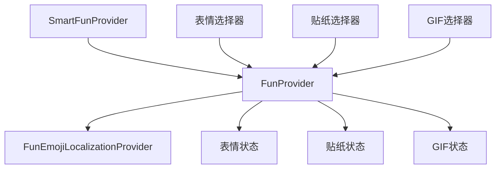
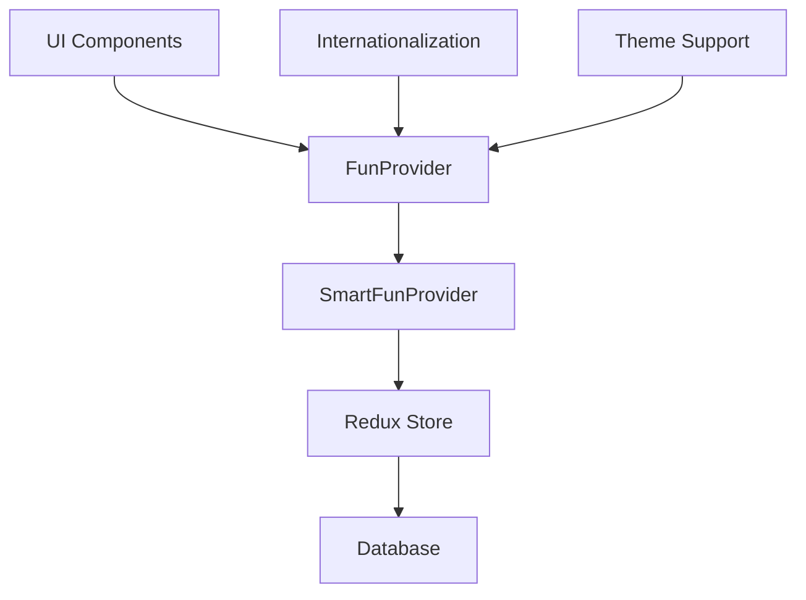
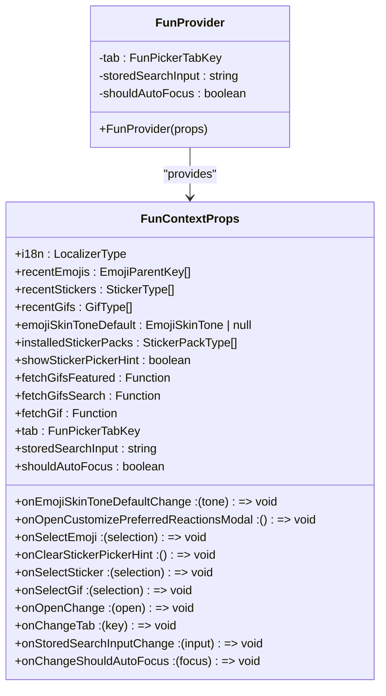
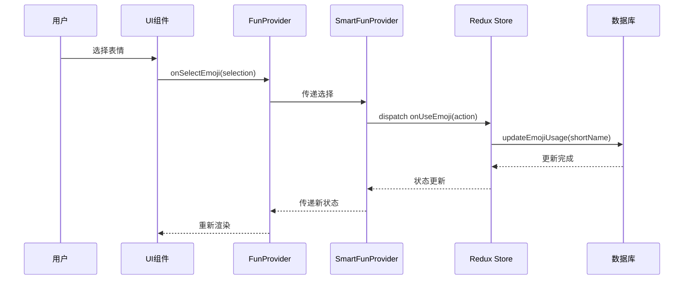
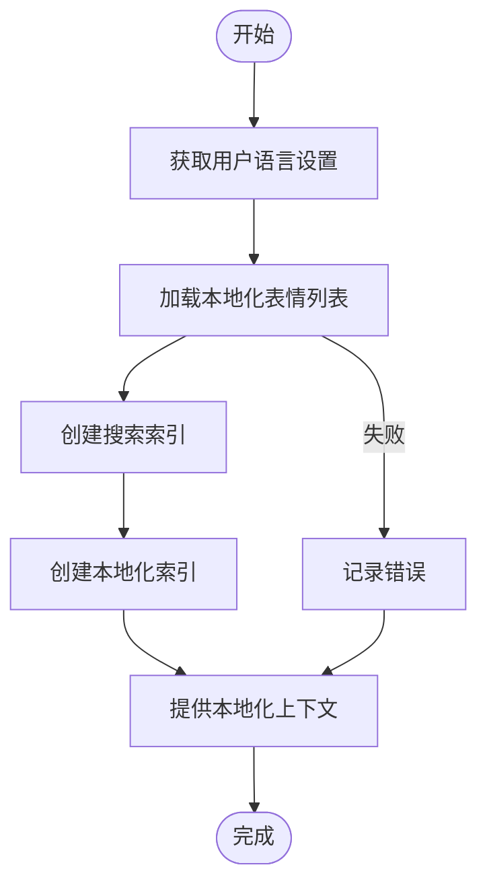
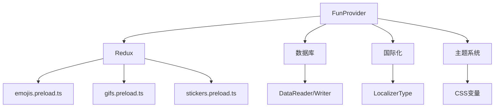

# 表情系统状态管理

<cite>
**本文档引用的文件**
- [FunProvider.dom.tsx](file://ts/components/fun/FunProvider.dom.tsx)
- [FunProvider.preload.tsx](file://ts/state/smart/FunProvider.preload.tsx)
- [FunEmojiLocalizationProvider.dom.tsx](file://ts/components/fun/FunEmojiLocalizationProvider.dom.tsx)
- [emojis.preload.ts](file://ts/state/ducks/emojis.preload.ts)
- [gifs.preload.ts](file://ts/state/ducks/gifs.preload.ts)
- [stickers.preload.ts](file://ts/state/ducks/stickers.preload.ts)
- [emojis.std.ts](file://ts/components/fun/data/emojis.std.ts)
- [gifs.preload.js](file://ts/components/fun/data/gifs.preload.js)
- [tenor.preload.js](file://ts/components/fun/data/tenor.preload.js)
- [items.std.ts](file://ts/state/selectors/items.dom.js)
- [user.std.ts](file://ts/state/selectors/user.std.js)
- [useBoundActions.std.ts](file://ts/hooks/useBoundActions.std.ts)
</cite>

## 目录
1. [简介](#简介)
2. [项目结构](#项目结构)
3. [核心组件](#核心组件)
4. [架构概述](#架构概述)
5. [详细组件分析](#详细组件分析)
6. [依赖分析](#依赖分析)
7. [性能考虑](#性能考虑)
8. [故障排除指南](#故障排除指南)
9. [结论](#结论)

## 简介
本文件详细记录了Signal-Desktop应用程序中表情系统（包括表情符号、GIF和贴纸）的状态管理实现。重点分析了FunProvider组件，该组件为表情选择器提供全局状态管理、主题支持和国际化处理。文档涵盖了状态上下文结构、状态更新机制、组件间通信模式、API文档、状态持久化策略、性能优化措施和错误边界处理。

## 项目结构
表情系统相关的代码主要分布在以下几个目录中：
- `ts/components/fun/`: 包含FunProvider及其相关UI组件
- `ts/state/ducks/`: 包含表情、GIF和贴纸的状态管理逻辑
- `ts/state/selectors/`: 包含状态选择器
- `ts/components/fun/data/`: 包含表情数据处理逻辑
- `ts/state/smart/`: 包含智能提供者组件

**图表来源**
- [FunProvider.dom.tsx](file://ts/components/fun/FunProvider.dom.tsx#L1-L170)
- [FunEmojiLocalizationProvider.dom.tsx](file://ts/components/fun/FunEmojiLocalizationProvider.dom.tsx#L1-L152)

**章节来源**
- [FunProvider.dom.tsx](file://ts/components/fun/FunProvider.dom.tsx#L1-L170)
- [FunEmojiLocalizationProvider.dom.tsx](file://ts/components/fun/FunEmojiLocalizationProvider.dom.tsx#L1-L152)

## 核心组件
FunProvider组件是表情系统的核心，它通过React Context API提供全局状态管理。该组件封装了表情、贴纸和GIF的所有状态和操作，为子组件提供统一的访问接口。SmartFunProvider作为容器组件，连接Redux状态和FunProvider，实现了状态的智能注入。

**章节来源**
- [FunProvider.dom.tsx](file://ts/components/fun/FunProvider.dom.tsx#L1-L170)
- [FunProvider.preload.tsx](file://ts/state/smart/FunProvider.preload.tsx#L1-L140)

## 架构概述
表情系统的架构采用分层设计，上层是UI组件，中间是状态提供者，底层是Redux状态管理。FunProvider作为中间层，将Redux状态转换为适合UI组件使用的格式，并提供回调函数用于状态更新。

**图表来源**
- [FunProvider.dom.tsx](file://ts/components/fun/FunProvider.dom.tsx#L1-L170)
- [FunProvider.preload.tsx](file://ts/state/smart/FunProvider.preload.tsx#L1-L140)

## 详细组件分析

### FunProvider分析
FunProvider组件实现了表情系统的状态管理，包括最近使用项、皮肤色调偏好、贴纸提示等状态的管理。

#### 状态上下文结构

**图表来源**
- [FunProvider.dom.tsx](file://ts/components/fun/FunProvider.dom.tsx#L28-L70)

#### 状态更新机制

**图表来源**
- [FunProvider.dom.tsx](file://ts/components/fun/FunProvider.dom.tsx#L95-L169)
- [FunProvider.preload.tsx](file://ts/state/smart/FunProvider.preload.tsx#L43-L139)
- [emojis.preload.ts](file://ts/state/ducks/emojis.preload.ts#L46-L62)

### 国际化处理
FunEmojiLocalizationProvider组件负责处理表情的国际化，根据用户的语言设置加载相应的本地化表情数据。

**图表来源**
- [FunEmojiLocalizationProvider.dom.tsx](file://ts/components/fun/FunEmojiLocalizationProvider.dom.tsx#L1-L152)

**章节来源**
- [FunEmojiLocalizationProvider.dom.tsx](file://ts/components/fun/FunEmojiLocalizationProvider.dom.tsx#L1-L152)

## 依赖分析
表情系统依赖于多个核心模块，包括Redux状态管理、数据库持久化、国际化服务等。

**图表来源**
- [FunProvider.dom.tsx](file://ts/components/fun/FunProvider.dom.tsx#L1-L170)
- [FunProvider.preload.tsx](file://ts/state/smart/FunProvider.preload.tsx#L1-L140)
- [emojis.preload.ts](file://ts/state/ducks/emojis.preload.ts#L1-L94)

**章节来源**
- [FunProvider.dom.tsx](file://ts/components/fun/FunProvider.dom.tsx#L1-L170)
- [FunProvider.preload.tsx](file://ts/state/smart/FunProvider.preload.tsx#L1-L140)
- [emojis.preload.ts](file://ts/state/ducks/emojis.preload.ts#L1-L94)
- [gifs.preload.ts](file://ts/state/ducks/gifs.preload.ts#L1-L116)
- [stickers.preload.ts](file://ts/state/ducks/stickers.preload.ts#L1-L563)

## 性能考虑
表情系统在性能方面进行了多项优化：
1. 使用memo和useCallback避免不必要的重新渲染
2. 对最近使用项的数量进行限制（表情32个，GIF 64个）
3. 搜索索引的缓存和复用
4. 异步加载本地化表情数据
5. 状态更新的批处理

## 故障排除指南
### 常见问题
1. **表情不显示**: 检查本地化表情列表是否成功加载
2. **最近使用项不更新**: 确认数据库写入操作是否成功
3. **皮肤色调偏好不保存**: 检查items状态中的emojiSkinToneDefault字段
4. **贴纸提示不消失**: 确认removeItem操作是否正确执行

**章节来源**
- [FunProvider.dom.tsx](file://ts/components/fun/FunProvider.dom.tsx#L1-L170)
- [FunProvider.preload.tsx](file://ts/state/smart/FunProvider.preload.tsx#L1-L140)
- [emojis.preload.ts](file://ts/state/ducks/emojis.preload.ts#L1-L94)

## 结论
Signal-Desktop的表情系统通过FunProvider组件实现了高效的状态管理，结合Redux和React Context提供了灵活的架构。系统支持完整的国际化和主题定制，具有良好的性能表现和可维护性。通过智能提供者模式，将复杂的Redux状态管理细节封装起来，为UI组件提供了简洁易用的API。