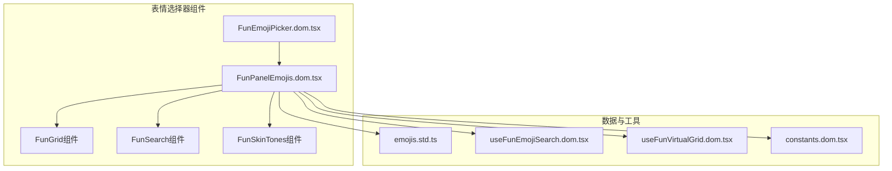
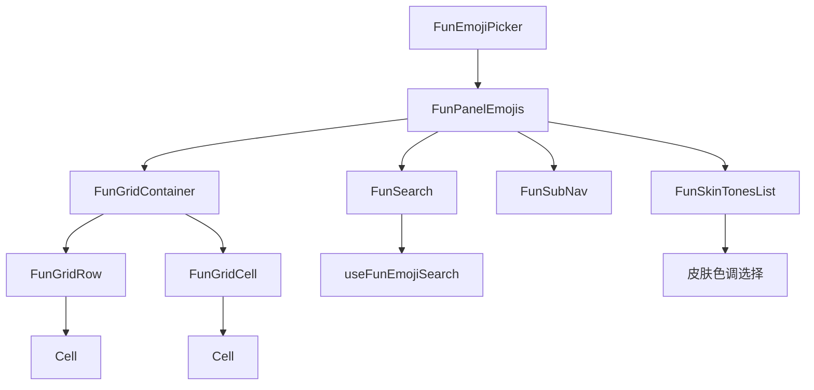
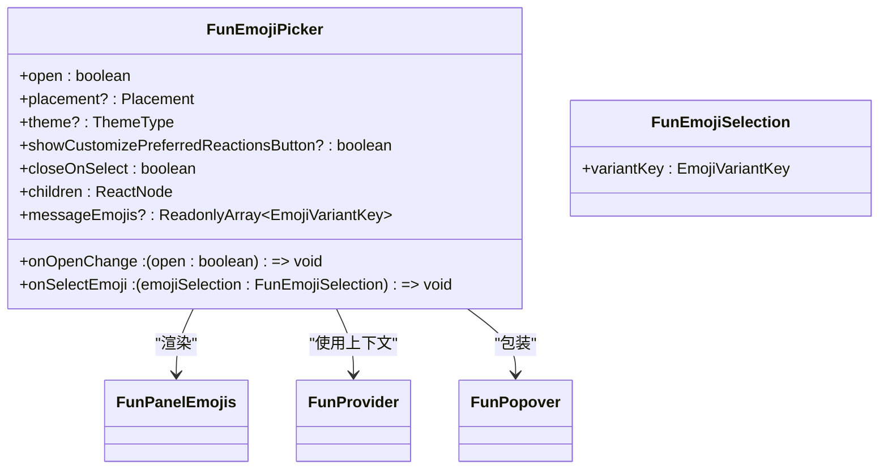
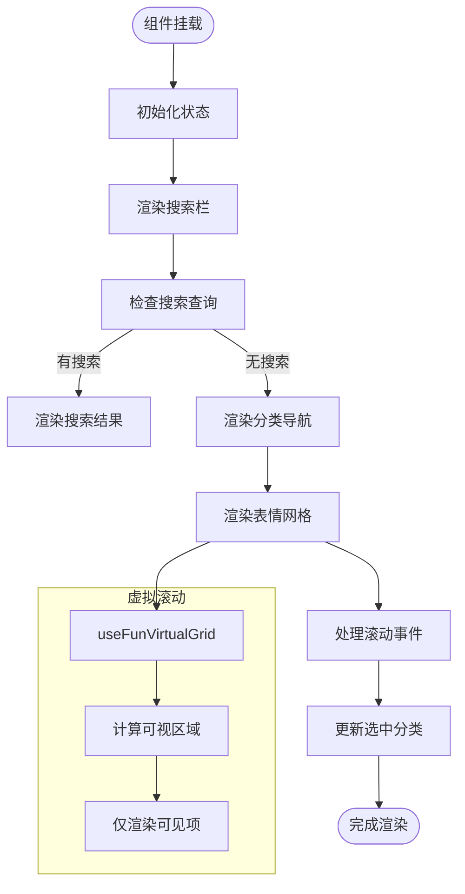
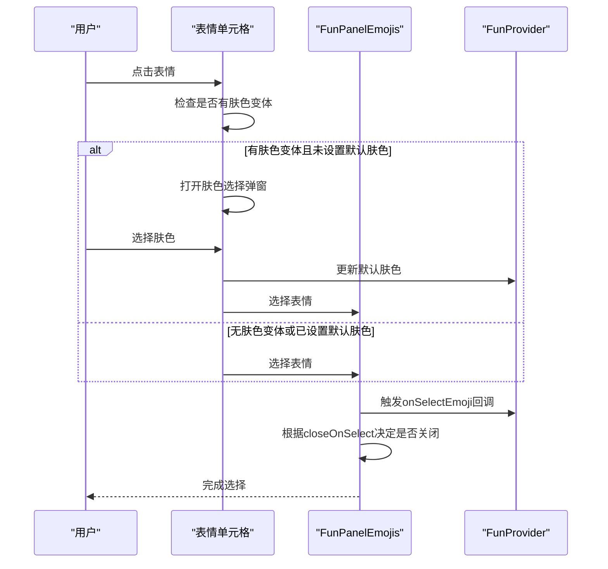
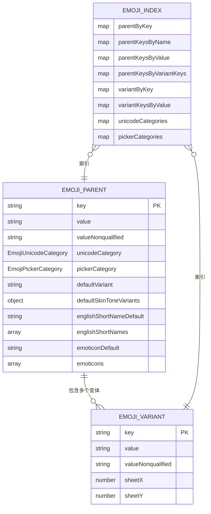
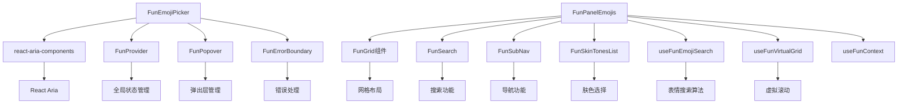

# 表情选择器

<cite>
**本文档中引用的文件**  
- [FunEmojiPicker.dom.tsx](file://ts/components/fun/FunEmojiPicker.dom.tsx)
- [FunEmojiPicker.dom.stories.tsx](file://ts/components/fun/FunEmojiPicker.dom.stories.tsx)
- [FunPanelEmojis.dom.tsx](file://ts/components/fun/panels/FunPanelEmojis.dom.tsx)
- [emojis.std.ts](file://ts/components/fun/data/emojis.std.ts)
- [useFunEmojiSearch.dom.tsx](file://ts/components/fun/useFunEmojiSearch.dom.tsx)
- [useFunVirtualGrid.dom.tsx](file://ts/components/fun/virtual/useFunVirtualGrid.dom.tsx)
- [constants.dom.tsx](file://ts/components/fun/constants.dom.tsx)
</cite>

## 目录
1. [简介](#简介)
2. [项目结构](#项目结构)
3. [核心组件](#核心组件)
4. [架构概述](#架构概述)
5. [详细组件分析](#详细组件分析)
6. [依赖分析](#依赖分析)
7. [性能考虑](#性能考虑)
8. [故障排除指南](#故障排除指南)
9. [结论](#结论)

## 简介
本文档详细介绍了Signal-Desktop中FunEmojiPicker组件的实现。该组件提供了一个功能丰富且用户友好的表情选择器，支持表情分类导航、搜索功能、皮肤色调选择和最近使用表情管理。文档深入分析了表情数据结构、表情网格渲染逻辑和用户交互事件处理，并提供了API文档、性能优化策略和无障碍访问支持。

## 项目结构
表情选择器功能主要位于`ts/components/fun/`目录下，包含多个子模块和组件。核心组件包括FunEmojiPicker、FunPanelEmojis和相关的数据处理工具。

**图示来源**
- [FunEmojiPicker.dom.tsx](file://ts/components/fun/FunEmojiPicker.dom.tsx)
- [FunPanelEmojis.dom.tsx](file://ts/components/fun/panels/FunPanelEmojis.dom.tsx)
- [emojis.std.ts](file://ts/components/fun/data/emojis.std.ts)

**节来源**
- [FunEmojiPicker.dom.tsx](file://ts/components/fun/FunEmojiPicker.dom.tsx)
- [FunPanelEmojis.dom.tsx](file://ts/components/fun/panels/FunPanelEmojis.dom.tsx)

## 核心组件
FunEmojiPicker是表情选择器的主要入口组件，它封装了表情面板的显示逻辑和状态管理。该组件通过DialogTrigger控制弹出层的显示和隐藏，并通过FunProvider获取全局的表情相关状态。

**节来源**
- [FunEmojiPicker.dom.tsx](file://ts/components/fun/FunEmojiPicker.dom.tsx)
- [FunEmojiPicker.dom.stories.tsx](file://ts/components/fun/FunEmojiPicker.dom.stories.tsx)

## 架构概述
表情选择器采用分层架构设计，将UI组件、数据处理和状态管理分离。FunEmojiPicker作为顶层组件，负责控制弹出层的显示；FunPanelEmojis作为核心面板组件，负责渲染表情网格和处理用户交互；底层工具模块负责表情数据的管理和搜索功能。

**图示来源**
- [FunEmojiPicker.dom.tsx](file://ts/components/fun/FunEmojiPicker.dom.tsx)
- [FunPanelEmojis.dom.tsx](file://ts/components/fun/panels/FunPanelEmojis.dom.tsx)

## 详细组件分析

### FunEmojiPicker分析
FunEmojiPicker组件是表情选择器的入口点，它使用React的memo进行性能优化，并通过useFunContext获取全局表情状态。

**图示来源**
- [FunEmojiPicker.dom.tsx](file://ts/components/fun/FunEmojiPicker.dom.tsx)

**节来源**
- [FunEmojiPicker.dom.tsx](file://ts/components/fun/FunEmojiPicker.dom.tsx)

### FunPanelEmojis分析
FunPanelEmojis是表情选择器的核心面板组件，负责渲染表情网格、处理搜索功能和用户交互。

#### 表情网格渲染

**图示来源**
- [FunPanelEmojis.dom.tsx](file://ts/components/fun/panels/FunPanelEmojis.dom.tsx)
- [useFunVirtualGrid.dom.tsx](file://ts/components/fun/virtual/useFunVirtualGrid.dom.tsx)

#### 用户交互处理

**图示来源**
- [FunPanelEmojis.dom.tsx](file://ts/components/fun/panels/FunPanelEmojis.dom.tsx)

**节来源**
- [FunPanelEmojis.dom.tsx](file://ts/components/fun/panels/FunPanelEmojis.dom.tsx)

### 表情数据结构分析
表情数据结构设计用于高效地存储和检索表情信息，包括基本表情、肤色变体和分类信息。

**图示来源**
- [emojis.std.ts](file://ts/components/fun/data/emojis.std.ts)

**节来源**
- [emojis.std.ts](file://ts/components/fun/data/emojis.std.ts)

## 依赖分析
表情选择器组件依赖于多个内部和外部模块，形成了一个复杂的依赖网络。

**图示来源**
- [FunEmojiPicker.dom.tsx](file://ts/components/fun/FunEmojiPicker.dom.tsx)
- [FunPanelEmojis.dom.tsx](file://ts/components/fun/panels/FunPanelEmojis.dom.tsx)
- [useFunEmojiSearch.dom.tsx](file://ts/components/fun/useFunEmojiSearch.dom.tsx)
- [useFunVirtualGrid.dom.tsx](file://ts/components/fun/virtual/useFunVirtualGrid.dom.tsx)

**节来源**
- [FunEmojiPicker.dom.tsx](file://ts/components/fun/FunEmojiPicker.dom.tsx)
- [FunPanelEmojis.dom.tsx](file://ts/components/fun/panels/FunPanelEmojis.dom.tsx)

## 性能考虑
表情选择器在设计时考虑了多个性能优化策略，以确保在大量表情数据下的流畅体验。

### 虚拟滚动
通过useFunVirtualGrid实现虚拟滚动，只渲染可视区域内的表情项，大大减少了DOM节点数量和内存占用。

### 记忆化
使用React.memo对FunEmojiPicker、Row和Cell等组件进行记忆化，避免不必要的重新渲染。

### 搜索优化
useFunEmojiSearch提供高效的搜索算法，通过预构建的搜索索引实现快速的表情搜索。

### 数据索引
在emojis.std.ts中构建了多个索引结构（parentByKey、parentKeysByName等），实现O(1)时间复杂度的表情数据查找。

**节来源**
- [useFunVirtualGrid.dom.tsx](file://ts/components/fun/virtual/useFunVirtualGrid.dom.tsx)
- [useFunEmojiSearch.dom.tsx](file://ts/components/fun/useFunEmojiSearch.dom.tsx)
- [emojis.std.ts](file://ts/components/fun/data/emojis.std.ts)

## 故障排除指南
### 表情不显示
检查表情数据是否正确加载，确保emoji-datasource依赖已正确安装。

### 搜索功能失效
验证useFunEmojiSearch是否正确初始化，检查搜索索引是否已构建。

### 肤色选择不工作
确认EmojiSkinTone枚举值是否正确，检查getEmojiVariantKeyByParentKeyAndSkinTone函数的实现。

### 虚拟滚动卡顿
检查useFunVirtualGrid的配置，确保overscan值设置合理。

**节来源**
- [FunPanelEmojis.dom.tsx](file://ts/components/fun/panels/FunPanelEmojis.dom.tsx)
- [useFunVirtualGrid.dom.tsx](file://ts/components/fun/virtual/useFunVirtualGrid.dom.tsx)

## 结论
Signal-Desktop的表情选择器是一个功能完整、性能优化良好的组件，通过合理的架构设计和多种优化策略，为用户提供了流畅的表情选择体验。组件的模块化设计使其易于维护和扩展，为未来的功能添加提供了良好的基础。