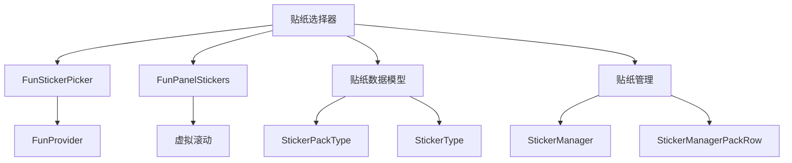
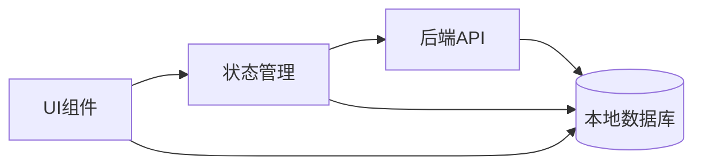
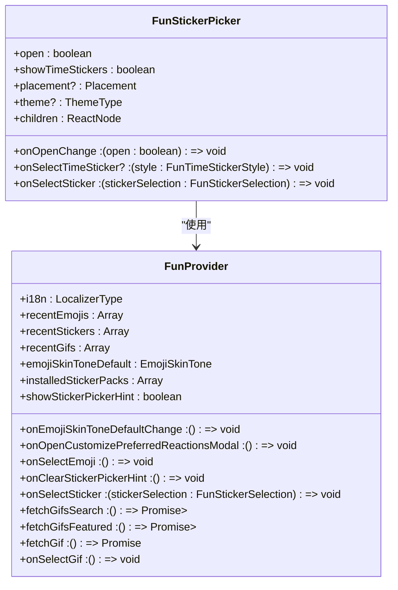
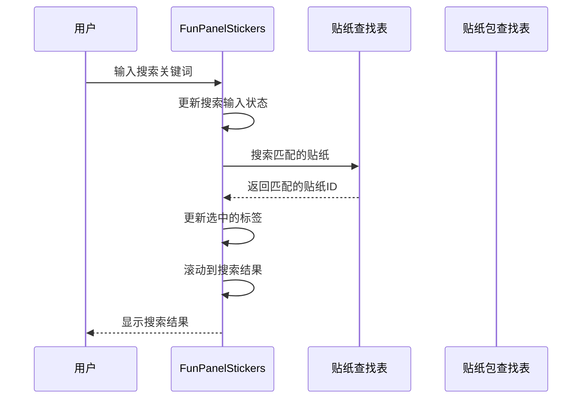
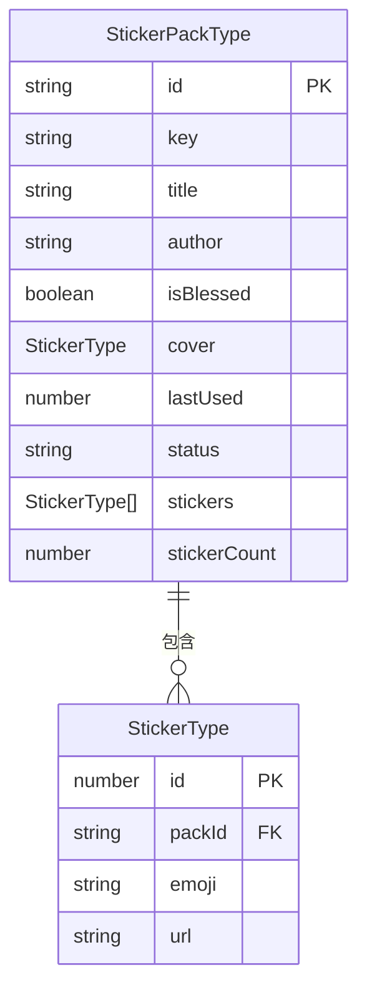
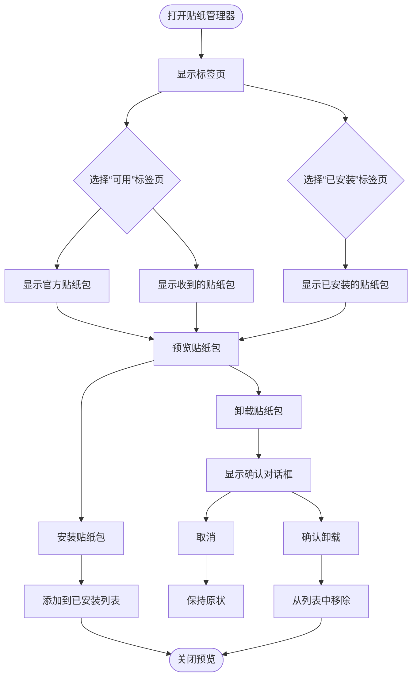

# 贴纸选择器

<cite>
**本文档中引用的文件**  
- [FunStickerPicker.dom.tsx](file://ts/components/fun/FunStickerPicker.dom.tsx)
- [FunPanelStickers.dom.tsx](file://ts/components/fun/panels/FunPanelStickers.dom.tsx)
- [stickers.preload.ts](file://ts/state/ducks/stickers.preload.ts)
- [StickerManager.dom.tsx](file://ts/components/stickers/StickerManager.dom.tsx)
- [StickerManagerPackRow.dom.tsx](file://ts/components/stickers/StickerManagerPackRow.dom.tsx)
- [WebAPI.preload.ts](file://ts/textsecure/WebAPI.preload.ts)
- [useFunVirtualGrid.dom.tsx](file://ts/components/fun/virtual/useFunVirtualGrid.dom.tsx)
- [FunSticker.dom.tsx](file://ts/components/fun/FunSticker.dom.tsx)
- [mocks.std.ts](file://ts/components/stickers/mocks.std.ts)
</cite>

## 目录
1. [简介](#简介)
2. [项目结构](#项目结构)
3. [核心组件](#核心组件)
4. [架构概述](#架构概述)
5. [详细组件分析](#详细组件分析)
6. [依赖分析](#依赖分析)
7. [性能考虑](#性能考虑)
8. [故障排除指南](#故障排除指南)
9. [结论](#结论)

## 简介
本文档详细介绍了Signal-Desktop应用程序中FunStickerPicker组件的实现。该组件为用户提供了一个直观的界面，用于浏览、搜索和选择贴纸。它支持贴纸包的安装、管理和最近使用的贴纸展示。贴纸选择器集成了虚拟滚动技术，以确保在处理大量贴纸时的高性能。此外，它还支持动态时间贴纸，这些贴纸会实时更新以显示当前时间。该组件的设计注重用户体验，提供了流畅的动画和无障碍功能。

## 项目结构
Signal-Desktop项目的贴纸功能主要分布在`ts/components/fun`和`ts/state/ducks`目录中。`fun`目录包含贴纸选择器的UI组件，而`ducks`目录包含与贴纸相关的状态管理逻辑。贴纸数据模型定义在`types/Stickers.preload.ts`中，而与后端服务的集成则在`textsecure/WebAPI.preload.ts`中处理。贴纸管理界面位于`ts/components/stickers`目录中，允许用户管理已安装的贴纸包。



**图表来源**
- [FunStickerPicker.dom.tsx](file://ts/components/fun/FunStickerPicker.dom.tsx)
- [FunPanelStickers.dom.tsx](file://ts/components/fun/panels/FunPanelStickers.dom.tsx)
- [stickers.preload.ts](file://ts/state/ducks/stickers.preload.ts)
- [StickerManager.dom.tsx](file://ts/components/stickers/StickerManager.dom.tsx)

**章节来源**
- [FunStickerPicker.dom.tsx](file://ts/components/fun/FunStickerPicker.dom.tsx)
- [FunPanelStickers.dom.tsx](file://ts/components/fun/panels/FunPanelStickers.dom.tsx)
- [stickers.preload.ts](file://ts/state/ducks/stickers.preload.ts)

## 核心组件
FunStickerPicker组件是贴纸选择功能的核心。它由`FunStickerPicker`和`FunPanelStickers`两个主要组件组成。`FunStickerPicker`负责管理选择器的打开和关闭状态，而`FunPanelStickers`负责渲染贴纸网格和处理用户交互。该组件使用React Aria Components来确保无障碍访问，并通过`FunProvider`上下文提供国际化和用户偏好设置。

**章节来源**
- [FunStickerPicker.dom.tsx](file://ts/components/fun/FunStickerPicker.dom.tsx)
- [FunPanelStickers.dom.tsx](file://ts/components/fun/panels/FunPanelStickers.dom.tsx)

## 架构概述
贴纸选择器的架构基于React组件和Redux状态管理。UI组件负责渲染和用户交互，而状态管理组件负责处理贴纸数据的加载、安装和卸载。贴纸数据从后端服务获取，并缓存在本地数据库中。虚拟滚动技术用于优化大量贴纸的渲染性能。整个系统通过清晰的API边界进行通信，确保了组件之间的松耦合。



**图表来源**
- [FunStickerPicker.dom.tsx](file://ts/components/fun/FunStickerPicker.dom.tsx)
- [stickers.preload.ts](file://ts/state/ducks/stickers.preload.ts)
- [WebAPI.preload.ts](file://ts/textsecure/WebAPI.preload.ts)

## 详细组件分析

### FunStickerPicker分析
FunStickerPicker组件是贴纸选择器的入口点。它使用`DialogTrigger`来管理模态对话框的打开和关闭状态。当用户点击触发器时，选择器会以弹出窗口的形式显示。该组件通过`FunProvider`上下文访问国际化字符串和用户偏好设置。



**图表来源**
- [FunStickerPicker.dom.tsx](file://ts/components/fun/FunStickerPicker.dom.tsx)
- [FunProvider.dom.js](file://ts/components/fun/FunProvider.dom.js)

**章节来源**
- [FunStickerPicker.dom.tsx](file://ts/components/fun/FunStickerPicker.dom.tsx)

### FunPanelStickers分析
FunPanelStickers组件负责渲染贴纸网格和处理用户交互。它使用虚拟滚动技术来优化性能，只渲染当前可见的贴纸。该组件支持搜索功能，允许用户通过关键词查找贴纸。它还管理贴纸包的标签导航，使用户可以在不同的贴纸包之间快速切换。



**图表来源**
- [FunPanelStickers.dom.tsx](file://ts/components/fun/panels/FunPanelStickers.dom.tsx)
- [stickers.preload.ts](file://ts/state/ducks/stickers.preload.ts)

**章节来源**
- [FunPanelStickers.dom.tsx](file://ts/components/fun/panels/FunPanelStickers.dom.tsx)

### 贴纸数据模型
贴纸数据模型定义了贴纸和贴纸包的结构。`StickerType`表示单个贴纸，包含ID、所属贴纸包ID、表情符号和URL。`StickerPackType`表示贴纸包，包含ID、密钥、标题、作者、是否为官方贴纸、封面贴纸、最后使用时间、状态、贴纸列表和贴纸数量。



**图表来源**
- [stickers.preload.ts](file://ts/state/ducks/stickers.preload.ts)

**章节来源**
- [stickers.preload.ts](file://ts/state/ducks/stickers.preload.ts)

### 贴纸管理界面
贴纸管理界面允许用户管理已安装的贴纸包。它分为两个标签页：可用贴纸包和已安装贴纸包。用户可以预览、安装和卸载贴纸包。卸载贴纸包时会显示确认对话框，以防止误操作。



**图表来源**
- [StickerManager.dom.tsx](file://ts/components/stickers/StickerManager.dom.tsx)
- [StickerManagerPackRow.dom.tsx](file://ts/components/stickers/StickerManagerPackRow.dom.tsx)

**章节来源**
- [StickerManager.dom.tsx](file://ts/components/stickers/StickerManager.dom.tsx)
- [StickerManagerPackRow.dom.tsx](file://ts/components/stickers/StickerManagerPackRow.dom.tsx)

## 依赖分析
贴纸选择器组件依赖于多个内部和外部模块。它依赖于React Aria Components进行无障碍访问，依赖于Redux进行状态管理，依赖于`@tanstack/react-virtual`进行虚拟滚动。与后端服务的通信通过`WebAPI.preload.ts`中的函数进行。本地数据存储和检索通过`sql/Client.preload.js`中的`DataReader`和`DataWriter`完成。

```mermaid
graph TD
FunStickerPicker --> ReactAria
FunStickerPicker --> Redux
FunPanelStickers --> react-virtual
FunPanelStickers --> stickers.preload.ts
stickers.preload.ts --> WebAPI.preload.ts
stickers.preload.ts --> sql/Client.preload.js
WebAPI.preload.ts --> CDN
sql/Client.preload.js --> 本地数据库
subgraph "外部依赖"
ReactAria[React Aria Components]
Redux[Redux]
react-virtual[@tanstack/react-virtual]
end
subgraph "内部模块"
WebAPI[WebAPI.preload.ts]
sql[sql/Client.preload.js]
end
subgraph "外部服务"
CDN[CDN]
本地数据库[(本地数据库)]
end
```

**图表来源**
- [FunStickerPicker.dom.tsx](file://ts/components/fun/FunStickerPicker.dom.tsx)
- [stickers.preload.ts](file://ts/state/ducks/stickers.preload.ts)
- [WebAPI.preload.ts](file://ts/textsecure/WebAPI.preload.ts)
- [sql/Client.preload.js](file://ts/sql/Client.preload.js)

**章节来源**
- [FunStickerPicker.dom.tsx](file://ts/components/fun/FunStickerPicker.dom.tsx)
- [stickers.preload.ts](file://ts/state/ducks/stickers.preload.ts)

## 性能考虑
贴纸选择器在设计时充分考虑了性能优化。虚拟滚动技术确保了即使在拥有数千个贴纸的情况下，UI也能保持流畅。贴纸图像采用懒加载策略，只有在进入视口时才开始加载。搜索功能通过预构建的查找表实现，确保了快速的响应时间。时间贴纸使用CSS动画和JavaScript定时器来实现平滑的更新效果。

**章节来源**
- [FunPanelStickers.dom.tsx](file://ts/components/fun/panels/FunPanelStickers.dom.tsx)
- [useFunVirtualGrid.dom.tsx](file://ts/components/fun/virtual/useFunVirtualGrid.dom.tsx)

## 故障排除指南
如果贴纸选择器无法正常工作，请检查以下几点：
1. 确保网络连接正常，因为贴纸数据需要从CDN下载。
2. 检查本地数据库是否损坏，可以尝试重启应用程序。
3. 确认贴纸包的密钥是否正确，错误的密钥会导致解密失败。
4. 查看控制台日志，寻找与贴纸相关的错误信息。

**章节来源**
- [stickers.preload.ts](file://ts/state/ducks/stickers.preload.ts)
- [WebAPI.preload.ts](file://ts/textsecure/WebAPI.preload.ts)

## 结论
Signal-Desktop的贴纸选择器是一个功能丰富且性能优化的组件。它通过清晰的架构设计和高效的实现，为用户提供了一个流畅的贴纸选择体验。虚拟滚动、懒加载和预构建查找表等技术的应用，确保了在处理大量贴纸时的高性能。未来可以考虑增加更多个性化功能，如用户自定义贴纸包和贴纸推荐。