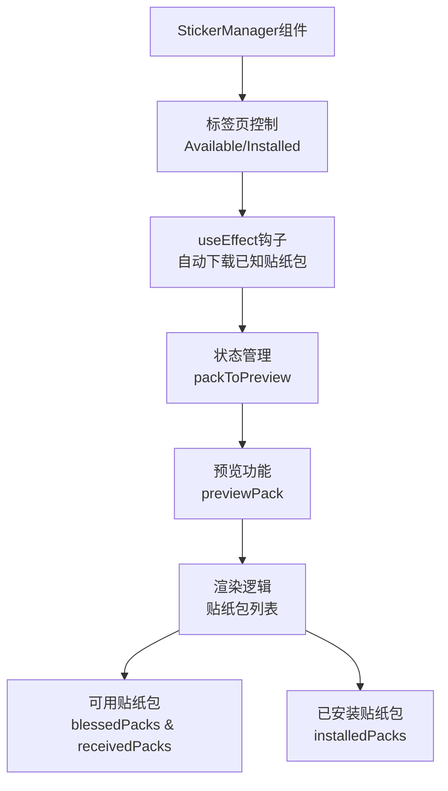
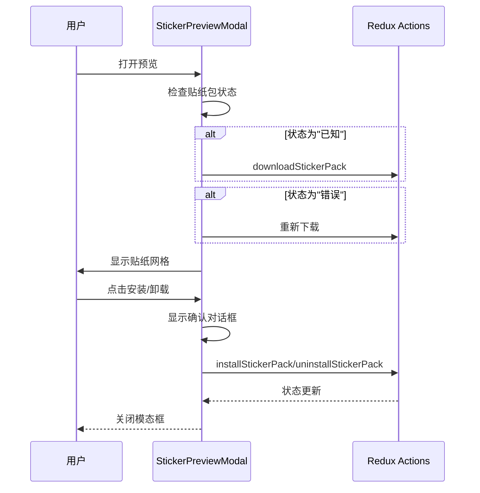
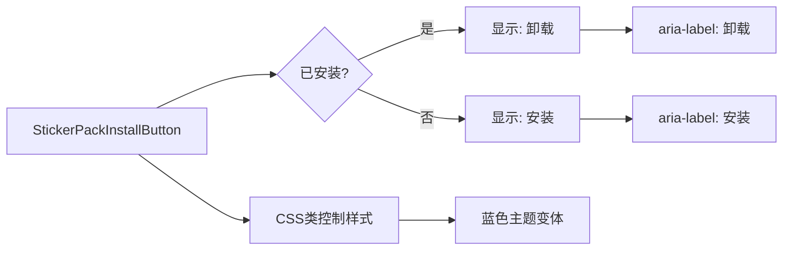
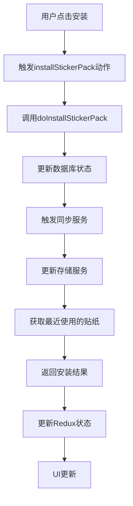
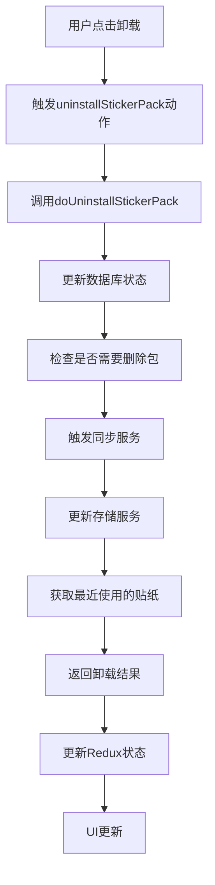
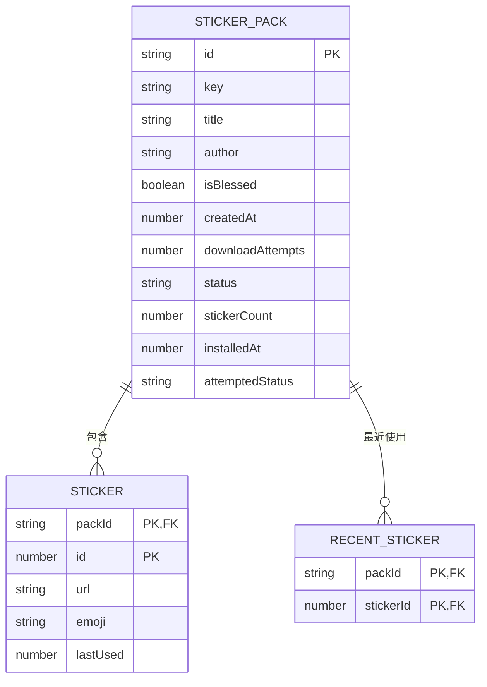
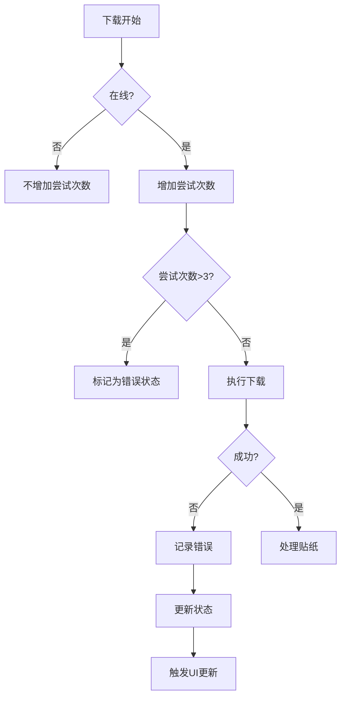

# 贴纸管理

<cite>
**本文档中引用的文件**   
- [StickerManager.dom.tsx](file://ts/components/stickers/StickerManager.dom.tsx)
- [StickerManagerPackRow.dom.tsx](file://ts/components/stickers/StickerManagerPackRow.dom.tsx)
- [StickerPreviewModal.dom.tsx](file://ts/components/stickers/StickerPreviewModal.dom.tsx)
- [StickerPackInstallButton.dom.tsx](file://ts/components/stickers/StickerPackInstallButton.dom.tsx)
- [stickers.preload.ts](file://ts/state/ducks/stickers.preload.ts)
- [Stickers.preload.ts](file://ts/types/Stickers.preload.ts)
- [StickerManager.scss](file://stylesheets/components/StickerManager.scss)
</cite>

## 目录
1. [简介](#简介)
2. [核心组件分析](#核心组件分析)
3. [贴纸包数据结构](#贴纸包数据结构)
4. [安装与卸载机制](#安装与卸载机制)
5. [本地存储与缓存策略](#本地存储与缓存策略)
6. [用户体验优化](#用户体验优化)
7. [错误处理机制](#错误处理机制)
8. [API文档](#api文档)

## 简介
Signal-Desktop的贴纸管理组件提供了一套完整的贴纸包管理功能，包括贴纸包的浏览、预览、安装和卸载。该系统设计注重用户体验，提供了直观的界面和流畅的交互。贴纸管理器通过标签页组织内容，分为"可用"和"已安装"两个视图，使用户能够轻松管理自己的贴纸收藏。系统还实现了复杂的缓存和下载策略，确保贴纸内容能够快速加载并有效利用网络资源。

**Section sources**
- [StickerManager.dom.tsx](file://ts/components/stickers/StickerManager.dom.tsx#L1-L191)

## 核心组件分析

### StickerManager组件
StickerManager是贴纸管理的核心组件，负责渲染贴纸包列表和管理用户交互。该组件使用React的函数组件和Hooks模式实现，通过`useEffect`在组件挂载时自动下载已知的贴纸包。组件包含两个标签页：可用贴纸包和已安装贴纸包，分别展示不同状态的贴纸包集合。对于可用贴纸包，组件进一步分为"官方推荐"和"已接收"两个部分，便于用户发现和管理贴纸内容。

**Diagram sources**
- [StickerManager.dom.tsx](file://ts/components/stickers/StickerManager.dom.tsx#L42-L188)

**Section sources**
- [StickerManager.dom.tsx](file://ts/components/stickers/StickerManager.dom.tsx#L42-L188)

### StickerPreviewModal组件
StickerPreviewModal组件提供贴纸包的预览功能，允许用户在安装前查看贴纸内容。该组件实现了复杂的交互逻辑，包括安装/卸载状态切换、错误处理和确认对话框。当贴纸包状态为"已知"时，组件会自动触发下载；当下载失败时，会显示错误信息并提供重试机制。预览模态框包含贴纸网格、包信息和操作按钮，为用户提供完整的预览体验。

**Diagram sources**
- [StickerPreviewModal.dom.tsx](file://ts/components/stickers/StickerPreviewModal.dom.tsx#L86-L238)

**Section sources**
- [StickerPreviewModal.dom.tsx](file://ts/components/stickers/StickerPreviewModal.dom.tsx#L86-L238)

### StickerPackInstallButton组件
StickerPackInstallButton是一个无状态的按钮组件，用于显示贴纸包的安装状态。该组件根据`installed`属性的值动态改变按钮文本，显示"安装"或"卸载"。组件使用CSS类来实现视觉样式，包括蓝色主题变体，以适应不同的UI场景。按钮的无障碍属性（aria-label）也相应更新，确保辅助技术用户能够理解按钮功能。

**Diagram sources**
- [StickerPackInstallButton.dom.tsx](file://ts/components/stickers/StickerPackInstallButton.dom.tsx#L17-L40)

**Section sources**
- [StickerPackInstallButton.dom.tsx](file://ts/components/stickers/StickerPackInstallButton.dom.tsx#L17-L40)

## 贴纸包数据结构
贴纸包数据结构定义了贴纸包的完整信息，包括元数据、状态和内容。核心数据结构包含以下字段：

| 字段 | 类型 | 描述 |
|------|------|------|
| id | string | 贴纸包的唯一标识符 |
| key | string | 用于解密贴纸包的密钥 |
| title | string | 贴纸包的标题 |
| author | string | 贴纸包的作者 |
| isBlessed | boolean | 是否为官方推荐贴纸包 |
| cover | StickerType | 封面贴纸信息 |
| lastUsed | number | 最后使用时间戳 |
| attemptedStatus | string | 尝试的状态（installed/downloaded/ephemeral） |
| status | StickerPackStatusType | 当前状态（known/ephemeral/pending/downloaded/error/installed） |
| stickers | Array<StickerType> | 贴纸数组 |
| stickerCount | number | 贴纸数量 |

**Section sources**
- [stickers.preload.ts](file://ts/state/ducks/stickers.preload.ts#L54-L66)

## 安装与卸载机制
贴纸包的安装和卸载通过Redux动作系统实现，确保状态变更的一致性和可预测性。安装过程包括数据库更新、同步服务调用和本地状态更新。

### 安装流程

**Diagram sources**
- [stickers.preload.ts](file://ts/state/ducks/stickers.preload.ts#L239-L274)

### 卸载流程

**Diagram sources**
- [stickers.preload.ts](file://ts/state/ducks/stickers.preload.ts#L291-L331)

**Section sources**
- [stickers.preload.ts](file://ts/state/ducks/stickers.preload.ts#L239-L331)

## 本地存储与缓存策略
贴纸管理系统实现了复杂的本地存储和缓存策略，确保数据的一致性和性能优化。

### 存储架构

### 缓存策略
系统采用多层缓存策略：
1. **内存缓存**：通过Redux状态管理实时数据
2. **数据库缓存**：使用SQL数据库持久化存储贴纸包信息
3. **文件缓存**：将下载的贴纸文件存储在本地文件系统

下载队列使用优先级机制，UI触发的下载具有高优先级，确保用户交互的即时响应。

**Section sources**
- [Stickers.preload.ts](file://ts/types/Stickers.preload.ts#L670-L712)

## 用户体验优化
贴纸管理系统包含多项用户体验优化措施，提升用户交互的流畅性和直观性。

### 加载动画
当贴纸包状态为"pending"时，系统显示加载动画，告知用户操作正在进行。预览模态框在贴纸数量未知时显示Spinner组件，提供视觉反馈。

### 安装进度
系统通过状态管理跟踪安装进度，从"pending"到"installed"的转变通过UI变化直观呈现。对于大型贴纸包，系统分批下载贴纸，确保进度可感知。

### 键盘导航
组件支持键盘导航，用户可以通过Tab键在贴纸包之间移动，并使用Enter或Space键预览贴纸包。`useRestoreFocus`钩子确保模态框关闭后焦点正确恢复。

**Section sources**
- [StickerPreviewModal.dom.tsx](file://ts/components/stickers/StickerPreviewModal.dom.tsx#L96-L118)
- [StickerManagerPackRow.dom.tsx](file://ts/components/stickers/StickerManagerPackRow.dom.tsx#L73-L86)

## 错误处理机制
系统实现了全面的错误处理机制，确保在各种异常情况下提供适当的用户反馈。

### 错误状态
当贴纸包下载失败超过三次，系统将其状态标记为"error"，并在UI中显示错误信息。错误处理包括：
- 网络连接检查
- 下载尝试次数限制
- 自动重试机制
- 用户可触发的重试

### 异常恢复
系统通过`downloadQueue`确保下载操作的串行化，防止并发问题。对于失败的下载，系统保留上下文信息，允许用户在条件改善后重新尝试。

**Section sources**
- [Stickers.preload.ts](file://ts/types/Stickers.preload.ts#L741-L764)

## API文档
### 贴纸包管理API
| 方法 | 参数 | 描述 |
|------|------|------|
| downloadStickerPack | packId, packKey, options | 下载贴纸包，支持指定最终状态 |
| installStickerPack | packId, packKey, options | 安装贴纸包，更新数据库和同步服务 |
| uninstallStickerPack | packId, packKey, options | 卸载贴纸包，处理引用计数 |
| useSticker | packId, stickerId, time | 记录贴纸使用，更新最近使用列表 |

### 事件回调
系统通过Redux动作和事件触发机制提供以下回调：
- `pack-install-failed`: 安装失败时触发
- `stickers/INSTALL_STICKER_PACK_FULFILLED`: 安装成功完成
- `stickers/UNINSTALL_STICKER_PACK_FULFILLED`: 卸载成功完成
- `stickers/USE_STICKER_FULFILLED`: 贴纸使用记录成功

**Section sources**
- [stickers.preload.ts](file://ts/state/ducks/stickers.preload.ts#L153-L163)
- [Stickers.preload.ts](file://ts/types/Stickers.preload.ts#L670-L712)