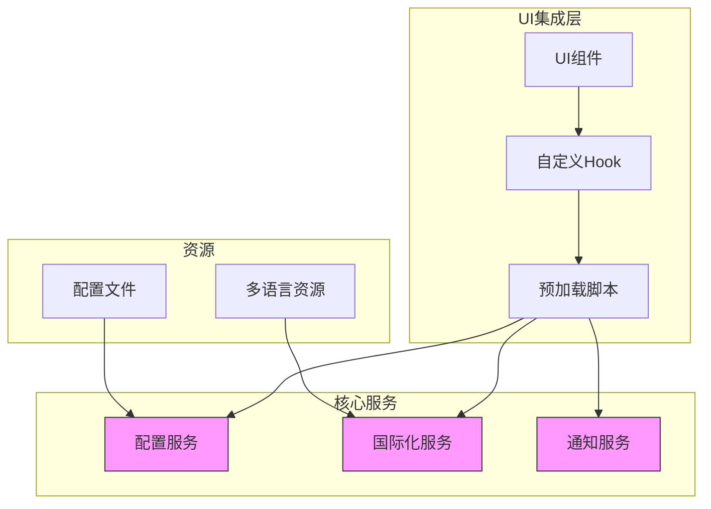
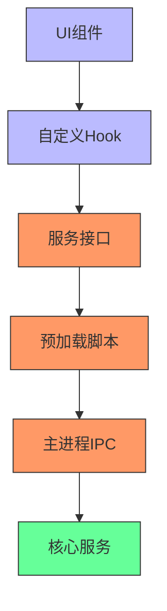
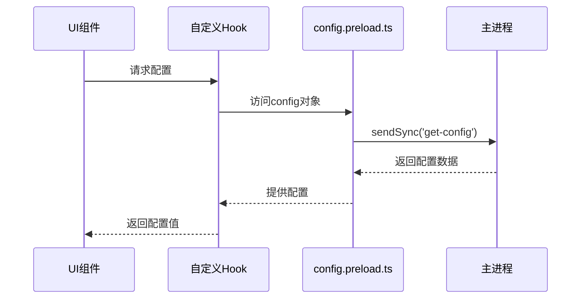
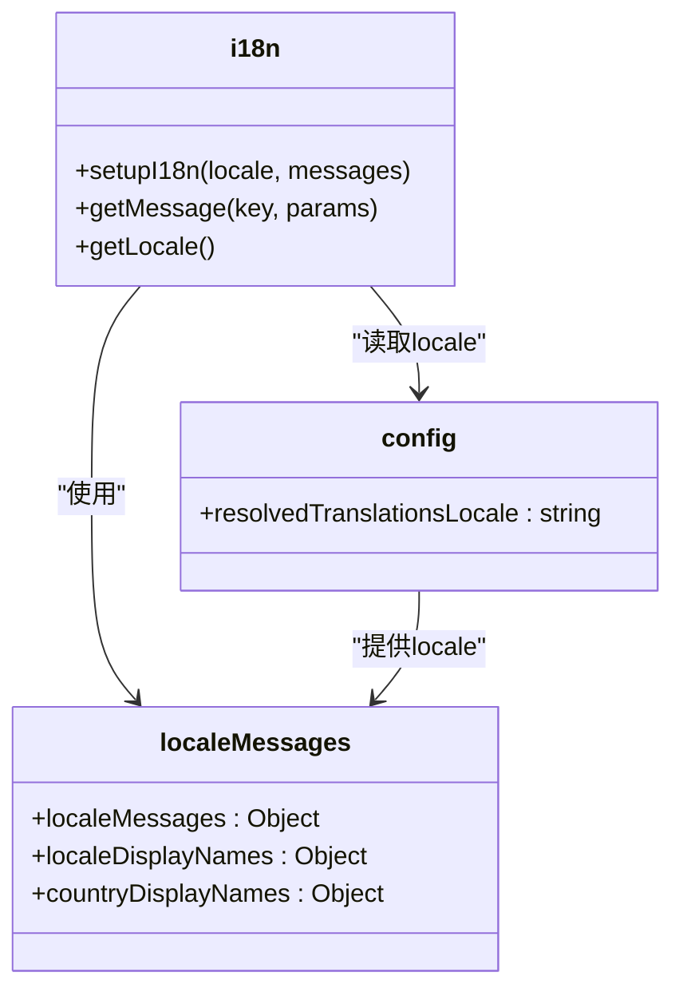
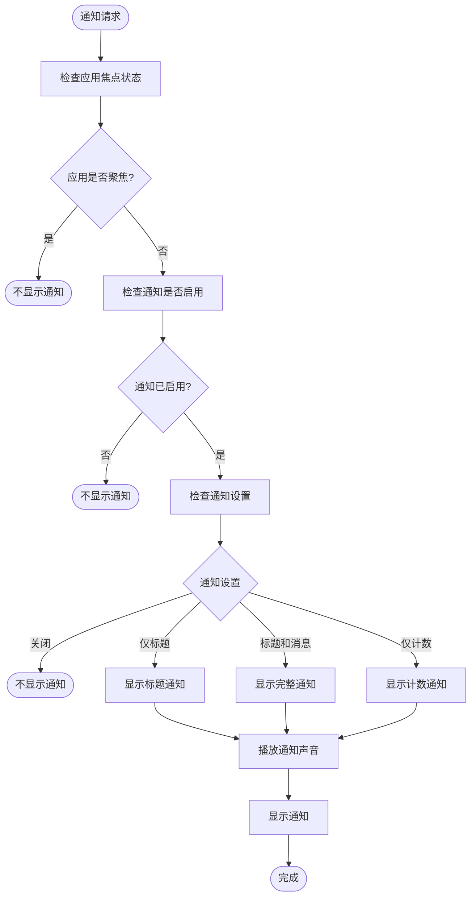
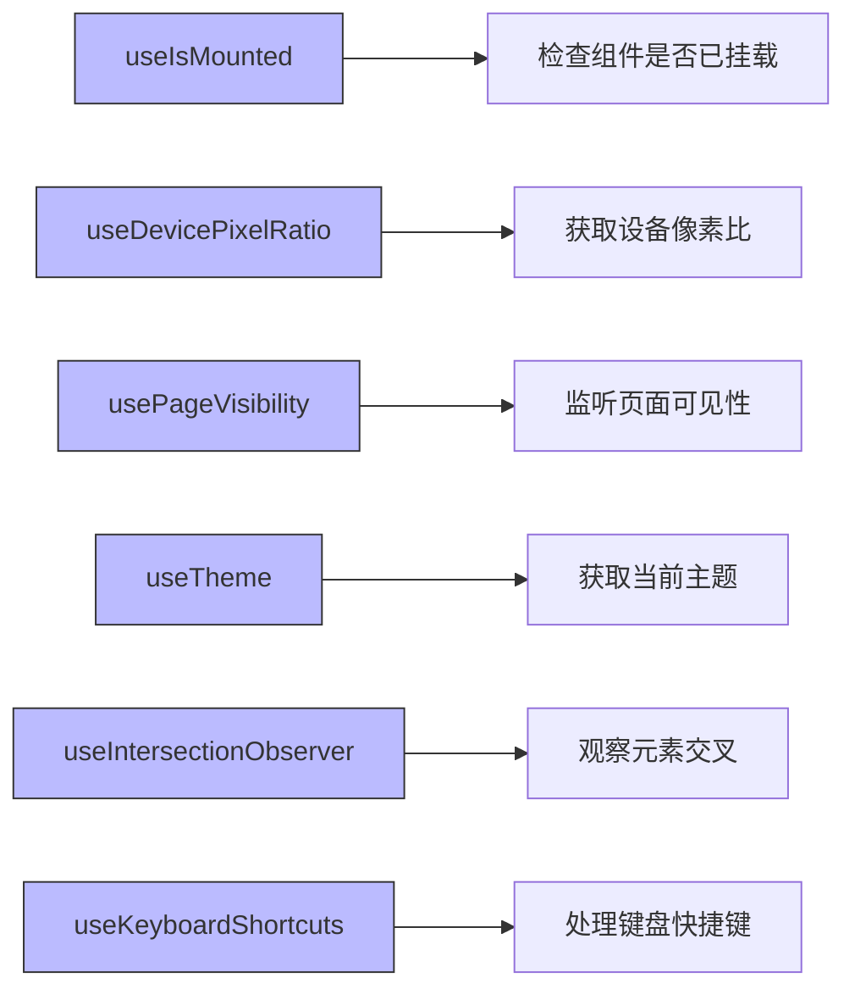

# UI集成

<cite>
**本文档中引用的文件**  
- [config.main.ts](file://app/config.main.ts)
- [config.preload.ts](file://ts/context/config.preload.ts)
- [i18n.preload.ts](file://ts/context/i18n.preload.ts)
- [localeMessages.preload.ts](file://ts/context/localeMessages.preload.ts)
- [notifications.preload.ts](file://ts/services/notifications.preload.ts)
- [preload.wrapper.ts](file://preload.wrapper.ts)
- [hooks目录](file://ts/hooks)
</cite>

## 目录
1. [简介](#简介)
2. [项目结构](#项目结构)
3. [核心组件](#核心组件)
4. [架构概述](#架构概述)
5. [详细组件分析](#详细组件分析)
6. [依赖分析](#依赖分析)
7. [性能考虑](#性能考虑)
8. [故障排除指南](#故障排除指南)
9. [结论](#结论)

## 简介
本文档详细说明Signal-Desktop应用程序的UI集成机制。重点分析UI组件如何与配置管理、国际化、通知系统和业务逻辑服务进行集成。文档涵盖预加载机制、多语言支持、通知集成、自定义Hook使用以及智能组件与普通组件之间的协作模式。

## 项目结构
Signal-Desktop的项目结构采用模块化设计，将UI集成相关的功能分布在不同的目录中。核心UI集成逻辑位于`ts/context`和`ts/services`目录下，而预加载脚本则通过Electron的preload机制注入到渲染进程中。



**图示来源**  
- [config.main.ts](file://app/config.main.ts#L1-L77)
- [i18n.preload.ts](file://ts/context/i18n.preload.ts#L1-L22)
- [notifications.preload.ts](file://ts/services/notifications.preload.ts#L1-L569)

**本节来源**  
- [app](file://app)
- [ts](file://ts)
- [config](file://config)
- [_locales](file://_locales)

## 核心组件
Signal-Desktop的UI集成机制围绕几个核心组件构建：配置管理、国际化系统、通知服务和状态管理。这些组件通过预加载脚本注入到渲染进程中，为UI组件提供必要的服务和数据。

**本节来源**  
- [config.preload.ts](file://ts/context/config.preload.ts#L1-L11)
- [i18n.preload.ts](file://ts/context/i18n.preload.ts#L1-L22)
- [notifications.preload.ts](file://ts/services/notifications.preload.ts#L1-L569)

## 架构概述
Signal-Desktop的UI集成架构采用分层设计，通过Electron的预加载机制将核心服务安全地暴露给渲染进程。架构分为三个主要层次：预加载层、服务层和UI层。



**图示来源**  
- [preload.wrapper.ts](file://preload.wrapper.ts#L1-L83)
- [config.preload.ts](file://ts/context/config.preload.ts#L1-L11)
- [i18n.preload.ts](file://ts/context/i18n.preload.ts#L1-L22)

## 详细组件分析

### 配置管理集成
Signal-Desktop通过`config.preload.ts`文件实现配置管理集成。该文件使用Electron的`ipcRenderer.sendSync`方法从主进程同步获取配置数据，确保UI组件在初始化时就能访问到必要的配置信息。



**图示来源**  
- [config.preload.ts](file://ts/context/config.preload.ts#L1-L11)
- [config.main.ts](file://app/config.main.ts#L1-L77)

### 国际化支持
国际化系统通过`i18n.preload.ts`和`localeMessages.preload.ts`文件实现。`localeMessages.preload.ts`从主进程获取本地化消息数据，而`i18n.preload.ts`使用这些数据初始化i18n实例。



**图示来源**  
- [i18n.preload.ts](file://ts/context/i18n.preload.ts#L1-L22)
- [localeMessages.preload.ts](file://ts/context/localeMessages.preload.ts#L1-L11)

### 通知系统集成
通知服务通过`notifications.preload.ts`文件实现，提供了一个完整的通知管理解决方案，包括通知显示、声音播放和点击处理。



**图示来源**  
- [notifications.preload.ts](file://ts/services/notifications.preload.ts#L1-L569)

**本节来源**  
- [config.preload.ts](file://ts/context/config.preload.ts#L1-L11)
- [i18n.preload.ts](file://ts/context/i18n.preload.ts#L1-L22)
- [notifications.preload.ts](file://ts/services/notifications.preload.ts#L1-L569)

### 自定义Hook使用指南
`ts/hooks`目录包含一系列自定义React Hook，为UI组件提供访问全局状态和服务的统一接口。



**图示来源**  
- [ts/hooks](file://ts/hooks)

**本节来源**  
- [ts/hooks](file://ts/hooks)

## 依赖分析
Signal-Desktop的UI集成机制依赖于Electron的IPC通信机制和预加载系统。各组件之间的依赖关系清晰，通过接口隔离确保了松耦合。

```mermaid
dependency-graph
config.main.ts --> node:fs
config.main.ts --> electron
config.main.ts --> config
config.preload.ts --> electron
i18n.preload.ts --> config.preload.ts
i18n.preload.ts --> localeMessages.preload.ts
notifications.preload.ts --> electron
notifications.preload.ts --> lodash
notifications.preload.ts --> uuid
notifications.preload.ts --> i18n
notifications.preload.ts --> storage
```

**图示来源**  
- [config.main.ts](file://app/config.main.ts#L1-L77)
- [config.preload.ts](file://ts/context/config.preload.ts#L1-L11)
- [notifications.preload.ts](file://ts/services/notifications.preload.ts#L1-L569)

**本节来源**  
- [package.json](file://package.json)

## 性能考虑
Signal-Desktop在UI集成方面采用了多项性能优化措施，包括通知的防抖处理、配置的同步获取和资源的按需加载。

- **通知防抖**: 通知服务使用debounce机制，避免短时间内频繁创建和销毁通知
- **同步配置获取**: 配置数据通过同步IPC调用获取，确保UI初始化时数据已就绪
- **资源预加载**: 多语言资源在应用启动时一次性加载，避免运行时延迟
- **内存管理**: 通知服务在应用聚焦时自动清除通知，减少内存占用

## 故障排除指南
### 常见问题及解决方案

| 问题现象 | 可能原因 | 解决方案 |
|---------|--------|---------|
| 配置无法获取 | 主进程未正确暴露配置 | 检查`config.main.ts`中的配置加载逻辑 |
| 多语言显示异常 | 本地化资源加载失败 | 检查`_locales`目录中的JSON文件完整性 |
| 通知不显示 | 通知权限被拒绝 | 检查操作系统通知权限设置 |
| 界面卡顿 | 通知更新过于频繁 | 检查通知服务的防抖设置 |

**本节来源**  
- [config.main.ts](file://app/config.main.ts#L1-L77)
- [notifications.preload.ts](file://ts/services/notifications.preload.ts#L1-L569)

## 结论
Signal-Desktop的UI集成机制设计精良，通过预加载脚本将核心服务安全地暴露给渲染进程。配置管理、国际化和通知系统各司其职，通过清晰的接口与UI组件交互。自定义Hook提供了访问全局状态的便捷方式，而分层架构确保了系统的可维护性和扩展性。整体设计体现了安全、性能和用户体验的平衡。