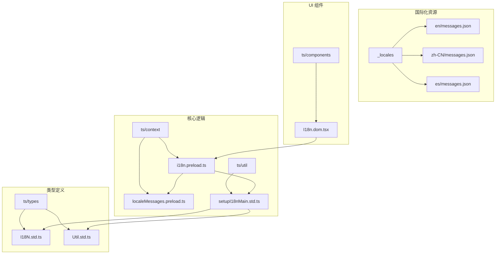
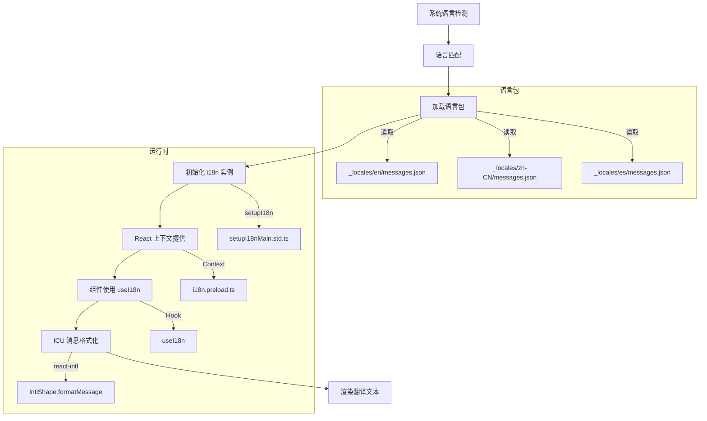
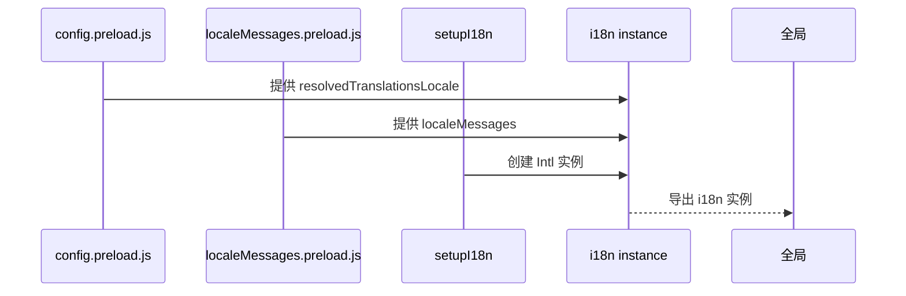
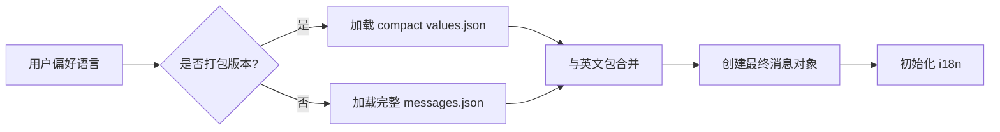
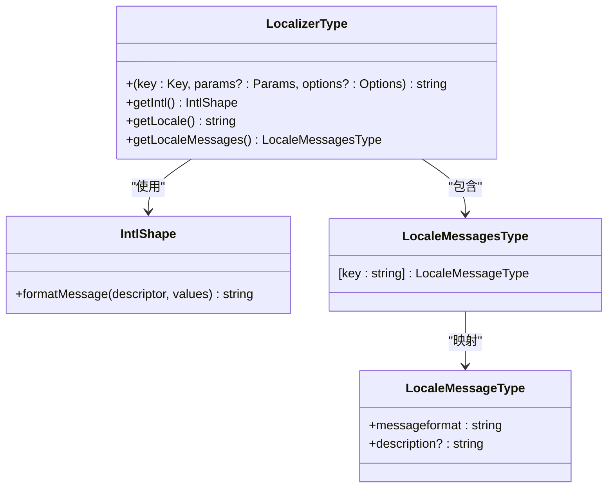
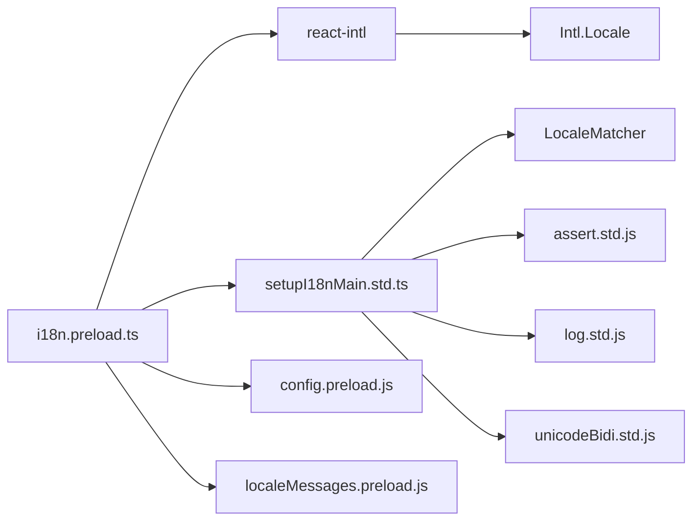

# 国际化集成

<cite>
**本文档中引用的文件**  
- [i18n.preload.ts](file://ts/context/i18n.preload.ts)
- [locale.node.ts](file://app/locale.node.ts)
- [setupI18nMain.std.ts](file://ts/util/setupI18nMain.std.ts)
- [I18N.std.ts](file://ts/types/I18N.std.ts)
- [Util.std.ts](file://ts/types/Util.std.ts)
- [_locales](file://_locales)
- [I18n.dom.tsx](file://ts/components/I18n.dom.tsx)
</cite>

## 目录
1. [简介](#简介)
2. [项目结构](#项目结构)
3. [核心组件](#核心组件)
4. [架构概述](#架构概述)
5. [详细组件分析](#详细组件分析)
6. [依赖分析](#依赖分析)
7. [性能考虑](#性能考虑)
8. [故障排除指南](#故障排除指南)
9. [结论](#结论)

## 简介
Signal-Desktop 的国际化（i18n）系统基于 `react-intl` 实现，支持多语言加载、动态切换、RTL 布局和 ICU 消息格式。系统通过 `_locales` 目录管理翻译资源，利用 `i18n.preload.ts` 初始化本地化上下文，并在 React 组件中通过 `useI18n` Hook 实现文本翻译。本文档详细解析其实现机制与最佳实践。

## 项目结构
Signal-Desktop 的国际化相关文件分布在多个目录中，核心结构如下：

**Diagram sources**  
- [i18n.preload.ts](file://ts/context/i18n.preload.ts)
- [setupI18nMain.std.ts](file://ts/util/setupI18nMain.std.ts)
- [_locales](file://_locales)

**Section sources**
- [i18n.preload.ts](file://ts/context/i18n.preload.ts)
- [locale.node.ts](file://app/locale.node.ts)

## 核心组件
Signal-Desktop 的国际化系统由多个核心组件构成：`i18n.preload.ts` 负责初始化本地化实例，`setupI18nMain.std.ts` 提供多语言支持的核心逻辑，`_locales` 目录存储所有语言包，`I18n.dom.tsx` 为 React 组件提供翻译能力。

**Section sources**
- [i18n.preload.ts](file://ts/context/i18n.preload.ts)
- [setupI18nMain.std.ts](file://ts/util/setupI18nMain.std.ts)
- [_locales](file://_locales)

## 架构概述
Signal-Desktop 的国际化架构采用分层设计，从底层语言包加载到上层 UI 渲染形成完整链条：

**Diagram sources**  
- [locale.node.ts](file://app/locale.node.ts)
- [i18n.preload.ts](file://ts/context/i18n.preload.ts)
- [setupI18nMain.std.ts](file://ts/util/setupI18nMain.std.ts)

## 详细组件分析

### i18n.preload.ts 分析
`i18n.preload.ts` 是国际化系统的入口点，负责在预加载阶段初始化 `i18n` 实例。

**Diagram sources**  
- [i18n.preload.ts](file://ts/context/i18n.preload.ts)
- [config.preload.js](file://ts/context/config.preload.js)
- [localeMessages.preload.js](file://ts/context/localeMessages.preload.js)

**Section sources**
- [i18n.preload.ts](file://ts/context/i18n.preload.ts)

### 语言包加载机制
系统通过 `locale.node.ts` 实现语言包的加载与匹配逻辑。

**Diagram sources**  
- [locale.node.ts](file://app/locale.node.ts)

**Section sources**
- [locale.node.ts](file://app/locale.node.ts)

### ICU 消息格式与翻译流程
Signal-Desktop 使用 ICU 消息格式支持复杂翻译场景，包括复数、选择和嵌套消息。

**Diagram sources**  
- [Util.std.ts](file://ts/types/Util.std.ts)
- [I18N.std.ts](file://ts/types/I18N.std.ts)

**Section sources**
- [Util.std.ts](file://ts/types/Util.std.ts)
- [I18N.std.ts](file://ts/types/I18N.std.ts)

## 依赖分析
国际化系统依赖多个外部库和内部模块协同工作。

**Diagram sources**  
- [i18n.preload.ts](file://ts/context/i18n.preload.ts)
- [setupI18nMain.std.ts](file://ts/util/setupI18nMain.std.ts)

**Section sources**
- [i18n.preload.ts](file://ts/context/i18n.preload.ts)
- [setupI18nMain.std.ts](file://ts/util/setupI18nMain.std.ts)

## 性能考虑
- **语言包压缩**：生产环境使用 `values.json` 和 `keys.json` 分离存储，减少重复内容
- **缓存机制**：`createIntlCache()` 确保 `Intl` 实例复用，避免重复解析
- **懒加载**：仅在需要时加载特定语言包，减少启动开销
- **类型安全**：通过 `ICUStringMessageParamsByKeyType` 确保翻译参数类型正确

## 故障排除指南
常见问题及解决方案：

**Section sources**
- [setupI18nMain.std.ts](file://ts/util/setupI18nMain.std.ts)
- [I18n.dom.tsx](file://ts/components/I18n.dom.tsx)

### 缺失翻译
当出现 `i18n: missing translation for "xxx"` 错误时：
1. 检查 `_locales/en/messages.json` 是否包含对应 key
2. 确认 key 在 `ICUMessageParams.d.ts` 中有正确参数定义
3. 验证组件是否正确传递 `components` 参数

### RTL 布局异常
若 RTL 语言显示异常：
1. 检查 `getLocaleDirection()` 是否正确识别语言方向
2. 确认 CSS 中 `direction` 属性已根据 `locale.direction` 设置
3. 验证 Unicode Bidi 控制字符是否正确应用

### 动态切换失败
语言切换无反应时：
1. 确保重新创建 `i18n` 实例
2. 检查 React 上下文是否更新
3. 验证组件是否订阅了语言变化

## 结论
Signal-Desktop 的国际化系统设计完善，基于 `react-intl` 实现了高效的多语言支持。通过 `i18n.preload.ts` 统一管理本地化实例，利用 ICU 格式处理复杂翻译场景，并结合 TypeScript 提供类型安全的 API。开发者应遵循现有模式添加新翻译，确保语言包完整性与格式正确性。