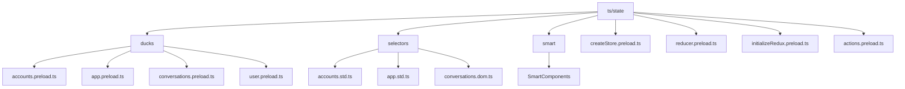
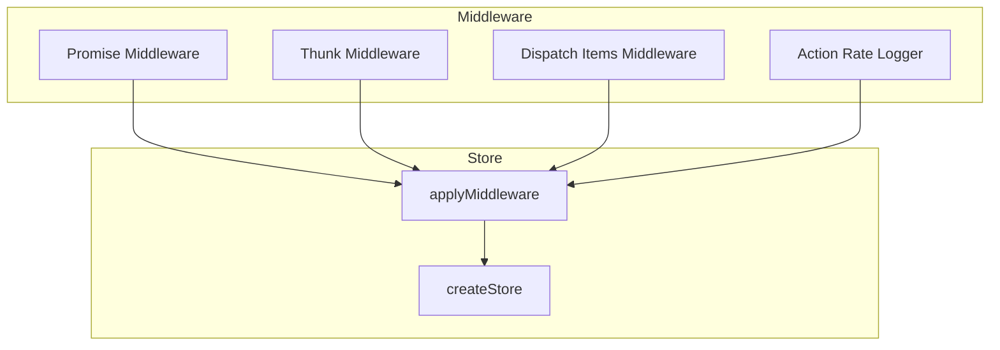
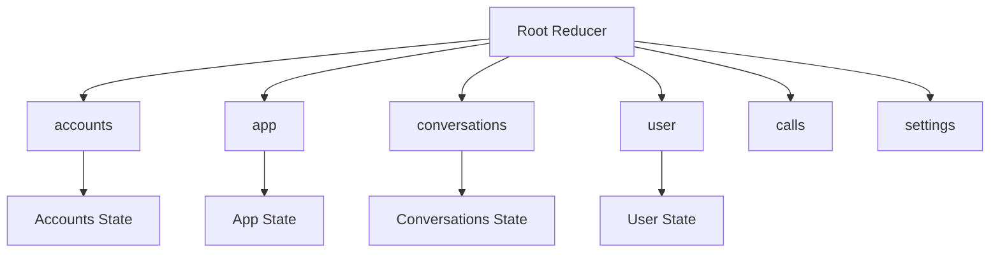
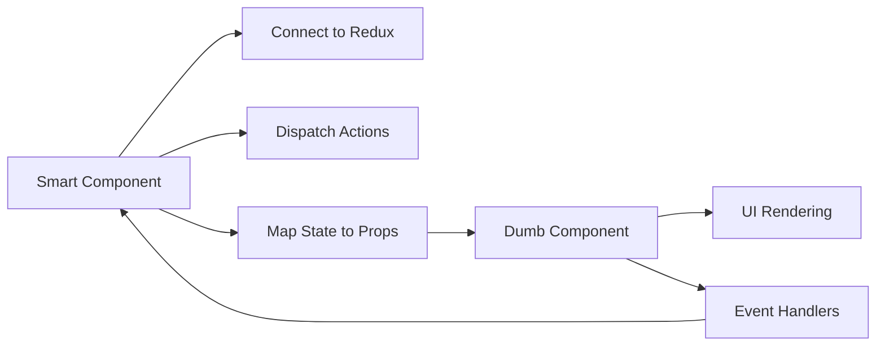
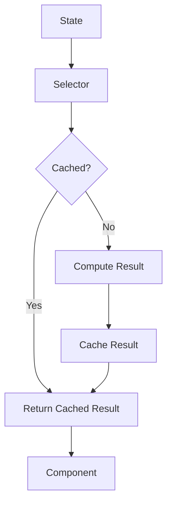
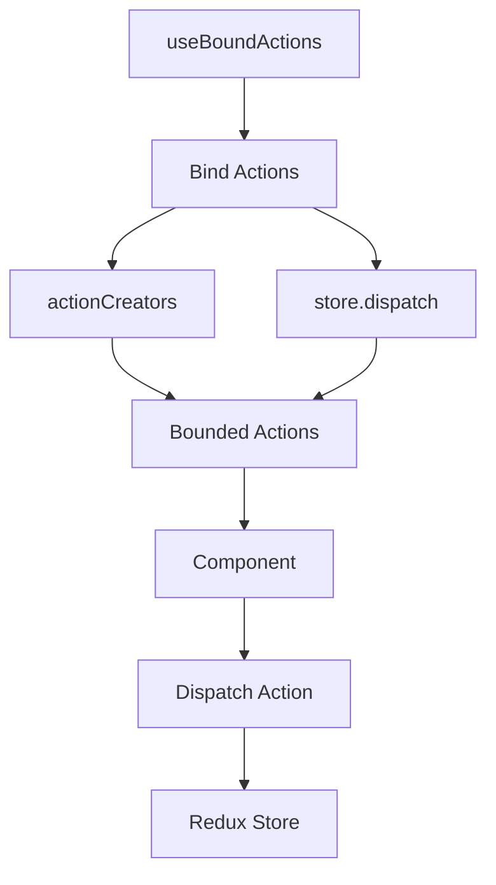
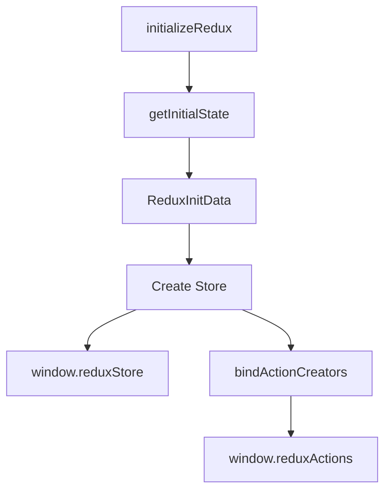
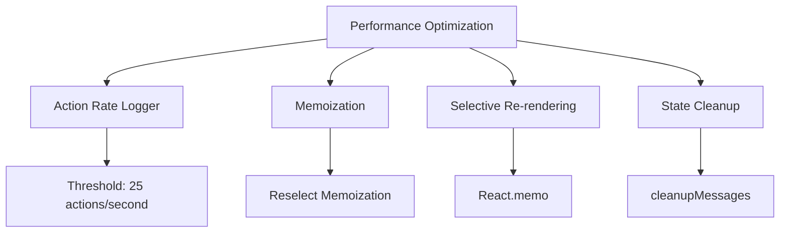

# 状态集成

<cite>
**本文档引用的文件**   
- [accounts.preload.ts](file://ts/state/ducks/accounts.preload.ts)
- [app.preload.ts](file://ts/state/ducks/app.preload.ts)
- [conversations.preload.ts](file://ts/state/ducks/conversations.preload.ts)
- [user.preload.ts](file://ts/state/ducks/user.preload.ts)
- [createStore.preload.ts](file://ts/state/createStore.preload.ts)
- [reducer.preload.ts](file://ts/state/reducer.preload.ts)
- [initializeRedux.preload.ts](file://ts/state/initializeRedux.preload.ts)
- [actions.preload.ts](file://ts/state/actions.preload.ts)
- [types.std.ts](file://ts/state/types.std.ts)
- [useBoundActions.std.ts](file://ts/hooks/useBoundActions.std.ts)
- [selectors](file://ts/state/selectors)
</cite>

## 目录
1. [项目结构](#项目结构)
2. [核心架构](#核心架构)
3. [状态切片与Ducks模式](#状态切片与ducks模式)
4. [智能组件与普通组件分离](#智能组件与普通组件分离)
5. [选择器与状态派生](#选择器与状态派生)
6. [自定义Hook与useBoundActions](#自定义hook与useboundactions)
7. [状态持久化与初始化](#状态持久化与初始化)
8. [错误处理与性能优化](#错误处理与性能优化)

## 项目结构

Signal-Desktop的状态管理架构位于`ts/state`目录下，采用Redux作为核心状态管理库。该架构通过Ducks模式组织状态切片，将相关的action、reducer和selectors封装在独立的模块中。

**Diagram sources**
- [ts/state](file://ts/state)
- [ts/state/ducks](file://ts/state/ducks)
- [ts/state/selectors](file://ts/state/selectors)
- [ts/state/smart](file://ts/state/smart)

**Section sources**
- [ts/state](file://ts/state)

## 核心架构

Signal-Desktop采用Redux作为状态管理解决方案，通过`createStore.preload.ts`创建Redux store实例。store的创建过程包含多个中间件，包括`redux-promise-middleware`、`redux-thunk`和自定义的`dispatchItemsMiddleware`，以支持异步操作和批量调度。

**Diagram sources**
- [ts/state/createStore.preload.ts](file://ts/state/createStore.preload.ts#L1-L96)

**Section sources**
- [ts/state/createStore.preload.ts](file://ts/state/createStore.preload.ts#L1-L96)

## 状态切片与Ducks模式

Signal-Desktop采用Ducks模式组织状态切片，每个状态切片包含action类型、action创建函数和reducer函数。`reducer.preload.ts`文件通过`combineReducers`将所有状态切片组合成根reducer。

**Diagram sources**
- [ts/state/reducer.preload.ts](file://ts/state/reducer.preload.ts#L1-L85)

**Section sources**
- [ts/state/reducer.preload.ts](file://ts/state/reducer.preload.ts#L1-L85)
- [ts/state/ducks/accounts.preload.ts](file://ts/state/ducks/accounts.preload.ts#L1-L150)
- [ts/state/ducks/app.preload.ts](file://ts/state/ducks/app.preload.ts#L1-L153)
- [ts/state/ducks/conversations.preload.ts](file://ts/state/ducks/conversations.preload.ts#L1-L800)
- [ts/state/ducks/user.preload.ts](file://ts/state/ducks/user.preload.ts#L1-L189)

## 智能组件与普通组件分离

Signal-Desktop通过智能组件(smart)与普通组件(dumb)的分离架构实现UI与业务逻辑的解耦。智能组件位于`ts/state/smart`目录下，负责连接Redux store并调度actions，而普通组件仅负责UI渲染。

**Section sources**
- [ts/state/smart](file://ts/state/smart)

## 选择器与状态派生

Signal-Desktop使用`reselect`库创建高效的选择器(selector)，通过`ts/state/selectors`目录下的文件实现状态派生。选择器采用记忆化(memoization)技术，避免不必要的计算。

**Section sources**
- [ts/state/selectors](file://ts/state/selectors)

## 自定义Hook与useBoundActions

Signal-Desktop通过`useBoundActions`自定义Hook简化action调度。该Hook将action创建函数与dispatch函数绑定，使组件可以直接调用已绑定的action。

**Diagram sources**
- [ts/hooks/useBoundActions.std.ts](file://ts/hooks/useBoundActions.std.ts)
- [ts/state/actions.preload.ts](file://ts/state/actions.preload.ts#L1-L80)

**Section sources**
- [ts/hooks/useBoundActions.std.ts](file://ts/hooks/useBoundActions.std.ts)
- [ts/state/actions.preload.ts](file://ts/state/actions.preload.ts#L1-L80)

## 状态持久化与初始化

Signal-Desktop通过`initializeRedux.preload.ts`文件初始化Redux store。该文件负责创建初始状态并暴露`window.reduxStore`和`window.reduxActions`全局变量。

**Diagram sources**
- [ts/state/initializeRedux.preload.ts](file://ts/state/initializeRedux.preload.ts#L1-L119)

**Section sources**
- [ts/state/initializeRedux.preload.ts](file://ts/state/initializeRedux.preload.ts#L1-L119)
- [ts/state/getInitialState.preload.ts](file://ts/state/getInitialState.preload.ts)

## 错误处理与性能优化

Signal-Desktop实现了全面的错误处理和性能优化策略。包括action速率日志记录、选择性重渲染和状态清理机制。

**Section sources**
- [ts/state/createStore.preload.ts](file://ts/state/createStore.preload.ts#L41-L79)
- [ts/util/cleanup.preload.ts](file://ts/util/cleanup.preload.ts)
- [ts/state/selectors](file://ts/state/selectors)
- [ts/hooks](file://ts/hooks)