# 通知集成

<cite>
**本文档引用的文件**
- [notifications.preload.ts](file://ts/services/notifications.preload.ts)
- [WindowsNotifications.main.ts](file://app/WindowsNotifications.main.ts)
- [WindowsNotificationsWorker.node.ts](file://app/WindowsNotificationsWorker.node.ts)
- [renderWindowsToast.std.tsx](file://app/renderWindowsToast.std.tsx)
- [types/notifications.std.ts](file://ts/types/notifications.std.ts)
- [SystemTrayService.main.ts](file://app/SystemTrayService.main.ts)
- [Preferences.dom.tsx](file://ts/components/Preferences.dom.tsx)
- [types/Settings.std.ts](file://ts/types/Settings.std.ts)
</cite>

## 目录
1. [简介](#简介)
2. [项目结构](#项目结构)
3. [核心组件](#核心组件)
4. [架构概述](#架构概述)
5. [详细组件分析](#详细组件分析)
6. [依赖分析](#依赖分析)
7. [性能考虑](#性能考虑)
8. [故障排除指南](#故障排除指南)
9. [结论](#结论)

## 简介
Signal-Desktop的通知系统提供了一套完整的跨平台通知管理解决方案，包括桌面通知、系统托盘提醒和内部UI通知的统一管理。该系统通过notifications.preload.ts文件实现核心通知服务，与WindowsNotifications.main.ts进行IPC通信，并支持跨平台适配策略。通知系统遵循严格的权限管理和用户偏好设置，确保在高频率消息场景下的流畅体验。

## 项目结构
Signal-Desktop的通知系统分布在多个关键文件中，形成了清晰的分层架构。核心通知逻辑位于preload层，而平台特定的实现则位于app层。

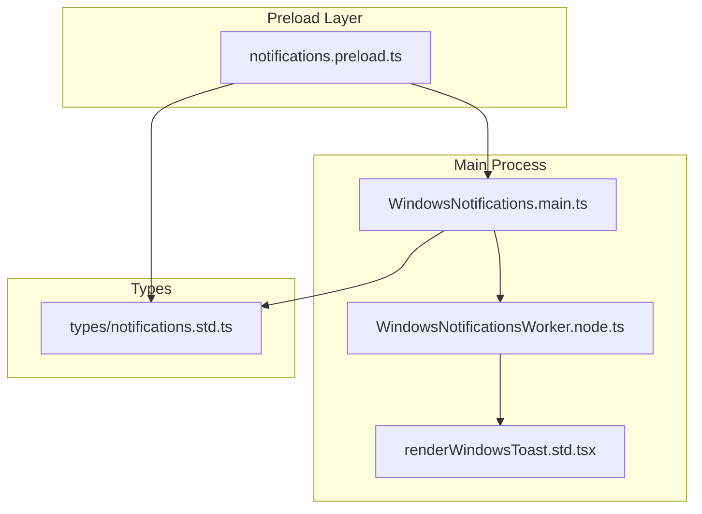

**图源**
- [notifications.preload.ts](file://ts/services/notifications.preload.ts)
- [WindowsNotifications.main.ts](file://app/WindowsNotifications.main.ts)
- [WindowsNotificationsWorker.node.ts](file://app/WindowsNotificationsWorker.node.ts)
- [renderWindowsToast.std.tsx](file://app/renderWindowsToast.std.tsx)
- [types/notifications.std.ts](file://ts/types/notifications.std.ts)

**本节来源**
- [notifications.preload.ts](file://ts/services/notifications.preload.ts)
- [app](file://app)

## 核心组件
通知系统的核心是NotificationService类，它负责管理所有通知的生命周期。该服务实现了防抖机制，避免在高频率消息场景下创建过多通知。服务通过IPC与主进程通信，在Windows平台上使用专用的Worker线程处理通知，确保UI线程不被阻塞。

通知系统支持多种通知类型，包括消息通知、来电通知、反应通知等，并根据用户偏好设置调整通知内容的显示级别。系统还集成了声音播放功能，在收到新消息时播放提示音。

**本节来源**
- [notifications.preload.ts](file://ts/services/notifications.preload.ts#L79-L542)
- [types/notifications.std.ts](file://ts/types/notifications.std.ts#L6-L13)

## 架构概述
Signal-Desktop的通知架构采用分层设计，将通知逻辑与平台特定实现分离。这种设计确保了跨平台一致性，同时允许针对特定平台进行优化。

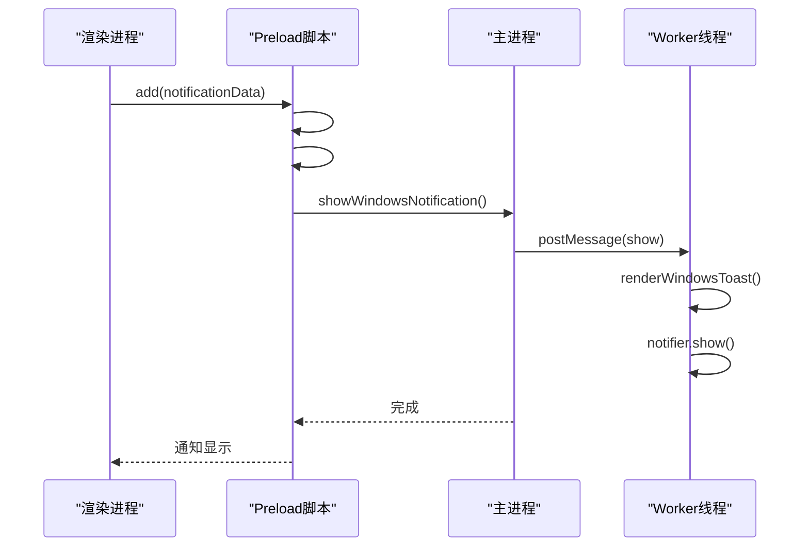

**图源**
- [notifications.preload.ts](file://ts/services/notifications.preload.ts)
- [WindowsNotifications.main.ts](file://app/WindowsNotifications.main.ts)
- [WindowsNotificationsWorker.node.ts](file://app/WindowsNotificationsWorker.node.ts)

## 详细组件分析

### NotificationService分析
NotificationService是通知系统的核心，它实现了高级别的通知管理功能。

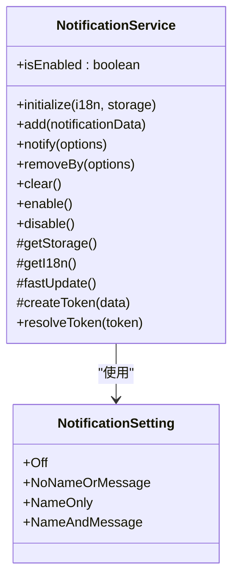

**图源**
- [notifications.preload.ts](file://ts/services/notifications.preload.ts#L79-L542)

#### IPC通信机制
Windows平台的通知通过IPC机制与主进程通信，确保安全性和稳定性。

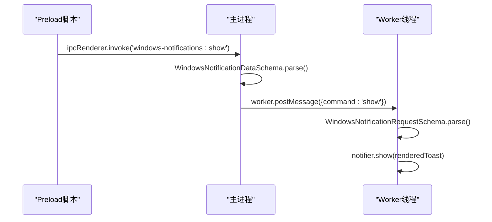

**图源**
- [WindowsNotifications.main.ts](file://app/WindowsNotifications.main.ts#L58-L68)
- [WindowsNotificationsWorker.node.ts](file://app/WindowsNotificationsWorker.node.ts#L40-L57)

#### 跨平台适配策略
通知系统针对不同平台采用了不同的实现策略，确保最佳用户体验。

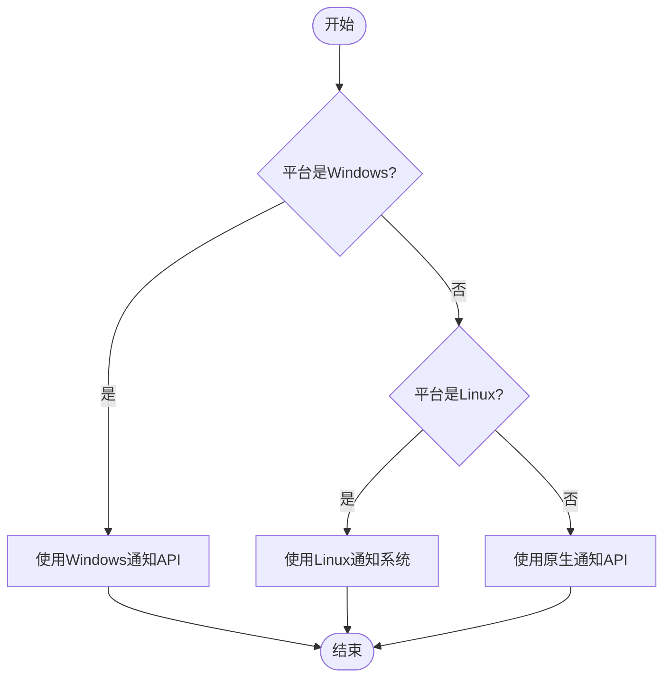

**图源**
- [notifications.preload.ts](file://ts/services/notifications.preload.ts#L177-L235)
- [types/Settings.std.ts](file://ts/types/Settings.std.ts)

**本节来源**
- [notifications.preload.ts](file://ts/services/notifications.preload.ts)
- [WindowsNotifications.main.ts](file://app/WindowsNotifications.main.ts)
- [WindowsNotificationsWorker.node.ts](file://app/WindowsNotificationsWorker.node.ts)

### 通知触发与处理指南
在组件中触发和处理通知需要遵循特定的流程和最佳实践。

#### 通知触发流程
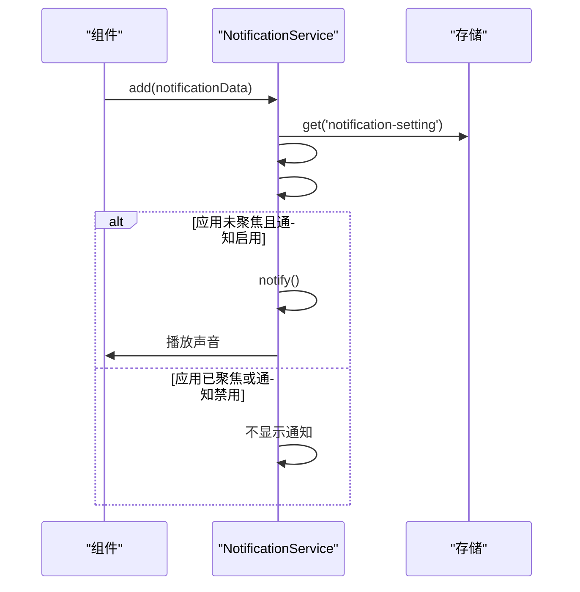

**图源**
- [notifications.preload.ts](file://ts/services/notifications.preload.ts#L138-L144)

#### 权限管理
通知系统实现了细粒度的权限控制，允许用户自定义通知行为。

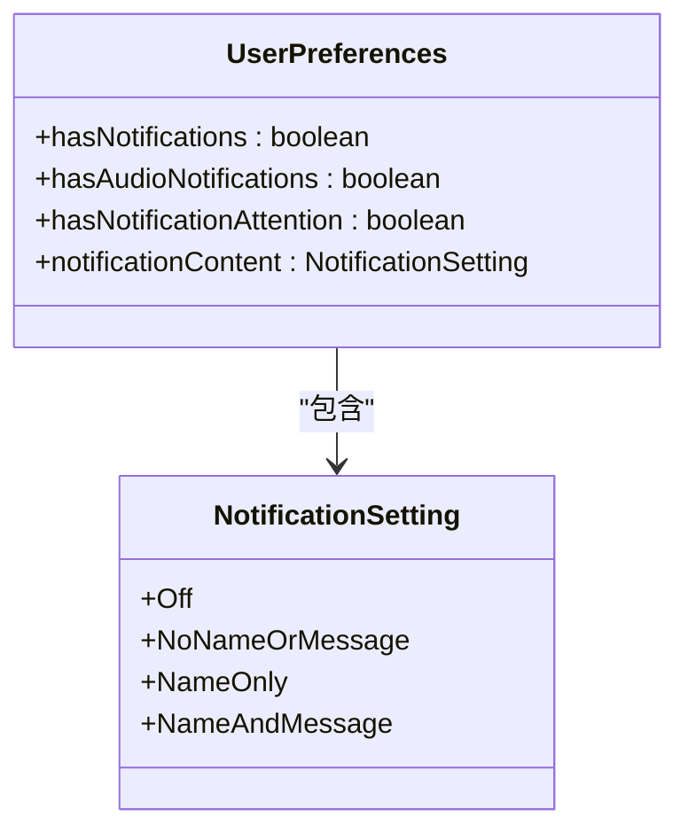

**图源**
- [types/notifications.std.ts](file://ts/types/notifications.std.ts#L59-L64)
- [Preferences.dom.tsx](file://ts/components/Preferences.dom.tsx#L1481-L1538)

#### 通知分类
系统支持多种通知类型，每种类型有不同的处理逻辑。

| 通知类型 | 描述 | 触发场景 |
|---------|------|---------|
| Message | 消息通知 | 收到新消息 |
| Reaction | 反应通知 | 消息被反应 |
| IncomingCall | 来电通知 | 收到来电 |
| IncomingGroupCall | 群组来电通知 | 收到群组来电 |
| IsPresenting | 屏幕共享通知 | 正在共享屏幕 |
| MinimizedToTray | 最小化到托盘通知 | 应用最小化到托盘 |

**图源**
- [types/notifications.std.ts](file://ts/types/notifications.std.ts#L6-L13)

**本节来源**
- [notifications.preload.ts](file://ts/services/notifications.preload.ts)
- [Preferences.dom.tsx](file://ts/components/Preferences.dom.tsx)
- [types/Settings.std.ts](file://ts/types/Settings.std.ts)

## 依赖分析
通知系统依赖于多个核心模块和外部库，形成了复杂的依赖网络。

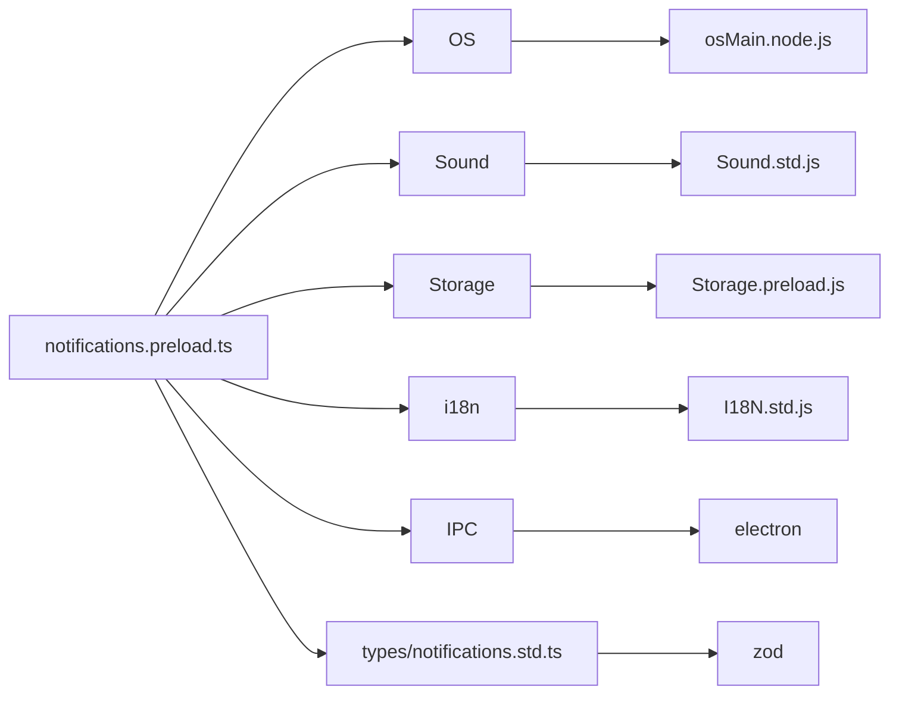

**图源**
- [notifications.preload.ts](file://ts/services/notifications.preload.ts#L4-L21)
- [types/notifications.std.ts](file://ts/types/notifications.std.ts#L4-L5)

**本节来源**
- [notifications.preload.ts](file://ts/services/notifications.preload.ts)
- [types/notifications.std.ts](file://ts/types/notifications.std.ts)

## 性能考虑
通知系统在设计时充分考虑了性能优化，特别是在高频率消息场景下的表现。

### 防抖机制
系统使用防抖技术避免在短时间内创建过多通知，防止通知堆积和性能下降。

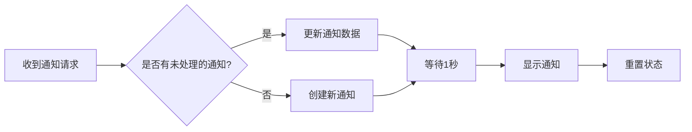

**图源**
- [notifications.preload.ts](file://ts/services/notifications.preload.ts#L96-L100)

### 生命周期管理
通知的生命周期管理确保资源被正确释放，避免内存泄漏。

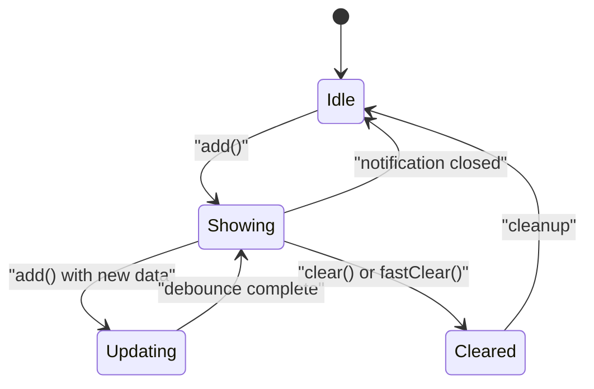

**图源**
- [notifications.preload.ts](file://ts/services/notifications.preload.ts)

### 错误处理
系统实现了全面的错误处理机制，确保在异常情况下仍能正常工作。

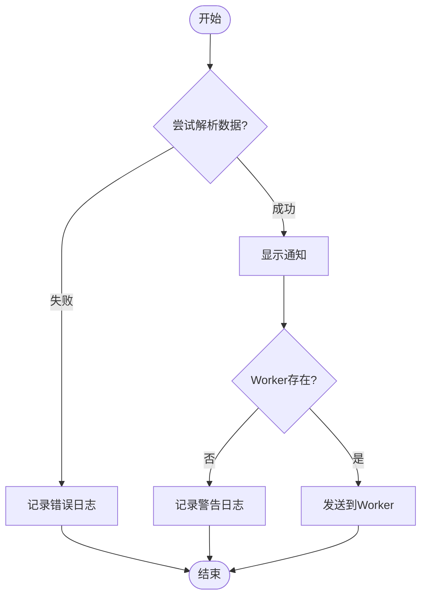

**图源**
- [WindowsNotifications.main.ts](file://app/WindowsNotifications.main.ts#L60-L66)
- [WindowsNotificationsWorker.node.ts](file://app/WindowsNotificationsWorker.node.ts#L41-L82)

## 故障排除指南
当通知系统出现问题时，可以参考以下常见问题和解决方案。

### 常见问题
1. **通知不显示**：检查应用是否在前台运行，通知设置是否启用
2. **声音不播放**：检查音频通知设置和系统音量
3. **托盘图标不显示**：检查系统托盘设置和操作系统支持
4. **通知重复**：检查防抖机制是否正常工作

### 调试技巧
- 查看控制台日志中的"notifications"和"WindowsNotifications"标签
- 检查IPC通信是否正常
- 验证Worker线程是否正确启动
- 确认通知权限设置

**本节来源**
- [notifications.preload.ts](file://ts/services/notifications.preload.ts)
- [WindowsNotifications.main.ts](file://app/WindowsNotifications.main.ts)
- [WindowsNotificationsWorker.node.ts](file://app/WindowsNotificationsWorker.node.ts)

## 结论
Signal-Desktop的通知系统通过精心设计的架构和实现，提供了可靠且高效的跨平台通知体验。系统采用分层设计，将核心逻辑与平台特定实现分离，确保了代码的可维护性和可扩展性。通过防抖机制、IPC通信和Worker线程等技术，系统在高频率消息场景下仍能保持流畅性能。完善的权限管理和用户偏好设置使用户能够完全控制自己的通知体验。整体而言，这是一个成熟且健壮的通知系统实现。