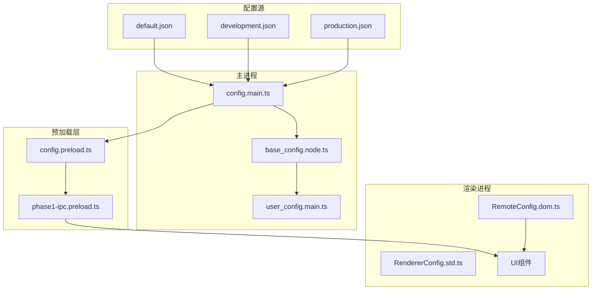
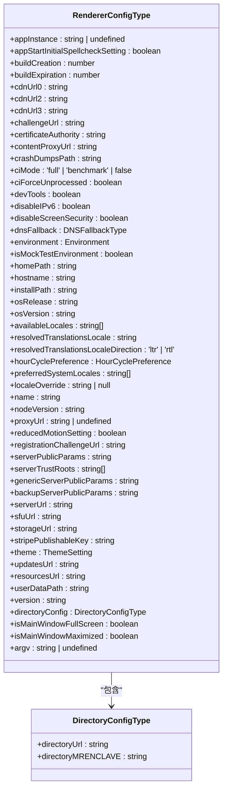
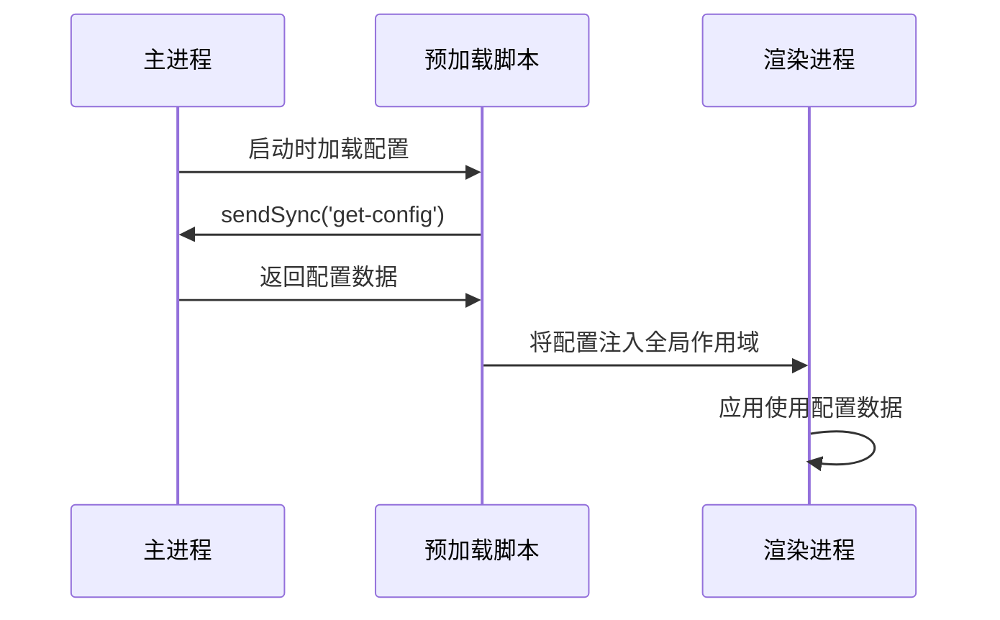
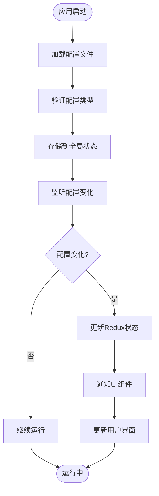
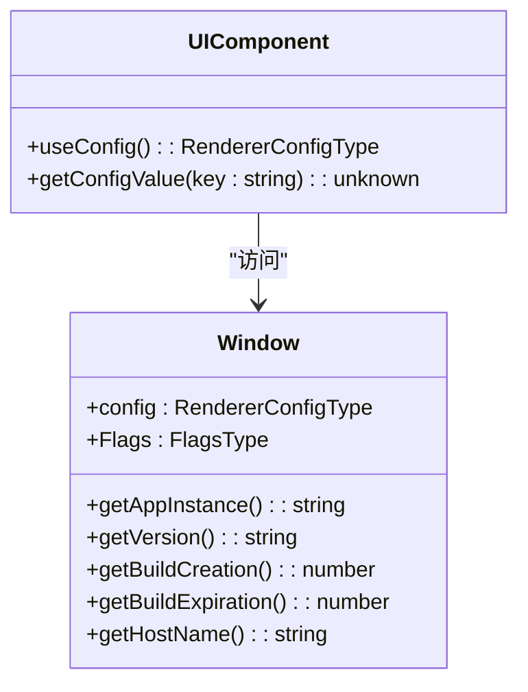
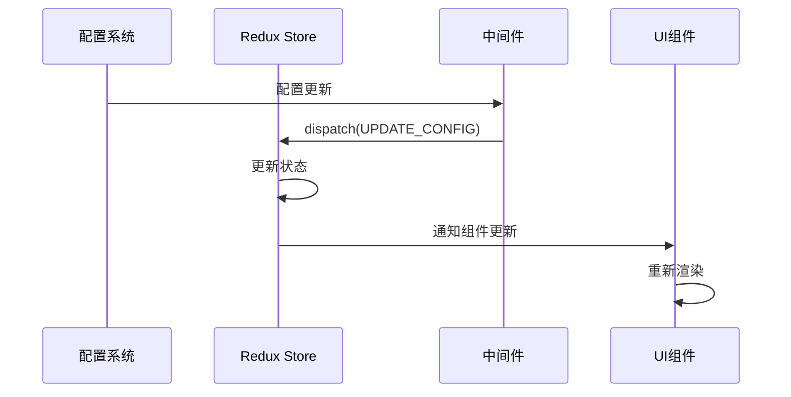
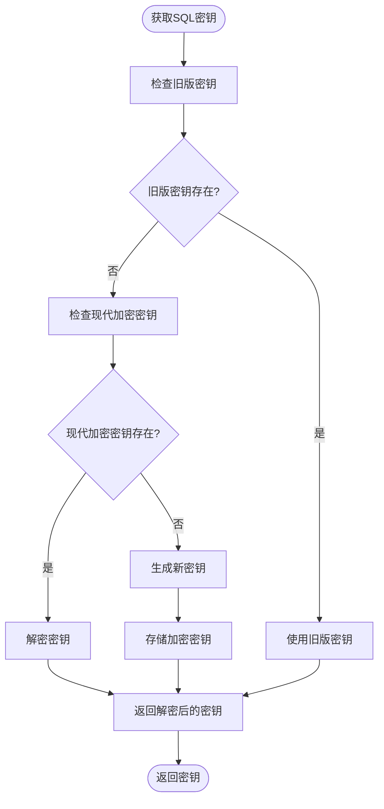
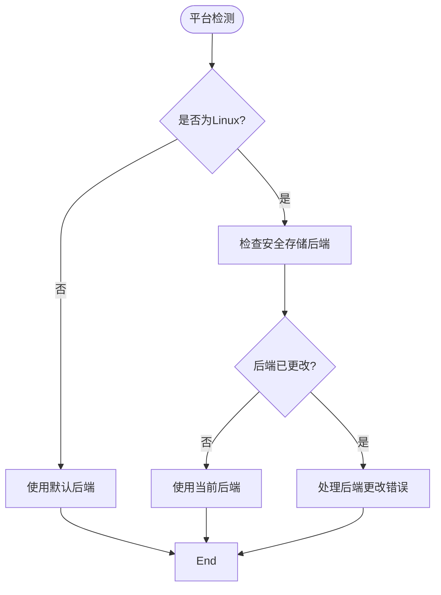
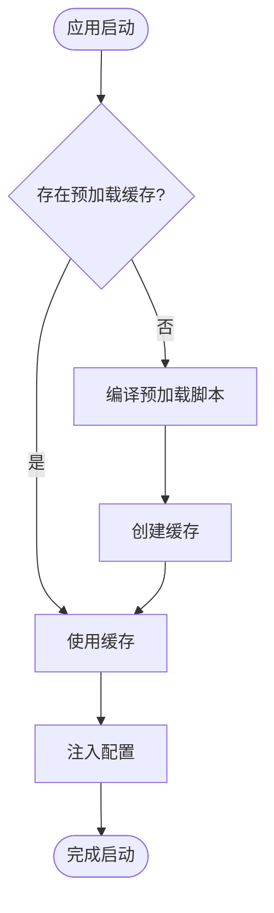

# 配置集成

<cite>
**本文档中引用的文件**  
- [config.preload.ts](file://ts/context/config.preload.ts)
- [RendererConfig.std.ts](file://ts/types/RendererConfig.std.ts)
- [config.main.ts](file://app/config.main.ts)
- [base_config.node.ts](file://app/base_config.node.ts)
- [default.json](file://config/default.json)
- [development.json](file://config/development.json)
- [production.json](file://config/production.json)
- [phase1-ipc.preload.ts](file://ts/windows/main/phase1-ipc.preload.ts)
- [RemoteConfig.dom.ts](file://ts/RemoteConfig.dom.ts)
</cite>

## 目录
1. [项目结构](#项目结构)
2. [核心配置机制](#核心配置机制)
3. [配置类型定义与默认值](#配置类型定义与默认值)
4. [IPC配置注入机制](#ipc配置注入机制)
5. [运行时配置更新](#运行时配置更新)
6. [UI组件中的配置访问](#ui组件中的配置访问)
7. [配置与Redux状态同步](#配置与redux状态同步)
8. [配置加密存储](#配置加密存储)
9. [跨平台差异处理](#跨平台差异处理)
10. [性能优化技巧](#性能优化技巧)

## 项目结构

Signal-Desktop的配置系统采用分层架构，主要由以下几个部分组成：

**图示来源**  
- [config/default.json](file://config/default.json)
- [app/config.main.ts](file://app/config.main.ts)
- [ts/context/config.preload.ts](file://ts/context/config.preload.ts)
- [ts/windows/main/phase1-ipc.preload.ts](file://ts/windows/main/phase1-ipc.preload.ts)

**本节来源**  
- [config/default.json](file://config/default.json)
- [config/development.json](file://config/development.json)
- [config/production.json](file://config/production.json)

## 核心配置机制

Signal-Desktop的配置系统设计旨在确保配置数据的安全传递和高效访问。系统通过Electron的IPC（进程间通信）机制，将主进程中的配置数据安全地注入到渲染进程中。这种设计不仅保证了配置数据的一致性，还提高了应用的安全性。

配置系统的核心特点包括：
- 分层配置管理：支持默认配置、开发配置和生产配置
- 类型安全：使用Zod进行配置数据的类型验证
- 运行时更新：支持配置的动态更新和响应式处理
- 加密存储：敏感配置项采用加密方式存储
- 跨平台兼容：针对不同操作系统进行特殊处理

**本节来源**  
- [app/config.main.ts](file://app/config.main.ts)
- [ts/types/RendererConfig.std.ts](file://ts/types/RendererConfig.std.ts)

## 配置类型定义与默认值

配置系统的类型定义位于`RendererConfig.std.ts`文件中，使用Zod库进行类型验证和约束。这种设计确保了配置数据的类型安全性和完整性。

**图示来源**  
- [ts/types/RendererConfig.std.ts](file://ts/types/RendererConfig.std.ts#L30-L89)

**本节来源**  
- [ts/types/RendererConfig.std.ts](file://ts/types/RendererConfig.std.ts#L1-L90)
- [config/default.json](file://config/default.json#L1-L36)

## IPC配置注入机制

配置注入机制是Signal-Desktop安全架构的关键组成部分。通过Electron的IPC机制，主进程将配置数据安全地传递到渲染进程，避免了直接暴露敏感信息的风险。

**图示来源**  
- [ts/context/config.preload.ts](file://ts/context/config.preload.ts#L8)
- [app/config.main.ts](file://app/config.main.ts#L53)

**本节来源**  
- [ts/context/config.preload.ts](file://ts/context/config.preload.ts#L1-L11)
- [app/config.main.ts](file://app/config.main.ts#L48-L76)

## 运行时配置更新

Signal-Desktop支持运行时配置更新，允许应用在不重启的情况下动态调整配置。这种机制对于A/B测试、功能开关和远程配置管理至关重要。

**图示来源**  
- [ts/RemoteConfig.dom.ts](file://ts/RemoteConfig.dom.ts#L93-L115)
- [ts/state/ducks/items.preload.ts](file://ts/state/ducks/items.preload.ts#L299-L328)

**本节来源**  
- [ts/RemoteConfig.dom.ts](file://ts/RemoteConfig.dom.ts#L69-L115)
- [ts/test-node/RemoteConfig_test.dom.ts](file://ts/test-node/RemoteConfig_test.dom.ts#L174-L211)

## UI组件中的配置访问

在UI组件中，可以通过全局配置对象访问配置数据。虽然没有找到`useConfig`自定义Hook的实现，但系统提供了类似的访问机制。

**图示来源**  
- [ts/windows/main/phase1-ipc.preload.ts](file://ts/windows/main/phase1-ipc.preload.ts#L38-L64)
- [ts/context/config.preload.ts](file://ts/context/config.preload.ts#L10)

**本节来源**  
- [ts/windows/main/phase1-ipc.preload.ts](file://ts/windows/main/phase1-ipc.preload.ts#L26-L64)
- [ts/context/config.preload.ts](file://ts/context/config.preload.ts#L8-L10)

## 配置与Redux状态同步

配置系统与Redux状态管理紧密集成，确保配置变化能够及时反映到应用状态中。这种同步机制通过中间件和action处理器实现。

**图示来源**  
- [ts/state/ducks/items.preload.ts](file://ts/state/ducks/items.preload.ts#L304-L315)
- [ts/state/reinitializeRedux.preload.ts](file://ts/state/reinitializeRedux.preload.ts#L17-L60)

**本节来源**  
- [ts/state/ducks/items.preload.ts](file://ts/state/ducks/items.preload.ts#L299-L328)
- [ts/state/reinitializeRedux.preload.ts](file://ts/state/reinitializeRedux.preload.ts#L1-L60)

## 配置加密存储

为了保护敏感配置数据，Signal-Desktop采用了加密存储机制。特别是数据库加密密钥等敏感信息，使用操作系统提供的安全存储服务进行保护。

**图示来源**  
- [app/main.main.ts](file://app/main.main.ts#L1627-L1739)
- [app/base_config.node.ts](file://app/base_config.node.ts#L31-L49)

**本节来源**  
- [app/main.main.ts](file://app/main.main.ts#L1623-L1743)
- [app/base_config.node.ts](file://app/base_config.node.ts#L1-L49)

## 跨平台差异处理

Signal-Desktop的配置系统考虑了不同操作系统的特性，特别是在安全存储和文件系统访问方面进行了特殊处理。

**图示来源**  
- [app/main.main.ts](file://app/main.main.ts#L1637-L1665)
- [app/main.main.ts](file://app/main.main.ts#L1720-L1732)

**本节来源**  
- [app/main.main.ts](file://app/main.main.ts#L1623-L1743)

## 性能优化技巧

为了提高配置系统的性能，Signal-Desktop采用了多种优化策略，包括预加载缓存、配置数据清理和高效的IPC通信。

**图示来源**  
- [preload.wrapper.ts](file://preload.wrapper.ts#L1-L82)
- [scripts/esbuild.js](file://scripts/esbuild.js#L147-L192)

**本节来源**  
- [preload.wrapper.ts](file://preload.wrapper.ts#L1-L82)
- [scripts/esbuild.js](file://scripts/esbuild.js#L147-L192)