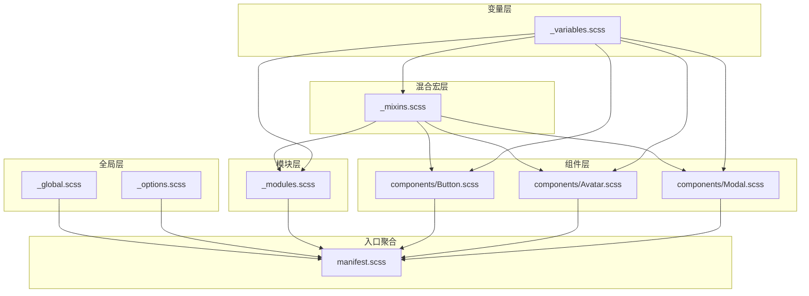
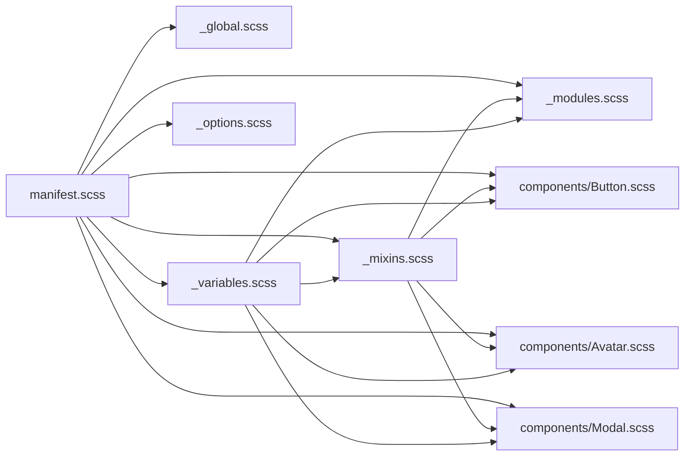
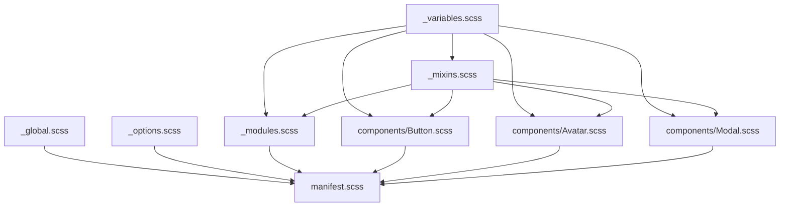

# Sass架构

<cite>
**本文引用的文件**
- [stylesheets/_variables.scss](file://stylesheets/_variables.scss)
- [stylesheets/_mixins.scss](file://stylesheets/_mixins.scss)
- [stylesheets/_modules.scss](file://stylesheets/_modules.scss)
- [stylesheets/_options.scss](file://stylesheets/_options.scss)
- [stylesheets/_global.scss](file://stylesheets/_global.scss)
- [stylesheets/manifest.scss](file://stylesheets/manifest.scss)
- [stylesheets/components/Button.scss](file://stylesheets/components/Button.scss)
- [stylesheets/components/Avatar.scss](file://stylesheets/components/Avatar.scss)
- [stylesheets/components/Modal.scss](file://stylesheets/components/Modal.scss)
- [package.json](file://package.json)
</cite>

## 目录
1. [简介](#简介)
2. [项目结构](#项目结构)
3. [核心组件](#核心组件)
4. [架构总览](#架构总览)
5. [详细组件分析](#详细组件分析)
6. [依赖关系分析](#依赖关系分析)
7. [性能与调试](#性能与调试)
8. [故障排查指南](#故障排查指南)
9. [结论](#结论)
10. [附录](#附录)

## 简介
本文件系统性梳理 Signal-Desktop 的 Sass 架构，围绕设计系统变量（颜色、间距、字体、动画）、可复用样式混合宏（主题、图标、按钮、布局等）、模块化组件组织（按功能域拆分）与全局配置进行深入解析，并给出设计原则、文件组织规范、编译流程与最佳实践，帮助开发者在不直接阅读代码的情况下也能高效理解与维护样式体系。

## 项目结构
Signal-Desktop 的样式采用“变量 + 混合宏 + 组件模块 + 全局配置”的分层组织：
- 变量层：集中定义颜色、透明度、字体族、动效曲线、z-index 层级、通用尺寸等。
- 混合宏层：封装主题切换、图标着色、键盘/鼠标模式、按钮风格、阴影、滚动条等通用能力。
- 模块层：以功能域划分（消息、图片、附件、打字动画、支付通知等），遵循 BEM 命名，强调可组合与可覆盖。
- 组件层：新的原子/分子/模板/页面级组件，采用独立文件，通过 manifest.scss 聚合引入。
- 全局层：基础样式、主题开关、通用动画、占位符等。
- 配置层：全局选项（如第三方库资源路径）。

图表来源
- [stylesheets/_variables.scss](file://stylesheets/_variables.scss#L1-L328)
- [stylesheets/_mixins.scss](file://stylesheets/_mixins.scss#L1-L800)
- [stylesheets/_modules.scss](file://stylesheets/_modules.scss#L1-L800)
- [stylesheets/_global.scss](file://stylesheets/_global.scss#L1-L200)
- [stylesheets/_options.scss](file://stylesheets/_options.scss#L1-L14)
- [stylesheets/manifest.scss](file://stylesheets/manifest.scss#L1-L208)
- [stylesheets/components/Button.scss](file://stylesheets/components/Button.scss#L1-L374)
- [stylesheets/components/Avatar.scss](file://stylesheets/components/Avatar.scss#L1-L191)
- [stylesheets/components/Modal.scss](file://stylesheets/components/Modal.scss#L1-L270)

章节来源
- [stylesheets/manifest.scss](file://stylesheets/manifest.scss#L1-L208)
- [package.json](file://package.json#L98-L100)

## 核心组件
- 设计系统变量（颜色、透明度、字体、动效、层级）
  - 颜色体系：品牌主色、灰阶、强调色、渐变色、头像配色映射、对话气泡配色映射、选中背景等。
  - 字体与排版：Inter 系列字体族、等宽字体族、标题/正文/副标题/说明等字号与行高、字距。
  - 动画与缓动：自定义贝塞尔曲线、调用界面背景色、本地预览宽高比等。
  - 层级与尺寸：z-index 分层、导航栏宽度、通话控件尺寸、滚动条尺寸等。
- 混合宏（主题、图标、按钮、布局、交互）
  - 主题：light-theme、dark-theme、any-theme、explicit-light-theme。
  - 图标：color-svg/color-svg-themed、RTL 图标映射与替换、强制色支持。
  - 交互：键盘/鼠标模式、仅页面可见时动画、平滑滚动、弹出阴影、按钮重置等。
  - 布局：圆角、定位居中、Flex 布局、滚动条样式等。
  - 按钮：主/次/危险/成功/呼叫/系统消息等风格，含 hover/active/focus 状态。
- 模块化组件（按功能域）
  - 消息模块：文本、链接预览、表情包、附件、状态徽章、打字动画、反应贴图等。
  - 图片模块：加载占位、进度圈、边框叠加、播放/停止/下载/不可下载图标等。
  - 附件模块：编辑态、关闭按钮、轨道滚动等。
  - 新组件：Button、Avatar、Modal 等，采用独立文件并通过 manifest.scss 聚合。
- 全局样式与配置
  - 全局：基础标签样式、主题开关、占位动画、全屏流程、链接样式等。
  - 配置：第三方库资源路径（如 intl-tel-input 的 flags/globe 资源）。

章节来源
- [stylesheets/_variables.scss](file://stylesheets/_variables.scss#L1-L328)
- [stylesheets/_mixins.scss](file://stylesheets/_mixins.scss#L1-L800)
- [stylesheets/_modules.scss](file://stylesheets/_modules.scss#L1-L800)
- [stylesheets/_global.scss](file://stylesheets/_global.scss#L1-L200)
- [stylesheets/_options.scss](file://stylesheets/_options.scss#L1-L14)
- [stylesheets/components/Button.scss](file://stylesheets/components/Button.scss#L1-L374)
- [stylesheets/components/Avatar.scss](file://stylesheets/components/Avatar.scss#L1-L191)
- [stylesheets/components/Modal.scss](file://stylesheets/components/Modal.scss#L1-L270)

## 架构总览
Sass 架构遵循“变量驱动 + 混合宏复用 + 组件模块化 + 入口聚合”的设计原则，确保：
- 可维护性：变量与混合宏集中管理，避免重复定义。
- 可扩展性：新组件独立文件，通过 manifest.scss 聚合，便于增量引入。
- 可访问性：键盘/鼠标模式、强制色支持、无障碍焦点环等。
- 可定制性：主题切换、透明度、颜色映射、z-index 分层等。

图表来源
- [stylesheets/manifest.scss](file://stylesheets/manifest.scss#L1-L208)
- [stylesheets/_global.scss](file://stylesheets/_global.scss#L1-L200)
- [stylesheets/_variables.scss](file://stylesheets/_variables.scss#L1-L328)
- [stylesheets/_mixins.scss](file://stylesheets/_mixins.scss#L1-L800)
- [stylesheets/_modules.scss](file://stylesheets/_modules.scss#L1-L800)
- [stylesheets/_options.scss](file://stylesheets/_options.scss#L1-L14)
- [stylesheets/components/Button.scss](file://stylesheets/components/Button.scss#L1-L374)
- [stylesheets/components/Avatar.scss](file://stylesheets/components/Avatar.scss#L1-L191)
- [stylesheets/components/Modal.scss](file://stylesheets/components/Modal.scss#L1-L270)

## 详细组件分析

### 设计系统变量（_variables.scss）
- 字体族与国际化
  - Inter 系列作为默认字体族，提供日语、波斯语、乌尔都语等语言下的字体回退链。
  - 等宽字体族用于粘贴场景匹配检测。
- 颜色体系
  - 品牌主色与强调色：蓝色系、绿色、红色、黄色等。
  - 灰阶与透明度：从近白到深黑的多级灰阶，配套多档 alpha 透明度。
  - 渐变色：多种方向与起止色的渐变映射。
  - 头像配色与对话气泡配色：提供映射表，便于按名称选择。
  - 特定用途色：iOS 蓝提示色、选中消息背景、安全号变更警告等。
- 动画与布局
  - 自定义缓动函数（如 ease-out-expo、局部预览缓动）。
  - 通话背景色、本地预览宽高比常量。
- 层级与尺寸
  - z-index 分层：负值、基础层、弹窗、上下文菜单、tooltip、toast、窗口控制等。
  - 组件特定层级：滚动按钮、故事、通话容器、模态宿主等。
  - 通用尺寸：标题栏高度、滚动条尺寸、导航 Tab 宽度等。

章节来源
- [stylesheets/_variables.scss](file://stylesheets/_variables.scss#L1-L328)

### 混合宏（_mixins.scss）
- 主题系统
  - light-theme、dark-theme、any-theme、explicit-light-theme，配合 @content 实现主题包裹。
- 字体与国际化
  - localized-fonts：针对不同语言设置字体族。
  - font-family/time-fonts/title/body/subtitle/caption 系列 mixin，统一字号/行高/字距。
- 交互与无障碍
  - keyboard-mode/mouse-mode/dark-keyboard-mode/dark-mouse-mode：基于类名的交互模式开关。
  - only-when-page-is-visible：仅在页面可见时执行动画。
  - smooth-scroll：尊重用户偏好（减少动态）。
- 图标与SVG
  - color-svg/color-svg-themed：基于 mask 的图标着色，支持暗色模式与强制色。
  - get-rtl-svg/rtl-icon-map：RTL 图标映射与替换，缺失时抛出错误。
- 布局与工具
  - rounded-corners、popper-shadow、button-reset、staged-attachment-close-button、calling-text-shadow 等。
- 按钮风格
  - button-primary/secondary/light/destructive/green 小按钮等，含 hover/active/focus 状态与混合色计算。
- 模态与面板
  - modal-reset/modal-close-button：统一模态样式与关闭按钮。

章节来源
- [stylesheets/_mixins.scss](file://stylesheets/_mixins.scss#L1-L800)

### 模块化组件（_modules.scss）
- 命名规范与组织
  - 采用 BEM 命名，模块以 .module-xxx 开头，子元素使用 __ 与 -- 扩展。
  - 同一模块内可定义 mixin（如 module-message__buttons__button），提升复用性。
- 功能域示例
  - 消息模块：文本、链接预览、附件、状态徽章、表情反应、打字动画、选中态、删除态等。
  - 图片模块：加载占位、进度圈、边框叠加、播放/停止/下载/不可下载图标、底部遮罩等。
  - 附件模块：编辑态、关闭按钮、横向滚动轨道等。
  - 支付通知模块：标签、信息框、提示图标等。
- 动画与过渡
  - 关键帧：消息抖动、高亮、打字动画等。
  - 过渡属性：背景、translate、滤镜等。
- 主题与状态
  - 使用变量与混合宏实现明暗主题切换、禁用态、键盘焦点态等。

章节来源
- [stylesheets/_modules.scss](file://stylesheets/_modules.scss#L1-L800)
- [stylesheets/_modules.scss](file://stylesheets/_modules.scss#L800-L1600)
- [stylesheets/_modules.scss](file://stylesheets/_modules.scss#L1600-L2400)
- [stylesheets/_modules.scss](file://stylesheets/_modules.scss#L2400-L3200)

### 新组件（components/*.scss）
- Button
  - 提供 large/medium/small、primary/secondary/destructive/calling/system-message 等风格。
  - 内置 hover/active/focus 状态与禁用态，支持 discoureged 变体。
- Avatar
  - 支持图片、标签、图标、加载、点击查看等子元素，带故事边框与官方标识。
- Modal
  - 统一头部、标题、关闭/返回按钮、主体滚动、底部按钮区等结构。
  - 支持重要提示变体与分隔线等。

章节来源
- [stylesheets/components/Button.scss](file://stylesheets/components/Button.scss#L1-L374)
- [stylesheets/components/Avatar.scss](file://stylesheets/components/Avatar.scss#L1-L191)
- [stylesheets/components/Modal.scss](file://stylesheets/components/Modal.scss#L1-L270)

### 全局样式与配置（_global.scss、_options.scss）
- 全局样式
  - html/body 基础样式、主题开关类、链接颜色、占位动画、全屏流程、滚动条等。
- 全局配置
  - 设置第三方库资源路径（如 intl-tel-input 的 flags/globe 资源）。

章节来源
- [stylesheets/_global.scss](file://stylesheets/_global.scss#L1-L200)
- [stylesheets/_options.scss](file://stylesheets/_options.scss#L1-L14)

## 依赖关系分析
- 变量与混合宏
  - _mixins.scss 与 _modules.scss 显式 @use 变量模块，确保所有样式共享同一设计系统。
- 组件与模块
  - 新组件（Button/Avatar/Modal）同样 @use 变量与混合宏，保持一致风格。
- 入口聚合
  - manifest.scss 作为统一入口，@use 全局、变量、混合宏、模块与各组件文件，形成最终 CSS 输出。

图表来源
- [stylesheets/_variables.scss](file://stylesheets/_variables.scss#L1-L328)
- [stylesheets/_mixins.scss](file://stylesheets/_mixins.scss#L1-L800)
- [stylesheets/_modules.scss](file://stylesheets/_modules.scss#L1-L800)
- [stylesheets/_global.scss](file://stylesheets/_global.scss#L1-L200)
- [stylesheets/_options.scss](file://stylesheets/_options.scss#L1-L14)
- [stylesheets/manifest.scss](file://stylesheets/manifest.scss#L1-L208)
- [stylesheets/components/Button.scss](file://stylesheets/components/Button.scss#L1-L374)
- [stylesheets/components/Avatar.scss](file://stylesheets/components/Avatar.scss#L1-L191)
- [stylesheets/components/Modal.scss](file://stylesheets/components/Modal.scss#L1-L270)

## 性能与调试

### 设计原则与文件组织规范
- 命名约定
  - 变量：$color-xxx、$z-index-xxx、$font-size-xxx 等，语义明确、层级清晰。
  - 混合宏：@mixin xxx()，语义化命名，避免过长嵌套。
  - 组件：.module-xxx，BEM 命名，子元素 __，修饰符 --。
- 层级管理策略
  - z-index 分层：负值、基础层、弹窗、上下文菜单、tooltip、toast、窗口控制等，避免层叠混乱。
  - 组件特定层级：按需提升，保证时间轴、故事、通话等元素正确覆盖。
- 避免样式冲突的最佳实践
  - 使用 .module-xxx 前缀隔离组件作用域。
  - 优先使用 @use 引入变量与混合宏，避免全局污染。
  - 在模块内部定义 mixin，减少跨模块耦合。
  - 使用主题混合宏包裹变体，避免重复条件判断。

### 编译流程
- 构建脚本
  - 使用 sass 命令将 manifest.scss 编译为 manifest.css，同时编译桥接文件 manifest_bridge.scss。
  - Tailwind CSS 通过 tailwindcss 命令生成 tailwind.css。
- 开发模式
  - 提供 dev:styles:sass 与 dev:styles:tailwind 两种 watch 模式，便于增量编译。
- 产物输出
  - 通过 manifest.scss 聚合所有样式，最终输出到 stylesheets 目录，供 Electron 应用加载。

章节来源
- [package.json](file://package.json#L98-L100)
- [package.json](file://package.json#L74-L77)
- [stylesheets/manifest.scss](file://stylesheets/manifest.scss#L1-L208)

### 调试技巧
- 变量与混合宏调试
  - 在组件文件顶部 @debug 或使用浏览器开发者工具检查变量值与混合宏展开结果。
  - 通过主题类切换（.light-theme/.dark-theme）快速验证视觉差异。
- 结构与层级调试
  - 使用 z-index 分层注释与可视化工具（如浏览器插件）检查层级覆盖问题。
- 图标与RTL调试
  - 使用 get-rtl-svg 的错误提示定位缺失的 RTL 图标映射。
- 动画与过渡调试
  - 临时禁用 prefers-reduced-motion 或仅-when-page-is-visible 条件，观察动画行为。

## 故障排查指南
- 图标颜色异常
  - 检查 color-svg/color-svg-themed 的参数是否正确传入，确认主题类是否存在。
  - 若为 RTL 场景，确认 rtl-icon-map 是否包含对应映射。
- 主题切换无效
  - 确认页面是否应用了 .light-theme 或 .dark-theme 类。
  - 检查 any-theme/explicit-light-theme 的使用是否正确包裹目标样式。
- 滚动条样式未生效
  - 确认 scrollbar-on-hover 或相关 mixin 已被正确引入与应用。
- 按钮状态异常
  - 检查 hover/active/focus 状态是否被其他规则覆盖，或是否遗漏 @include 对应模式。
- z-index 层叠问题
  - 检查组件特定层级与全局层级的数值范围，避免相邻层级误判。
- 编译失败
  - 确认 sass 命令参数与版本兼容，检查 manifest.scss 中 @use 的路径是否正确。

章节来源
- [stylesheets/_mixins.scss](file://stylesheets/_mixins.scss#L1-L800)
- [stylesheets/_modules.scss](file://stylesheets/_modules.scss#L1-L800)
- [stylesheets/components/Button.scss](file://stylesheets/components/Button.scss#L1-L374)
- [stylesheets/components/Avatar.scss](file://stylesheets/components/Avatar.scss#L1-L191)
- [stylesheets/components/Modal.scss](file://stylesheets/components/Modal.scss#L1-L270)
- [package.json](file://package.json#L98-L100)

## 结论
Signal-Desktop 的 Sass 架构以变量与混合宏为核心，结合模块化组件与入口聚合，实现了高可维护性与强一致性。通过明确的命名约定、层级管理策略与主题系统，开发者可以快速构建可复用、可定制且符合无障碍要求的界面。建议在新增样式时严格遵循现有规范，充分利用 @use 与 @mixin，减少嵌套与重复，确保编译效率与运行性能。

## 附录
- 变量命名约定
  - 颜色：$color-xxx，支持 alpha 透明度与主题映射。
  - 层级：$z-index-xxx，按层级范围命名。
  - 字体：$font-size-xxx、$line-height-xxx、$letter-spacing-xxx。
- 文件组织建议
  - 新组件独立文件，通过 manifest.scss 聚合。
  - 模块内 mixin 仅限模块内部使用，避免跨模块耦合。
  - 保持混合宏无副作用，尽量使用 @content 与参数化。