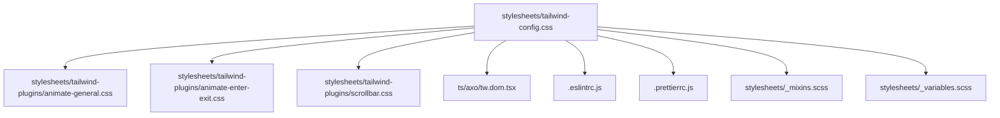
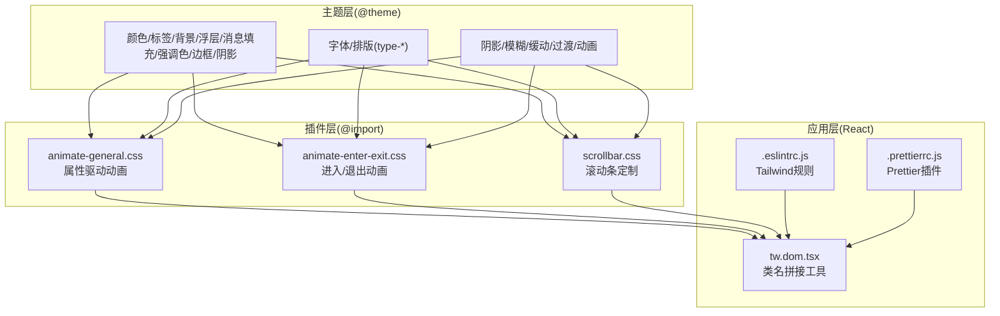
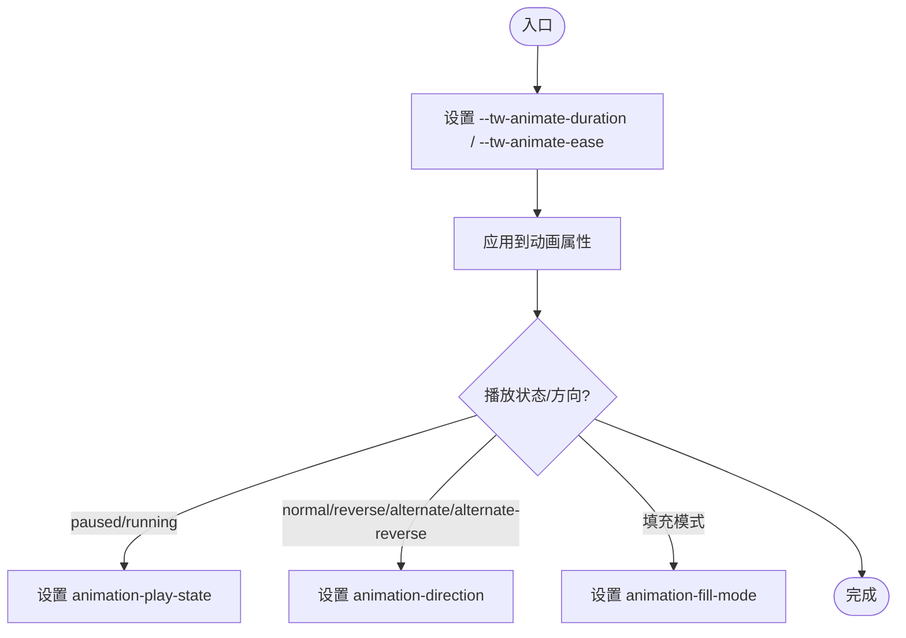
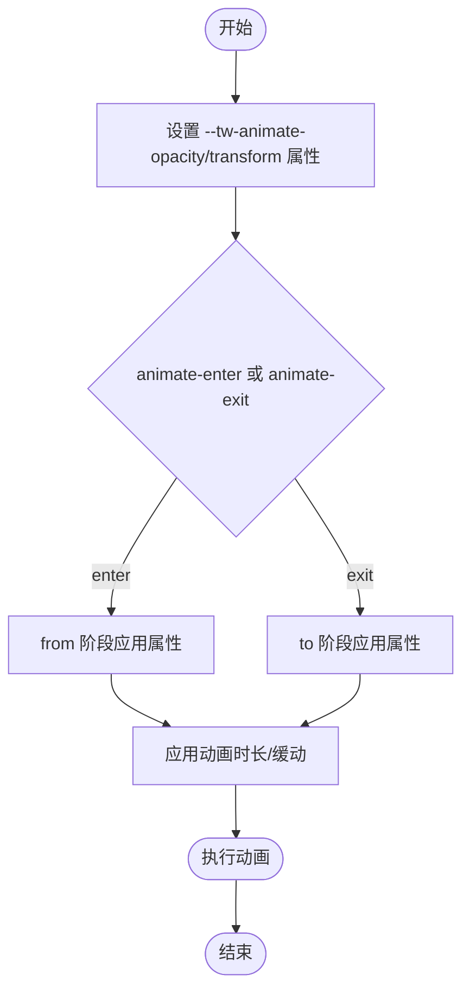
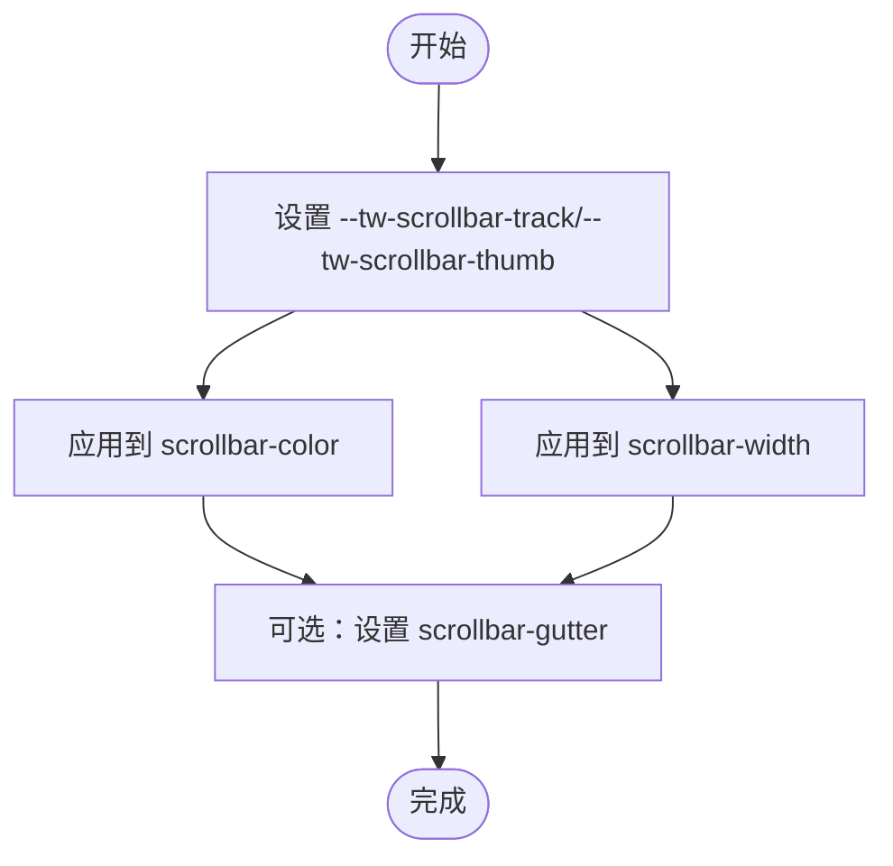
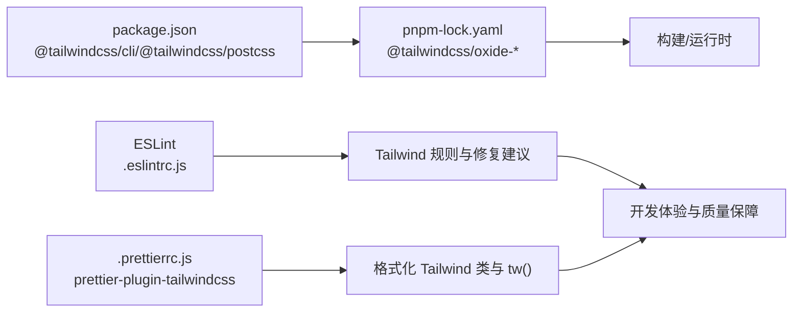

# Tailwind配置

<cite>
**本文引用的文件**
- [stylesheets/tailwind-config.css](file://stylesheets/tailwind-config.css)
- [stylesheets/tailwind-plugins/animate-general.css](file://stylesheets/tailwind-plugins/animate-general.css)
- [stylesheets/tailwind-plugins/animate-enter-exit.css](file://stylesheets/tailwind-plugins/animate-enter-exit.css)
- [stylesheets/tailwind-plugins/scrollbar.css](file://stylesheets/tailwind-plugins/scrollbar.css)
- [ts/axo/tw.dom.tsx](file://ts/axo/tw.dom.tsx)
- [.eslintrc.js](file://.eslintrc.js)
- [.prettierrc.js](file://.prettierrc.js)
- [package.json](file://package.json)
- [pnpm-lock.yaml](file://pnpm-lock.yaml)
- [stylesheets/_mixins.scss](file://stylesheets/_mixins.scss)
- [stylesheets/_variables.scss](file://stylesheets/_variables.scss)
</cite>

## 目录
1. [简介](#简介)
2. [项目结构](#项目结构)
3. [核心组件](#核心组件)
4. [架构总览](#架构总览)
5. [详细组件分析](#详细组件分析)
6. [依赖关系分析](#依赖关系分析)
7. [性能考量](#性能考量)
8. [故障排查指南](#故障排查指南)
9. [结论](#结论)
10. [附录](#附录)

## 简介
本文件系统性梳理 Signal-Desktop 中 Tailwind CSS 的配置与插件体系，重点覆盖以下方面：
- 设计系统变量映射：颜色、字体、排版、阴影、模糊、缓动与过渡/动画等主题变量的统一管理。
- 自定义主题扩展：通过 @theme 声明与 light-dark 模式适配，以及高对比度媒体查询下的差异化变量。
- 插件注册机制：通过 @import 将自定义动画与滚动条插件注入到 Tailwind 主样式中。
- 动画实用类：进入/退出动画（animate-enter-exit）与通用动画（animate-general）的属性驱动与关键帧实现。
- 滚动条样式定制：基于 CSS 变量与属性的可组合滚动条实用类。
- 使用规范：响应式前缀、逻辑方向属性替换、类名一致性与冲突检测。
- 集成方式：与 Sass 架构的协同（字体、混入与变量），样式优先级与避免类名膨胀。
- 调试与构建优化：Tailwind CLI、Prettier 插件、ESLint Tailwind 规则与平台二进制支持。

## 项目结构
Tailwind 配置位于 stylesheets/tailwind-config.css，并通过 @import 引入三个插件：
- animate-general.css：通用动画属性与播放控制
- animate-enter-exit.css：进入/退出动画的属性驱动与关键帧
- scrollbar.css：滚动条宽度、轨道与拇指的定制

同时，项目在 ts/axo/tw.dom.tsx 提供 tw() 工具函数用于拼接类名；ESLint 与 Prettier 配置强化 Tailwind 类的风格与一致性；Sass 变量与混入为全局字体与主题提供补充。

图表来源
- [stylesheets/tailwind-config.css](file://stylesheets/tailwind-config.css#L1-L12)
- [stylesheets/tailwind-plugins/animate-general.css](file://stylesheets/tailwind-plugins/animate-general.css#L1-L13)
- [stylesheets/tailwind-plugins/animate-enter-exit.css](file://stylesheets/tailwind-plugins/animate-enter-exit.css#L1-L30)
- [stylesheets/tailwind-plugins/scrollbar.css](file://stylesheets/tailwind-plugins/scrollbar.css#L1-L14)
- [ts/axo/tw.dom.tsx](file://ts/axo/tw.dom.tsx#L1-L29)
- [.eslintrc.js](file://.eslintrc.js#L266-L308)
- [.prettierrc.js](file://.prettierrc.js#L1-L13)
- [stylesheets/_mixins.scss](file://stylesheets/_mixins.scss#L1-L37)
- [stylesheets/_variables.scss](file://stylesheets/_variables.scss#L1-L21)

章节来源
- [stylesheets/tailwind-config.css](file://stylesheets/tailwind-config.css#L1-L12)
- [ts/axo/tw.dom.tsx](file://ts/axo/tw.dom.tsx#L1-L29)
- [.eslintrc.js](file://.eslintrc.js#L266-L308)
- [.prettierrc.js](file://.prettierrc.js#L1-L13)
- [stylesheets/_mixins.scss](file://stylesheets/_mixins.scss#L1-L37)
- [stylesheets/_variables.scss](file://stylesheets/_variables.scss#L1-L21)

## 核心组件
- 设计系统变量映射（@theme）
  - 颜色：标签、背景、浮层、消息填充、强调色、边框、阴影等，均以 light-dark 适配亮/暗主题，并在高对比度媒体查询下进一步增强对比度。
  - 字体：sans、mono、symbols 家族与语言特定回退。
  - 排版：type-* 实用类映射字号、字重、字距与行高。
  - 阴影：多层级 elevation 与 inset、drop-shadow。
  - 模糊：blur-*。
  - 缓动：ease-*。
  - 过渡与动画：默认时长与缓动，以及 spinner 关键帧。
- 自定义变体
  - dark、hovered、pressed、focused，分别绑定 .dark-theme、:hover/:active（禁用态排除）、键盘模式下的 :focus。
- 插件注册
  - 通过 @import 将 animate-general、animate-enter-exit、scrollbar 注入主样式，形成统一的工具集。
- 属性驱动动画
  - animate-general：通过 CSS 变量 --tw-animate-duration、--tw-animate-ease 控制动画时长与缓动。
  - animate-enter-exit：通过 CSS 属性 --tw-animate-opacity、--tw-animate-rotate、--tw-animate-scale、--tw-animate-translate-x/y 组合关键帧 tw-animate-enter/tw-animate-exit。
- 滚动条定制
  - 通过 --tw-scrollbar-track、--tw-scrollbar-thumb 与 scrollbar-width、scrollbar-gutter 实用类，结合基础层设置默认滚动条外观。

章节来源
- [stylesheets/tailwind-config.css](file://stylesheets/tailwind-config.css#L13-L210)
- [stylesheets/tailwind-config.css](file://stylesheets/tailwind-config.css#L212-L351)
- [stylesheets/tailwind-config.css](file://stylesheets/tailwind-config.css#L353-L441)
- [stylesheets/tailwind-plugins/animate-general.css](file://stylesheets/tailwind-plugins/animate-general.css#L1-L86)
- [stylesheets/tailwind-plugins/animate-enter-exit.css](file://stylesheets/tailwind-plugins/animate-enter-exit.css#L1-L143)
- [stylesheets/tailwind-plugins/scrollbar.css](file://stylesheets/tailwind-plugins/scrollbar.css#L1-L82)

## 架构总览
Tailwind v4 在本项目中采用“主题变量 + 自定义插件 + 工具函数”的三层架构：
- 主题层：集中于 tailwind-config.css 的 @theme 声明，统一颜色、排版、阴影、模糊、缓动与动画参数。
- 插件层：通过 animate-general 与 animate-enter-exit 提供属性驱动的动画能力；通过 scrollbar 提供滚动条定制。
- 应用层：React 组件通过 tw() 拼接类名，遵循 ESLint/Prettier/Tailwind 规则，确保一致性与可维护性。

图表来源
- [stylesheets/tailwind-config.css](file://stylesheets/tailwind-config.css#L28-L441)
- [stylesheets/tailwind-plugins/animate-general.css](file://stylesheets/tailwind-plugins/animate-general.css#L1-L86)
- [stylesheets/tailwind-plugins/animate-enter-exit.css](file://stylesheets/tailwind-plugins/animate-enter-exit.css#L1-L143)
- [stylesheets/tailwind-plugins/scrollbar.css](file://stylesheets/tailwind-plugins/scrollbar.css#L1-L82)
- [ts/axo/tw.dom.tsx](file://ts/axo/tw.dom.tsx#L1-L29)
- [.eslintrc.js](file://.eslintrc.js#L266-L308)
- [.prettierrc.js](file://.prettierrc.js#L1-L13)

## 详细组件分析

### 设计系统变量映射（@theme）
- 颜色体系
  - 标签类：primary/secondary/placeholder/disabled 及 inverted/on-color 变体，均以 light-dark 包裹，自动适配亮/暗主题。
  - 背景与浮层：background-primary/secondary/overlay 与 elevated-background-* 多层级。
  - 消息填充：incoming/outgoing 两套主次三级填充，支持亮/暗主题差异。
  - 强调色：primary/light/affirmative/destructive 及 disabled 变体。
  - 边框与阴影：border-primary/secondary/focused/selected/error 与多级 elevation shadow。
- 字体与排版
  - 字体家族：sans、mono、symbols，并在 :lang(ja/fa/ur) 下提供本地化回退。
  - 排版：type-* 实用类映射 text-size、font-weight、letter-spacing、line-height。
- 阴影、模糊、缓动与动画
  - shadow-elevation-*、inset-shadow-on-color、drop-shadow-elevation-*。
  - blur-thin/regular/thick。
  - ease-in/out/cubic 与默认过渡/动画时长与缓动。
  - 默认动画：spinner-v2 关键帧。
- 高对比度适配
  - 在 prefers-contrast: more 条件下，显著提升对比度与可见性，调整阴影与边框透明度。

章节来源
- [stylesheets/tailwind-config.css](file://stylesheets/tailwind-config.css#L28-L210)
- [stylesheets/tailwind-config.css](file://stylesheets/tailwind-config.css#L212-L351)
- [stylesheets/tailwind-config.css](file://stylesheets/tailwind-config.css#L353-L441)

### 自定义变体与源目录
- 自定义变体
  - dark：.dark-theme 或其后代匹配。
  - hovered：:hover 且 :not(:disabled)。
  - pressed：:active 且 :not(:disabled)。
  - focused：.keyboard-mode 下的 :focus。
- 源目录
  - @source 指向 ts、test、.storybook 与根目录 HTML/JS，确保扫描到组件与测试中的类名。

章节来源
- [stylesheets/tailwind-config.css](file://stylesheets/tailwind-config.css#L13-L21)
- [stylesheets/tailwind-config.css](file://stylesheets/tailwind-config.css#L8-L12)

### 动画通用插件（animate-general.css）
- 目标
  - 通过 CSS 变量与工具类，提供统一的动画时长、延迟、缓动、填充模式、播放状态与方向控制。
- 关键点
  - 变量：--tw-animate-duration、--tw-animate-ease。
  - 工具类：animate-duration-*、animate-delay-*、animate-ease-*、animate-forwards/backwards/both/none、paused/running、animate-normal/reverse/alternate/alternate-reverse。
  - 与默认主题联动：继承默认动画时长与缓动。

图表来源
- [stylesheets/tailwind-plugins/animate-general.css](file://stylesheets/tailwind-plugins/animate-general.css#L1-L86)

章节来源
- [stylesheets/tailwind-plugins/animate-general.css](file://stylesheets/tailwind-plugins/animate-general.css#L1-L86)

### 进入/退出动画插件（animate-enter-exit.css）
- 目标
  - 通过属性驱动的方式，组合透明度与变换（旋转、缩放、平移），生成进入/退出动画。
- 关键点
  - 属性：--tw-animate-opacity、--tw-animate-rotate、--tw-animate-scale、--tw-animate-translate-x/y。
  - 工具类：animate-enter、animate-exit，以及 animate-opacity-*、animate-rotate-*（含负号变体）、animate-scale-*（含负号变体）、animate-translate-x/y-*（支持整数间距与百分比/长度）。
  - 关键帧：tw-animate-enter（from）与 tw-animate-exit（to），从/到阶段应用上述属性。

图表来源
- [stylesheets/tailwind-plugins/animate-enter-exit.css](file://stylesheets/tailwind-plugins/animate-enter-exit.css#L1-L143)

章节来源
- [stylesheets/tailwind-plugins/animate-enter-exit.css](file://stylesheets/tailwind-plugins/animate-enter-exit.css#L1-L143)

### 滚动条样式定制（scrollbar.css）
- 目标
  - 提供可组合的滚动条宽度、轨道与拇指定制，以及 gutter 策略。
- 关键点
  - 变量：--default-scrollbar-width、--default-scrollbar-track、--default-scrollbar-thumb。
  - 属性：--tw-scrollbar-track、--tw-scrollbar-thumb。
  - 工具类：scrollbar-track-*、scrollbar-thumb-*、scrollbar-width-auto/thin/none、scrollbar-gutter-auto/stable/stable-both-edges。
  - 基础层：默认滚动条宽度与颜色由主题变量提供。

图表来源
- [stylesheets/tailwind-plugins/scrollbar.css](file://stylesheets/tailwind-plugins/scrollbar.css#L1-L82)

章节来源
- [stylesheets/tailwind-plugins/scrollbar.css](file://stylesheets/tailwind-plugins/scrollbar.css#L1-L82)

### 类名拼接工具（tw.dom.tsx）
- 目标
  - 在 React 中安全地拼接 Tailwind 类名，避免空值与重复空格。
- 行为
  - 支持字符串、布尔、null/undefined 输入，仅保留有效字符串并以空格连接。
  - 返回类型为 TailwindStyles，便于静态检查与工具链识别。

章节来源
- [ts/axo/tw.dom.tsx](file://ts/axo/tw.dom.tsx#L1-L29)

### 与 Sass 架构的集成
- 字体与混入
  - Sass 变量与混入提供字体家族、语言回退与排版混入，与 Tailwind 的 --font-* 互补。
- 主题混入
  - Sass 混入提供 light/dark/any 主题包裹，与 Tailwind 的 dark 变体配合，保证样式在不同主题下的一致性。
- 变量复用
  - Sass 变量与 Tailwind @theme 变量在颜色与排版上保持一致命名与语义，减少重复与歧义。

章节来源
- [stylesheets/_mixins.scss](file://stylesheets/_mixins.scss#L1-L37)
- [stylesheets/_variables.scss](file://stylesheets/_variables.scss#L1-L21)
- [stylesheets/tailwind-config.css](file://stylesheets/tailwind-config.css#L212-L253)

## 依赖关系分析
- Tailwind CLI 与 PostCSS
  - 项目使用 @tailwindcss/cli 与 @tailwindcss/postcss，确保 v4 API 的可用性与构建稳定性。
- 平台二进制
  - pnpm-lock.yaml 显示各平台的 @tailwindcss/oxide-* 二进制，保障跨平台安装与运行。
- ESLint Tailwind 规则
  - 通过 better-tailwindcss 插件强制类名顺序、去重、禁止任意值与重要修饰符、推荐逻辑属性替换等。
- Prettier Tailwind 插件
  - 通过 tailwindStylesheet 与 tailwindFunctions 配置，使格式化器识别 Tailwind 类与 tw() 函数。

图表来源
- [package.json](file://package.json#L260-L298)
- [pnpm-lock.yaml](file://pnpm-lock.yaml#L3826-L3894)
- [.eslintrc.js](file://.eslintrc.js#L266-L456)
- [.prettierrc.js](file://.prettierrc.js#L1-L13)

章节来源
- [package.json](file://package.json#L260-L298)
- [pnpm-lock.yaml](file://pnpm-lock.yaml#L3826-L3894)
- [.eslintrc.js](file://.eslintrc.js#L266-L456)
- [.prettierrc.js](file://.prettierrc.js#L1-L13)

## 性能考量
- 构建优化
  - 使用 Tailwind CLI 与平台二进制，减少跨平台兼容问题与构建时间。
  - 合理拆分插件与主题，避免一次性注入过多关键帧与复杂选择器。
- 样式体积控制
  - 通过 ESLint Tailwind 规则限制任意值与重要修饰符，减少无谓的类名膨胀。
  - 使用逻辑属性（如 start/end/ms/me/ps/pe/rounded-s/e/ss/se/es/ee）替代 left/right 等，提升 RTL 兼容性与可维护性。
- 动画与滚动条
  - 动画属性驱动（CSS 变量）相比内联样式更易被 Tree Shaking 优化。
  - 滚动条定制仅在需要时启用，避免对全站滚动条进行不必要的全局覆盖。

[本节为通用指导，不直接分析具体文件]

## 故障排查指南
- 类名未注册或冲突
  - 使用 ESLint Tailwind 规则报告未注册类名与冲突类名，及时修正。
- 任意值与重要修饰符
  - 禁止使用任意值（如 text-[#fff]）与 !important，改用主题变量与逻辑属性。
- 逻辑属性替换
  - 将 left/right、ml/mr、pl/pr、border-l/r、rounded-l/r 等替换为 start/end、ms/me、ps/pe、border-s/e、rounded-s/e、rounded-ss/se/es/ee 等。
- Prettier/Tailwind 集成
  - 确认 tailwindStylesheet 与 tailwindFunctions 配置正确，避免格式化失败。
- 平台二进制问题
  - 若构建失败，检查 pnpm-lock.yaml 中对应平台的 @tailwindcss/oxide-* 是否存在。

章节来源
- [.eslintrc.js](file://.eslintrc.js#L266-L456)
- [.prettierrc.js](file://.prettierrc.js#L1-L13)
- [pnpm-lock.yaml](file://pnpm-lock.yaml#L3826-L3894)

## 结论
本项目的 Tailwind v4 配置以“主题变量 + 自定义插件 + 工具函数”为核心，实现了：
- 一致的设计系统变量映射与高对比度适配；
- 可组合的动画与滚动条定制；
- 与 Sass 的无缝协作；
- 开发期的严格规则与格式化保障；
- 跨平台的构建稳定性。

建议在后续迭代中持续：
- 保持主题变量与 Sass 变量的一致性；
- 逐步推广逻辑属性与类型化工具类；
- 通过 ESLint/Prettier 规则持续优化类名质量与体积。

[本节为总结，不直接分析具体文件]

## 附录

### 使用规范与最佳实践
- 响应式前缀与逻辑属性
  - 优先使用 start/end、ms/me、ps/pe、border-s/e、rounded-s/e、rounded-ss/se/es/ee 等逻辑属性，避免直接使用 left/right。
- 类名一致性
  - 通过 ESLint Tailwind 规则与 Prettier 插件，确保类名顺序、去重、无任意值与重要修饰符。
- 动画与过渡
  - 使用 animate-general 的 duration/ease/方向/播放状态工具类，结合 animate-enter-exit 的属性驱动组合，避免硬编码关键帧。
- 滚动条定制
  - 仅在需要的容器上启用滚动条定制，避免全局覆盖影响整体体验。

章节来源
- [.eslintrc.js](file://.eslintrc.js#L266-L308)
- [.prettierrc.js](file://.prettierrc.js#L1-L13)
- [stylesheets/tailwind-plugins/animate-general.css](file://stylesheets/tailwind-plugins/animate-general.css#L1-L86)
- [stylesheets/tailwind-plugins/animate-enter-exit.css](file://stylesheets/tailwind-plugins/animate-enter-exit.css#L1-L143)
- [stylesheets/tailwind-plugins/scrollbar.css](file://stylesheets/tailwind-plugins/scrollbar.css#L1-L82)