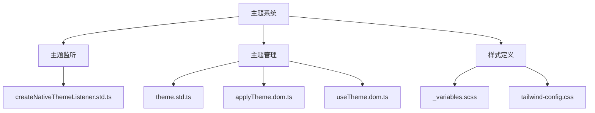
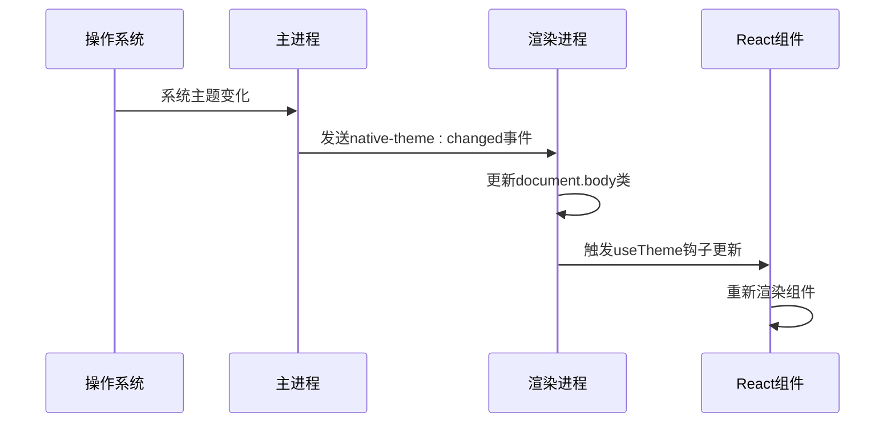
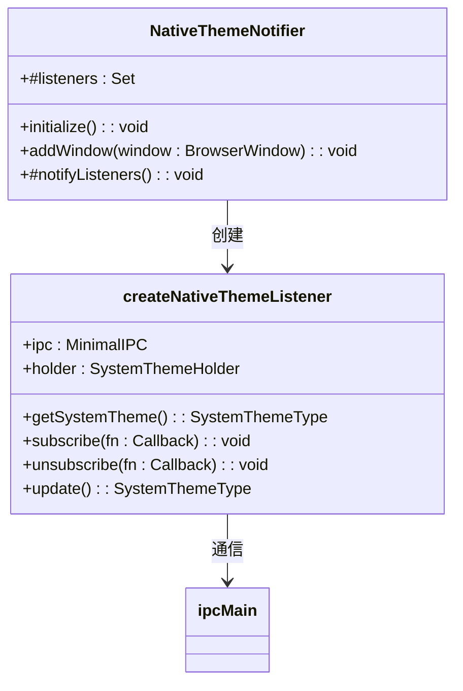
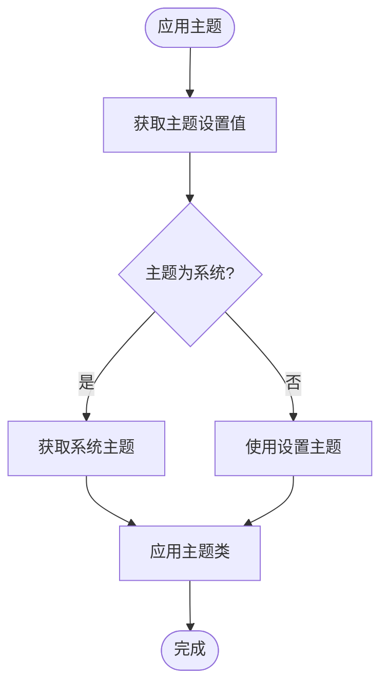
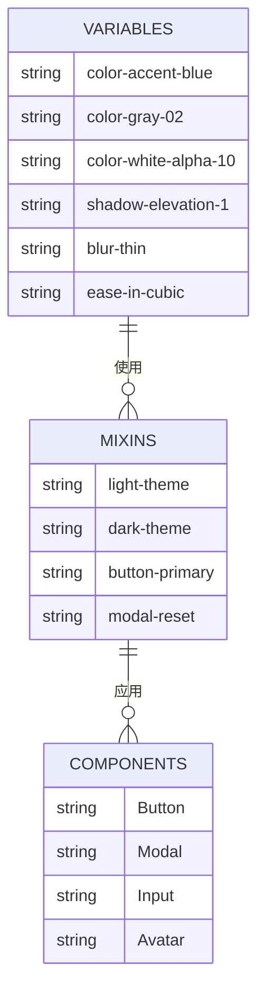
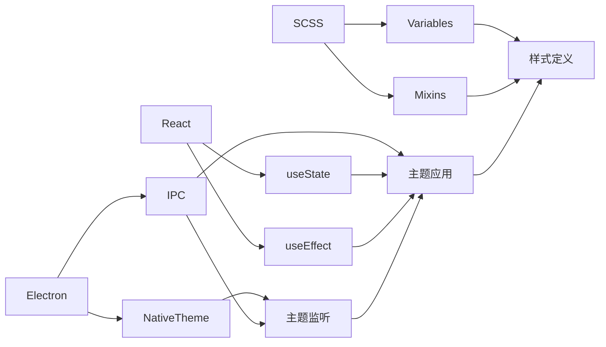

# 主题系统

<cite>
**本文档中引用的文件**  
- [createNativeThemeListener.std.ts](file://ts/context/createNativeThemeListener.std.ts)
- [theme.std.ts](file://ts/util/theme.std.ts)
- [_variables.scss](file://stylesheets/_variables.scss)
- [applyTheme.dom.ts](file://ts/windows/applyTheme.dom.ts)
- [useTheme.dom.ts](file://ts/hooks/useTheme.dom.ts)
- [getThemeType.dom.ts](file://ts/util/getThemeType.dom.ts)
- [main.main.ts](file://app/main.main.ts)
- [Preferences.dom.tsx](file://ts/components/Preferences.dom.tsx)
- [tailwind-config.css](file://stylesheets/tailwind-config.css)
- [_mixins.scss](file://stylesheets/_mixins.scss)
</cite>

## 目录
1. [简介](#简介)
2. [项目结构](#项目结构)
3. [核心组件](#核心组件)
4. [架构概述](#架构概述)
5. [详细组件分析](#详细组件分析)
6. [依赖分析](#依赖分析)
7. [性能考虑](#性能考虑)
8. [故障排除指南](#故障排除指南)
9. [结论](#结论)

## 简介
Signal-Desktop 主题系统实现了基于操作系统原生主题的动态切换机制，支持亮色、暗色和系统级三种主题模式。该系统通过 Electron 的原生 API 监听系统主题变化，并结合 React 组件状态管理和 CSS 自定义属性，实现了平滑的主题切换体验。主题变量在 SCSS 中集中定义，并通过 CSS 类和自定义属性应用于整个应用界面。系统还提供了主题扩展接口和调试工具，支持跨平台适配和自定义主题创建。

## 项目结构
主题系统相关文件分布在多个目录中，主要包括：
- `ts/context/`: 包含主题监听器的创建逻辑
- `ts/util/`: 包含主题管理工具函数
- `ts/hooks/`: 包含 React 主题钩子
- `stylesheets/`: 包含主题变量和样式定义
- `app/`: 包含主进程中的主题设置初始化

**Diagram sources**
- [createNativeThemeListener.std.ts](file://ts/context/createNativeThemeListener.std.ts)
- [theme.std.ts](file://ts/util/theme.std.ts)
- [_variables.scss](file://stylesheets/_variables.scss)

**Section sources**
- [ts/context/createNativeThemeListener.std.ts](file://ts/context/createNativeThemeListener.std.ts)
- [ts/util/theme.std.ts](file://ts/util/theme.std.ts)
- [stylesheets/_variables.scss](file://stylesheets/_variables.scss)

## 核心组件
主题系统的核心组件包括主题监听器、主题管理器和主题变量定义。主题监听器负责监听操作系统主题变化，主题管理器负责应用主题到 DOM，主题变量定义了亮色和暗色模式下的颜色、阴影等样式属性。

**Section sources**
- [createNativeThemeListener.std.ts](file://ts/context/createNativeThemeListener.std.ts)
- [theme.std.ts](file://ts/util/theme.std.ts)
- [_variables.scss](file://stylesheets/_variables.scss)

## 架构概述
Signal-Desktop 主题系统采用分层架构，从底层的原生主题监听到上层的 React 组件主题应用，形成了完整的主题管理链条。系统通过 IPC 通信在主进程和渲染进程之间传递主题变化事件，确保主题切换的实时性和一致性。

**Diagram sources**
- [main.main.ts](file://app/main.main.ts)
- [createNativeThemeListener.std.ts](file://ts/context/createNativeThemeListener.std.ts)
- [applyTheme.dom.ts](file://ts/windows/applyTheme.dom.ts)
- [useTheme.dom.ts](file://ts/hooks/useTheme.dom.ts)

## 详细组件分析

### 主题监听机制分析
主题监听机制基于 Electron 的 `nativeTheme` API，通过 IPC 通道在主进程和渲染进程之间同步主题状态。主进程初始化主题监听器并监听系统主题变化，当主题变化时通过 IPC 向所有渲染进程发送通知。

**Diagram sources**
- [main.main.ts](file://app/main.main.ts)
- [createNativeThemeListener.std.ts](file://ts/context/createNativeThemeListener.std.ts)

**Section sources**
- [main.main.ts](file://app/main.main.ts#L328-L364)
- [createNativeThemeListener.std.ts](file://ts/context/createNativeThemeListener.std.ts#L32-L82)

### 主题管理逻辑分析
主题管理逻辑主要由 `applyTheme.dom.ts` 和 `useTheme.dom.ts` 实现。`applyTheme` 函数负责将主题应用到 DOM 元素，通过添加或移除 CSS 类来切换主题。`useTheme` 钩子为 React 组件提供当前主题状态，支持函数组件使用主题。

**Diagram sources**
- [applyTheme.dom.ts](file://ts/windows/applyTheme.dom.ts)
- [useTheme.dom.ts](file://ts/hooks/useTheme.dom.ts)

**Section sources**
- [applyTheme.dom.ts](file://ts/windows/applyTheme.dom.ts#L4-L34)
- [useTheme.dom.ts](file://ts/hooks/useTheme.dom.ts#L10-L58)

### 主题变量与样式分析
主题变量在 `_variables.scss` 中集中定义，包括颜色、阴影、布局等各类 CSS 变量。这些变量通过 CSS 自定义属性（CSS Variables）在运行时动态应用，支持主题的实时切换。Tailwind CSS 配置中也引用了这些变量，实现了样式系统的统一管理。

**Diagram sources**
- [_variables.scss](file://stylesheets/_variables.scss)
- [tailwind-config.css](file://stylesheets/tailwind-config.css)
- [_mixins.scss](file://stylesheets/_mixins.scss)

**Section sources**
- [_variables.scss](file://stylesheets/_variables.scss#L1-L328)
- [tailwind-config.css](file://stylesheets/tailwind-config.css#L329-L372)
- [_mixins.scss](file://stylesheets/_mixins.scss#L533-L773)

## 依赖分析
主题系统依赖于 Electron 的原生 API、React 的状态管理机制以及 SCSS 的预处理功能。各组件之间通过明确的接口进行通信，降低了耦合度。主进程和渲染进程通过 IPC 通道进行异步通信，确保了系统的响应性和稳定性。

**Diagram sources**
- [main.main.ts](file://app/main.main.ts)
- [createNativeThemeListener.std.ts](file://ts/context/createNativeThemeListener.std.ts)
- [applyTheme.dom.ts](file://ts/windows/applyTheme.dom.ts)
- [useTheme.dom.ts](file://ts/hooks/useTheme.dom.ts)

**Section sources**
- [app/main.main.ts](file://app/main.main.ts)
- [ts/context/createNativeThemeListener.std.ts](file://ts/context/createNativeThemeListener.std.ts)
- [ts/windows/applyTheme.dom.ts](file://ts/windows/applyTheme.dom.ts)

## 性能考虑
主题系统在设计时充分考虑了性能优化。通过使用 CSS 类切换而非内联样式，减少了重排和重绘的开销。主题变化监听采用事件驱动模式，避免了轮询带来的性能损耗。React 组件通过 `useTheme` 钩子订阅主题变化，实现了最小化的重新渲染范围。

## 故障排除指南
当主题系统出现问题时，可以按照以下步骤进行排查：
1. 检查主进程是否正确初始化了 `NativeThemeNotifier`
2. 验证 IPC 通道是否正常工作
3. 确认 `document.body` 是否正确添加了主题类
4. 检查 CSS 变量是否正确加载
5. 验证 React 组件是否正确使用了 `useTheme` 钩子

**Section sources**
- [main.main.ts](file://app/main.main.ts)
- [createNativeThemeListener.std.ts](file://ts/context/createNativeThemeListener.std.ts)
- [applyTheme.dom.ts](file://ts/windows/applyTheme.dom.ts)
- [useTheme.dom.ts](file://ts/hooks/useTheme.dom.ts)

## 结论
Signal-Desktop 主题系统通过精心设计的架构和实现，提供了流畅的亮色/暗色模式切换体验。系统充分利用了 Electron、React 和现代 CSS 的特性，实现了高性能、低耦合的主题管理。通过集中化的变量定义和模块化的组件设计，系统具有良好的可维护性和扩展性，为用户提供了个性化的界面体验。