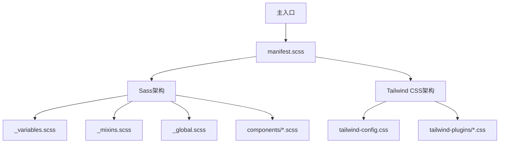
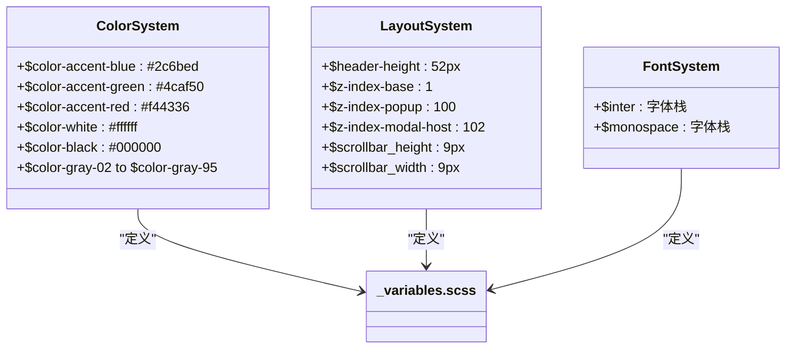
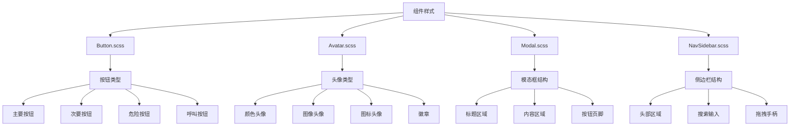
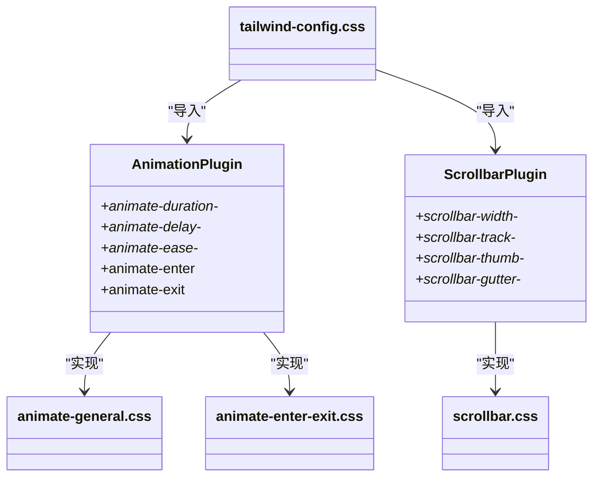
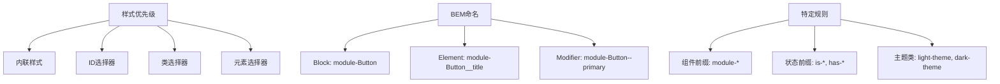
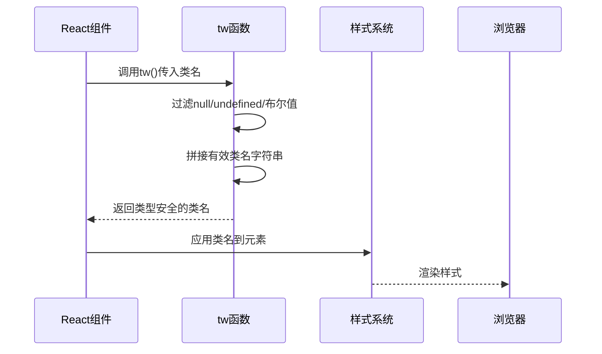
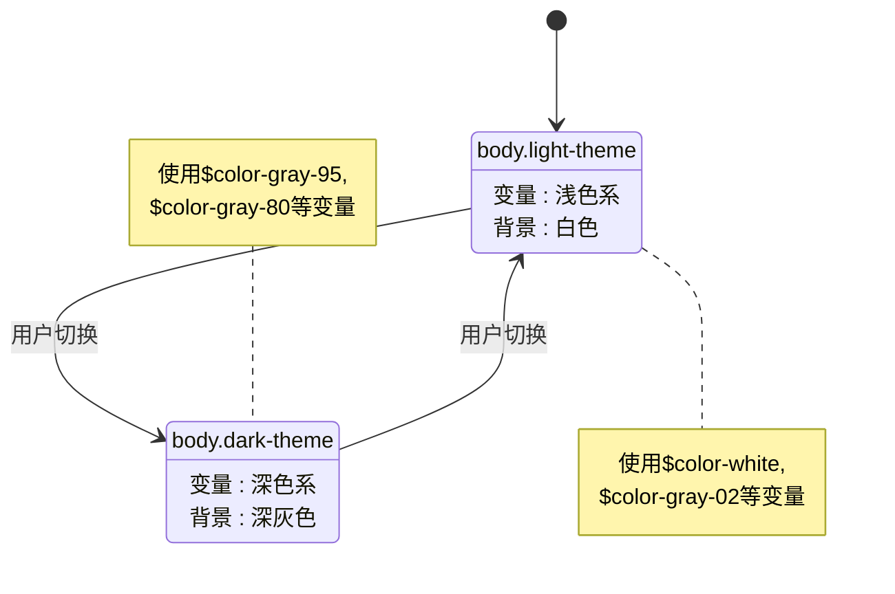
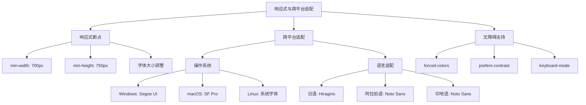
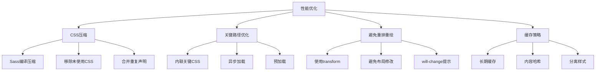

# 样式系统

<cite>
**本文档中引用的文件**   
- [_variables.scss](file://stylesheets/_variables.scss)
- [tailwind-config.css](file://stylesheets/tailwind-config.css)
- [manifest.scss](file://stylesheets/manifest.scss)
- [_mixins.scss](file://stylesheets/_mixins.scss)
- [_global.scss](file://stylesheets/_global.scss)
- [Button.scss](file://stylesheets/components/Button.scss)
- [Avatar.scss](file://stylesheets/components/Avatar.scss)
- [Modal.scss](file://stylesheets/components/Modal.scss)
- [NavSidebar.scss](file://stylesheets/components/NavSidebar.scss)
- [animate-general.css](file://stylesheets/tailwind-plugins/animate-general.css)
- [animate-enter-exit.css](file://stylesheets/tailwind-plugins/animate-enter-exit.css)
- [scrollbar.css](file://stylesheets/tailwind-plugins/scrollbar.css)
- [tw.dom.tsx](file://ts/axo/tw.dom.tsx)
</cite>

## 目录
1. [简介](#简介)
2. [混合样式架构](#混合样式架构)
3. [设计系统变量](#设计系统变量)
4. [组件样式实现](#组件样式实现)
5. [Tailwind CSS自定义插件](#tailwind-css自定义插件)
6. [样式优先级与BEM命名](#样式优先级与bem命名)
7. [CSS-in-JS模式使用](#css-in-js模式使用)
8. [暗色模式实现](#暗色模式实现)
9. [响应式与跨平台适配](#响应式与跨平台适配)
10. [样式调试与性能优化](#样式调试与性能优化)

## 简介
Signal-Desktop的样式系统采用Sass和Tailwind CSS的混合架构，结合了传统CSS预处理器的变量和混入功能与现代实用类优先的CSS框架优势。该系统通过模块化设计实现了高度一致的视觉语言，同时保持了开发效率和性能优化。核心设计原则包括可维护性、可扩展性和跨平台一致性。

**Section sources**
- [manifest.scss](file://stylesheets/manifest.scss#L1-L208)

## 混合样式架构
Signal-Desktop的样式架构结合了Sass的模块化能力和Tailwind CSS的实用类系统。主样式表`manifest.scss`通过`@use`指令导入所有组件样式，形成完整的样式表。同时，`tailwind-config.css`文件定义了Tailwind的配置，包括主题变量、自定义变体和实用类。

该架构的关键优势在于：
- **Sass用于复杂组件**：复杂的组件样式（如按钮、模态框）使用Sass编写，利用其变量、混入和嵌套功能
- **Tailwind用于布局和实用类**：使用Tailwind的实用类处理布局、间距、颜色等常见样式
- **无缝集成**：通过`@import`指令将Tailwind配置与Sass样式表集成



**Diagram sources **
- [manifest.scss](file://stylesheets/manifest.scss#L1-L208)
- [tailwind-config.css](file://stylesheets/tailwind-config.css#L1-L441)

**Section sources**
- [manifest.scss](file://stylesheets/manifest.scss#L1-L208)
- [tailwind-config.css](file://stylesheets/tailwind-config.css#L1-L441)

## 设计系统变量
设计系统变量在`_variables.scss`文件中定义，包含颜色、字体、布局和z-index等核心设计令牌。这些变量遵循系统化命名约定，确保设计一致性。

### 颜色系统
颜色变量分为多个类别：
- **基础颜色**：如`$color-accent-blue`、`$color-accent-green`
- **灰度系列**：从`$color-gray-02`到`$color-gray-95`的渐变灰度
- **主题颜色**：如`$color-ultramarine`系列的主色调
- **状态颜色**：如`$color-accent-red`用于错误状态

### 布局变量
关键布局变量包括：
- `$header-height`: 52px的头部高度
- `$z-index-*`系列：从`$z-index-base`到`$z-index-on-top-of-everything`的层级系统
- `$scrollbar_height`和`$scrollbar_width`：滚动条尺寸

### 字体系统
字体变量定义了主要字体栈：
- `$inter`: 主要无衬线字体栈，包含Inter、Source Sans Pro等
- `$monospace`: 等宽字体栈，用于代码显示



**Diagram sources **
- [_variables.scss](file://stylesheets/_variables.scss#L1-L328)

**Section sources**
- [_variables.scss](file://stylesheets/_variables.scss#L1-L328)

## 组件样式实现
组件样式在`stylesheets/components/`目录下实现，每个组件有独立的SCSS文件。组件采用BEM（Block-Element-Modifier）命名约定，确保样式隔离和可预测性。

### 按钮组件
`Button.scss`实现了多种按钮变体：
- **主要按钮**（`--primary`）：蓝色背景，白色文字
- **次要按钮**（`--secondary`）：浅灰色背景，深色文字
- **危险按钮**（`--destructive`）：红色背景，用于删除操作
- **呼叫按钮**（`--calling`）：绿色背景，用于呼叫功能

按钮样式通过混入实现悬停和激活状态，使用`color.mix()`函数创建颜色变体。

### 头像组件
`Avatar.scss`实现了头像组件，支持：
- **颜色头像**：基于`$avatar-colors`映射的颜色背景
- **图像头像**：圆形图像显示
- **图标头像**：使用Webkit遮罩显示SVG图标
- **徽章**：头像上的状态指示器

### 模态框组件
`Modal.scss`实现了模态框组件，包含：
- **标题区域**：带有返回和关闭按钮
- **内容区域**：可滚动的内容主体
- **按钮页脚**：操作按钮容器
- **边框分隔线**：根据滚动状态显示的边框

### 导航侧边栏
`NavSidebar.scss`实现了导航侧边栏，包含：
- **头部区域**：标题和操作按钮
- **搜索输入**：集成的搜索功能
- **拖拽手柄**：用于调整侧边栏宽度
- **空状态**：无内容时的占位显示



**Diagram sources **
- [Button.scss](file://stylesheets/components/Button.scss#L1-L374)
- [Avatar.scss](file://stylesheets/components/Avatar.scss#L1-L191)
- [Modal.scss](file://stylesheets/components/Modal.scss#L1-L270)
- [NavSidebar.scss](file://stylesheets/components/NavSidebar.scss#L1-L277)

**Section sources**
- [Button.scss](file://stylesheets/components/Button.scss#L1-L374)
- [Avatar.scss](file://stylesheets/components/Avatar.scss#L1-L191)
- [Modal.scss](file://stylesheets/components/Modal.scss#L1-L270)
- [NavSidebar.scss](file://stylesheets/components/NavSidebar.scss#L1-L277)

## Tailwind CSS自定义插件
Tailwind CSS自定义插件在`stylesheets/tailwind-plugins/`目录下实现，扩展了Tailwind的核心功能。

### 动画插件
`animate-general.css`和`animate-enter-exit.css`提供了自定义动画功能：
- **动画持续时间**：`animate-duration-*`实用类
- **动画延迟**：`animate-delay-*`实用类
- **动画缓动**：`animate-ease-*`实用类
- **进入/退出动画**：`animate-enter`和`animate-exit`实用类

### 滚动条插件
`scrollbar.css`实现了跨浏览器滚动条样式：
- **滚动条宽度**：`scrollbar-width-auto`、`scrollbar-width-thin`
- **滚动条颜色**：`scrollbar-track-*`、`scrollbar-thumb-*`
- **滚动条间距**：`scrollbar-gutter-auto`、`scrollbar-gutter-stable`

这些插件通过`@property`定义自定义CSS属性，确保动画的流畅性和性能。



**Diagram sources **
- [animate-general.css](file://stylesheets/tailwind-plugins/animate-general.css#L1-L86)
- [animate-enter-exit.css](file://stylesheets/tailwind-plugins/animate-enter-exit.css#L1-L143)
- [scrollbar.css](file://stylesheets/tailwind-plugins/scrollbar.css#L1-L82)

**Section sources**
- [animate-general.css](file://stylesheets/tailwind-plugins/animate-general.css#L1-L86)
- [animate-enter-exit.css](file://stylesheets/tailwind-plugins/animate-enter-exit.css#L1-L143)
- [scrollbar.css](file://stylesheets/tailwind-plugins/scrollbar.css#L1-L82)

## 样式优先级与BEM命名
样式系统遵循严格的优先级规则和BEM命名约定，确保样式的可预测性和可维护性。

### 样式优先级规则
1. **内联样式**：最高优先级，但尽量避免使用
2. **ID选择器**：高优先级，仅用于JavaScript钩子
3. **类选择器**：主要样式应用方式
4. **元素选择器**：最低优先级，用于全局重置

### BEM命名约定
组件采用BEM（Block-Element-Modifier）命名法：
- **Block**：组件根类，如`module-Button`
- **Element**：组件子元素，用双下划线分隔，如`module-Button__title`
- **Modifier**：组件状态或变体，用双连字符分隔，如`module-Button--primary`

### 特定选择器规则
- **组件类前缀**：所有组件类以`module-`开头，确保命名空间隔离
- **状态类**：使用`is-`或`has-`前缀，如`is-resizing-left-pane`
- **主题类**：使用`light-theme`和`dark-theme`类切换主题



**Section sources**
- [_global.scss](file://stylesheets/_global.scss#L1-L640)
- [_mixins.scss](file://stylesheets/_mixins.scss#L1-L800)

## CSS-in-JS模式使用
CSS-in-JS模式在Axo组件库中实现，通过`tw.dom.tsx`文件提供类型安全的Tailwind CSS类名拼接。

### tw函数实现
`tw`函数是一个类型安全的工具函数，用于拼接Tailwind CSS类名：
- **类型定义**：`TailwindStyles`类型确保只有有效的类名被使用
- **条件类名**：支持布尔值和null/undefined的条件渲染
- **性能优化**：避免重复的字符串拼接操作

### 使用模式
```typescript
// 示例：使用tw函数
const className = tw(
  'bg-blue-500',
  'text-white',
  'px-4',
  'py-2',
  'rounded',
  isActive && 'bg-green-500'
);
```

这种模式结合了CSS-in-JS的动态性和Tailwind CSS的实用性，同时保持了类型安全和性能。



**Diagram sources **
- [tw.dom.tsx](file://ts/axo/tw.dom.tsx#L1-L30)

**Section sources**
- [tw.dom.tsx](file://ts/axo/tw.dom.tsx#L1-L30)

## 暗色模式实现
暗色模式通过CSS类切换和Sass混入实现，确保在不同主题下的视觉一致性。

### 主题切换机制
- **根元素类**：`light-theme`和`dark-theme`类应用于`body`元素
- **颜色变量**：使用Sass混入`light-theme()`和`dark-theme()`定义主题特定样式
- **CSS变量**：在`tailwind-config.css`中使用`light-dark()`函数定义响应式颜色

### 关键实现
1. **全局主题类**：`body`元素根据用户设置添加`light-theme`或`dark-theme`类
2. **混入应用**：组件使用`@include light-theme`和`@include dark-theme`定义主题样式
3. **颜色映射**：设计系统变量为每个颜色定义明暗模式下的对应值

### 特殊处理
- **强制颜色模式**：支持`forced-colors: active`媒体查询
- **高对比度模式**：通过`prefers-contrast: more`媒体查询调整颜色对比度
- **过渡动画**：主题切换时使用CSS过渡确保平滑效果



**Section sources**
- [_variables.scss](file://stylesheets/_variables.scss#L1-L328)
- [tailwind-config.css](file://stylesheets/tailwind-config.css#L1-L441)
- [_mixins.scss](file://stylesheets/_mixins.scss#L1-L800)

## 响应式与跨平台适配
样式系统通过多种机制实现响应式设计和跨平台适配。

### 响应式断点
系统使用媒体查询实现响应式设计：
- **小屏幕**：`min-width: 700px`
- **大屏幕**：`min-height: 750px`
- **特定设备**：针对不同设备尺寸调整字体大小和布局

### 跨平台适配
1. **操作系统差异**：
   - Windows：使用Segoe UI字体
   - macOS：使用SF Pro字体
   - Linux：使用系统默认字体

2. **语言适配**：
   - 日语：使用Hiragino Kaku Gothic Pro字体
   - 阿拉伯语：使用Noto Sans Arabic字体
   - 印地语：使用Noto Sans字体

3. **输入方式适配**：
   - 键盘模式：`.keyboard-mode`类增强焦点可见性
   - 鼠标模式：`.mouse-mode`类优化悬停效果

### 特定适配技术
- **字体栈**：通过`$inter`变量定义多语言字体栈
- **方向性支持**：使用`:dir(ltr)`和`:dir(rtl)`处理从右到左语言
- **无障碍支持**：通过`forced-colors`媒体查询支持高对比度模式



**Section sources**
- [_mixins.scss](file://stylesheets/_mixins.scss#L1-L800)
- [_global.scss](file://stylesheets/_global.scss#L1-L640)
- [tailwind-config.css](file://stylesheets/tailwind-config.css#L1-L441)

## 样式调试与性能优化
样式系统包含多种调试工具和性能优化策略。

### 样式调试技巧
1. **开发工具类**：
   - `sr-only`：屏幕阅读器专用类
   - `debug-log`：调试日志显示
   - `overflow-hidden`：溢出内容隐藏

2. **可视化调试**：
   - 使用`outline`属性可视化焦点状态
   - 通过`border`属性调试布局问题
   - 利用浏览器开发者工具的盒模型视图

3. **状态调试**：
   - `page-is-visible`类用于页面可见性调试
   - `is-resizing-left-pane`类用于拖拽状态调试

### 性能优化策略
1. **CSS压缩**：
   - 使用Sass编译时压缩
   - 移除未使用的CSS规则
   - 合并重复的样式声明

2. **关键路径优化**：
   - 内联关键CSS
   - 异步加载非关键样式
   - 使用`rel="preload"`预加载重要样式

3. **避免重排重绘**：
   - 使用`transform`和`opacity`进行动画
   - 避免频繁修改布局属性
   - 使用`will-change`提示浏览器优化

4. **缓存策略**：
   - 长期缓存静态样式文件
   - 使用内容哈希确保缓存失效
   - 分离经常变化和不经常变化的样式



**Section sources**
- [_mixins.scss](file://stylesheets/_mixins.scss#L1-L800)
- [_global.scss](file://stylesheets/_global.scss#L1-L640)
- [manifest.scss](file://stylesheets/manifest.scss#L1-L208)