# Redux架构设计

<cite>
**本文档引用的文件**  
- [reducer.preload.ts](file://ts/state/reducer.preload.ts)
- [createStore.preload.ts](file://ts/state/createStore.preload.ts)
- [getInitialState.preload.ts](file://ts/state/getInitialState.preload.ts)
- [actions.preload.ts](file://ts/state/actions.preload.ts)
- [initializeRedux.preload.ts](file://ts/state/initializeRedux.preload.ts)
- [ducks/conversations.preload.ts](file://ts/state/ducks/conversations.preload.ts)
- [ducks/stories.preload.ts](file://ts/state/ducks/stories.preload.ts)
- [ducks/calling.preload.ts](file://ts/state/ducks/calling.preload.ts)
- [ducks/accounts.preload.ts](file://ts/state/ducks/accounts.preload.ts)
- [ducks/app.preload.ts](file://ts/state/ducks/app.preload.ts)
</cite>

## 目录
1. [简介](#简介)
2. [项目结构](#项目结构)
3. [核心组件](#核心组件)
4. [架构概述](#架构概述)
5. [详细组件分析](#详细组件分析)
6. [依赖分析](#依赖分析)
7. [性能考虑](#性能考虑)
8. [故障排除指南](#故障排除指南)
9. [结论](#结论)

## 简介
本文档详细描述了Signal-Desktop应用程序中基于ducks模式的Redux状态管理架构。文档涵盖了根reducer的组合机制、store的创建流程、各业务模块的状态切片设计原则以及中间件配置等关键方面。通过分析核心文件和模块，本文档旨在为开发者提供对Signal-Desktop状态管理系统的全面理解。

## 项目结构
Signal-Desktop的Redux架构主要集中在`ts/state`目录下，采用模块化的ducks模式组织代码。该架构将相关的action、reducer和action creator组织在独立的模块中，实现了高内聚低耦合的设计。

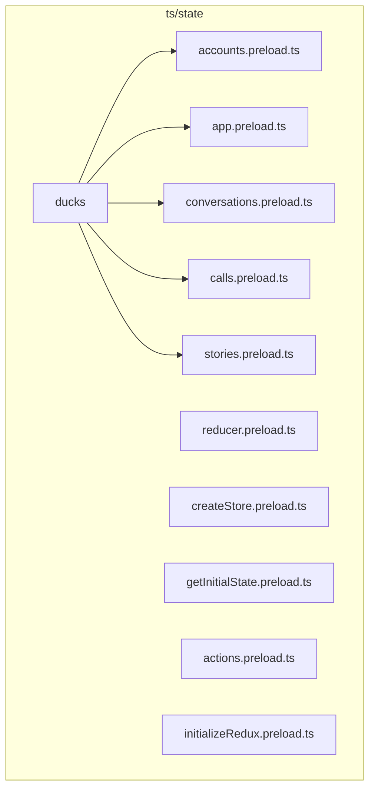

**图示来源**  
- [reducer.preload.ts](file://ts/state/reducer.preload.ts#L1-L85)
- [createStore.preload.ts](file://ts/state/createStore.preload.ts#L1-L96)

**本节来源**  
- [ts/state](file://ts/state)

## 核心组件
Signal-Desktop的Redux架构由几个核心组件构成：reducer组合器、store创建器、初始状态生成器和action分发器。这些组件协同工作，构建了一个可扩展且易于维护的状态管理系统。

**本节来源**  
- [reducer.preload.ts](file://ts/state/reducer.preload.ts#L1-L85)
- [createStore.preload.ts](file://ts/state/createStore.preload.ts#L1-L96)
- [getInitialState.preload.ts](file://ts/state/getInitialState.preload.ts#L1-L248)

## 架构概述
Signal-Desktop采用基于ducks模式的模块化Redux架构，将应用程序状态划分为多个独立的切片。每个切片负责管理特定业务领域的状态，通过根reducer组合成完整的状态树。

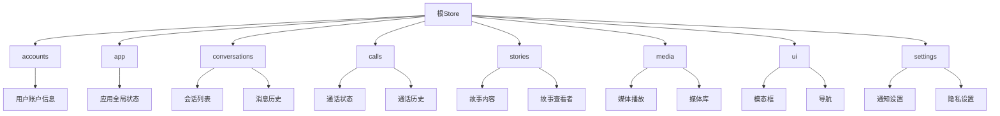

**图示来源**  
- [reducer.preload.ts](file://ts/state/reducer.preload.ts#L44-L82)
- [ducks](file://ts/state/ducks)

## 详细组件分析
### Ducks模式设计
Signal-Desktop采用ducks模式组织Redux模块，每个模块包含action类型、action creator和reducer。这种模式将相关逻辑组织在一起，提高了代码的可维护性和可理解性。

```mermaid
classDiagram
class DuckModule {
+string ACTION_TYPE_1
+string ACTION_TYPE_2
+actionCreator1(payload)
+actionCreator2(payload)
+reducer(state, action)
+getEmptyState()
}
DuckModule <|-- AccountsDuck
DuckModule <|-- ConversationsDuck
DuckModule <|-- StoriesDuck
DuckModule <|-- CallingDuck
AccountsDuck --> "用户认证状态"
ConversationsDuck --> "会话和消息状态"
StoriesDuck --> "故事状态"
CallingDuck --> "通话状态"
```

**图示来源**  
- [ducks/accounts.preload.ts](file://ts/state/ducks/accounts.preload.ts)
- [ducks/conversations.preload.ts](file://ts/state/ducks/conversations.preload.ts)
- [ducks/stories.preload.ts](file://ts/state/ducks/stories.preload.ts)
- [ducks/calling.preload.ts](file://ts/state/ducks/calling.preload.ts)

**本节来源**  
- [ducks](file://ts/state/ducks)

### 根Reducer组合机制
根reducer通过combineReducers函数将各个模块的reducer组合成一个统一的reducer。这种组合方式使得状态树的结构清晰，便于管理和调试。

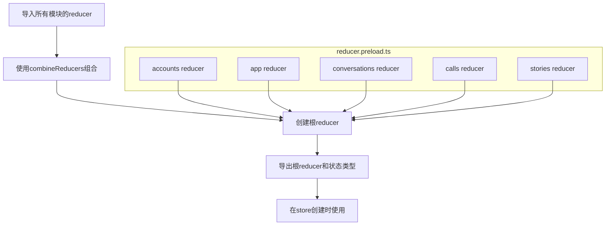

**图示来源**  
- [reducer.preload.ts](file://ts/state/reducer.preload.ts#L6-L82)

**本节来源**  
- [reducer.preload.ts](file://ts/state/reducer.preload.ts#L1-L85)

### Store创建流程
Store的创建流程包括中间件配置、增强器应用和初始状态注入。Signal-Desktop使用了redux-promise-middleware、thunk和自定义中间件来处理异步操作和副作用。

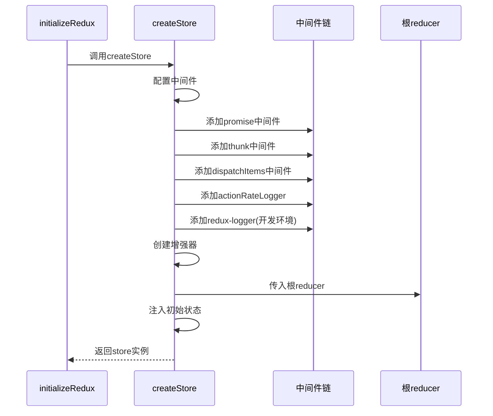

**图示来源**  
- [createStore.preload.ts](file://ts/state/createStore.preload.ts#L81-L87)
- [initializeRedux.preload.ts](file://ts/state/initializeRedux.preload.ts#L42-L45)

**本节来源**  
- [createStore.preload.ts](file://ts/state/createStore.preload.ts#L1-L96)
- [initializeRedux.preload.ts](file://ts/state/initializeRedux.preload.ts#L1-L119)

### 业务模块状态切片
Signal-Desktop将应用程序状态划分为多个业务模块，每个模块负责管理特定领域的状态。这种模块化设计使得状态管理更加清晰和可维护。

#### 会话模块
会话模块管理所有与会话相关的状态，包括会话列表、消息历史、联系人信息等。

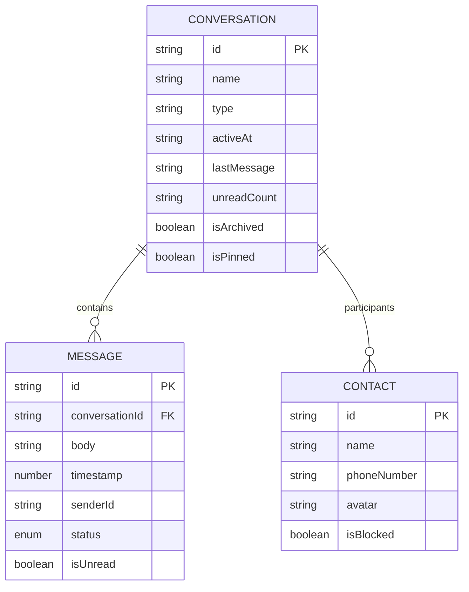

**图示来源**  
- [ducks/conversations.preload.ts](file://ts/state/ducks/conversations.preload.ts#L165-L186)
- [model-types.d.ts](file://ts/model-types.d.ts)

**本节来源**  
- [ducks/conversations.preload.ts](file://ts/state/ducks/conversations.preload.ts#L1-L200)

#### 通话模块
通话模块管理所有与通话相关的状态，包括当前通话、通话历史、设备设置等。

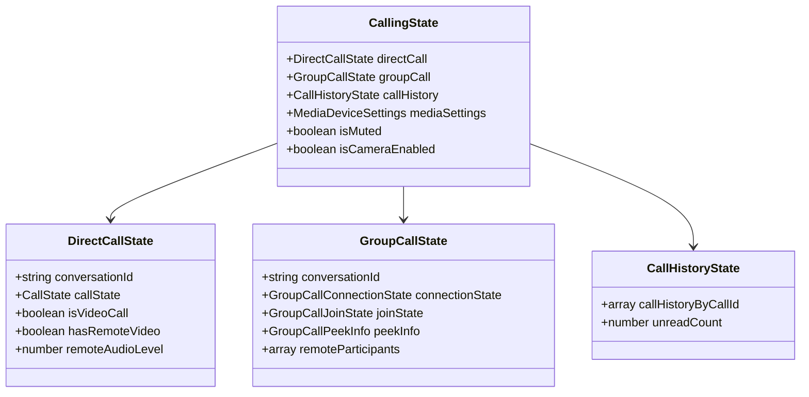

**图示来源**  
- [ducks/calling.preload.ts](file://ts/state/ducks/calling.preload.ts#L139-L200)
- [ducks/callHistory.preload.ts](file://ts/state/ducks/callHistory.preload.ts)

**本节来源**  
- [ducks/calling.preload.ts](file://ts/state/ducks/calling.preload.ts#L1-L200)

#### 故事模块
故事模块管理所有与故事相关的状态，包括故事内容、查看者列表、发送状态等。

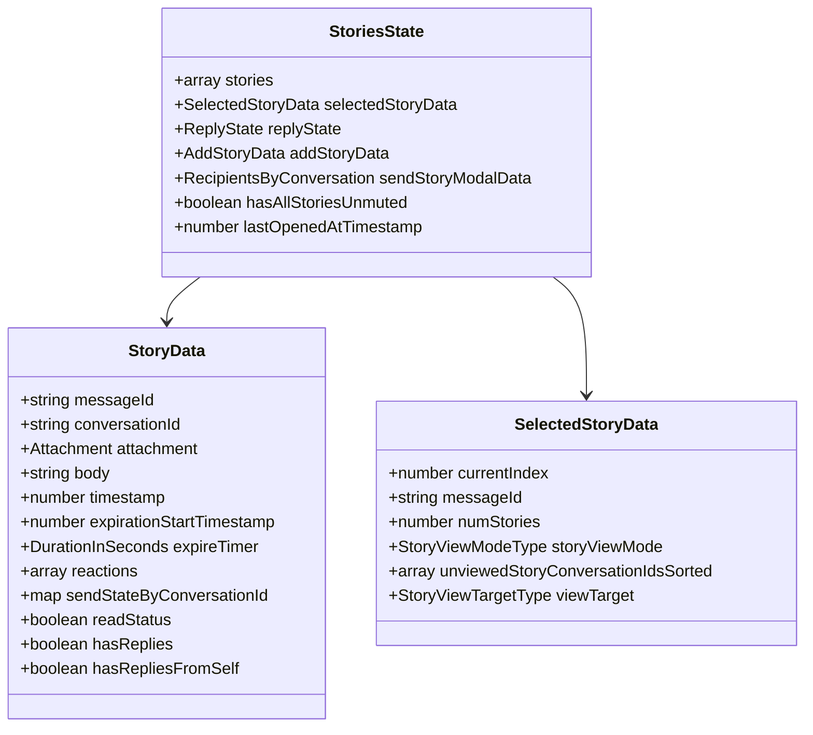

**图示来源**  
- [ducks/stories.preload.ts](file://ts/state/ducks/stories.preload.ts#L165-L176)
- [types/Stories.std.js](file://ts/types/Stories.std.js)

**本节来源**  
- [ducks/stories.preload.ts](file://ts/state/ducks/stories.preload.ts#L1-L200)

### 中间件配置
Signal-Desktop配置了多个中间件来处理不同的任务，包括异步操作、副作用处理和性能监控。

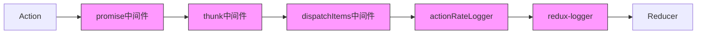

**图示来源**  
- [createStore.preload.ts](file://ts/state/createStore.preload.ts#L81-L87)
- [shims/dispatchItemsMiddleware.preload.js](file://ts/shims/dispatchItemsMiddleware.preload.js)

**本节来源**  
- [createStore.preload.ts](file://ts/state/createStore.preload.ts#L1-L96)

### 初始状态加载
初始状态的加载通过getInitialState函数实现，该函数从持久化存储和其他服务中获取初始数据，并与空状态合并。

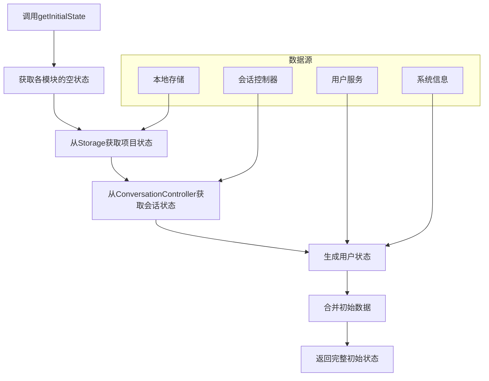

**图示来源**  
- [getInitialState.preload.ts](file://ts/state/getInitialState.preload.ts#L67-L126)
- [Storage.preload.js](file://ts/textsecure/Storage.preload.js)
- [ConversationController.preload.js](file://ts/ConversationController.preload.js)

**本节来源**  
- [getInitialState.preload.ts](file://ts/state/getInitialState.preload.ts#L1-L248)

## 依赖分析
Signal-Desktop的Redux架构依赖于多个外部库和内部服务，这些依赖关系确保了状态管理系统的完整性和功能性。

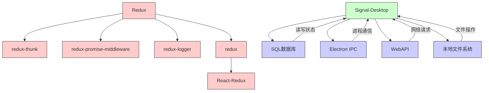

**图示来源**  
- [package.json](file://package.json)
- [createStore.preload.ts](file://ts/state/createStore.preload.ts#L7-L8)
- [getInitialState.preload.ts](file://ts/state/getInitialState.preload.ts#L10-L11)

**本节来源**  
- [package.json](file://package.json)
- [ts/state](file://ts/state)

## 性能考虑
Signal-Desktop在Redux架构设计中考虑了多个性能优化点，包括action频率监控、选择器优化和状态更新策略。

### Action频率监控
通过actionRateLogger中间件监控action的频率，防止过多的action导致性能问题。

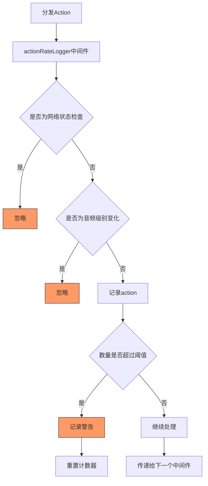

**图示来源**  
- [createStore.preload.ts](file://ts/state/createStore.preload.ts#L50-L78)
- [environment.std.js](file://ts/environment.std.js)

**本节来源**  
- [createStore.preload.ts](file://ts/state/createStore.preload.ts#L1-L96)

## 故障排除指南
### 状态更新问题
当遇到状态更新问题时，可以检查以下几个方面：

1. **Action类型是否正确**：确保action的type字段与reducer中处理的类型匹配
2. **Reducer是否纯函数**：确保reducer没有副作用，总是返回新的状态对象
3. **中间件配置**：检查中间件链是否正确配置，没有阻止action传递

### 初始状态加载失败
如果初始状态加载失败，可以检查：

1. **存储服务是否可用**：确保Storage服务已正确初始化
2. **数据迁移是否完成**：检查数据库迁移是否成功完成
3. **权限是否足够**：确保应用程序有足够的权限访问所需资源

**本节来源**  
- [initializeRedux.preload.ts](file://ts/state/initializeRedux.preload.ts#L42-L46)
- [getInitialState.preload.ts](file://ts/state/getInitialState.preload.ts#L87-L89)

## 结论
Signal-Desktop的Redux架构采用了成熟的ducks模式，实现了模块化、可扩展的状态管理。通过合理的中间件配置、初始状态加载机制和性能优化策略，该架构为应用程序提供了稳定可靠的状态管理基础。各业务模块的状态切片设计清晰，命名规范统一，便于维护和扩展。整体架构体现了高内聚、低耦合的设计原则，为大型应用程序的状态管理提供了优秀的实践范例。