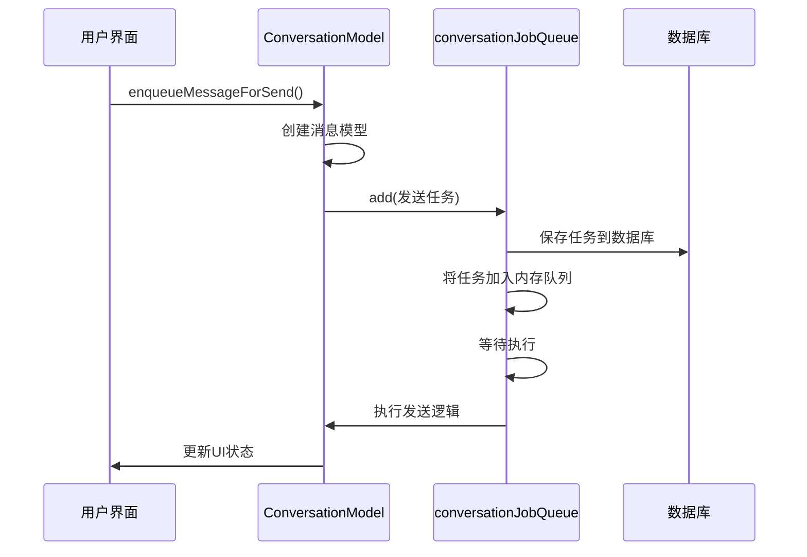
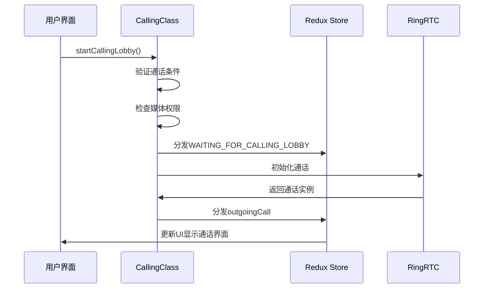
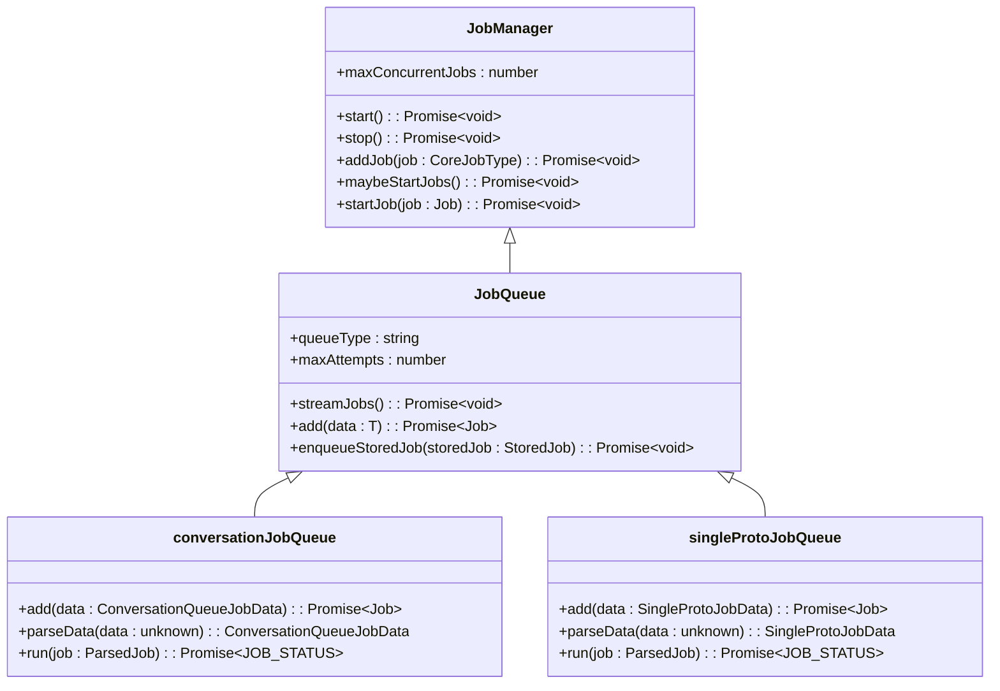

# 异步操作处理

<cite>
**Referenced Files in This Document**   
- [conversations.preload.ts](file://ts/models/conversations.preload.ts)
- [conversations.preload.ts](file://ts/state/ducks/conversations.preload.ts)
- [calling.preload.ts](file://ts/services/calling.preload.ts)
- [calling.preload.ts](file://ts/state/ducks/calling.preload.ts)
- [JobManager.std.ts](file://ts/jobs/JobManager.std.ts)
- [JobQueue.std.ts](file://ts/jobs/JobQueue.std.ts)
- [conversationJobQueue.preload.ts](file://ts/jobs/conversationJobQueue.preload.ts)
- [singleProtoJobQueue.preload.ts](file://ts/jobs/singleProtoJobQueue.preload.ts)
- [createStore.preload.ts](file://ts/state/createStore.preload.ts)
</cite>

## 目录
1. [简介](#简介)
2. [基于Redux的异步操作管理模式](#基于redux的异步操作管理模式)
3. [消息发送流程分析](#消息发送流程分析)
4. [通话控制逻辑分析](#通话控制逻辑分析)
5. [任务队列管理机制](#任务队列管理机制)
6. [异步操作状态管理](#异步操作状态管理)
7. [错误处理策略](#错误处理策略)
8. [任务去重与并发控制](#任务去重与并发控制)
9. [性能优化建议](#性能优化建议)
10. [结论](#结论)

## 简介
Signal-Desktop应用采用基于Redux的异步操作管理模式，通过action creators触发异步任务并更新应用状态。该系统核心由Redux状态管理、thunk中间件和自定义任务队列组成，确保异步操作的可靠执行和状态一致性。应用中的关键异步操作包括消息发送、通话控制和后台任务处理，这些操作通过精心设计的任务队列系统进行管理，以保证操作的顺序性和可靠性。

**Section sources**
- [createStore.preload.ts](file://ts/state/createStore.preload.ts#L81-L87)

## 基于Redux的异步操作管理模式
Signal-Desktop使用Redux作为核心状态管理框架，结合thunk中间件处理异步操作。在`createStore.preload.ts`中配置了包含`promise`、`thunk`和自定义中间件的中间件链，为异步操作提供了基础支持。action creators返回thunk函数，这些函数可以访问Redux store的dispatch和getState方法，从而在异步操作完成后分发适当的状态更新action。

异步操作通过定义pending、success和error等状态来管理操作生命周期。当触发异步操作时，首先分发一个pending action，更新UI显示加载状态；操作成功后分发success action更新最终状态；若操作失败则分发error action处理错误情况。这种模式确保了UI与应用状态的同步，为用户提供清晰的操作反馈。

**Section sources**
- [createStore.preload.ts](file://ts/state/createStore.preload.ts#L81-L87)

## 消息发送流程分析
消息发送流程始于`conversations.preload.ts`中的`enqueueMessageForSend`方法，该方法负责准备消息数据并将其加入发送队列。当用户发送消息时，系统首先创建消息模型，设置必要的属性如时间戳、会话ID和消息内容，然后通过`conversationJobQueue.add`方法将消息发送任务加入队列。

**Diagram sources **
- [conversations.preload.ts](file://ts/models/conversations.preload.ts#L4081-L4290)
- [conversationJobQueue.preload.ts](file://ts/jobs/conversationJobQueue.preload.ts#L477-L491)

**Section sources**
- [conversations.preload.ts](file://ts/models/conversations.preload.ts#L4081-L4290)
- [conversations.preload.ts](file://ts/state/ducks/conversations.preload.ts#L2561-L2713)

## 通话控制逻辑分析
通话控制逻辑在`calling.preload.ts`中实现，通过`CallingClass`管理通话的整个生命周期。当用户发起通话时，`startCallingLobby`方法被调用，该方法首先验证通话条件，检查用户权限，然后初始化通话设置。系统通过Redux action更新通话状态，通知UI层显示相应的通话界面。

**Diagram sources **
- [calling.preload.ts](file://ts/services/calling.preload.ts#L642-L800)
- [calling.preload.ts](file://ts/state/ducks/calling.preload.ts#L764-L784)

**Section sources**
- [calling.preload.ts](file://ts/services/calling.preload.ts#L642-L800)
- [calling.preload.ts](file://ts/state/ducks/calling.preload.ts#L764-L784)

## 任务队列管理机制
Signal-Desktop使用分层的任务队列系统管理异步操作，核心组件是`JobManager`和`JobQueue`。`JobManager`提供任务调度和并发控制，而`JobQueue`负责具体任务的排队和执行。系统实现了多种专用任务队列，如`conversationJobQueue`用于消息相关操作，`singleProtoJobQueue`用于单个协议消息发送。

任务队列采用内存队列与持久化存储结合的方式，确保任务在应用重启后仍能继续执行。每个任务在添加到队列时都会被持久化到数据库，然后加入内存中的PQueue实例等待执行。系统通过`streamJobs`方法从数据库流式读取任务并加入内存队列，实现高效的任务处理。

**Diagram sources **
- [JobManager.std.ts](file://ts/jobs/JobManager.std.ts#L80-L490)
- [JobQueue.std.ts](file://ts/jobs/JobQueue.std.ts#L59-L388)
- [conversationJobQueue.preload.ts](file://ts/jobs/conversationJobQueue.preload.ts#L454-L800)
- [singleProtoJobQueue.preload.ts](file://ts/jobs/singleProtoJobQueue.preload.ts#L38-L148)

**Section sources**
- [JobManager.std.ts](file://ts/jobs/JobManager.std.ts#L80-L490)
- [JobQueue.std.ts](file://ts/jobs/JobQueue.std.ts#L59-L388)
- [conversationJobQueue.preload.ts](file://ts/jobs/conversationJobQueue.preload.ts#L454-L800)
- [singleProtoJobQueue.preload.ts](file://ts/jobs/singleProtoJobQueue.preload.ts#L38-L148)

## 异步操作状态管理
异步操作的状态管理通过Redux状态树实现，每个异步操作都有明确的生命周期状态。系统使用pending、success和error三种基本状态来表示操作的不同阶段。在`conversations.preload.ts`和`calling.preload.ts`中定义了相应的action类型和reducer函数，用于处理状态转换。

对于长时间运行的操作，系统还实现了更细粒度的状态管理。例如，通话操作有Active、Waiting等多种状态，通过`activeCallState`字段在Redux store中维护。消息发送操作则通过`sendStateByConversationId`跟踪每个消息的发送状态，包括发送中、已发送、发送失败等。

**Section sources**
- [conversations.preload.ts](file://ts/state/ducks/conversations.preload.ts#L702-L717)
- [calling.preload.ts](file://ts/state/ducks/calling.preload.ts#L202-L224)

## 错误处理策略
Signal-Desktop实现了全面的错误处理策略，确保异步操作的可靠性和用户体验。系统采用重试机制处理临时性错误，通过指数退避算法控制重试间隔，避免对服务器造成过大压力。在`JobManager`中实现了`#retryJobLater`方法，根据任务的尝试次数计算适当的重试延迟。

对于可恢复错误，系统会自动重试操作；对于不可恢复错误，则会分发相应的error action，触发UI层的错误处理逻辑。系统还实现了挑战处理机制，当遇到需要用户验证的情况时，会暂停相关任务队列，等待用户完成验证后再继续执行。

**Section sources**
- [JobManager.std.ts](file://ts/jobs/JobManager.std.ts#L359-L374)
- [conversationJobQueue.preload.ts](file://ts/jobs/conversationJobQueue.preload.ts#L612-L686)

## 任务去重与并发控制
任务去重与并发控制是Signal-Desktop异步操作处理的关键特性。系统通过`JobManager`的`#activeJobs` Map跟踪正在执行的任务，防止同一任务被重复执行。在`_addJob`方法中，系统会检查任务是否已在运行，如果是则直接返回，避免重复处理。

并发控制通过`maxConcurrentJobs`配置和PQueue库实现。系统限制同时执行的任务数量，防止资源过度消耗。对于会话相关的操作，系统使用基于会话ID的内存队列，确保同一会话的操作按顺序执行，维护操作的原子性和一致性。

**Section sources**
- [JobManager.std.ts](file://ts/jobs/JobManager.std.ts#L82-L84)
- [JobManager.std.ts](file://ts/jobs/JobManager.std.ts#L178-L214)

## 性能优化建议
为优化异步操作处理的性能，建议实施以下策略：首先，实现任务批处理机制，将多个小任务合并为批量操作，减少数据库I/O开销。其次，引入任务优先级调度，为高优先级任务（如实时通话信令）分配更多资源，确保关键操作的及时响应。

资源管理方面，建议实现更精细的内存控制，及时清理已完成任务的资源引用，防止内存泄漏。同时，优化数据库查询，为任务队列相关的表添加适当的索引，提高任务检索效率。对于长时间运行的任务，可考虑实现进度报告机制，向用户反馈操作进展，提升用户体验。

**Section sources**
- [JobManager.std.ts](file://ts/jobs/JobManager.std.ts#L380-L385)
- [JobQueue.std.ts](file://ts/jobs/JobQueue.std.ts#L76-L77)

## 结论
Signal-Desktop的异步操作处理机制设计精良，通过Redux状态管理、thunk中间件和自定义任务队列的组合，实现了可靠、高效的异步操作处理。系统在消息发送、通话控制和后台任务管理方面表现出色，具备完善的错误处理、重试机制和状态管理。通过进一步优化任务批处理、优先级调度和资源管理，可进一步提升应用性能和用户体验。