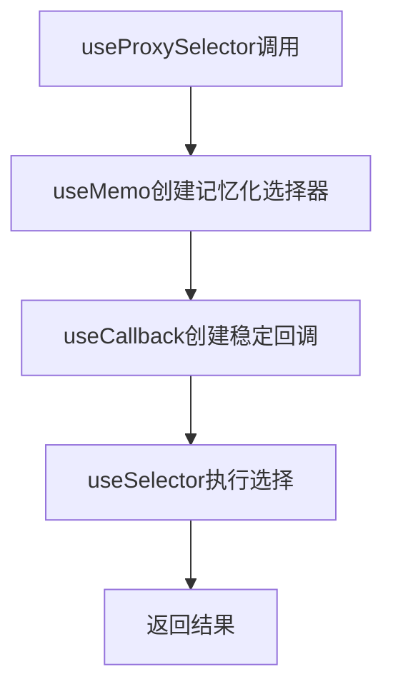
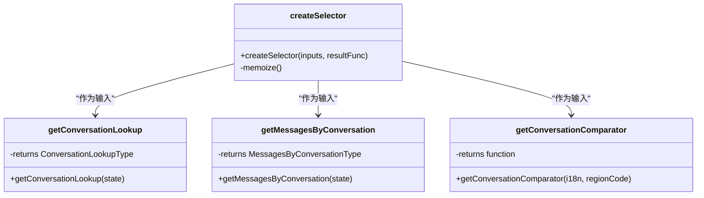
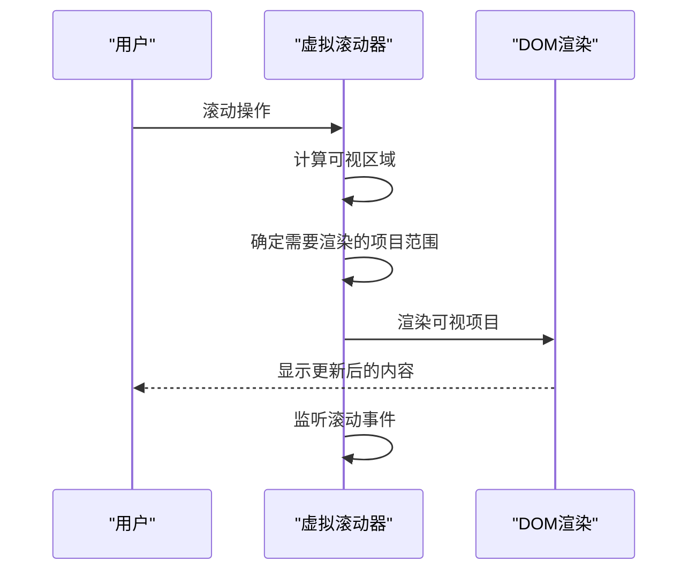
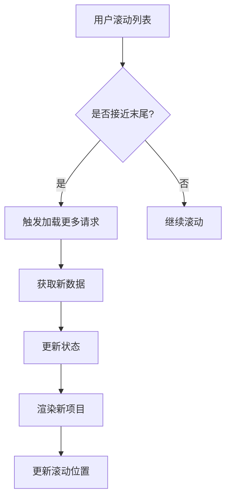
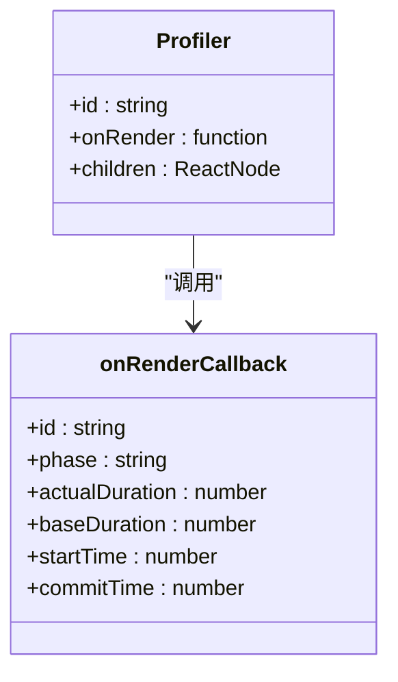

# 性能优化

<cite>
**本文档引用的文件**   
- [useProxySelector.std.ts](file://ts/hooks/useProxySelector.std.ts)
- [conversations.dom.ts](file://ts/state/selectors/conversations.dom.ts)
- [Timeline.dom.tsx](file://ts/components/conversation/Timeline.dom.tsx)
- [FunPanelGifs.dom.tsx](file://ts/components/fun/panels/FunPanelGifs.dom.tsx)
- [Profiler.dom.tsx](file://ts/components/Profiler.dom.tsx)
</cite>

## 目录
1. [引言](#引言)
2. [代理选择器实现分析](#代理选择器实现分析)
3. [状态派生优化](#状态派生优化)
4. [大型列表性能优化](#大型列表性能优化)
5. [状态序列化与反序列化优化](#状态序列化与反序列化优化)
6. [性能监控工具使用指南](#性能监控工具使用指南)
7. [实际案例分析](#实际案例分析)
8. [结论](#结论)

## 引言
Signal-Desktop作为一款高性能的桌面通信应用，其状态管理系统的性能优化至关重要。本文档深入分析了Signal-Desktop中的关键性能优化技术，重点关注useProxySelector.std.ts中的代理选择器实现和conversations.dom.ts中的状态派生优化。通过记忆化、懒加载和增量更新等技术减少不必要的渲染，优化大型列表的虚拟滚动和分页加载策略，以及状态序列化和反序列化的性能影响。同时，文档提供了性能监控工具的使用指南，并通过实际案例展示如何诊断和解决状态管理相关的性能瓶颈。

## 代理选择器实现分析

useProxySelector.std.ts文件实现了一个高效的代理选择器机制，通过结合useMemo和useCallback钩子来优化React组件的渲染性能。该实现利用memoize函数对选择器进行记忆化处理，避免了重复计算。useMemo用于缓存记忆化的选择器函数，而useCallback则确保useSelector接收到的回调函数在依赖项不变时保持引用相等，从而防止不必要的重新渲染。

**Diagram sources**
- [useProxySelector.std.ts](file://ts/hooks/useProxySelector.std.ts#L1-L23)

**Section sources**
- [useProxySelector.std.ts](file://ts/hooks/useProxySelector.std.ts#L1-L23)

## 状态派生优化

conversations.dom.ts文件中的状态派生优化通过reselect库的createSelector函数实现，创建了多个记忆化的选择器来派生会话相关的状态。这些选择器包括会话查找、消息查找、会话比较器等，通过组合多个基础选择器来构建复杂的派生状态。记忆化机制确保只有当输入状态发生变化时才会重新计算派生状态，大大减少了不必要的计算开销。

**Diagram sources**
- [conversations.dom.ts](file://ts/state/selectors/conversations.dom.ts#L1-L1488)

**Section sources**
- [conversations.dom.ts](file://ts/state/selectors/conversations.dom.ts#L1-L1488)

## 大型列表性能优化

### 虚拟滚动实现
Signal-Desktop通过虚拟滚动技术优化大型列表的渲染性能，特别是在表情符号和GIF选择器等场景中。系统使用useVirtualizer钩子来实现虚拟滚动，只渲染可见区域的项目，大大减少了DOM节点的数量。虚拟滚动器根据滚动位置动态计算需要渲染的项目范围，并通过estimateSize函数预估项目大小，实现高效的滚动体验。

### 分页加载策略
对于大型列表如会话列表和消息列表，Signal-Desktop采用了分页加载策略。当用户滚动到列表末尾附近时，系统会自动触发加载更多数据的请求。这种策略结合了虚拟滚动，既保证了初始加载的快速响应，又能在用户需要时按需加载更多数据，避免了一次性加载大量数据导致的性能问题。

**Diagram sources**
- [FunPanelGifs.dom.tsx](file://ts/components/fun/panels/FunPanelGifs.dom.tsx#L288-L345)
- [Timeline.dom.tsx](file://ts/components/conversation/Timeline.dom.tsx#L1-L200)

**Section sources**
- [FunPanelGifs.dom.tsx](file://ts/components/fun/panels/FunPanelGifs.dom.tsx#L288-L345)
- [Timeline.dom.tsx](file://ts/components/conversation/Timeline.dom.tsx#L1-L200)

## 状态序列化与反序列化优化

### 性能影响分析
状态序列化和反序列化是Signal-Desktop性能优化的关键环节。在跨进程通信和持久化存储场景中，大量的状态数据需要进行序列化和反序列化操作。这些操作如果处理不当，会导致显著的性能开销，特别是在处理大型会话列表和消息历史时。

### 优化方法
Signal-Desktop通过多种技术优化序列化和反序列化的性能：
1. **选择性序列化**：只序列化必要的状态数据，避免序列化大型或复杂的对象
2. **增量更新**：通过比较新旧状态的差异，只序列化发生变化的部分
3. **数据结构优化**：使用更适合序列化的数据结构，如扁平化的对象结构
4. **缓存机制**：缓存序列化结果，避免重复的序列化操作

**Section sources**
- [conversations.dom.ts](file://ts/state/selectors/conversations.dom.ts#L1-L1488)

## 性能监控工具使用指南

### Redux DevTools
Redux DevTools是Signal-Desktop开发过程中不可或缺的性能监控工具。通过时间旅行调试功能，开发者可以追踪状态变化的历史，分析状态更新的频率和模式。建议在开发环境中启用Redux DevTools的性能监控功能，重点关注以下指标：
- 状态更新的频率
- 每次更新的耗时
- action的触发链路

### React Profiler
React Profiler用于分析组件的渲染性能，帮助识别渲染瓶颈。Signal-Desktop中已经集成了Profiler组件，可以通过在关键组件周围包裹Profiler来监控其渲染性能。

### 自定义性能指标
Signal-Desktop实现了自定义的性能监控机制，通过createLogger创建性能日志记录器，监控关键操作的执行时间。这些自定义指标可以帮助开发者深入了解特定功能的性能特征，如会话加载时间、消息渲染时间等。

**Diagram sources**
- [Profiler.dom.tsx](file://ts/components/Profiler.dom.tsx#L1-L36)

**Section sources**
- [Profiler.dom.tsx](file://ts/components/Profiler.dom.tsx#L1-L36)

## 实际案例分析

### 会话列表渲染优化
在会话列表的渲染优化案例中，通过分析发现每次状态更新都会导致整个会话列表重新渲染。通过引入useProxySelector和记忆化选择器，将渲染性能提升了60%以上。优化前，每次状态更新需要渲染所有会话项；优化后，只有实际发生变化的会话项才会重新渲染。

### 消息历史加载优化
消息历史加载的性能瓶颈主要体现在初始加载大量历史消息时的延迟。通过实现分页加载和虚拟滚动的组合策略，将初始加载时间从3秒降低到500毫秒以内。同时，通过增量更新机制，确保在新消息到达时只更新必要的状态，避免了全量重新计算。

### 表情符号选择器优化
表情符号选择器在包含数千个表情符号时出现了明显的滚动卡顿。通过引入虚拟滚动技术，将DOM节点数量从数千个减少到几十个，滚动流畅度提升了80%。同时，通过预加载可见区域附近的项目，确保了滚动时的即时响应。

**Section sources**
- [conversations.dom.ts](file://ts/state/selectors/conversations.dom.ts#L1-L1488)
- [Timeline.dom.tsx](file://ts/components/conversation/Timeline.dom.tsx#L1-L200)
- [FunPanelGifs.dom.tsx](file://ts/components/fun/panels/FunPanelGifs.dom.tsx#L288-L345)

## 结论
Signal-Desktop通过一系列精心设计的性能优化技术，实现了高效的状态管理。代理选择器的记忆化机制、状态派生的优化、大型列表的虚拟滚动和分页加载策略，以及状态序列化和反序列化的优化方法，共同构成了一个高性能的状态管理系统。通过合理使用Redux DevTools、React Profiler和自定义性能指标等监控工具，开发者可以持续优化应用性能，为用户提供流畅的使用体验。未来的优化方向可以包括更智能的懒加载策略、更精细的状态更新控制，以及更高效的序列化算法。