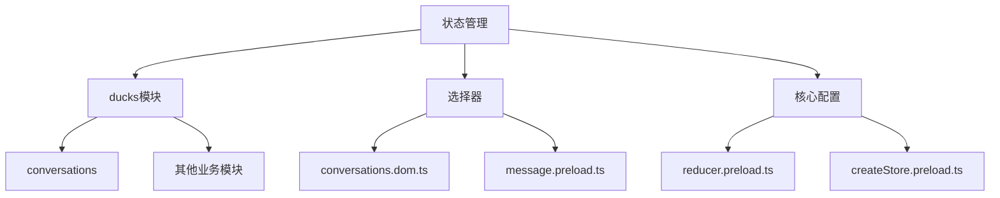
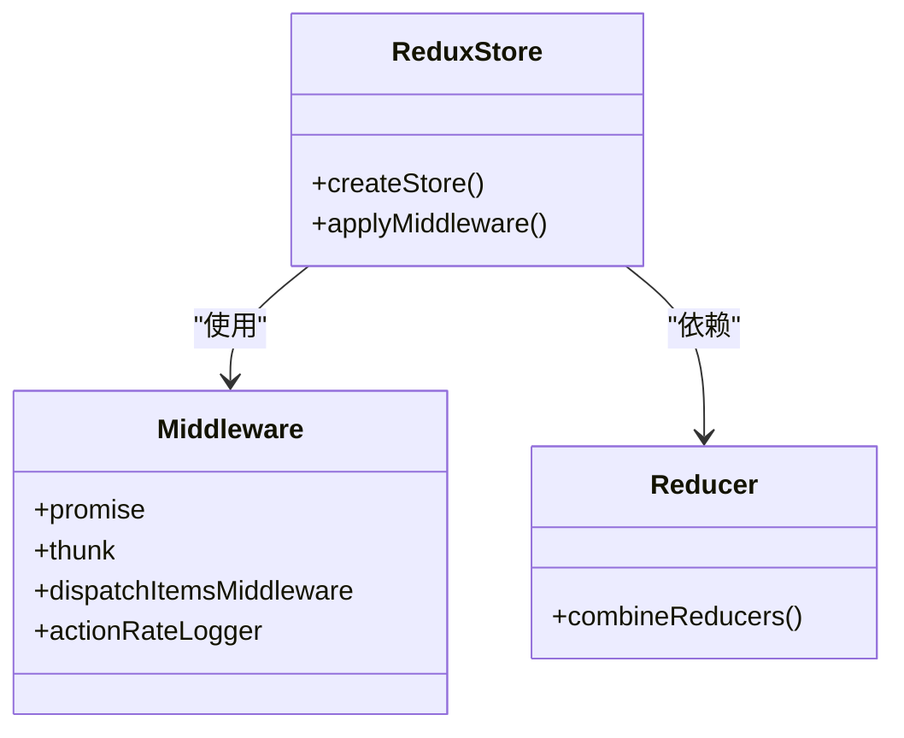
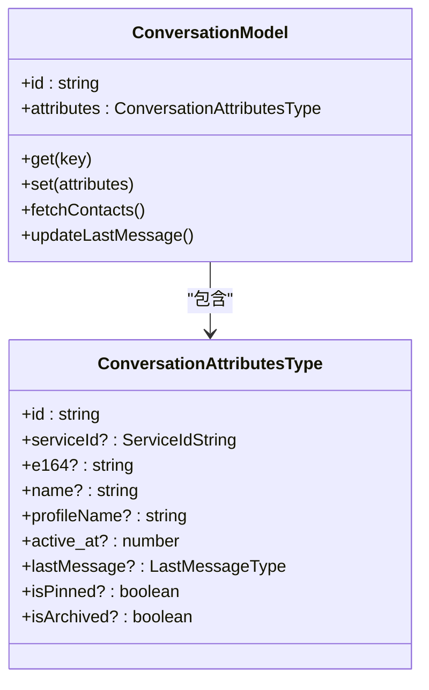
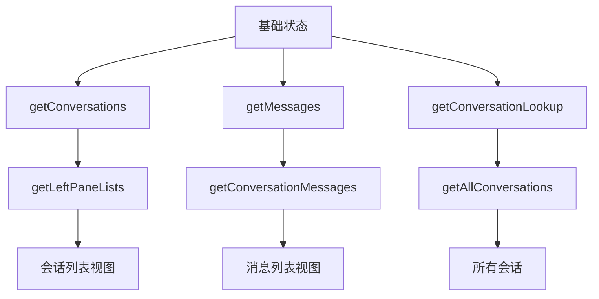
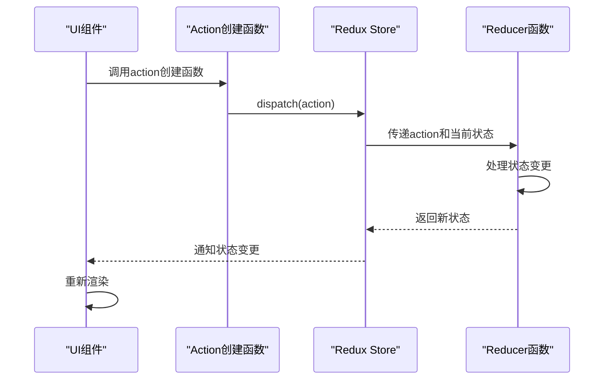
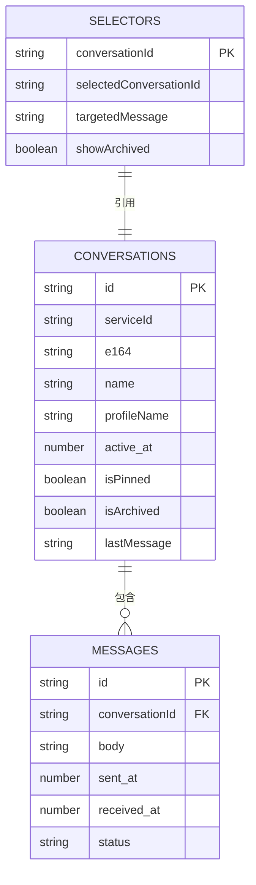
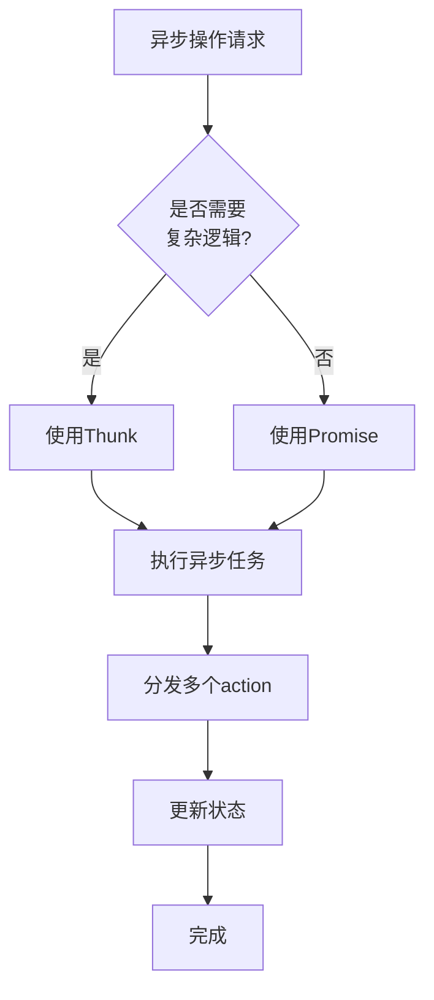
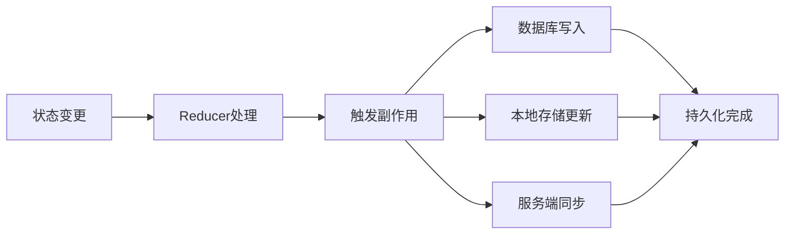
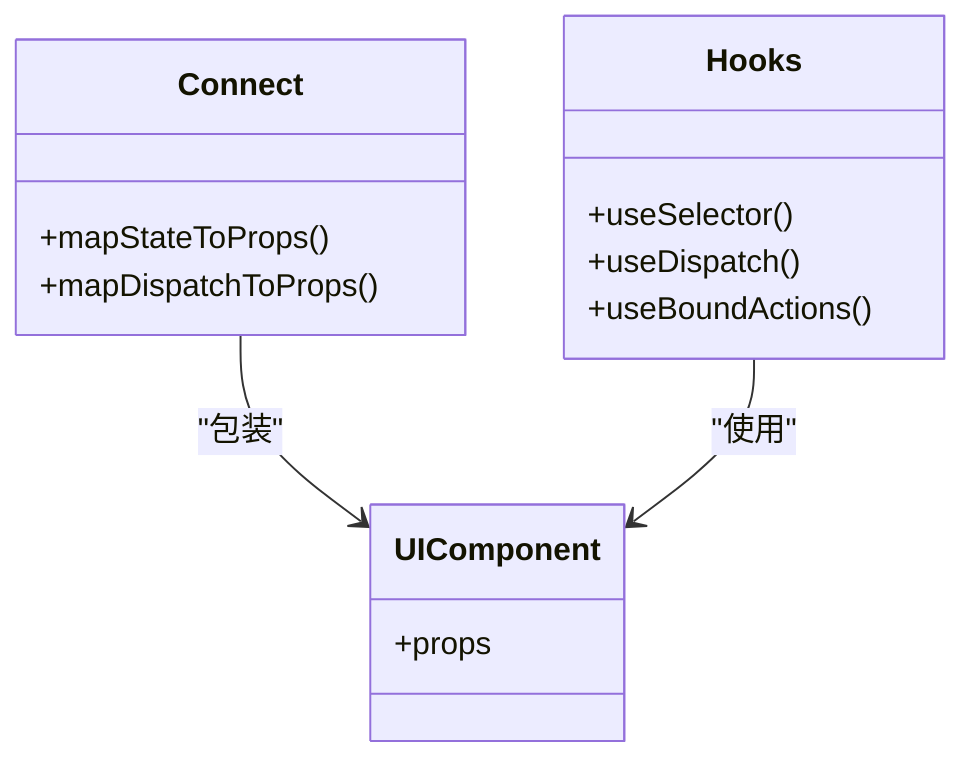
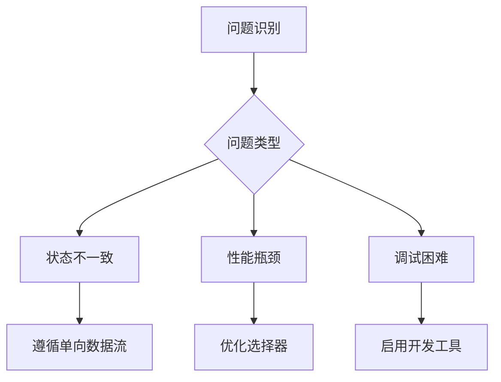

# 状态管理

<cite>
**本文档引用的文件**   
- [conversations.preload.ts](file://ts/models/conversations.preload.ts)
- [conversations.preload.ts](file://ts/state/ducks/conversations.preload.ts)
- [reducer.preload.ts](file://ts/state/reducer.preload.ts)
- [createStore.preload.ts](file://ts/state/createStore.preload.ts)
- [conversations.dom.ts](file://ts/state/selectors/conversations.dom.ts)
- [message.preload.ts](file://ts/state/selectors/message.preload.ts)
</cite>

## 目录
1. [项目结构](#项目结构)
2. [核心状态管理架构](#核心状态管理架构)
3. [会话状态管理](#会话状态管理)
4. [选择器与状态派生](#选择器与状态派生)
5. [动作与状态变更流程](#动作与状态变更流程)
6. [状态树结构](#状态树结构)
7. [异步操作与中间件](#异步操作与中间件)
8. [状态持久化机制](#状态持久化机制)
9. [UI组件连接方式](#ui组件连接方式)
10. [常见问题与解决方案](#常见问题与解决方案)

## 项目结构

Signal-Desktop项目采用基于Redux的全局状态管理架构，核心状态管理文件位于`ts/state`目录下。该架构通过ducks模式组织reducer和action，实现了模块化的状态管理。主要组件包括：
- `ducks/`目录：包含各个业务模块的状态管理逻辑
- `selectors/`目录：包含状态选择器函数
- 核心配置文件：`reducer.preload.ts`和`createStore.preload.ts`

**Diagram sources**
- [reducer.preload.ts](file://ts/state/reducer.preload.ts)
- [createStore.preload.ts](file://ts/state/createStore.preload.ts)

**Section sources**
- [reducer.preload.ts](file://ts/state/reducer.preload.ts)
- [createStore.preload.ts](file://ts/state/createStore.preload.ts)

## 核心状态管理架构

Signal-Desktop采用Redux作为全局状态管理解决方案，通过ducks模式实现模块化设计。该架构将action类型、action创建函数和reducer逻辑封装在单个文件中，提高了代码的可维护性和可读性。

状态管理的核心配置在`reducer.preload.ts`文件中，使用`combineReducers`将各个模块的reducer合并为一个根reducer。`createStore.preload.ts`文件负责创建Redux store，配置了包括redux-promise-middleware、thunk在内的多个中间件。

**Diagram sources**
- [reducer.preload.ts](file://ts/state/reducer.preload.ts)
- [createStore.preload.ts](file://ts/state/createStore.preload.ts)

**Section sources**
- [reducer.preload.ts](file://ts/state/reducer.preload.ts)
- [createStore.preload.ts](file://ts/state/createStore.preload.ts)

## 会话状态管理

会话状态管理是Signal-Desktop状态管理的核心部分，主要由`conversations.preload.ts`文件实现。该模块负责管理所有会话相关的状态，包括会话列表、消息记录、用户信息等。

`ConversationModel`类是会话状态管理的基础，它封装了会话的所有属性和行为。该类提供了丰富的getter和setter方法，用于访问和修改会话状态。同时，它还实现了属性变更的监听机制，当会话属性发生变化时会自动触发相应的处理逻辑。

**Diagram sources**
- [conversations.preload.ts](file://ts/models/conversations.preload.ts)

**Section sources**
- [conversations.preload.ts](file://ts/models/conversations.preload.ts)

## 选择器与状态派生

状态选择器是Signal-Desktop状态管理的重要组成部分，它们负责从全局状态树中提取和派生所需的数据。选择器使用reselect库实现，具有记忆化功能，可以避免不必要的计算。

`conversations.dom.ts`文件包含了大量会话相关的选择器函数，如`getConversations`、`getMessages`、`getConversationLookup`等。这些选择器通过`createSelector`创建，可以组合多个基础选择器来生成复杂的派生状态。

**Diagram sources**
- [conversations.dom.ts](file://ts/state/selectors/conversations.dom.ts)

**Section sources**
- [conversations.dom.ts](file://ts/state/selectors/conversations.dom.ts)

## 动作与状态变更流程

Signal-Desktop的状态变更通过Redux的action-reducer模式实现。`conversations.preload.ts`文件定义了大量action类型和action创建函数，涵盖了会话管理的各个方面。

每个action类型都有对应的reducer处理函数，当dispatch一个action时，reducer会根据action类型更新相应的状态。对于复杂的异步操作，使用thunk中间件创建异步action，这些action可以包含多个同步action的dispatch操作。

**Diagram sources**
- [conversations.preload.ts](file://ts/state/ducks/conversations.preload.ts)

**Section sources**
- [conversations.preload.ts](file://ts/state/ducks/conversations.preload.ts)

## 状态树结构

Signal-Desktop的状态树采用扁平化的结构设计，主要分为以下几个顶级模块：

**Diagram sources**
- [conversations.preload.ts](file://ts/state/ducks/conversations.preload.ts)

**Section sources**
- [conversations.preload.ts](file://ts/state/ducks/conversations.preload.ts)

## 异步操作与中间件

Signal-Desktop通过多种机制处理异步操作，确保状态变更的可靠性和一致性。核心异步操作处理机制包括：

1. **Thunk中间件**：处理复杂的异步逻辑，允许action创建函数返回函数而不是纯对象
2. **Promise中间件**：处理基于Promise的异步操作
3. **作业队列**：管理需要按顺序执行的异步任务

**Diagram sources**
- [createStore.preload.ts](file://ts/state/createStore.preload.ts)

**Section sources**
- [createStore.preload.ts](file://ts/state/createStore.preload.ts)

## 状态持久化机制

Signal-Desktop通过多种方式实现状态持久化，确保用户数据的安全和一致性。主要持久化机制包括：

1. **数据库存储**：使用SQL数据库持久化会话和消息数据
2. **本地存储**：使用IndexedDB存储用户偏好设置
3. **自动同步**：在状态变更时自动同步到后端服务

状态持久化与Redux状态管理紧密结合，当reducer处理完状态变更后，会通过副作用函数将变更同步到持久化存储中。

**Diagram sources**
- [conversations.preload.ts](file://ts/state/ducks/conversations.preload.ts)

**Section sources**
- [conversations.preload.ts](file://ts/state/ducks/conversations.preload.ts)

## UI组件连接方式

Signal-Desktop的UI组件通过多种方式与Redux状态管理连接，主要包括：

1. **connect函数**：传统的高阶组件方式，将状态和action映射到组件props
2. **Hooks替代方案**：使用`useSelector`和`useDispatch`等React Hooks
3. **自定义Hooks**：如`useBoundActions`，简化action的使用

**Diagram sources**
- [conversations.preload.ts](file://ts/state/ducks/conversations.preload.ts)

**Section sources**
- [conversations.preload.ts](file://ts/state/ducks/conversations.preload.ts)

## 常见问题与解决方案

在使用Signal-Desktop状态管理系统时，可能会遇到一些常见问题，以下是主要问题及其解决方案：

### 状态不一致问题
**问题**：UI显示与实际状态不一致
**解决方案**：
- 确保所有状态变更都通过Redux action
- 使用immer等不可变数据处理库
- 避免直接修改状态对象

### 性能瓶颈
**问题**：状态树过大导致性能下降
**解决方案**：
- 使用记忆化选择器避免重复计算
- 实现分页加载机制
- 优化reducer逻辑

### 调试困难
**问题**：难以追踪状态变更
**解决方案**：
- 启用Redux DevTools
- 使用actionRateLogger监控action频率
- 添加详细的日志记录

**Diagram sources**
- [createStore.preload.ts](file://ts/state/createStore.preload.ts)

**Section sources**
- [createStore.preload.ts](file://ts/state/createStore.preload.ts)