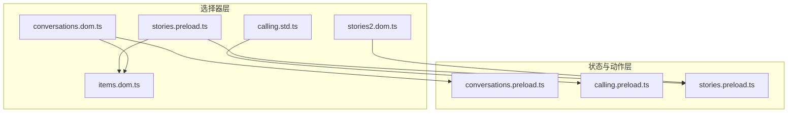
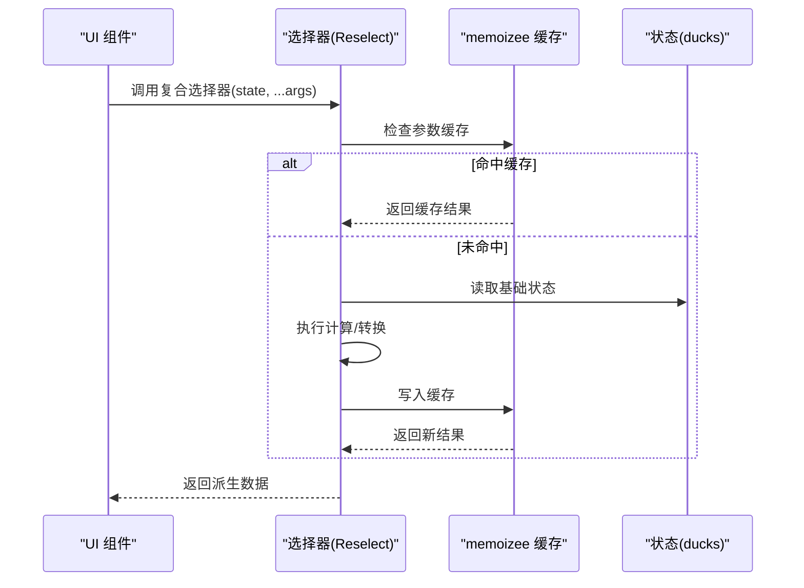
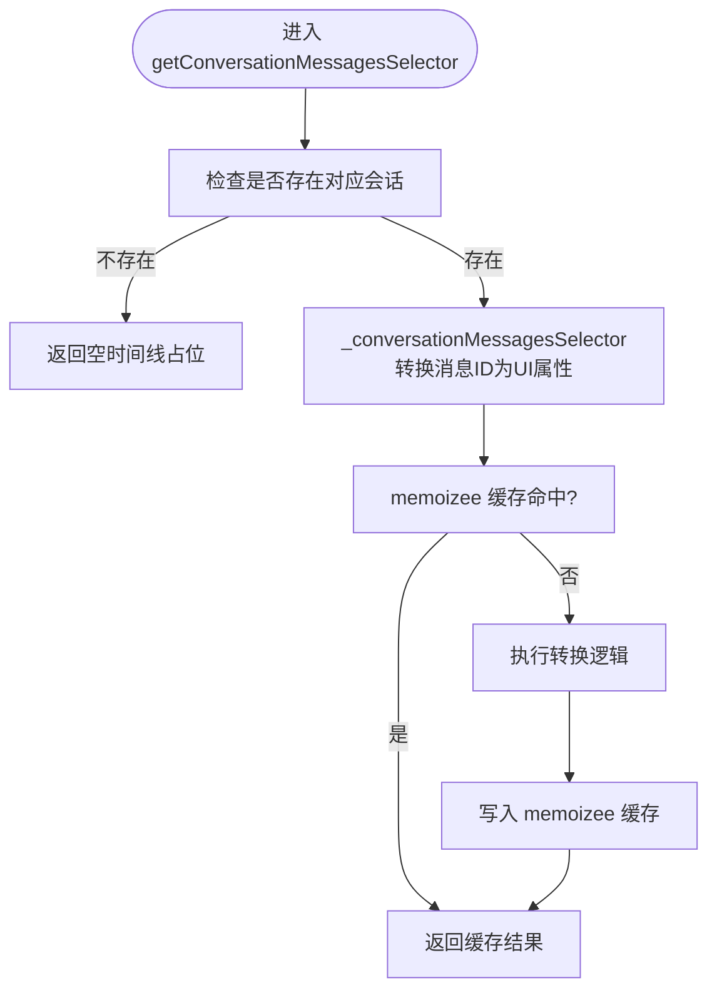
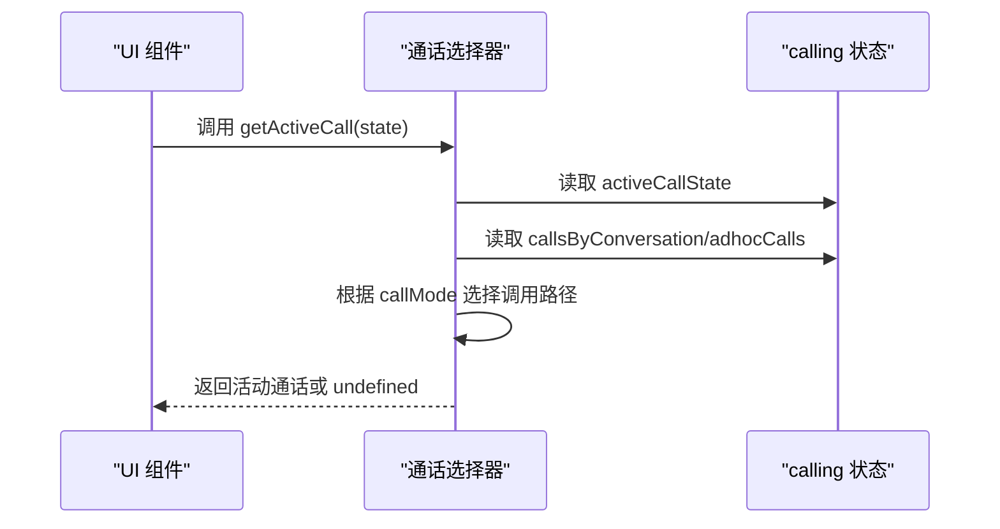
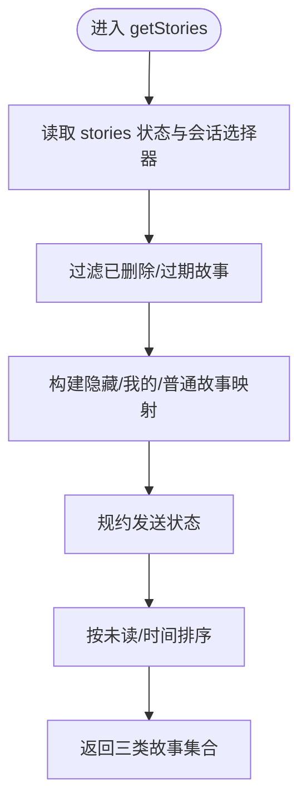
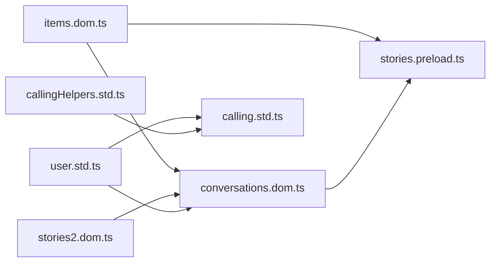

# 状态选择器

<cite>
**本文引用的文件**
- [conversations.dom.ts](file://ts/state/selectors/conversations.dom.ts)
- [calling.std.ts](file://ts/state/selectors/calling.std.ts)
- [stories.preload.ts](file://ts/state/selectors/stories.preload.ts)
- [stories2.dom.ts](file://ts/state/selectors/stories2.dom.ts)
- [items.dom.ts](file://ts/state/selectors/items.dom.ts)
- [conversations.preload.ts](file://ts/state/ducks/conversations.preload.ts)
- [stories.preload.ts](file://ts/state/ducks/stories.preload.ts)
- [calling.preload.ts](file://ts/state/ducks/calling.preload.ts)
- [useProxySelector.std.ts](file://ts/hooks/useProxySelector.std.ts)
</cite>

## 目录
1. [简介](#简介)
2. [项目结构](#项目结构)
3. [核心组件](#核心组件)
4. [架构总览](#架构总览)
5. [详细组件分析](#详细组件分析)
6. [依赖关系分析](#依赖关系分析)
7. [性能考量](#性能考量)
8. [故障排查指南](#故障排查指南)
9. [结论](#结论)
10. [附录](#附录)

## 简介
本文件围绕 Signal-Desktop 的状态选择器系统，聚焦于三个关键模块：
- 会话状态派生：conversations.dom.ts
- 通话状态计算：calling.std.ts
- 故事状态处理：stories.preload.ts 与 stories2.dom.ts

文档将解释如何使用 Reselect 进行记忆化优化，如何在复杂状态计算、数据转换与 UI 适配之间取得平衡，并给出性能分析方法、优化技巧与常见问题排查建议。为避免泄露源码细节，本文不直接粘贴代码，而通过“代码片段路径”指引定位到具体实现位置。

## 项目结构
选择器位于 ts/state/selectors 目录下，按功能域划分，分别服务于 conversations、calling、stories 等子系统；同时配合 ducks 下的状态定义与 reducers，形成“状态定义—选择器—UI”的清晰分层。

图表来源
- [conversations.dom.ts](file://ts/state/selectors/conversations.dom.ts#L1-L120)
- [calling.std.ts](file://ts/state/selectors/calling.std.ts#L1-L60)
- [stories.preload.ts](file://ts/state/selectors/stories.preload.ts#L1-L60)
- [stories2.dom.ts](file://ts/state/selectors/stories2.dom.ts#L1-L41)
- [items.dom.ts](file://ts/state/selectors/items.dom.ts#L1-L40)
- [conversations.preload.ts](file://ts/state/ducks/conversations.preload.ts#L1-L120)
- [stories.preload.ts](file://ts/state/ducks/stories.preload.ts#L1-L120)
- [calling.preload.ts](file://ts/state/ducks/calling.preload.ts#L1-L120)

章节来源
- [conversations.dom.ts](file://ts/state/selectors/conversations.dom.ts#L1-L120)
- [calling.std.ts](file://ts/state/selectors/calling.std.ts#L1-L60)
- [stories.preload.ts](file://ts/state/selectors/stories.preload.ts#L1-L60)
- [stories2.dom.ts](file://ts/state/selectors/stories2.dom.ts#L1-L41)
- [items.dom.ts](file://ts/state/selectors/items.dom.ts#L1-L40)

## 核心组件
- 会话选择器（conversations.dom.ts）：负责从 conversations 状态中派生对话列表、排序、过滤、消息时间线、联系人颜色映射等，大量使用 Reselect 与 memoizee 实现缓存与去重。
- 通话选择器（calling.std.ts）：从 calling 状态中提取设备列表、活动/响铃通话、通话链接、呈现源等，采用轻量级记忆化与组合器。
- 故事选择器（stories.preload.ts、stories2.dom.ts）：从 stories 状态中聚合故事视图、回复、发送状态、未读计数等，结合 items.dom.ts 的开关与 stories2.dom.ts 的 HasStories 计算，完成复杂的数据转换与 UI 适配。

章节来源
- [conversations.dom.ts](file://ts/state/selectors/conversations.dom.ts#L120-L220)
- [calling.std.ts](file://ts/state/selectors/calling.std.ts#L60-L120)
- [stories.preload.ts](file://ts/state/selectors/stories.preload.ts#L140-L220)
- [stories2.dom.ts](file://ts/state/selectors/stories2.dom.ts#L12-L41)

## 架构总览
选择器通过 createSelector 将多个基础选择器组合成复合选择器，利用输入选择器的稳定性避免重复计算；对于昂贵的纯函数计算，使用 memoizee 做参数级缓存，确保在应用配置或用户信息变化时才重建缓存。

图表来源
- [conversations.dom.ts](file://ts/state/selectors/conversations.dom.ts#L986-L1000)
- [useProxySelector.std.ts](file://ts/hooks/useProxySelector.std.ts#L1-L23)

## 详细组件分析

### 会话状态派生（conversations.dom.ts）
- 复合选择器
  - 会话查询与索引：如 getConversationLookup、getConversationsByServiceId、getConversationsByE164、getConversationsByGroupId 等，用于多键位检索。
  - 会话列表与排序：getLeftPaneLists、getConversationComparator、getAllConversationsUnreadStats 等，支持聊天折叠、置顶、归档、未读统计等。
  - 消息时间线：getConversationMessages、getConversationMessagesSelector、getLastEditableMessageId 等，将消息 ID 列表转换为 UI 友好的时间线属性。
  - 联系人与颜色：getConversationSelector、getContactNameColorSelector、getCachedConversationMemberColorsSelector 等，结合 memoizee 对联系人颜色做缓存。
- 记忆化策略
  - 使用 createSelector 对输入状态进行稳定判断，避免无谓重算。
  - 使用 memoizee 对高成本纯函数（如联系人颜色映射、消息时间线转换）进行参数级缓存，限制最大缓存条目，防止内存膨胀。
- 数据转换与 UI 适配
  - 将原始状态对象扁平化为 UI 属性（如时间线项、滚动索引、未读计数），减少 UI 层的计算负担。
  - 对聊天折叠、未读统计、联系人颜色等进行统一处理，保证 UI 渲染一致性。

图表来源
- [conversations.dom.ts](file://ts/state/selectors/conversations.dom.ts#L1213-L1254)
- [conversations.dom.ts](file://ts/state/selectors/conversations.dom.ts#L1162-L1211)

章节来源
- [conversations.dom.ts](file://ts/state/selectors/conversations.dom.ts#L120-L220)
- [conversations.dom.ts](file://ts/state/selectors/conversations.dom.ts#L297-L320)
- [conversations.dom.ts](file://ts/state/selectors/conversations.dom.ts#L487-L511)
- [conversations.dom.ts](file://ts/state/selectors/conversations.dom.ts#L1162-L1254)
- [conversations.dom.ts](file://ts/state/selectors/conversations.dom.ts#L1256-L1339)

### 通话状态计算（calling.std.ts）
- 设备与状态
  - 音频/视频设备列表与当前选中设备：getAvailableMicrophones、getSelectedMicrophone、getAvailableSpeakers、getSelectedSpeaker、getAvailableCameras、getSelectedCamera。
  - 活动/响铃通话：getActiveCallState、getActiveCall、isInCall、isInFullScreenCall、getRingingCall、areAnyCallsActiveOrRinging。
  - 通话链接：getCallsByConversation、getAdhocCalls、getCallLinksByRoomId、getCallLinkSelector、getAllCallLinks、getHasAnyAdminCallLinks。
- 记忆化策略
  - 使用 createSelector 将基础状态映射为简单值，保持选择器的纯函数特性。
  - 对于动态选择器（如 getCallLinkSelector、getCallSelector、getAdhocCallSelector），返回一个闭包函数，避免每次渲染都创建新的函数实例，降低 React 重渲染风险。
- 数据转换与 UI 适配
  - 将 callsByConversation、adhocCalls、callLinks 等结构转换为 UI 可直接消费的属性，如是否处于全屏模式、是否响铃、是否为活动通话等。

图表来源
- [calling.std.ts](file://ts/state/selectors/calling.std.ts#L127-L151)
- [calling.std.ts](file://ts/state/selectors/calling.std.ts#L158-L186)

章节来源
- [calling.std.ts](file://ts/state/selectors/calling.std.ts#L1-L60)
- [calling.std.ts](file://ts/state/selectors/calling.std.ts#L127-L186)

### 故事状态处理（stories.preload.ts 与 stories2.dom.ts）
- HasStories 计算（stories2.dom.ts）
  - getHasStoriesSelector：基于 items.dom.ts 的开关与 stories 状态，计算某个会话是否有未读/已读故事，避免循环依赖。
- 故事聚合与 UI 适配（stories.preload.ts）
  - getStories：将 stories 状态聚合为三类输出：隐藏故事、我的故事、普通故事；对发送状态进行规约、对未读/已读进行排序；处理分发列表与群组场景。
  - getStoryReplies：将回复映射为 UI 可用的作者头像、颜色、文本等。
  - getStoriesNotificationCount：根据 lastOpenedAtTimestamp、隐藏列表与未读状态计算通知计数。
  - getStoryView、getConversationStory：将原始 story 数据转换为 UI 视图对象，包含附件、过期时间、发送状态、阅读状态等。
- 记忆化策略
  - 使用 createSelector 对输入状态进行稳定判断。
  - 在复杂聚合逻辑中，尽量复用中间结果（如 Map/Set 的构建与更新），减少重复遍历。
- 数据转换与 UI 适配
  - 将多源数据（会话、分发列表、发送状态）合并为统一的 UI 结构，屏蔽底层状态差异。

图表来源
- [stories.preload.ts](file://ts/state/selectors/stories.preload.ts#L348-L490)
- [stories2.dom.ts](file://ts/state/selectors/stories2.dom.ts#L12-L41)
- [items.dom.ts](file://ts/state/selectors/items.dom.ts#L140-L145)

章节来源
- [stories.preload.ts](file://ts/state/selectors/stories.preload.ts#L140-L220)
- [stories.preload.ts](file://ts/state/selectors/stories.preload.ts#L348-L490)
- [stories2.dom.ts](file://ts/state/selectors/stories2.dom.ts#L12-L41)
- [items.dom.ts](file://ts/state/selectors/items.dom.ts#L140-L145)

## 依赖关系分析
- 选择器之间的耦合
  - conversations.dom.ts 依赖 items.dom.ts（未读统计开关）、stories2.dom.ts（HasStories 计算）、user.std.ts（用户标识）等。
  - stories.preload.ts 依赖 conversations.dom.ts 的会话选择器、items.dom.ts 的开关、message.preload.ts 的回复能力等。
  - calling.std.ts 依赖 user.std.ts（用户 ACI）、callingHelpers.std.ts（响铃通话辅助）等。
- 外部依赖
  - Reselect：用于组合选择器与记忆化。
  - memoizee：用于对纯函数进行参数级缓存，控制缓存大小，避免内存泄漏。
  - lodash：用于 pick、reduce 等工具函数，简化数据转换。

图表来源
- [conversations.dom.ts](file://ts/state/selectors/conversations.dom.ts#L1-L120)
- [stories.preload.ts](file://ts/state/selectors/stories.preload.ts#L1-L60)
- [stories2.dom.ts](file://ts/state/selectors/stories2.dom.ts#L1-L41)
- [calling.std.ts](file://ts/state/selectors/calling.std.ts#L1-L60)

章节来源
- [conversations.dom.ts](file://ts/state/selectors/conversations.dom.ts#L1-L120)
- [stories.preload.ts](file://ts/state/selectors/stories.preload.ts#L1-L60)
- [stories2.dom.ts](file://ts/state/selectors/stories2.dom.ts#L1-L41)
- [calling.std.ts](file://ts/state/selectors/calling.std.ts#L1-L60)

## 性能考量
- 记忆化原理与优势
  - Reselect：通过输入选择器的稳定性判断，避免重复计算；当输入不变时直接返回缓存结果，显著降低 UI 层重渲染成本。
  - memoizee：对纯函数进行参数级缓存，适合高成本计算（如颜色映射、消息时间线转换），可设置最大缓存条目上限，防止内存泄漏。
- 复杂度与数据流
  - 会话列表排序与过滤：O(n log n) 排序 + O(n) 过滤；通过 memoizee 缓存排序比较器与过滤结果，减少重复遍历。
  - 故事聚合：O(n) 遍历 stories，使用 Map/Set 去重与规约；通过中间结果复用，避免多次扫描。
  - 通话选择器：常数时间映射，返回闭包函数避免额外开销。
- 优化技巧
  - 合理拆分选择器：将复杂逻辑拆分为多个小选择器，提升缓存命中率。
  - 控制缓存大小：为 memoizee 设置合理的 max 参数，定期清理不再使用的缓存。
  - 避免不必要的对象创建：在选择器内部复用中间结构（如 Map/Set），减少垃圾回收压力。
  - 使用闭包选择器：对动态选择器（如 getCallSelector）返回闭包，避免每次渲染创建新函数导致的重渲染。
  - 条件开关：通过 items.dom.ts 的开关（如 getStoriesEnabled）快速短路昂贵逻辑，减少无效计算。
- 重复计算与内存泄漏排查
  - 若发现 UI 卡顿，优先检查是否缺少 memoizee 或缓存过大；确认输入选择器是否稳定。
  - 若出现内存增长，检查 memoizee 的 max 是否过小或未正确释放；确认闭包选择器是否被正确销毁。
  - 使用 React DevTools Profiler 或 Redux DevTools 检查选择器调用频率与缓存命中情况。

章节来源
- [conversations.dom.ts](file://ts/state/selectors/conversations.dom.ts#L986-L1000)
- [conversations.dom.ts](file://ts/state/selectors/conversations.dom.ts#L1084-L1124)
- [stories.preload.ts](file://ts/state/selectors/stories.preload.ts#L492-L519)
- [items.dom.ts](file://ts/state/selectors/items.dom.ts#L140-L145)
- [useProxySelector.std.ts](file://ts/hooks/useProxySelector.std.ts#L1-L23)

## 故障排查指南
- 会话选择器相关
  - 空时间线占位：当会话不存在时，getConversationMessagesSelector 返回默认占位，检查消息 ID 列表与消息查找逻辑。
  - 颜色映射缺失：getContactNameColor 返回默认颜色，检查成员列表与 memoizee 缓存是否正确初始化。
  - 左侧面板闪烁：检查 getLeftPaneLists 的排序与过滤逻辑，确认输入选择器是否稳定。
- 通话选择器相关
  - 响铃/活动通话为空：检查 activeCallState 与 callsByConversation/adhocCalls 的匹配逻辑。
  - 设备切换无效：确认 getSelectedMicrophone/getSelectedSpeaker/getSelectedCamera 的状态同步。
- 故事选择器相关
  - 未读计数异常：检查 getStoriesNotificationCount 的隐藏列表与时间戳过滤条件。
  - 发送状态不一致：检查 resolveStorySendStatus 与 reduceStorySendStatus 的规约逻辑。
  - 回复渲染异常：检查 getStoryReplies 的作者头像与颜色映射。
- 通用排查
  - 选择器未命中缓存：确认输入选择器是否稳定；检查 memoizee 的参数类型与数量。
  - 闭包选择器泄漏：确认组件卸载后是否释放闭包引用；避免在 UI 中直接传入新函数。

章节来源
- [conversations.dom.ts](file://ts/state/selectors/conversations.dom.ts#L1226-L1254)
- [conversations.dom.ts](file://ts/state/selectors/conversations.dom.ts#L1131-L1143)
- [calling.std.ts](file://ts/state/selectors/calling.std.ts#L127-L151)
- [stories.preload.ts](file://ts/state/selectors/stories.preload.ts#L492-L519)
- [stories.preload.ts](file://ts/state/selectors/stories.preload.ts#L306-L346)

## 结论
Signal-Desktop 的选择器系统通过 Reselect 与 memoizee 的组合，实现了在复杂状态计算、数据转换与 UI 适配之间的高效平衡。通过对输入状态的稳定判断与参数级缓存，大幅降低了重复计算与重渲染成本；通过闭包选择器与条件开关，进一步提升了性能与可维护性。遵循本文提供的性能分析方法与优化技巧，可在大型数据集与复杂业务逻辑下保持流畅的用户体验。

## 附录
- 实际代码示例路径（不直接展示代码）
  - 会话选择器：[getConversationMessagesSelector](file://ts/state/selectors/conversations.dom.ts#L1226-L1254)、[getConversationSelector](file://ts/state/selectors/conversations.dom.ts#L1045-L1068)
  - 通话选择器：[getActiveCall](file://ts/state/selectors/calling.std.ts#L127-L151)、[getCallSelector](file://ts/state/selectors/calling.std.ts#L107-L116)
  - 故事选择器：[getStories](file://ts/state/selectors/stories.preload.ts#L348-L490)、[getStoriesNotificationCount](file://ts/state/selectors/stories.preload.ts#L492-L519)
  - HasStories 计算：[getHasStoriesSelector](file://ts/state/selectors/stories2.dom.ts#L12-L41)
  - 未读统计开关：[getStoriesEnabled](file://ts/state/selectors/items.dom.ts#L140-L145)