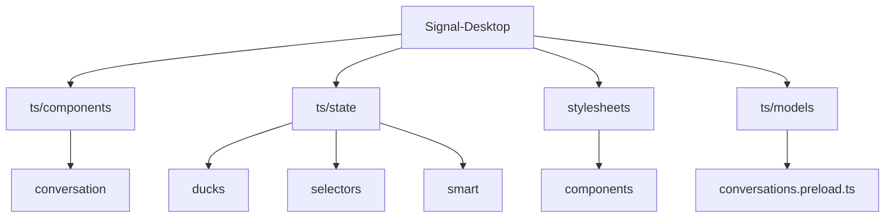
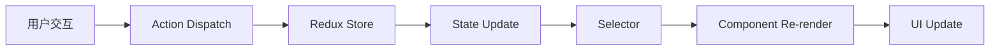
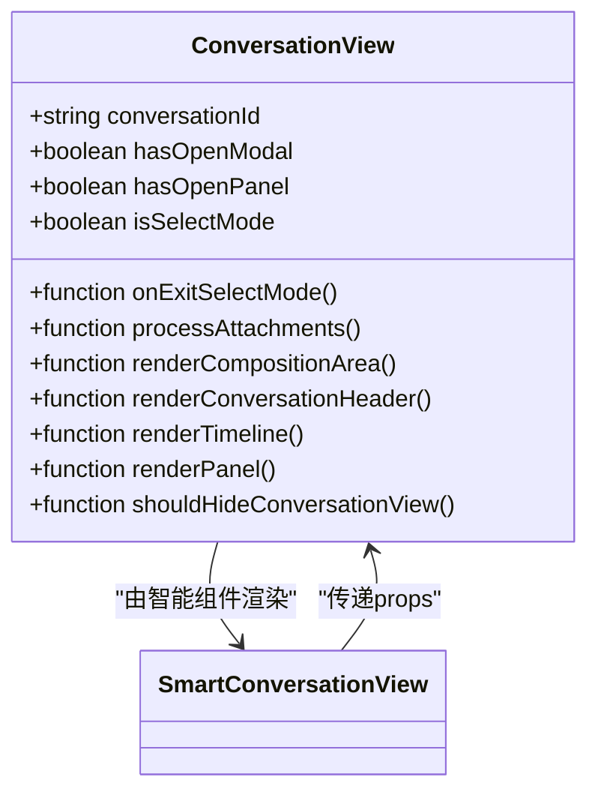
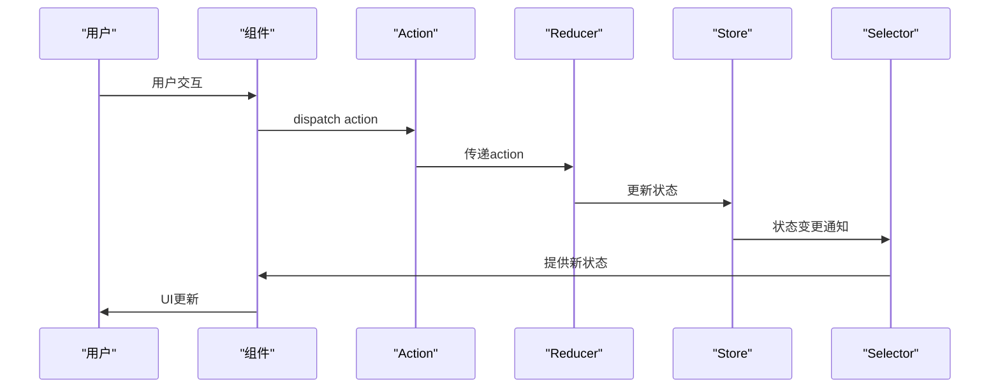
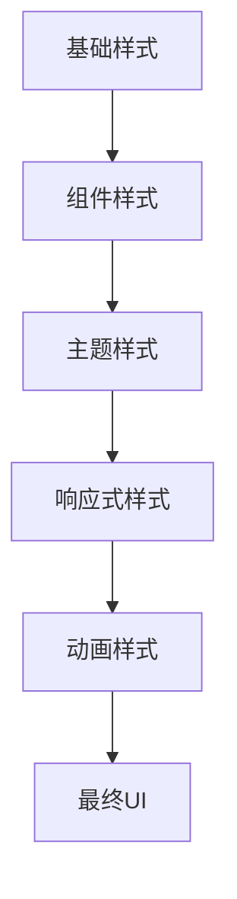
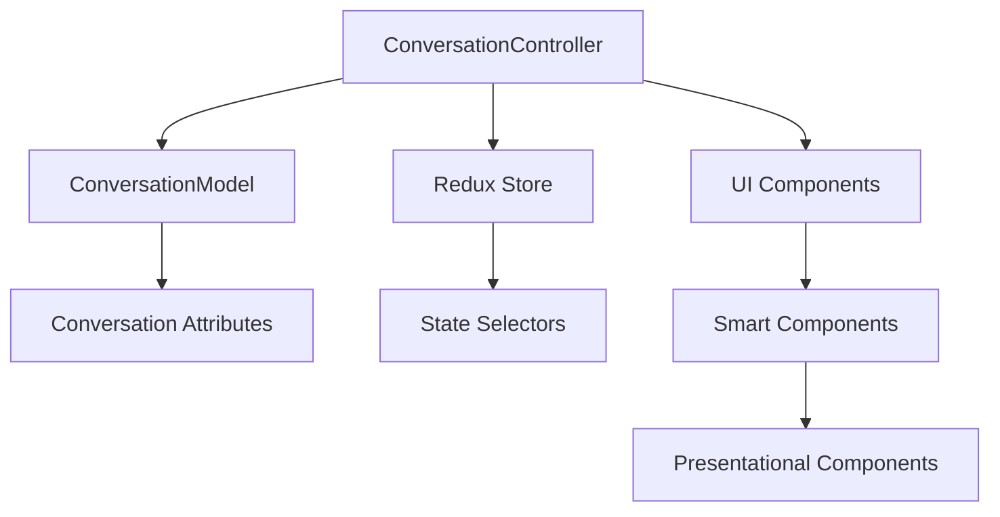

# 用户界面

<cite>
**本文档引用的文件**   
- [conversations.preload.ts](file://ts/models/conversations.preload.ts)
- [conversations.preload.ts](file://ts/state/ducks/conversations.preload.ts)
- [conversations.dom.ts](file://ts/state/selectors/conversations.dom.ts)
- [ConversationView.dom.tsx](file://ts/components/conversation/ConversationView.dom.tsx)
- [ConversationView.preload.tsx](file://ts/state/smart/ConversationView.preload.tsx)
- [ConversationPanel.preload.tsx](file://ts/state/smart/ConversationPanel.preload.tsx)
- [ConversationController.preload.ts](file://ts/ConversationController.preload.ts)
</cite>

## 目录
1. [简介](#简介)
2. [项目结构](#项目结构)
3. [核心组件](#核心组件)
4. [架构概述](#架构概述)
5. [详细组件分析](#详细组件分析)
6. [依赖分析](#依赖分析)
7. [性能考虑](#性能考虑)
8. [故障排除指南](#故障排除指南)
9. [结论](#结论)

## 简介
Signal-Desktop用户界面是一个复杂的React应用，采用Redux进行状态管理。该系统通过精心设计的组件层次结构、高效的状态同步机制和现代化的样式系统，为用户提供流畅的通信体验。本文档深入探讨了React组件架构、状态管理机制、UI状态同步和样式系统，重点分析了对话组件、Redux状态管理逻辑和选择器实现。

## 项目结构
Signal-Desktop的项目结构遵循模块化设计原则，将代码组织成清晰的目录结构。核心用户界面组件位于`ts/components`目录，状态管理逻辑分布在`ts/state`目录，样式文件则集中于`stylesheets`目录。

**Diagram sources**
- [ts/components](file://ts/components)
- [ts/state](file://ts/state)
- [stylesheets](file://stylesheets)

**Section sources**
- [ts/components](file://ts/components)
- [ts/state](file://ts/state)
- [stylesheets](file://stylesheets)

## 核心组件
Signal-Desktop的核心组件围绕对话视图构建，采用智能组件与展示组件分离的模式。`ConversationView`作为主要的展示组件，接收来自智能组件的状态和回调函数，实现了UI与业务逻辑的解耦。

**Section sources**
- [ConversationView.dom.tsx](file://ts/components/conversation/ConversationView.dom.tsx)
- [ConversationView.preload.tsx](file://ts/state/smart/ConversationView.preload.tsx)

## 架构概述
Signal-Desktop采用Redux作为状态管理解决方案，通过`conversations.preload.ts`文件中的`ConversationModel`类管理对话状态。状态更新通过Redux action触发，确保了状态变更的可预测性和可追踪性。

**Diagram sources**
- [conversations.preload.ts](file://ts/models/conversations.preload.ts)
- [conversations.preload.ts](file://ts/state/ducks/conversations.preload.ts)

## 详细组件分析

### 对话视图组件分析
对话视图组件是Signal-Desktop用户界面的核心，负责渲染对话界面的各个部分，包括消息时间线、输入区域和对话头。

#### 组件属性
`ConversationView`组件接收多个关键属性：
- `conversationId`: 当前对话的唯一标识符
- `hasOpenModal`: 指示是否有模态框打开
- `isSelectMode`: 指示是否处于选择模式
- `onExitSelectMode`: 退出选择模式的回调函数
- `processAttachments`: 处理附件上传的函数
- `renderCompositionArea`: 渲染输入区域的函数
- `renderConversationHeader`: 渲染对话头的函数
- `renderTimeline`: 渲染消息时间线的函数
- `renderPanel`: 渲染面板的函数

**Diagram sources**
- [ConversationView.dom.tsx](file://ts/components/conversation/ConversationView.dom.tsx)
- [ConversationView.preload.tsx](file://ts/state/smart/ConversationView.preload.tsx)

**Section sources**
- [ConversationView.dom.tsx](file://ts/components/conversation/ConversationView.dom.tsx)
- [ConversationView.preload.tsx](file://ts/state/smart/ConversationView.preload.tsx)

### 状态管理分析
Signal-Desktop的状态管理基于Redux架构，通过`conversations.preload.ts`文件中的`ConversationModel`类实现。该类封装了对话的所有属性和方法，提供了统一的接口来访问和修改对话状态。

#### 状态更新机制
状态更新通过以下流程实现：
1. 用户交互触发action dispatch
2. Redux reducer处理action并更新状态
3. selector从store中提取相关状态
4. 组件接收新的props并重新渲染

**Diagram sources**
- [conversations.preload.ts](file://ts/models/conversations.preload.ts)
- [conversations.preload.ts](file://ts/state/ducks/conversations.preload.ts)
- [conversations.dom.ts](file://ts/state/selectors/conversations.dom.ts)

**Section sources**
- [conversations.preload.ts](file://ts/models/conversations.preload.ts)
- [conversations.preload.ts](file://ts/state/ducks/conversations.preload.ts)
- [conversations.dom.ts](file://ts/state/selectors/conversations.dom.ts)

### 样式系统分析
Signal-Desktop采用模块化CSS和Tailwind CSS结合的样式系统。组件样式文件使用`.module.scss`命名约定，确保样式作用域的隔离。

#### 样式定制选项
- **主题支持**: 通过CSS变量实现深色/浅色主题切换
- **响应式设计**: 使用媒体查询适配不同屏幕尺寸
- **动画效果**: 利用CSS transitions和animations实现平滑的UI过渡
- **可访问性**: 遵循WCAG标准，确保界面的可访问性

**Diagram sources**
- [stylesheets](file://stylesheets)
- [tailwind-config.css](file://stylesheets/tailwind-config.css)

## 依赖分析
Signal-Desktop的组件和状态管理模块之间存在复杂的依赖关系。通过`ConversationController.preload.ts`中的`ConversationController`类，实现了对话模型与UI组件之间的桥梁。

**Diagram sources**
- [ConversationController.preload.ts](file://ts/ConversationController.preload.ts)
- [conversations.preload.ts](file://ts/models/conversations.preload.ts)

**Section sources**
- [ConversationController.preload.ts](file://ts/ConversationController.preload.ts)
- [conversations.preload.ts](file://ts/models/conversations.preload.ts)

## 性能考虑
Signal-Desktop在性能优化方面采取了多项措施：
- **虚拟滚动**: 在消息时间线中使用虚拟滚动技术，只渲染可见的消息项
- **防抖和节流**: 对频繁触发的操作（如输入、滚动）使用防抖和节流技术
- **memoization**: 使用`reselect`库的`createSelector`函数缓存计算结果
- **批量更新**: 通过`createBatcher`函数批量处理状态更新，减少不必要的渲染

## 故障排除指南
### UI卡顿问题
**症状**: 消息滚动不流畅，界面响应迟缓
**解决方案**:
1. 检查是否启用了虚拟滚动
2. 优化selector的计算逻辑
3. 减少不必要的组件重新渲染
4. 使用React DevTools分析性能瓶颈

### 状态不一致问题
**症状**: UI显示与实际状态不符
**解决方案**:
1. 检查action的type是否正确
2. 验证reducer是否正确处理了action
3. 确认selector是否正确地从store中提取了状态
4. 使用Redux DevTools调试状态变更历史

### 响应式设计问题
**症状**: 界面在不同设备上显示异常
**解决方案**:
1. 检查媒体查询的断点设置
2. 验证CSS flexbox或grid布局的正确性
3. 确保图片和媒体元素的响应式设置
4. 使用浏览器开发者工具的设备模拟功能进行测试

**Section sources**
- [ConversationController.preload.ts](file://ts/ConversationController.preload.ts#L1580-L1617)
- [conversations.preload.ts](file://ts/models/conversations.preload.ts#L301-L800)

## 结论
Signal-Desktop的用户界面设计体现了现代Web应用的最佳实践。通过React组件架构、Redux状态管理和模块化样式系统，实现了高度可维护和可扩展的代码结构。对于初学者，建议从组件层次结构入手，理解智能组件与展示组件的分离模式；对于经验丰富的开发者，可以深入研究性能优化和复杂状态管理的实现细节。未来的发展方向可能包括进一步优化渲染性能、增强可访问性支持和改进响应式设计。