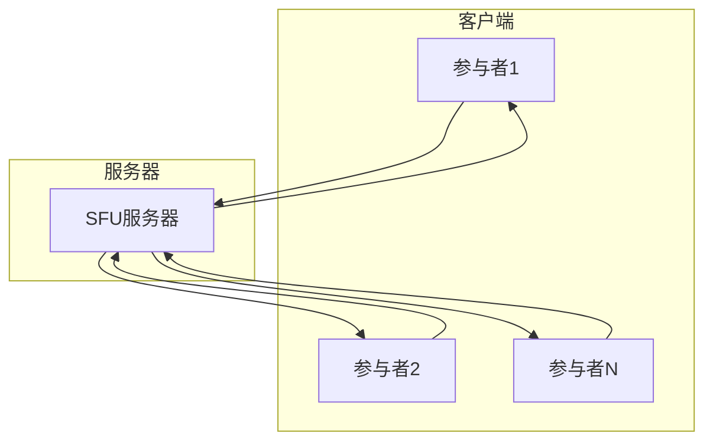
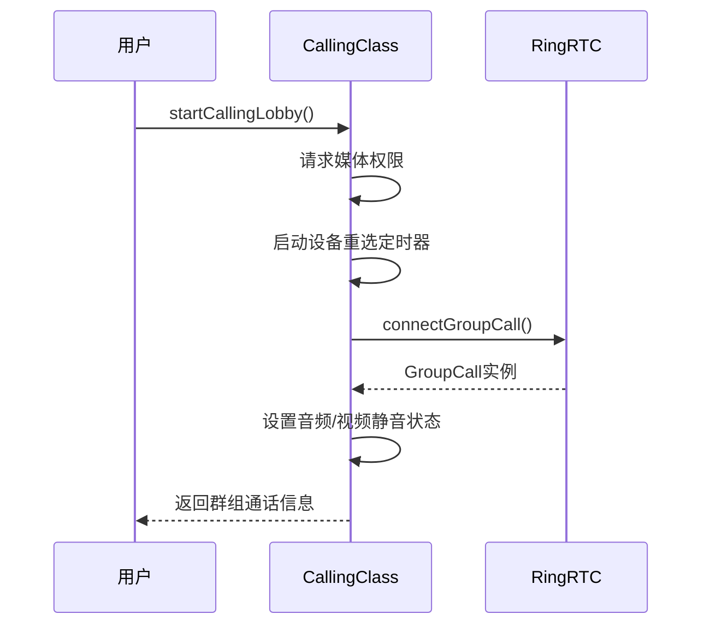
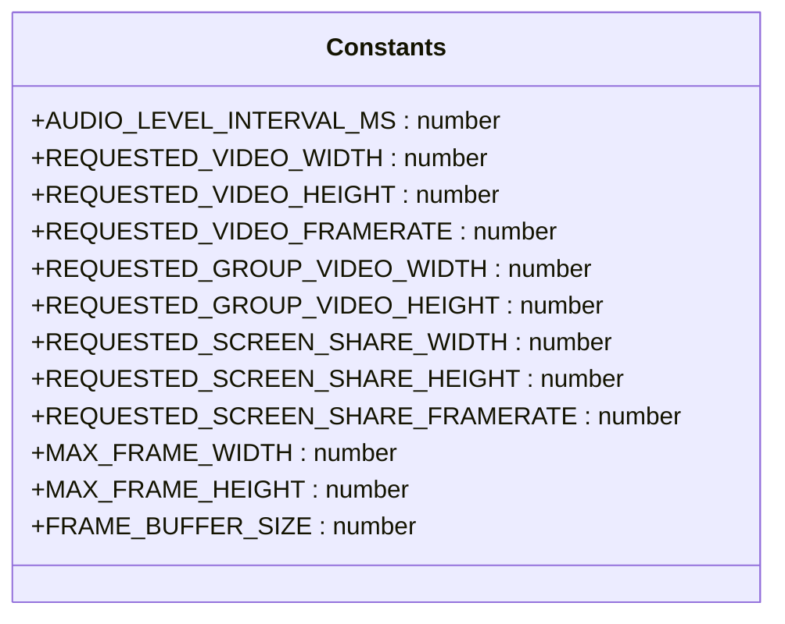
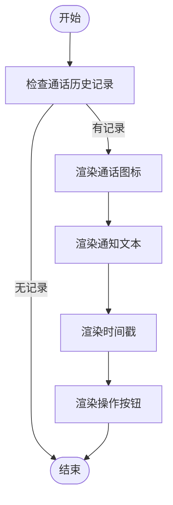

# 群组通话

<cite>
**本文档引用的文件**   
- [calling.preload.ts](file://ts\services\calling.preload.ts)
- [constants.std.ts](file://ts\calling\constants.std.ts)
- [CallingNotification.dom.tsx](file://ts\components\conversation\CallingNotification.dom.tsx)
- [VideoSupport.preload.ts](file://ts\calling\VideoSupport.preload.ts)
</cite>

## 目录
1. [简介](#简介)
2. [项目结构](#项目结构)
3. [核心组件](#核心组件)
4. [架构概述](#架构概述)
5. [详细组件分析](#详细组件分析)
6. [依赖分析](#依赖分析)
7. [性能考虑](#性能考虑)
8. [故障排除指南](#故障排除指南)
9. [结论](#结论)

## 简介
本文档深入探讨了Signal-Desktop中群组通话功能的实现。该功能基于WebRTC SFU（选择性转发单元）架构，支持多方实时通信。文档详细解释了参与者管理、媒体流混合、网络拓扑和信令协议的完整流程。重点分析了`calling.preload.ts`中的群组通话控制逻辑、`constants.std.ts`中定义的配置参数以及`CallingNotification.dom.tsx`中的通知机制。此外，还记录了群组通话API的接口定义、状态同步机制和错误处理策略，并解释了其与用户界面、消息系统和网络服务的集成关系。

## 项目结构
Signal-Desktop的群组通话功能主要分布在`ts`目录下的多个子目录中。核心逻辑位于`ts/services/calling.preload.ts`，而相关的常量定义在`ts/calling/constants.std.ts`中。用户界面组件，如通话通知，则位于`ts/components/conversation/CallingNotification.dom.tsx`。视频支持功能由`ts/calling/VideoSupport.preload.ts`提供。

**Section sources**
- [calling.preload.ts](file://ts\services\calling.preload.ts)
- [constants.std.ts](file://ts\calling\constants.std.ts)
- [CallingNotification.dom.tsx](file://ts\components\conversation\CallingNotification.dom.tsx)
- [VideoSupport.preload.ts](file://ts\calling\VideoSupport.preload.ts)

## 核心组件
群组通话的核心组件包括`CallingClass`，它负责管理所有通话的生命周期。该类处理从创建、连接到断开的全过程。`GumVideoCapturer`和`CanvasVideoRenderer`类分别负责本地视频的捕获和远程视频的渲染。`GroupCallObserver`接口定义了群组通话的各种事件回调，如参与者加入/退出、音频电平变化和举手状态更新。

**Section sources**
- [calling.preload.ts](file://ts\services\calling.preload.ts#L521-L544)
- [VideoSupport.preload.ts](file://ts\calling\VideoSupport.preload.ts#L38-L371)

## 架构概述
Signal-Desktop的群组通话采用SFU架构，其中服务器作为中心节点接收所有参与者的媒体流，并将混合后的流转发给其他参与者。这种架构减少了客户端的带宽和计算负担，同时支持大规模并发连接。



**Diagram sources**
- [calling.preload.ts](file://ts\services\calling.preload.ts#L1369-L1446)

## 详细组件分析

### 群组通话控制逻辑分析
`calling.preload.ts`文件中的`CallingClass`是群组通话功能的核心。它通过`connectGroupCall`方法连接到群组通话，并通过`joinGroupCall`方法加入通话。`startCallingLobby`方法用于在正式加入前预览本地媒体流。



**Diagram sources**
- [calling.preload.ts](file://ts\services\calling.preload.ts#L642-L816)

### 群组通话配置参数分析
`constants.std.ts`文件定义了群组通话的关键配置参数，如音频电平更新间隔、视频分辨率和帧率等。



**Diagram sources**
- [constants.std.ts](file://ts\calling\constants.std.ts#L1-L22)

### 群组通话通知机制分析
`CallingNotification.dom.tsx`组件负责在聊天界面中显示群组通话的通知，包括通话状态、时间戳和操作按钮。



**Diagram sources**
- [CallingNotification.dom.tsx](file://ts\components\conversation\CallingNotification.dom.tsx#L55-L255)

## 依赖分析
群组通话功能依赖于多个外部库和内部模块。主要依赖包括`@signalapp/ringrtc`用于WebRTC功能，`@signalapp/libsignal-client`用于安全通信，以及`electron`用于桌面应用集成。

```mermaid
graph TD
A[calling.preload.ts] --> B[@signalapp/ringrtc]
A --> C[@signalapp/libsignal-client]
A --> D[electron]
A --> E[lodash]
A --> F[Long]
```

**Diagram sources**
- [calling.preload.ts](file://ts\services\calling.preload.ts#L4-L49)

## 性能考虑
为了优化性能，Signal-Desktop采用了多种策略。例如，通过`AUDIO_LEVEL_INTERVAL_MS`参数控制音频电平更新频率，避免频繁的UI更新。视频共享的帧率被限制为5fps，以减少CPU占用。此外，`GumVideoCapturer`类通过`spawnSender`方法高效地将视频帧从`MediaStreamTrack`传输到`VideoFrameSender`。

**Section sources**
- [constants.std.ts](file://ts\calling\constants.std.ts#L1-L22)
- [VideoSupport.preload.ts](file://ts\calling\VideoSupport.preload.ts#L274-L337)

## 故障排除指南
常见的群组通话问题包括网络拥塞、参与者延迟和媒体同步问题。解决这些问题的方法包括检查网络连接、调整媒体流的分辨率和帧率，以及确保所有参与者都使用最新的软件版本。调试方法包括查看日志文件和使用`calling_tools.html`工具进行实时监控。

**Section sources**
- [calling.preload.ts](file://ts\services\calling.preload.ts#L189-L191)
- [calling_tools.html](file://calling_tools.html)

## 结论
Signal-Desktop的群组通话功能通过SFU架构实现了高效、可扩展的多方实时通信。其模块化的设计和清晰的接口定义使得功能易于维护和扩展。通过深入理解其核心组件和工作流程，开发者可以更好地优化性能和解决潜在问题。