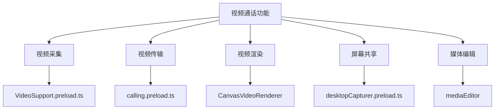
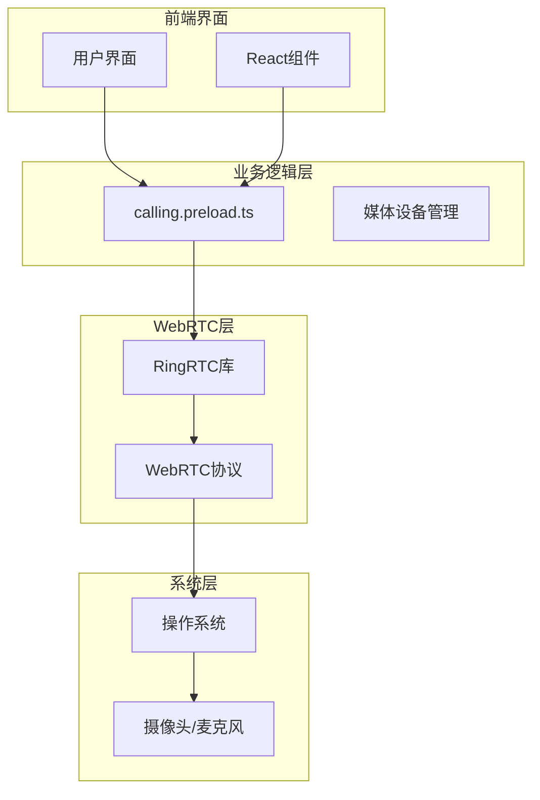
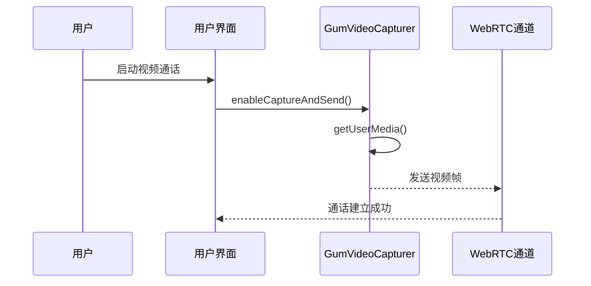
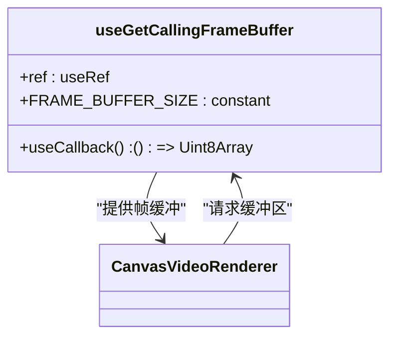
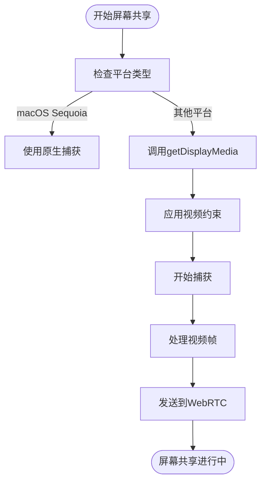
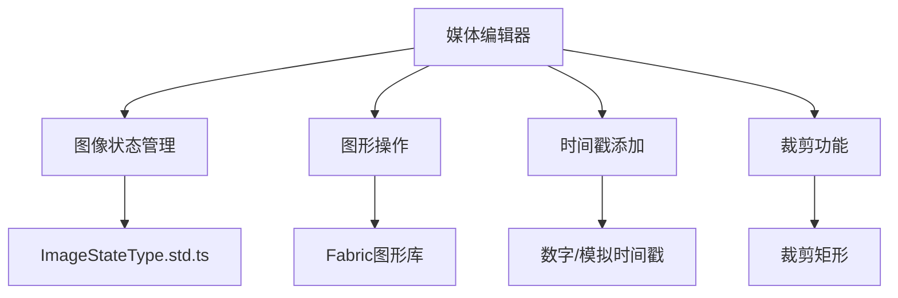
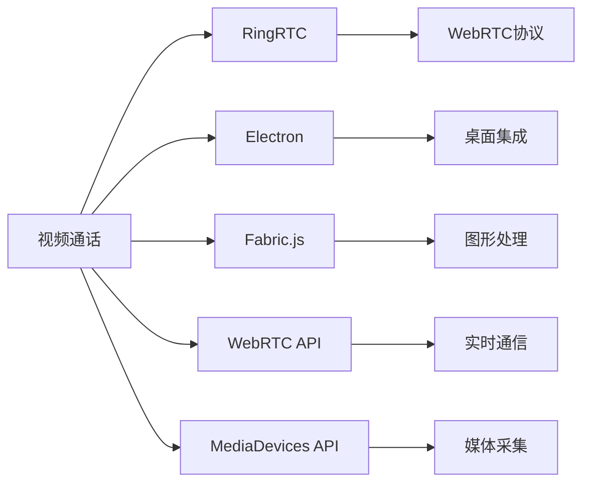

# 视频通话

<cite>
**本文档中引用的文件**  
- [calling.preload.ts](file://ts/services/calling.preload.ts)
- [useGetCallingFrameBuffer.std.ts](file://ts/calling/useGetCallingFrameBuffer.std.ts)
- [VideoSupport.preload.ts](file://ts/calling/VideoSupport.preload.ts)
- [constants.std.ts](file://ts/calling/constants.std.ts)
- [desktopCapturer.preload.ts](file://ts/util/desktopCapturer.preload.ts)
- [mediaEditor](file://ts/mediaEditor)
</cite>

## 目录
1. [简介](#简介)
2. [项目结构](#项目结构)
3. [核心组件](#核心组件)
4. [架构概述](#架构概述)
5. [详细组件分析](#详细组件分析)
6. [依赖分析](#依赖分析)
7. [性能考虑](#性能考虑)
8. [故障排除指南](#故障排除指南)
9. [结论](#结论)

## 简介
本文档深入探讨Signal-Desktop应用程序中基于WebRTC的视频通话功能实现。重点分析视频采集、编码、传输、渲染和屏幕共享的完整流程。详细说明`calling.preload.ts`中的视频通道建立逻辑、`useGetCallingFrameBuffer.std.ts`中的视频帧缓冲管理以及`mediaEditor`中的视频处理功能。文档还涵盖视频通话API接口定义、视频状态机和错误处理机制，以及与用户界面组件、系统资源管理和网络带宽监测的集成关系。

## 项目结构
Signal-Desktop的视频通话功能主要分布在`ts/calling`、`ts/services`和`ts/mediaEditor`目录中。核心视频处理逻辑位于`ts/calling/VideoSupport.preload.ts`，而视频帧缓冲管理则在`ts/calling/useGetCallingFrameBuffer.std.ts`中实现。屏幕共享功能通过`ts/util/desktopCapturer.preload.ts`处理，媒体编辑功能则集中在`ts/mediaEditor`目录下。

**Diagram sources**
- [VideoSupport.preload.ts](file://ts/calling/VideoSupport.preload.ts)
- [calling.preload.ts](file://ts/services/calling.preload.ts)

**Section sources**
- [VideoSupport.preload.ts](file://ts/calling/VideoSupport.preload.ts)
- [calling.preload.ts](file://ts/services/calling.preload.ts)

## 核心组件
Signal-Desktop的视频通话系统由多个核心组件构成，包括`GumVideoCapturer`用于视频采集，`CanvasVideoRenderer`用于视频渲染，以及`CallingClass`管理整个通话生命周期。这些组件协同工作，实现了高质量的视频通信功能。

**Section sources**
- [VideoSupport.preload.ts](file://ts/calling/VideoSupport.preload.ts)
- [calling.preload.ts](file://ts/services/calling.preload.ts)

## 架构概述
Signal-Desktop的视频通话架构基于WebRTC技术栈，采用分层设计模式。底层使用RingRTC库处理WebRTC协议，中间层通过`calling.preload.ts`封装业务逻辑，上层通过React组件与用户界面交互。系统支持一对一通话和群组通话两种模式，通过SFU（选择性转发单元）架构优化群组通话性能。

**Diagram sources**
- [calling.preload.ts](file://ts/services/calling.preload.ts)
- [VideoSupport.preload.ts](file://ts/calling/VideoSupport.preload.ts)

## 详细组件分析

### 视频采集与传输分析
`GumVideoCapturer`类负责视频采集功能，通过`getUserMedia` API获取摄像头流。该组件支持自适应分辨率和帧率调整，根据网络状况动态优化视频质量。视频传输通过`enableCaptureAndSend`方法实现，将采集到的视频帧发送到WebRTC通道。

**Diagram sources**
- [VideoSupport.preload.ts](file://ts/calling/VideoSupport.preload.ts)

**Section sources**
- [VideoSupport.preload.ts](file://ts/calling/VideoSupport.preload.ts)

### 视频帧缓冲管理
`useGetCallingFrameBuffer`钩子函数提供了一个单例的`ArrayBuffer`用于视频渲染。这种设计在群组通话中特别有用，可以重用相同的帧缓冲区而不是为每个参与者分配新的缓冲区，从而减少内存分配开销。

**Diagram sources**
- [useGetCallingFrameBuffer.std.ts](file://ts/calling/useGetCallingFrameBuffer.std.ts)
- [VideoSupport.preload.ts](file://ts/calling/VideoSupport.preload.ts)

**Section sources**
- [useGetCallingFrameBuffer.std.ts](file://ts/calling/useGetCallingFrameBuffer.std.ts)

### 屏幕共享实现
屏幕共享功能通过`desktopCapturer.preload.ts`实现，利用Electron的`desktopCapturer` API获取屏幕或窗口内容。系统会根据平台特性（如macOS Sequoia）选择最优的捕获方式，并应用适当的视频约束来平衡质量和性能。

**Diagram sources**
- [desktopCapturer.preload.ts](file://ts/util/desktopCapturer.preload.ts)

**Section sources**
- [desktopCapturer.preload.ts](file://ts/util/desktopCapturer.preload.ts)

### 媒体编辑功能
`mediaEditor`模块提供视频处理功能，包括图像裁剪、滤镜应用和时间戳添加等。该模块与Fabric.js库集成，支持在视频帧上进行复杂的图形操作。

**Diagram sources**
- [mediaEditor](file://ts/mediaEditor)

**Section sources**
- [mediaEditor](file://ts/mediaEditor)

## 依赖分析
视频通话功能依赖于多个外部库和系统API。核心依赖包括RingRTC（WebRTC实现）、Electron（桌面集成）和Fabric.js（图形处理）。系统还依赖浏览器的MediaDevices API进行媒体采集。

**Diagram sources**
- [calling.preload.ts](file://ts/services/calling.preload.ts)
- [desktopCapturer.preload.ts](file://ts/util/desktopCapturer.preload.ts)

**Section sources**
- [calling.preload.ts](file://ts/services/calling.preload.ts)
- [desktopCapturer.preload.ts](file://ts/util/desktopCapturer.preload.ts)

## 性能考虑
视频通话系统的性能优化主要集中在三个方面：内存管理、CPU使用率和网络带宽。通过重用帧缓冲区减少内存分配，使用自适应比特率调整网络传输，并通过Web Workers处理密集型计算任务来降低主线程负载。

**Section sources**
- [useGetCallingFrameBuffer.std.ts](file://ts/calling/useGetCallingFrameBuffer.std.ts)
- [constants.std.ts](file://ts/calling/constants.std.ts)

## 故障排除指南
常见的视频质量问题包括卡顿、模糊和不同步。卡顿通常由网络带宽不足或CPU过载引起，可通过降低视频分辨率解决。模糊问题多与摄像头对焦或编码质量有关，不同步则需要检查音频和视频时间戳同步机制。

**Section sources**
- [calling.preload.ts](file://ts/services/calling.preload.ts)
- [VideoSupport.preload.ts](file://ts/calling/VideoSupport.preload.ts)

## 结论
Signal-Desktop的视频通话功能通过精心设计的架构实现了高质量的实时通信。系统采用分层设计，将WebRTC协议处理、业务逻辑和用户界面分离，提高了代码的可维护性和可扩展性。通过优化的帧缓冲管理和自适应传输策略，系统能够在各种网络条件下提供稳定的视频通话体验。