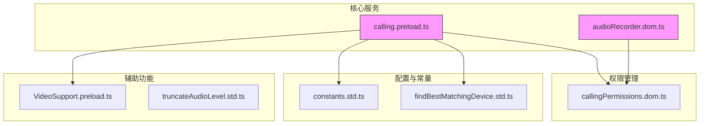
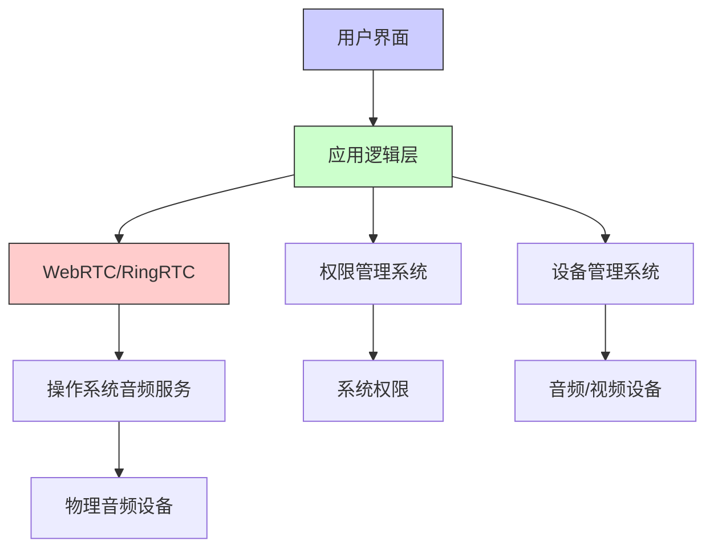
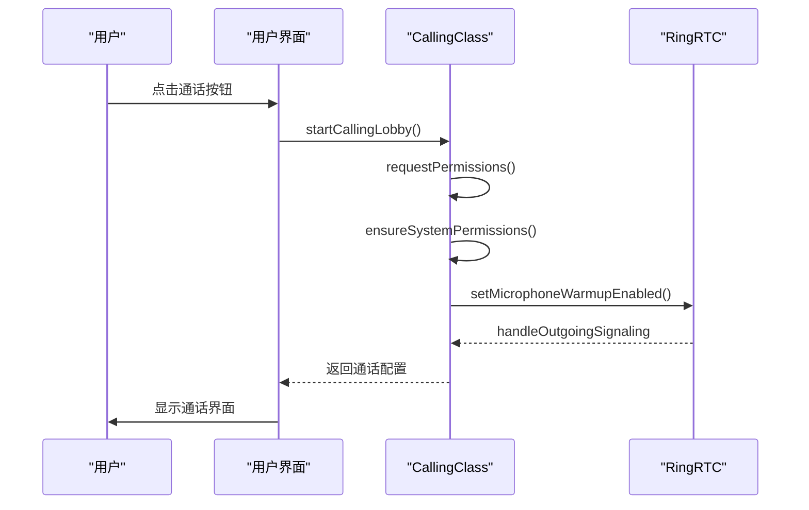
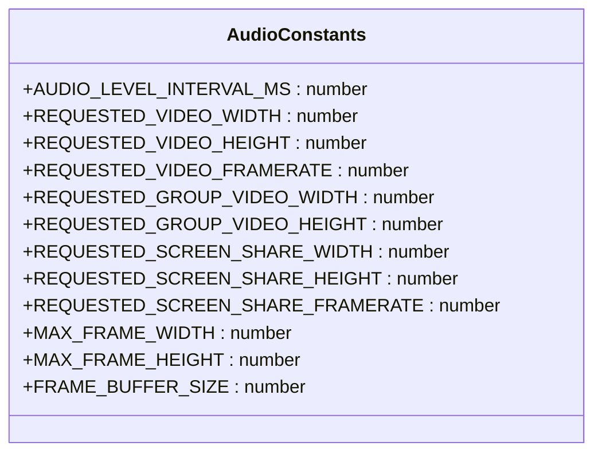
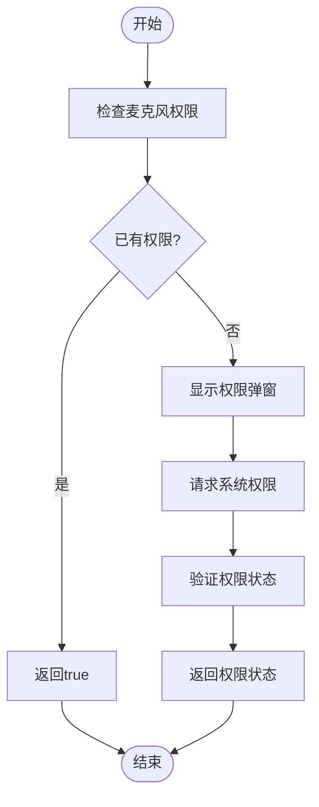
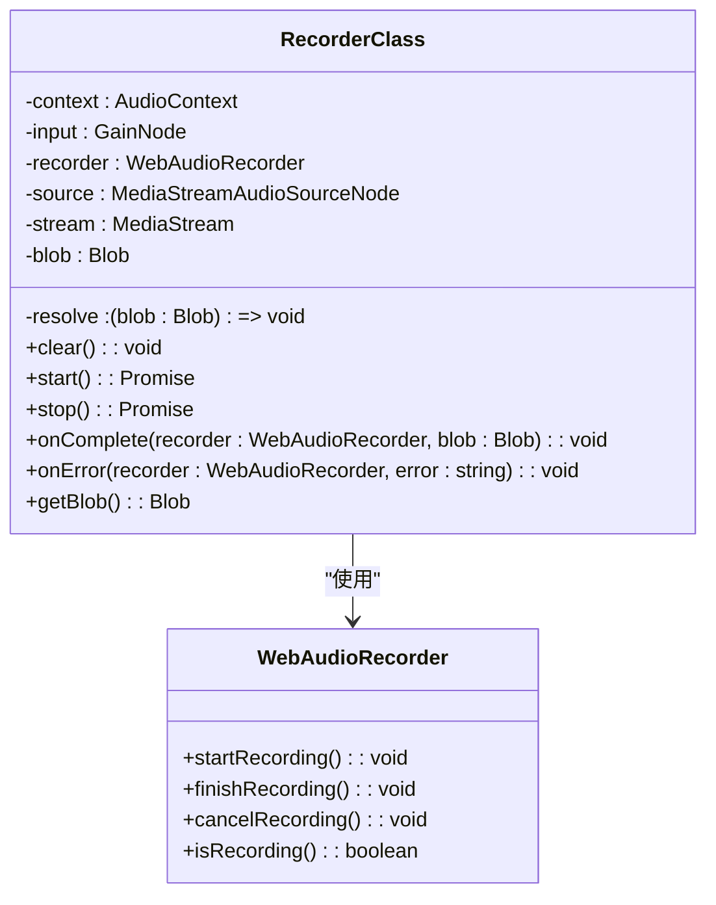
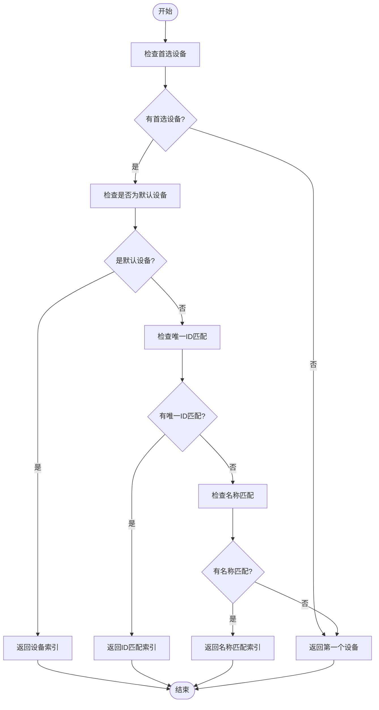
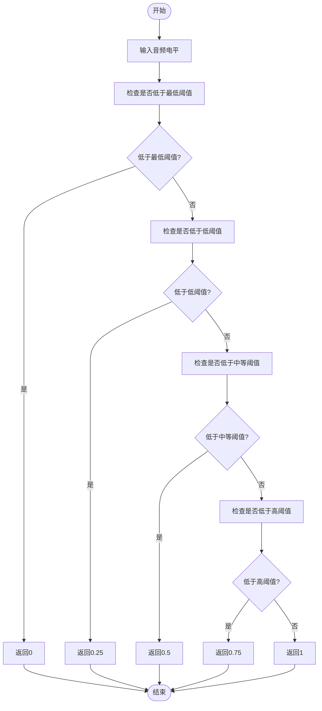
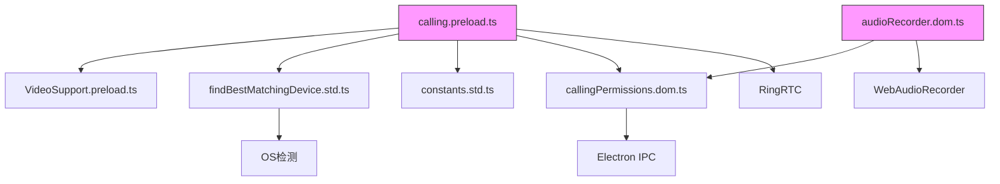

# 语音通话

<cite>
**本文档引用的文件**   
- [calling.preload.ts](file://ts/services/calling.preload.ts)
- [constants.std.ts](file://ts/calling/constants.std.ts)
- [callingPermissions.dom.ts](file://ts/util/callingPermissions.dom.ts)
- [audioRecorder.dom.ts](file://ts/services/audioRecorder.dom.ts)
- [callingHelpers.std.ts](file://ts/state/ducks/callingHelpers.std.ts)
- [VideoSupport.preload.ts](file://ts/calling/VideoSupport.preload.ts)
- [findBestMatchingDevice.std.ts](file://ts/calling/findBestMatchingDevice.std.ts)
- [truncateAudioLevel.std.ts](file://ts/calling/truncateAudioLevel.std.ts)
</cite>

## 目录
1. [简介](#简介)
2. [项目结构](#项目结构)
3. [核心组件](#核心组件)
4. [架构概述](#架构概述)
5. [详细组件分析](#详细组件分析)
6. [依赖分析](#依赖分析)
7. [性能考虑](#性能考虑)
8. [故障排除指南](#故障排除指南)
9. [结论](#结论)

## 简介
本文档深入探讨Signal-Desktop中基于WebRTC的语音通话功能实现。重点分析音频通信的完整流程，包括音频采集、编码、传输和播放。详细解释`calling.preload.ts`中的音频通道建立逻辑、`constants.std.ts`中定义的音频配置参数以及`callingPermissions.dom.ts`中的麦克风权限管理机制。提供实际代码示例展示音频流的创建、音频设备的枚举与选择、音频增益控制和回声消除的实现。记录语音通话API的接口定义、状态机转换和错误处理机制。解释语音通话与系统音频服务、用户界面通知和电池优化功能的集成关系。解决常见的音频质量问题，如回声、背景噪音和音频延迟，并提供相应的调试方法和性能优化建议。

## 项目结构
Signal-Desktop的语音通话功能主要分布在`ts`目录下的多个子模块中。核心音频功能位于`ts/services`和`ts/calling`目录，权限管理位于`ts/util`目录，而音频设备支持和视频相关功能则分布在`ts/calling`和`ts/components`目录中。

**图表来源**
- [calling.preload.ts](file://ts/services/calling.preload.ts)
- [constants.std.ts](file://ts/calling/constants.std.ts)
- [callingPermissions.dom.ts](file://ts/util/callingPermissions.dom.ts)
- [audioRecorder.dom.ts](file://ts/services/audioRecorder.dom.ts)
- [VideoSupport.preload.ts](file://ts/calling/VideoSupport.preload.ts)
- [findBestMatchingDevice.std.ts](file://ts/calling/findBestMatchingDevice.std.ts)
- [truncateAudioLevel.std.ts](file://ts/calling/truncateAudioLevel.std.ts)

**章节来源**
- [calling.preload.ts](file://ts/services/calling.preload.ts)
- [constants.std.ts](file://ts/calling/constants.std.ts)
- [callingPermissions.dom.ts](file://ts/util/callingPermissions.dom.ts)

## 核心组件
Signal-Desktop的语音通话功能由多个核心组件协同工作。`calling.preload.ts`是主要的服务类，负责管理所有通话的生命周期，包括建立、维护和终止通话连接。`audioRecorder.dom.ts`专门处理音频录制功能，而`callingPermissions.dom.ts`则负责管理麦克风和摄像头的系统权限。

**章节来源**
- [calling.preload.ts](file://ts/services/calling.preload.ts#L521-L554)
- [audioRecorder.dom.ts](file://ts/services/audioRecorder.dom.ts#L11-L19)
- [callingPermissions.dom.ts](file://ts/util/callingPermissions.dom.ts#L4-L13)

## 架构概述
Signal-Desktop的语音通话架构基于WebRTC技术栈，采用分层设计模式。最底层是WebRTC原生实现（RingRTC），中间层是Signal的应用逻辑层，最上层是用户界面层。这种架构确保了音频通信的高效性和安全性。

**图表来源**
- [calling.preload.ts](file://ts/services/calling.preload.ts)
- [callingPermissions.dom.ts](file://ts/util/callingPermissions.dom.ts)
- [audioRecorder.dom.ts](file://ts/services/audioRecorder.dom.ts)

## 详细组件分析

### 音频通道建立逻辑分析
`calling.preload.ts`文件中的`CallingClass`是语音通话功能的核心。它通过`initialize`方法初始化RingRTC，并设置各种回调函数来处理来电、信令、日志等事件。音频通道的建立始于`startCallingLobby`方法，该方法负责在用户准备发起或接听通话时进行必要的权限检查和设备准备。

**图表来源**
- [calling.preload.ts](file://ts/services/calling.preload.ts#L642-L797)

**章节来源**
- [calling.preload.ts](file://ts/services/calling.preload.ts#L642-L797)

### 音频配置参数分析
`constants.std.ts`文件定义了语音通话中使用的关键音频和视频配置参数。这些常量控制着音频采集的频率、视频分辨率和屏幕共享的帧率等重要参数。

**图表来源**
- [constants.std.ts](file://ts/calling/constants.std.ts)

**章节来源**
- [constants.std.ts](file://ts/calling/constants.std.ts)

### 麦克风权限管理机制分析
`callingPermissions.dom.ts`文件实现了麦克风权限的管理逻辑。该机制通过Electron的IPC通信与系统进行交互，确保在需要时能够正确请求和验证麦克风权限。

**图表来源**
- [callingPermissions.dom.ts](file://ts/util/callingPermissions.dom.ts)

**章节来源**
- [callingPermissions.dom.ts](file://ts/util/callingPermissions.dom.ts)

### 音频流创建与设备管理分析
`audioRecorder.dom.ts`文件中的`RecorderClass`负责音频流的创建和管理。该类使用Web Audio API来捕获和处理音频数据，实现了完整的录音生命周期管理。

**图表来源**
- [audioRecorder.dom.ts](file://ts/services/audioRecorder.dom.ts)

**章节来源**
- [audioRecorder.dom.ts](file://ts/services/audioRecorder.dom.ts)

### 音频设备匹配算法分析
`findBestMatchingDevice.std.ts`文件实现了音频设备的智能匹配算法。该算法根据用户的首选设备和当前可用设备，选择最合适的音频输入设备。

**图表来源**
- [findBestMatchingDevice.std.ts](file://ts/calling/findBestMatchingDevice.std.ts)

**章节来源**
- [findBestMatchingDevice.std.ts](file://ts/calling/findBestMatchingDevice.std.ts)

### 音频电平截断算法分析
`truncateAudioLevel.std.ts`文件实现了音频电平的截断算法。该算法将原始的音频电平值映射到四个离散的级别，用于在用户界面中显示音频活动状态。

**图表来源**
- [truncateAudioLevel.std.ts](file://ts/calling/truncateAudioLevel.std.ts)

**章节来源**
- [truncateAudioLevel.std.ts](file://ts/calling/truncateAudioLevel.std.ts)

## 依赖分析
语音通话功能依赖于多个内部和外部组件。主要依赖包括WebRTC实现（RingRTC）、音频录制库（WebAudioRecorder）、权限管理系统和设备枚举API。

**图表来源**
- [calling.preload.ts](file://ts/services/calling.preload.ts)
- [audioRecorder.dom.ts](file://ts/services/audioRecorder.dom.ts)
- [callingPermissions.dom.ts](file://ts/util/callingPermissions.dom.ts)
- [findBestMatchingDevice.std.ts](file://ts/calling/findBestMatchingDevice.std.ts)
- [VideoSupport.preload.ts](file://ts/calling/VideoSupport.preload.ts)

**章节来源**
- [calling.preload.ts](file://ts/services/calling.preload.ts)
- [audioRecorder.dom.ts](file://ts/services/audioRecorder.dom.ts)

## 性能考虑
语音通话功能在设计时充分考虑了性能优化。通过预加载音频设备、缓存设备设置和优化音频处理流程来减少延迟和资源消耗。音频电平更新间隔设置为200毫秒，平衡了实时性和性能开销。

## 故障排除指南
常见的音频问题包括权限被拒绝、设备不可用和音频延迟。调试时应首先检查系统权限设置，然后验证设备是否正确枚举，最后检查网络连接质量。使用内置的WebRTC调试工具可以帮助诊断更复杂的问题。

**章节来源**
- [callingPermissions.dom.ts](file://ts/util/callingPermissions.dom.ts#L4-L13)
- [calling.preload.ts](file://ts/services/calling.preload.ts#L436-L455)

## 结论
Signal-Desktop的语音通话功能通过精心设计的架构和组件实现了高质量的音频通信。基于WebRTC的技术栈确保了跨平台兼容性和安全性，而分层的实现方式使得功能扩展和维护更加容易。权限管理和设备选择算法保证了良好的用户体验，而性能优化措施确保了通话的流畅性。