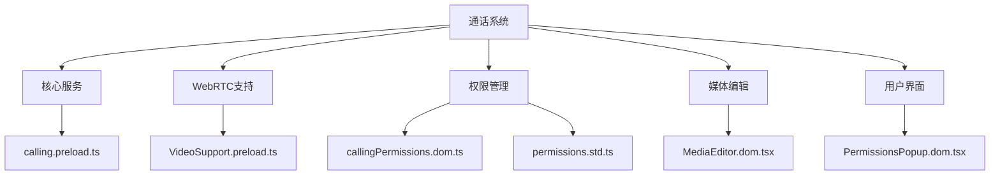
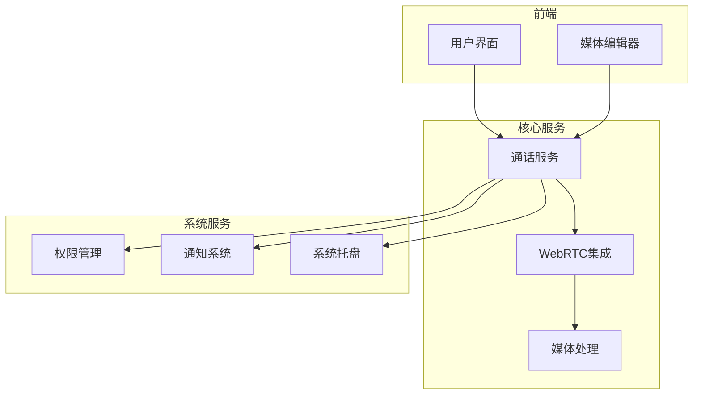
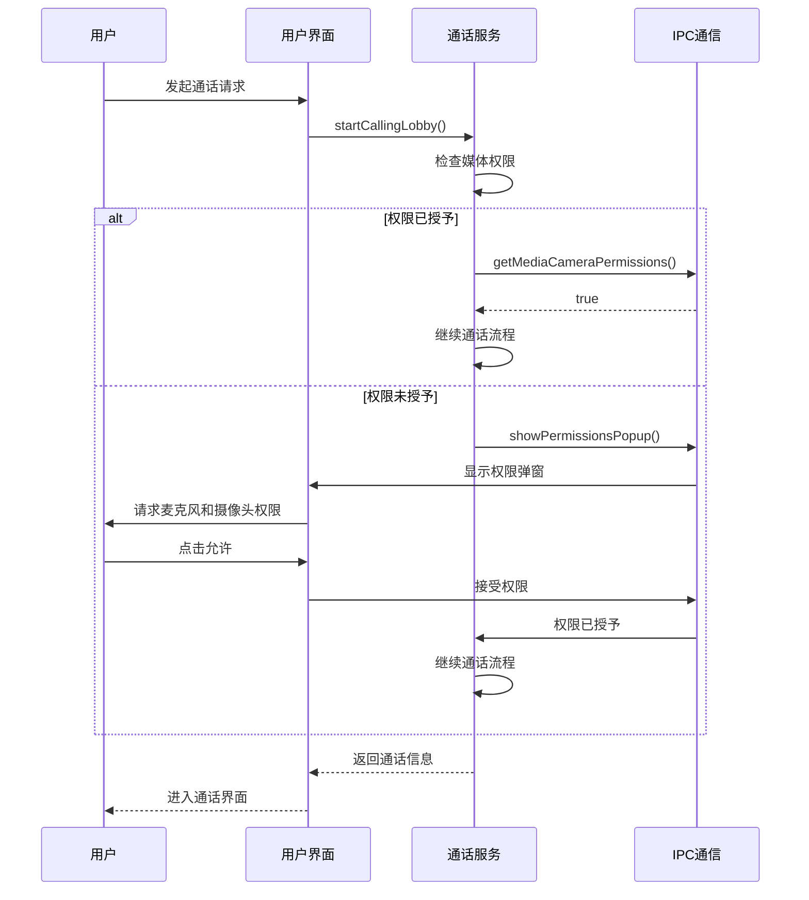
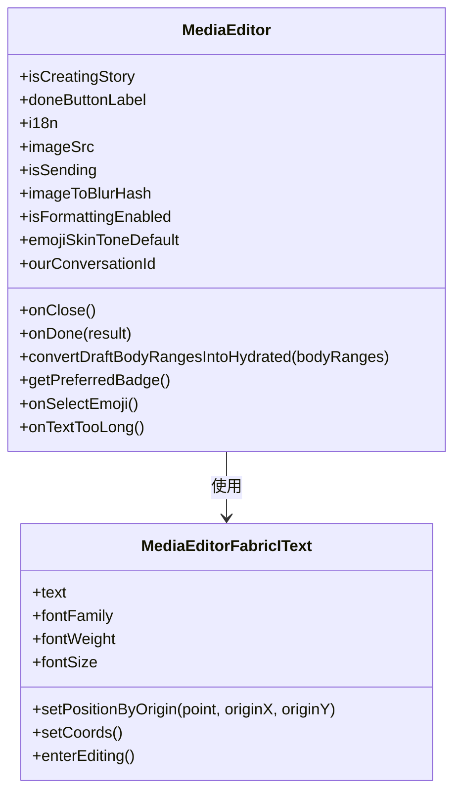
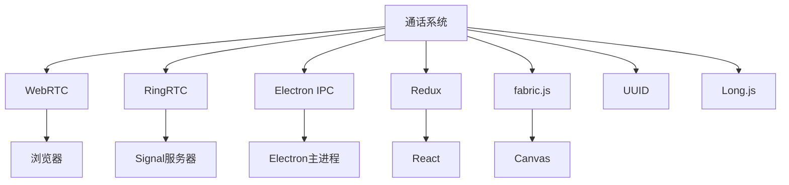
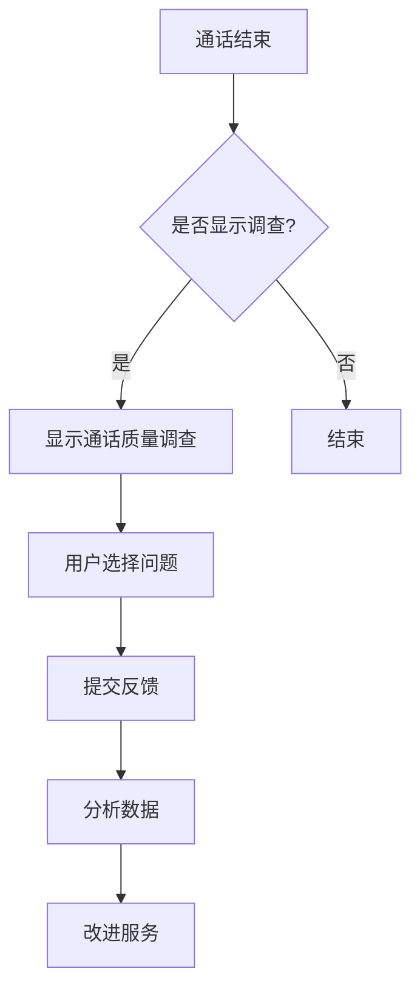

# 通话系统

<cite>
**本文档中引用的文件**   
- [calling.preload.ts](file://ts/services/calling.preload.ts)
- [callingPermissions.dom.ts](file://ts/util/callingPermissions.dom.ts)
- [MediaEditor.dom.tsx](file://ts/components/MediaEditor.dom.tsx)
- [VideoSupport.preload.ts](file://ts/calling/VideoSupport.preload.ts)
- [constants.std.ts](file://ts/calling/constants.std.ts)
- [permissions.std.ts](file://app/permissions.std.ts)
- [preload.preload.ts](file://ts/windows/permissions/preload.preload.ts)
- [PermissionsPopup.dom.tsx](file://ts/components/PermissionsPopup.dom.tsx)
- [app.dom.tsx](file://ts/windows/permissions/app.dom.tsx)
- [requestMicrophonePermissions.dom.ts](file://ts/util/requestMicrophonePermissions.dom.ts)
</cite>

## 目录
1. [简介](#简介)
2. [项目结构](#项目结构)
3. [核心组件](#核心组件)
4. [架构概述](#架构概述)
5. [详细组件分析](#详细组件分析)
6. [依赖分析](#依赖分析)
7. [性能考虑](#性能考虑)
8. [故障排除指南](#故障排除指南)
9. [结论](#结论)

## 简介
本文档深入探讨Signal-Desktop应用程序中的通话系统实现，重点分析语音通话、视频通话和群组通话的技术细节。文档详细解释了WebRTC集成、媒体流处理、网络适配策略以及与用户界面和系统服务的集成。通过分析实际代码库中的关键文件，如`calling.preload.ts`中的通话控制逻辑、`mediaEditor`中的媒体处理功能和`callingPermissions.dom.ts`中的权限管理，为开发者提供全面的技术参考。

## 项目结构
Signal-Desktop的通话系统分布在多个目录中，主要组件包括：
- `ts/services/`：包含核心通话服务逻辑
- `ts/calling/`：包含WebRTC相关支持功能
- `ts/util/`：包含通话相关的实用工具
- `ts/components/`：包含用户界面组件
- `app/`：包含系统级权限处理



**图源**
- [calling.preload.ts](file://ts/services/calling.preload.ts)
- [VideoSupport.preload.ts](file://ts/calling/VideoSupport.preload.ts)
- [callingPermissions.dom.ts](file://ts/util/callingPermissions.dom.ts)
- [MediaEditor.dom.tsx](file://ts/components/MediaEditor.dom.tsx)
- [PermissionsPopup.dom.tsx](file://ts/components/PermissionsPopup.dom.tsx)

**本节来源**
- [calling.preload.ts](file://ts/services/calling.preload.ts)
- [VideoSupport.preload.ts](file://ts/calling/VideoSupport.preload.ts)
- [callingPermissions.dom.ts](file://ts/util/callingPermissions.dom.ts)

## 核心组件
通话系统的核心组件包括通话控制服务、WebRTC集成、媒体流处理和权限管理系统。`calling.preload.ts`文件实现了主要的通话逻辑，包括直接通话、群组通话和通话链接的创建与管理。系统使用WebRTC进行实时音视频通信，并通过`VideoSupport.preload.ts`处理视频捕获和渲染。

**本节来源**
- [calling.preload.ts](file://ts/services/calling.preload.ts#L1-L800)
- [VideoSupport.preload.ts](file://ts/calling/VideoSupport.preload.ts#L1-L505)

## 架构概述
Signal-Desktop的通话系统采用分层架构，将通话控制、媒体处理和用户界面分离。系统通过WebRTC与Signal服务器通信，使用SFU（选择性转发单元）架构处理群组通话。媒体流通过GUM（Get User Media）API获取，并通过Canvas进行渲染。



**图源**
- [calling.preload.ts](file://ts/services/calling.preload.ts#L1-L800)
- [VideoSupport.preload.ts](file://ts/calling/VideoSupport.preload.ts#L1-L505)
- [callingPermissions.dom.ts](file://ts/util/callingPermissions.dom.ts#L1-L14)

## 详细组件分析

### 通话控制分析
`calling.preload.ts`文件实现了通话系统的核心功能，包括直接通话、群组通话和通话链接的管理。系统使用RingRTC库进行WebRTC通信，并通过Redux与用户界面交互。

#### 通话控制类
```mermaid
classDiagram
class CallingClass {
+initialize(reduxInterface, sfuUrl)
+startCallingLobby(conversation, hasLocalAudio, preferLocalVideo)
+stopCallingLobby(conversationId)
+createCallLink()
+deleteCallLink(callLink)
+updateCallLinkName(callLink, name)
+updateCallLinkRestrictions(callLink, restrictions)
+readCallLink(callLinkRootKey, callLinkEpoch)
+startCallLinkLobby(callLinkRootKey, callLinkEpoch, adminPasskey, hasLocalAudio, preferLocalVideo)
+startOutgoingDirectCall(conversationId, hasLocalAudio, hasLocalVideo)
+joinGroupCall(conversationId, hasLocalAudio, hasLocalVideo, shouldRing)
+setLocalPreviewContainer(container)
+cleanupStaleRingingCalls()
+peekGroupCall(conversationId)
+peekCallLinkCall(roomId, rootKey, epoch)
+connectGroupCall(conversationId, {groupId, publicParams, secretParams})
+connectCallLinkCall({roomId, authCredentialPresentation, callLinkRootKey, callLinkEpoch, adminPasskey, endorsementsPublicKey})
+setGroupCallVideoRequest(conversationId, resolutions, speakerHeight)
+groupMembersChanged(conversationId)
+approveUser(conversationId, aci)
+denyUser(conversationId, aci)
+removeClient(conversationId, demuxId)
+getGroupCallVideoFrameSource(conversationId, demuxId)
+resendGroupCallMediaKeys(conversationId)
+sendGroupCallRaiseHand(conversationId, raise)
+sendGroupCallReaction(conversationId, value)
+setAllRtcStatsInterval(intervalMillis)
}
```

**图源**
- [calling.preload.ts](file://ts/services/calling.preload.ts#L521-L4268)

### 权限管理分析
通话系统需要访问用户的麦克风和摄像头，因此实现了完善的权限管理机制。系统在用户尝试进行音视频通话时请求必要的权限，并提供清晰的权限说明。

#### 权限请求流程


**图源**
- [callingPermissions.dom.ts](file://ts/util/callingPermissions.dom.ts#L4-L13)
- [requestMicrophonePermissions.dom.ts](file://ts/util/requestMicrophonePermissions.dom.ts#L4-L15)
- [preload.preload.ts](file://ts/windows/permissions/preload.preload.ts#L1-L40)
- [app.dom.tsx](file://ts/windows/permissions/app.dom.tsx#L1-L49)

### 媒体处理分析
媒体编辑器组件允许用户在发送前编辑图片和视频，支持添加文本、绘图和贴纸等效果。

#### 媒体编辑器类


**图源**
- [MediaEditor.dom.tsx](file://ts/components/MediaEditor.dom.tsx#L57-L1279)
- [MediaEditorFabricIText.dom.ts](file://ts/mediaEditor/MediaEditorFabricIText.dom.ts#L7-L38)

## 依赖分析
通话系统依赖于多个外部库和内部模块，包括WebRTC、RingRTC、Electron IPC通信和Redux状态管理。



**图源**
- [calling.preload.ts](file://ts/services/calling.preload.ts#L4-L46)
- [VideoSupport.preload.ts](file://ts/calling/VideoSupport.preload.ts#L8-L11)
- [MediaEditor.dom.tsx](file://ts/components/MediaEditor.dom.tsx#L4-L5)

**本节来源**
- [calling.preload.ts](file://ts/services/calling.preload.ts#L4-L46)
- [VideoSupport.preload.ts](file://ts/calling/VideoSupport.preload.ts#L8-L11)
- [MediaEditor.dom.tsx](file://ts/components/MediaEditor.dom.tsx#L4-L5)

## 性能考虑
通话系统在设计时考虑了多种性能优化策略，包括：
- 使用Canvas进行视频渲染以提高性能
- 限制通话统计数据的计算频率
- 预加载媒体设备以减少延迟
- 优化WebRTC配置参数

系统通过`AUDIO_LEVEL_INTERVAL_MS`常量控制音频电平更新频率，默认为200毫秒，平衡了性能和用户体验。

## 故障排除指南
### 常见问题及解决方案

| 问题 | 可能原因 | 解决方案 |
|------|---------|---------|
| 无法进行视频通话 | 摄像头权限未授予 | 检查系统权限设置，重新请求权限 |
| 音频质量差 | 回声或网络抖动 | 启用回声消除，检查网络连接 |
| 视频卡顿 | 网络带宽不足 | 降低视频分辨率，切换到更稳定的网络 |
| 无法连接到群组通话 | ICE服务器问题 | 检查ICE服务器配置，重试连接 |

### 通话质量调查
系统在通话结束后可能会显示通话质量调查，收集用户反馈以改进服务质量。



**图源**
- [CallQualitySurveyDialog.dom.tsx](file://ts/components/CallQualitySurveyDialog.dom.tsx#L401-L440)
- [callQualitySurvey.dom.ts](file://ts/util/callQualitySurvey.dom.ts#L92-L113)
- [CallQualitySurvey.std.ts](file://ts/types/CallQualitySurvey.std.ts#L1-L52)

**本节来源**
- [CallQualitySurveyDialog.dom.tsx](file://ts/components/CallQualitySurveyDialog.dom.tsx#L401-L440)
- [callQualitySurvey.dom.ts](file://ts/util/callQualitySurvey.dom.ts#L92-L113)
- [CallQualitySurvey.std.ts](file://ts/types/CallQualitySurvey.std.ts#L1-L52)

## 结论
Signal-Desktop的通话系统是一个复杂而完善的实时通信解决方案，通过WebRTC技术实现了高质量的语音和视频通话功能。系统设计考虑了安全性、性能和用户体验，提供了丰富的功能和灵活的配置选项。通过深入分析核心组件和实现细节，开发者可以更好地理解和扩展通话系统功能。