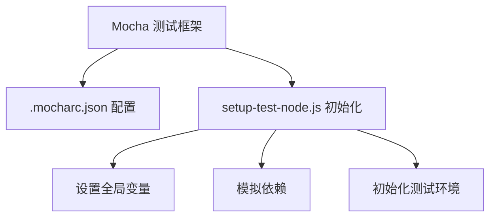
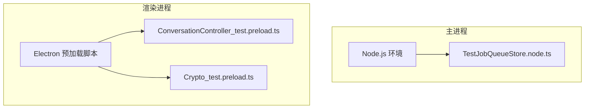
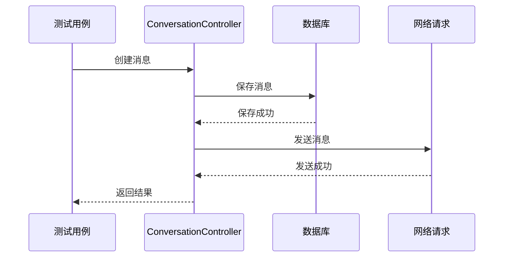
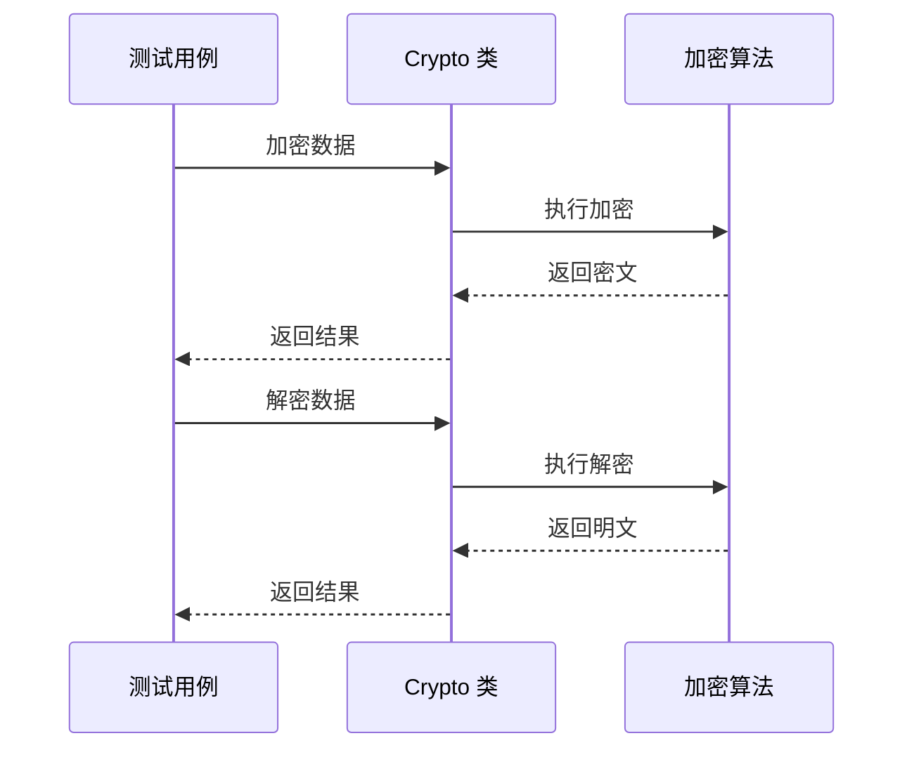
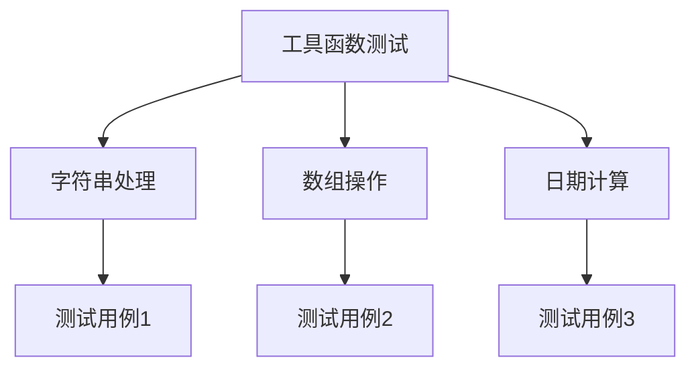
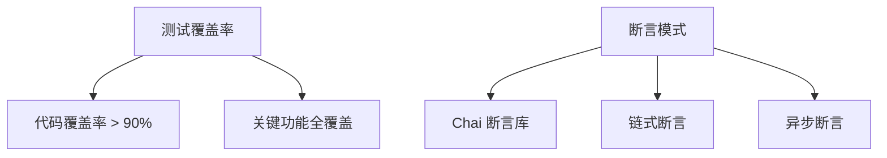
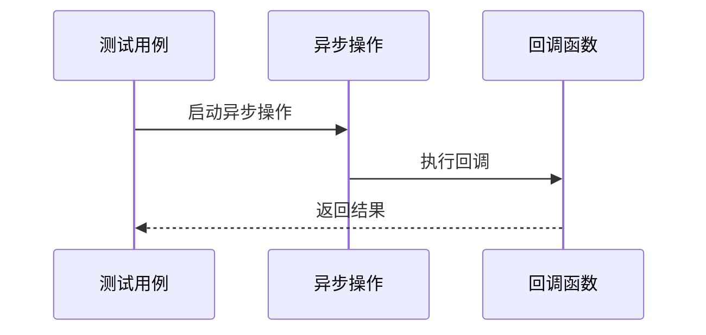
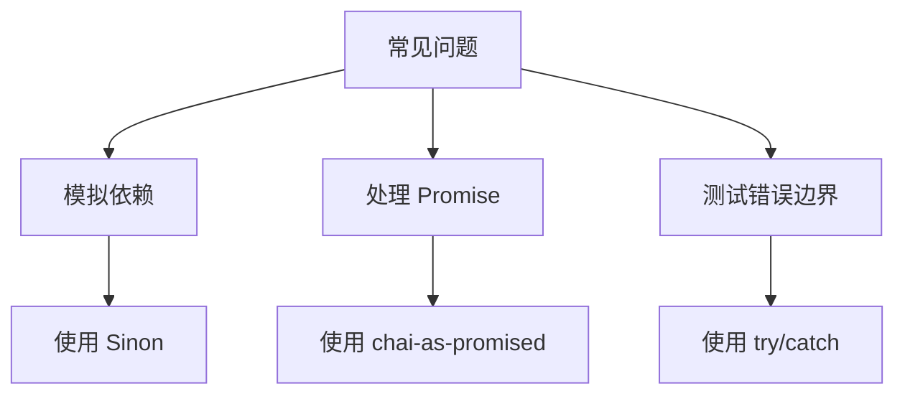

# 单元测试

<cite>
**本文档中引用的文件**  
- [ConversationController.preload.ts](file://ts/ConversationController.preload.ts)
- [Crypto.node.ts](file://ts/Crypto.node.ts)
- [ConversationController_test.preload.ts](file://ts/test-electron/ConversationController_test.preload.ts)
- [Crypto_test.preload.ts](file://ts/test-electron/Crypto_test.preload.ts)
- [test.js](file://test/test.js)
- [setup-test-node.js](file://test/setup-test-node.js)
- [.mocharc.json](file://.mocharc.json)
- [test-electron.js](file://ts/scripts/test-electron.node.ts)
</cite>

## 目录
1. [简介](#简介)
2. [测试框架配置](#测试框架配置)
3. [主进程与渲染进程测试](#主进程与渲染进程测试)
4. [消息处理测试](#消息处理测试)
5. [加密功能测试](#加密功能测试)
6. [工具函数测试](#工具函数测试)
7. [测试覆盖率与断言模式](#测试覆盖率与断言模式)
8. [异步测试处理](#异步测试处理)
9. [常见问题解决](#常见问题解决)
10. [结论](#结论)

## 简介
Signal-Desktop 使用 Mocha 和 Sinon 框架进行单元测试，覆盖主进程和渲染进程的关键功能。本文档详细说明如何编写针对消息处理、加密功能和工具函数的测试用例，包括实际代码库中的具体示例。文档还记录了测试覆盖率要求、断言模式和异步测试处理方法，并提供了解决常见问题的指导。

**Section sources**
- [test.js](file://test/test.js#L1-L50)
- [setup-test-node.js](file://test/setup-test-node.js#L1-L54)

## 测试框架配置
Signal-Desktop 的测试框架基于 Mocha 和 Sinon，配置文件包括 `.mocharc.json` 和 `setup-test-node.js`。Mocha 用于定义测试套件和测试用例，Sinon 用于创建模拟和存根。测试环境通过 `setup-test-node.js` 文件进行初始化，设置全局变量和模拟依赖。

**Diagram sources**
- [.mocharc.json](file://.mocharc.json#L1-L4)
- [setup-test-node.js](file://test/setup-test-node.js#L1-L54)

**Section sources**
- [.mocharc.json](file://.mocharc.json#L1-L4)
- [setup-test-node.js](file://test/setup-test-node.js#L1-L54)

## 主进程与渲染进程测试
主进程和渲染进程的测试分别在不同的环境中运行。主进程测试使用 Node.js 环境，渲染进程测试使用 Electron 的预加载脚本环境。测试文件通常以 `_test.preload.ts` 结尾，表示它们在预加载脚本环境中运行。

**Diagram sources**
- [TestJobQueueStore.node.ts](file://ts/test-node/jobs/TestJobQueueStore.node.ts#L1-L1)
- [ConversationController_test.preload.ts](file://ts/test-electron/ConversationController_test.preload.ts#L1-L1)
- [Crypto_test.preload.ts](file://ts/test-electron/Crypto_test.preload.ts#L1-L1)

**Section sources**
- [ConversationController_test.preload.ts](file://ts/test-electron/ConversationController_test.preload.ts#L1-L1)
- [Crypto_test.preload.ts](file://ts/test-electron/Crypto_test.preload.ts#L1-L1)

## 消息处理测试
消息处理测试主要集中在 `ConversationController` 类上，验证消息的创建、更新和删除功能。测试用例使用 Sinon 模拟数据库操作和网络请求，确保测试的独立性和可重复性。

**Diagram sources**
- [ConversationController.preload.ts](file://ts/ConversationController.preload.ts#L1-L2092)
- [ConversationController_test.preload.ts](file://ts/test-electron/ConversationController_test.preload.ts#L1-L1)

**Section sources**
- [ConversationController.preload.ts](file://ts/ConversationController.preload.ts#L1-L2092)
- [ConversationController_test.preload.ts](file://ts/test-electron/ConversationController_test.preload.ts#L1-L1)

## 加密功能测试
加密功能测试集中在 `Crypto` 类上，验证加密和解密操作的正确性。测试用例使用 Sinon 模拟加密算法和密钥生成，确保测试的独立性和可重复性。

**Diagram sources**
- [Crypto.node.ts](file://ts/Crypto.node.ts#L1-L715)
- [Crypto_test.preload.ts](file://ts/test-electron/Crypto_test.preload.ts#L1-L1)

**Section sources**
- [Crypto.node.ts](file://ts/Crypto.node.ts#L1-L715)
- [Crypto_test.preload.ts](file://ts/test-electron/Crypto_test.preload.ts#L1-L1)

## 工具函数测试
工具函数测试覆盖了各种辅助功能，如字符串处理、数组操作和日期计算。测试用例使用 Sinon 模拟外部依赖，确保测试的独立性和可重复性。

**Diagram sources**
- [util 目录](file://ts/util)
- [test-helpers 目录](file://ts/test-helpers)

**Section sources**
- [util 目录](file://ts/util)
- [test-helpers 目录](file://ts/test-helpers)

## 测试覆盖率与断言模式
Signal-Desktop 的测试覆盖率要求较高，确保关键功能的代码覆盖率超过 90%。断言模式使用 Chai 断言库，支持链式断言和异步断言。

**Diagram sources**
- [test.js](file://test/test.js#L1-L50)
- [setup-test-node.js](file://test/setup-test-node.js#L1-L54)

**Section sources**
- [test.js](file://test/test.js#L1-L50)
- [setup-test-node.js](file://test/setup-test-node.js#L1-L54)

## 异步测试处理
异步测试处理使用 Mocha 的 `async/await` 语法，确保异步操作的正确执行。测试用例使用 Sinon 模拟异步操作，确保测试的独立性和可重复性。

**Diagram sources**
- [test.js](file://test/test.js#L1-L50)
- [setup-test-node.js](file://test/setup-test-node.js#L1-L54)

**Section sources**
- [test.js](file://test/test.js#L1-L50)
- [setup-test-node.js](file://test/setup-test-node.js#L1-L54)

## 常见问题解决
常见问题包括模拟依赖、处理 Promise 和测试错误边界。解决方案包括使用 Sinon 模拟依赖、使用 `chai-as-promised` 处理 Promise 和使用 `try/catch` 测试错误边界。

**Diagram sources**
- [test.js](file://test/test.js#L1-L50)
- [setup-test-node.js](file://test/setup-test-node.js#L1-L54)

**Section sources**
- [test.js](file://test/test.js#L1-L50)
- [setup-test-node.js](file://test/setup-test-node.js#L1-L54)

## 结论
Signal-Desktop 的单元测试框架基于 Mocha 和 Sinon，覆盖主进程和渲染进程的关键功能。通过详细的测试用例和高覆盖率要求，确保了代码的可靠性和稳定性。文档提供了编写测试用例的指导和解决常见问题的方法，帮助开发者更好地理解和使用测试框架。