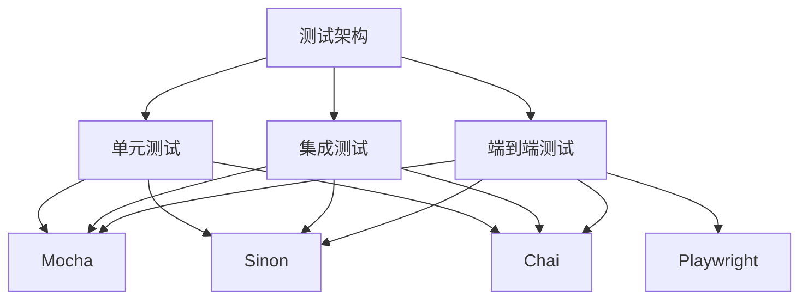
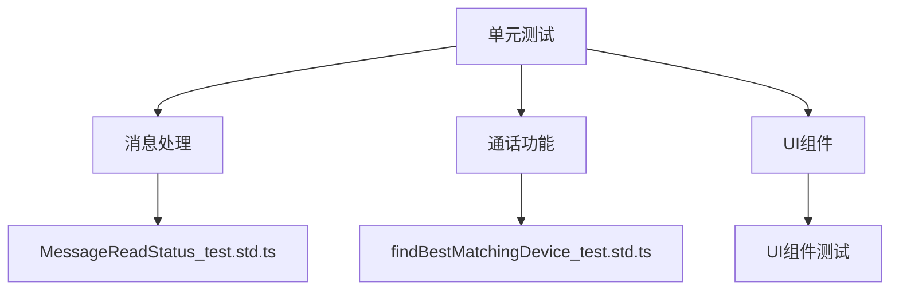
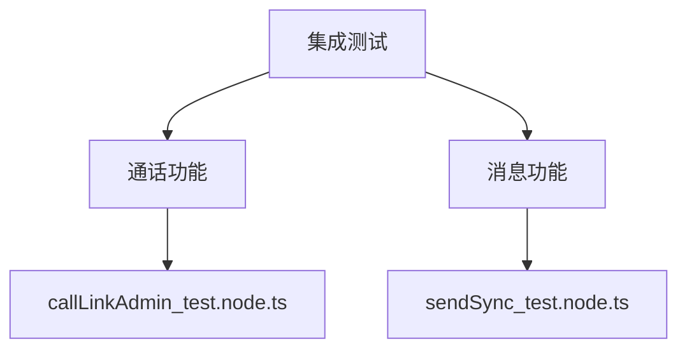
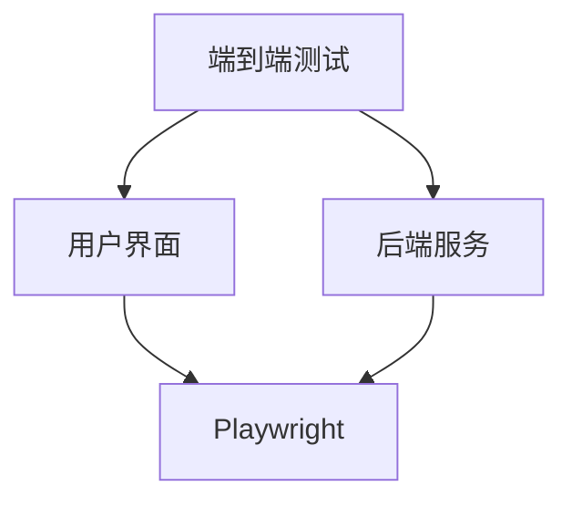
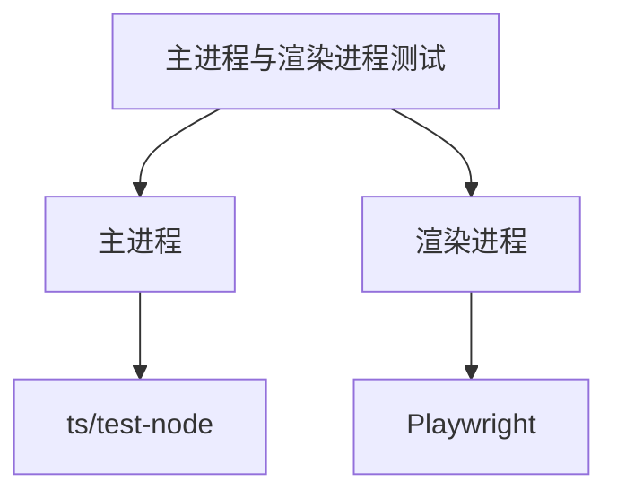
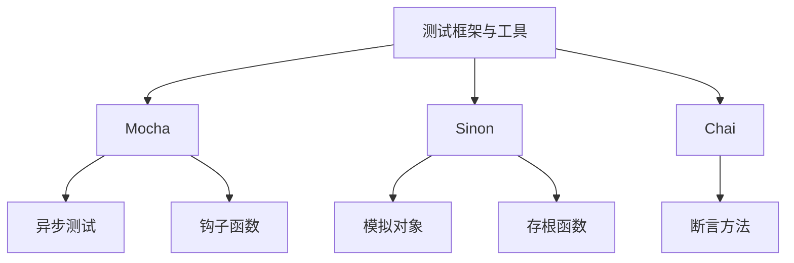
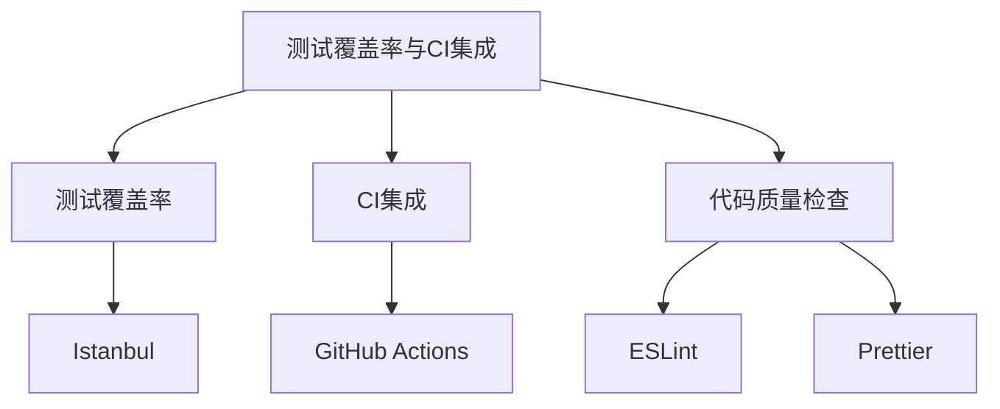
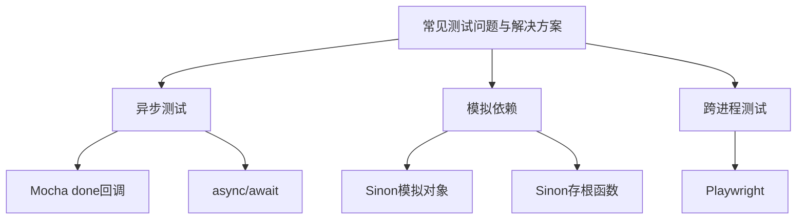

# 测试策略

<cite>
**本文档中引用的文件**  
- [package.json](file://package.json)
- [.mocharc.json](file://.mocharc.json)
- [test/setup-test-node.js](file://test/setup-test-node.js)
- [test/test.js](file://test/test.js)
- [ts/test-mock/bootstrap.node.ts](file://ts/test-mock/bootstrap.node.ts)
- [ts/test-mock/setup-ci.node.ts](file://ts/test-mock/setup-ci.node.ts)
- [ts/test-mock/calling/callLinkAdmin_test.node.ts](file://ts/test-mock/calling/callLinkAdmin_test.node.ts)
- [ts/test-mock/messaging/sendSync_test.node.ts](file://ts/test-mock/messaging/sendSync_test.node.ts)
- [ts/test-node/calling/findBestMatchingDevice_test.std.ts](file://ts/test-node/calling/findBestMatchingDevice_test.std.ts)
- [ts/test-helpers/getDefaultConversation.std.ts](file://ts/test-helpers/getDefaultConversation.std.ts)
</cite>

## 目录
1. [简介](#简介)
2. [测试架构概述](#测试架构概述)
3. [单元测试](#单元测试)
4. [集成测试](#集成测试)
5. [端到端测试](#端到端测试)
6. [主进程与渲染进程测试](#主进程与渲染进程测试)
7. [测试框架与工具](#测试框架与工具)
8. [测试覆盖率与CI集成](#测试覆盖率与ci集成)
9. [常见测试问题与解决方案](#常见测试问题与解决方案)
10. [结论](#结论)

## 简介

Signal-Desktop的测试策略旨在确保应用程序的高质量、可靠性和安全性。本策略详细说明了单元测试、集成测试和端到端测试的方法，涵盖了使用Mocha、Sinon等测试框架的实践，以及如何编写针对主进程和渲染进程的测试。文档还包括来自实际代码库的具体示例，如消息处理测试、通话功能测试和UI组件测试。此外，还记录了测试覆盖率要求、CI集成和代码质量检查流程，并解决了常见测试问题及其解决方案。

**Section sources**
- [package.json](file://package.json#L49-L57)

## 测试架构概述

Signal-Desktop的测试架构分为三个主要层次：单元测试、集成测试和端到端测试。单元测试用于验证单个函数或模块的正确性；集成测试确保不同模块之间的交互按预期工作；端到端测试模拟用户操作，验证整个应用流程的完整性。测试框架主要使用Mocha，配合Sinon进行模拟和存根，Chai用于断言。

**Diagram sources**
- [package.json](file://package.json#L337-L356)
- [test/setup-test-node.js](file://test/setup-test-node.js#L4-L12)

## 单元测试

单元测试是验证单个函数或模块正确性的基础。在Signal-Desktop中，单元测试主要集中在`ts/test-node`目录下，覆盖了各种核心功能，如消息处理、通话功能和UI组件。例如，`findBestMatchingDevice_test.std.ts`文件中的测试验证了音频设备匹配逻辑的正确性。

**Diagram sources**
- [ts/test-node/calling/findBestMatchingDevice_test.std.ts](file://ts/test-node/calling/findBestMatchingDevice_test.std.ts#L8-L181)
- [ts/test-node/messages/MessageReadStatus_test.std.ts](file://ts/test-node/messages/MessageReadStatus_test.std.ts)

**Section sources**
- [ts/test-node/calling/findBestMatchingDevice_test.std.ts](file://ts/test-node/calling/findBestMatchingDevice_test.std.ts#L8-L181)

## 集成测试

集成测试确保不同模块之间的交互按预期工作。在Signal-Desktop中，集成测试主要集中在`ts/test-mock`目录下，使用Playwright进行浏览器自动化测试。例如，`callLinkAdmin_test.node.ts`文件中的测试验证了创建和编辑通话链接的功能。

**Diagram sources**
- [ts/test-mock/calling/callLinkAdmin_test.node.ts](file://ts/test-mock/calling/callLinkAdmin_test.node.ts#L9-L88)
- [ts/test-mock/messaging/sendSync_test.node.ts](file://ts/test-mock/messaging/sendSync_test.node.ts#L14-L94)

**Section sources**
- [ts/test-mock/calling/callLinkAdmin_test.node.ts](file://ts/test-mock/calling/callLinkAdmin_test.node.ts#L9-L88)

## 端到端测试

端到端测试模拟用户操作，验证整个应用流程的完整性。在Signal-Desktop中，端到端测试使用Playwright进行浏览器自动化测试，确保用户界面和后端服务的协同工作。例如，`sendSync_test.node.ts`文件中的测试验证了在群组中发送同步消息的功能。

**Diagram sources**
- [ts/test-mock/messaging/sendSync_test.node.ts](file://ts/test-mock/messaging/sendSync_test.node.ts#L14-L94)

**Section sources**
- [ts/test-mock/messaging/sendSync_test.node.ts](file://ts/test-mock/messaging/sendSync_test.node.ts#L14-L94)

## 主进程与渲染进程测试

Signal-Desktop采用Electron架构，分为主进程和渲染进程。主进程负责管理应用生命周期和系统资源，而渲染进程负责用户界面。测试策略需要分别针对这两个进程编写测试。主进程的测试主要集中在`ts/test-node`目录下，而渲染进程的测试则使用Playwright进行自动化测试。

**Diagram sources**
- [ts/test-node](file://ts/test-node)
- [ts/test-mock](file://ts/test-mock)

**Section sources**
- [ts/test-node](file://ts/test-node)
- [ts/test-mock](file://ts/test-mock)

## 测试框架与工具

Signal-Desktop使用Mocha作为主要的测试框架，配合Sinon进行模拟和存根，Chai用于断言。Mocha提供了灵活的测试结构，支持异步测试和钩子函数。Sinon允许创建模拟对象和存根函数，以便隔离测试单元。Chai提供了丰富的断言方法，使测试代码更加清晰易读。

**Diagram sources**
- [package.json](file://package.json#L337-L356)
- [test/setup-test-node.js](file://test/setup-test-node.js#L4-L12)

**Section sources**
- [package.json](file://package.json#L337-L356)
- [test/setup-test-node.js](file://test/setup-test-node.js#L4-L12)

## 测试覆盖率与CI集成

Signal-Desktop的测试策略包括严格的测试覆盖率要求和CI集成。测试覆盖率通过工具如Istanbul进行监控，确保关键代码路径得到充分测试。CI集成使用GitHub Actions，每次提交代码后自动运行测试，确保代码质量。此外，代码质量检查流程包括ESLint和Prettier，确保代码风格一致。

**Diagram sources**
- [package.json](file://package.json#L58-L67)
- [.mocharc.json](file://.mocharc.json#L1-L4)

**Section sources**
- [package.json](file://package.json#L58-L67)
- [.mocharc.json](file://.mocharc.json#L1-L4)

## 常见测试问题与解决方案

在Signal-Desktop的测试过程中，可能会遇到一些常见问题，如异步测试、模拟依赖和跨进程测试。异步测试可以通过Mocha的`done`回调或`async/await`语法解决。模拟依赖可以使用Sinon创建模拟对象和存根函数。跨进程测试则需要使用Playwright进行浏览器自动化测试，确保主进程和渲染进程的协同工作。

**Diagram sources**
- [test/setup-test-node.js](file://test/setup-test-node.js#L14-L15)
- [ts/test-mock/bootstrap.node.ts](file://ts/test-mock/bootstrap.node.ts#L406-L419)

**Section sources**
- [test/setup-test-node.js](file://test/setup-test-node.js#L14-L15)
- [ts/test-mock/bootstrap.node.ts](file://ts/test-mock/bootstrap.node.ts#L406-L419)

## 结论

Signal-Desktop的测试策略全面覆盖了单元测试、集成测试和端到端测试，确保了应用程序的高质量、可靠性和安全性。通过使用Mocha、Sinon等测试框架，以及Playwright进行浏览器自动化测试，能够有效验证应用的各个层面。测试覆盖率要求和CI集成进一步保障了代码质量，而解决常见测试问题的方案则提高了测试的效率和可靠性。未来，将继续优化测试策略，引入更多自动化工具，提升测试覆盖率和测试效率。