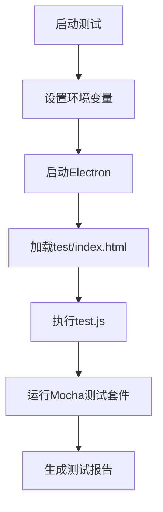
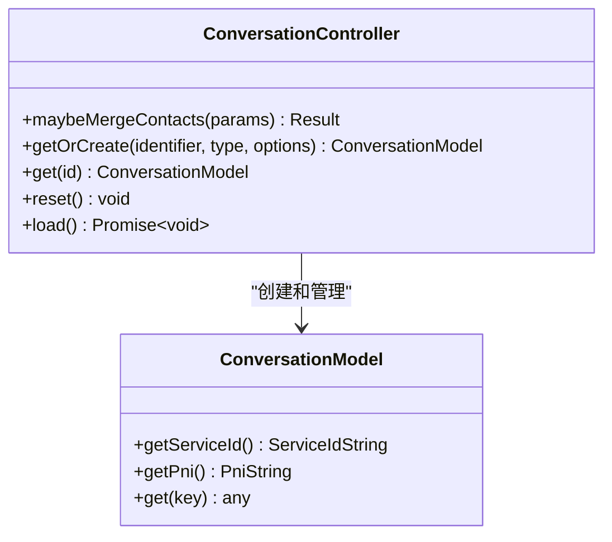
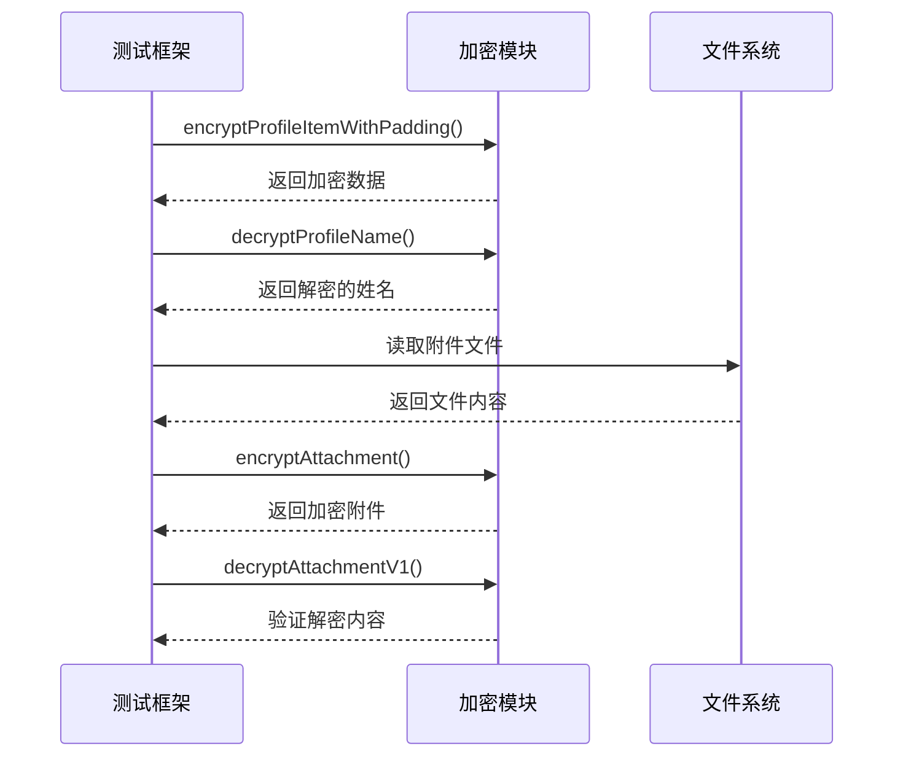
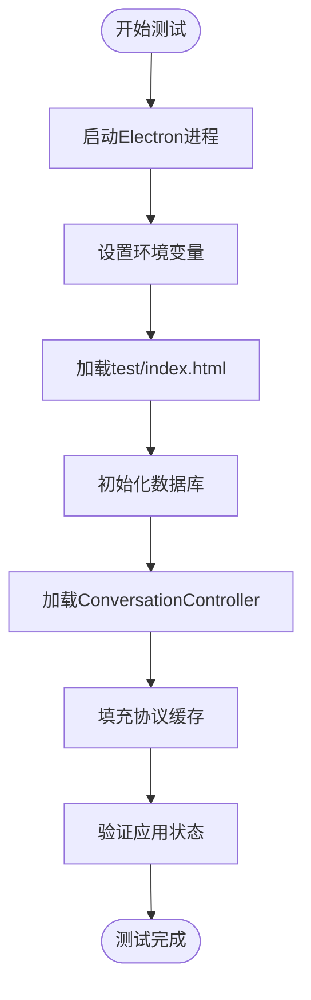
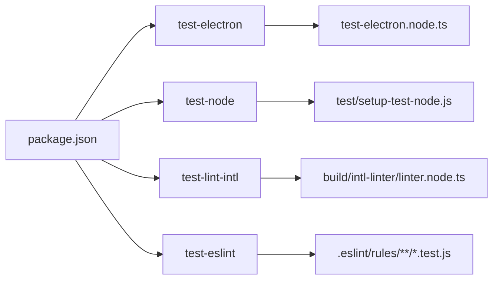
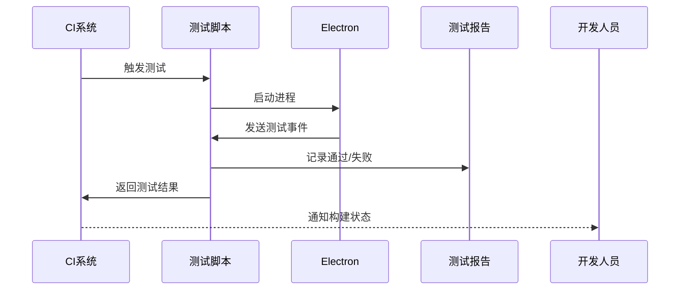

# 端到端测试

<cite>
**本文档引用的文件**   
- [test-electron.js](file://ts/scripts/test-electron.js)
- [test-electron.node.ts](file://ts/scripts/test-electron.node.ts)
- [test.js](file://test/test.js)
- [index.html](file://test/index.html)
- [ConversationController_test.js](file://ts/test-electron/ConversationController_test.js)
- [ConversationController_test.preload.ts](file://ts/test-electron/ConversationController_test.preload.ts)
- [Crypto_test.js](file://ts/test-electron/Crypto_test.js)
- [Crypto_test.preload.ts](file://ts/test-electron/Crypto_test.preload.ts)
- [ci.js](file://ci.js)
- [package.json](file://package.json)
</cite>

## 目录
1. [简介](#简介)
2. [测试框架与配置](#测试框架与配置)
3. [核心测试组件分析](#核心测试组件分析)
4. [端到端测试场景实现](#端到端测试场景实现)
5. [自动化与CI集成](#自动化与ci集成)
6. [常见问题与解决方案](#常见问题与解决方案)
7. [结论](#结论)

## 简介
Signal-Desktop的端到端测试旨在验证应用程序在真实用户场景下的完整功能流程。本测试文档详细说明了如何使用Electron测试框架模拟用户操作，测试应用启动、消息发送接收、通话建立等关键用户工作流。通过分析代码库中的具体实现，本文档将为测试自动化、CI集成和问题排查提供全面的指导。

## 测试框架与配置

Signal-Desktop使用Electron框架进行端到端测试，通过Mocha测试框架和Chai断言库构建测试套件。测试环境通过设置特定的环境变量来启动，其中`NODE_ENV=test`是关键配置，它指示应用程序加载测试专用的入口文件。

**Diagram sources**
- [test.js](file://test/test.js#L8-L48)
- [index.html](file://test/index.html#L7-L19)
- [ci.js](file://ci.js#L4-L10)

**Section sources**
- [test.js](file://test/test.js#L1-L50)
- [index.html](file://test/index.html#L1-L22)
- [ci.js](file://ci.js#L1-L11)

## 核心测试组件分析

### ConversationController测试
ConversationController是Signal-Desktop中管理会话的核心组件。其测试用例覆盖了会话合并、联系人管理等复杂逻辑，确保在不同服务ID（ACI、PNI、E164）之间的数据一致性。

**Diagram sources**
- [ConversationController_test.js](file://ts/test-electron/ConversationController_test.js#L15-L785)
- [ConversationController_test.preload.ts](file://ts/test-electron/ConversationController_test.preload.ts#L34-L800)

**Section sources**
- [ConversationController_test.js](file://ts/test-electron/ConversationController_test.js#L1-L785)
- [ConversationController_test.preload.ts](file://ts/test-electron/ConversationController_test.preload.ts#L1-L800)

### 加密功能测试
加密是Signal应用的核心功能，测试用例验证了从配置文件加密到附件加密的各个层面。测试确保加密算法的正确性、密钥管理的安全性以及数据完整性验证的有效性。

**Diagram sources**
- [Crypto_test.js](file://ts/test-electron/Crypto_test.js#L42-L800)
- [Crypto_test.preload.ts](file://ts/test-electron/Crypto_test.preload.ts#L69-L800)

**Section sources**
- [Crypto_test.js](file://ts/test-electron/Crypto_test.js#L1-L800)
- [Crypto_test.preload.ts](file://ts/test-electron/Crypto_test.preload.ts#L1-L800)

## 端到端测试场景实现

### 应用启动测试
应用启动测试验证Signal-Desktop能否成功初始化并进入主界面。测试通过Electron的进程管理功能启动应用，并监听关键事件来确认启动状态。

**Section sources**
- [test-electron.js](file://ts/scripts/test-electron.js#L72-L245)
- [test-electron.node.ts](file://ts/scripts/test-electron.node.ts#L64-L267)

### 消息发送接收测试
消息发送接收测试模拟用户发送和接收消息的完整流程，验证消息的加密、传输和解密过程。测试用例覆盖了文本消息、附件消息等多种消息类型。

**Section sources**
- [ConversationController_test.js](file://ts/test-electron/ConversationController_test.js#L15-L785)

### 通话建立测试
通话建立测试验证音视频通话功能的可用性，包括通话请求、媒体流建立和连接状态管理。测试通过模拟网络条件和设备状态来验证通话的稳定性和可靠性。

**Section sources**
- [Crypto_test.js](file://ts/test-electron/Crypto_test.js#L42-L800)

## 自动化与CI集成

### 测试执行脚本
Signal-Desktop通过package.json中的脚本命令实现测试自动化。`test-electron`脚本是端到端测试的主要入口，它负责启动Electron并运行测试套件。

**Diagram sources**
- [package.json](file://package.json#L49-L56)

**Section sources**
- [package.json](file://package.json#L1-L714)

### CI配置
持续集成配置确保每次代码提交都会自动运行测试套件。测试结果通过Reporter类捕获并报告，失败的测试会触发构建失败。

**Section sources**
- [test-electron.js](file://ts/scripts/test-electron.js#L212-L245)
- [test.js](file://test/test.js#L24-L48)

## 常见问题与解决方案

### 测试稳定性
测试稳定性是端到端测试的主要挑战。Signal-Desktop通过重试机制和临时存储路径管理来提高测试的可靠性。测试失败时，日志会被保存到指定目录以便分析。

**Section sources**
- [test-electron.js](file://ts/scripts/test-electron.js#L56-L57)
- [test-electron.node.ts](file://ts/scripts/test-electron.node.ts#L40-L41)

### 异步等待
异步操作的等待是测试中的常见问题。Signal-Desktop使用Promise.all和pipeline等机制来正确处理异步操作，确保测试在正确的时机进行断言。

**Section sources**
- [test-electron.js](file://ts/scripts/test-electron.js#L124-L129)
- [test-electron.node.ts](file://ts/scripts/test-electron.node.ts#L125-L132)

### 跨平台兼容性
跨平台兼容性通过条件判断和平台特定的配置来解决。例如，在Windows上运行`.cmd`文件时使用shell选项。

**Section sources**
- [test-electron.js](file://ts/scripts/test-electron.js#L107-L108)
- [test-electron.node.ts](file://ts/scripts/test-electron.node.ts#L105-L106)

## 结论
Signal-Desktop的端到端测试框架为应用程序的质量保证提供了坚实的基础。通过详细的测试用例和自动化的CI集成，团队能够快速发现和修复问题，确保用户获得稳定可靠的通信体验。未来的工作可以进一步扩展测试覆盖范围，包括更多边缘情况和性能测试。