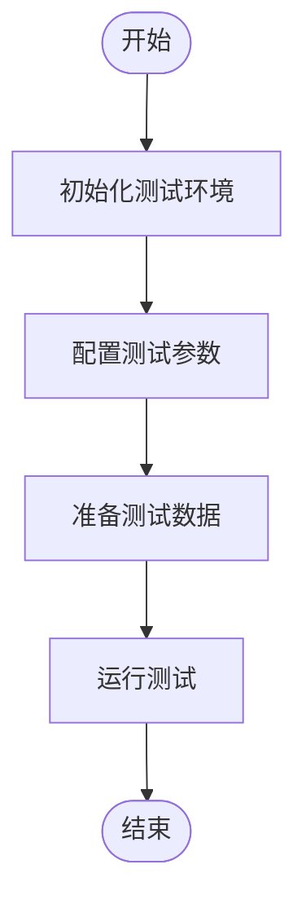
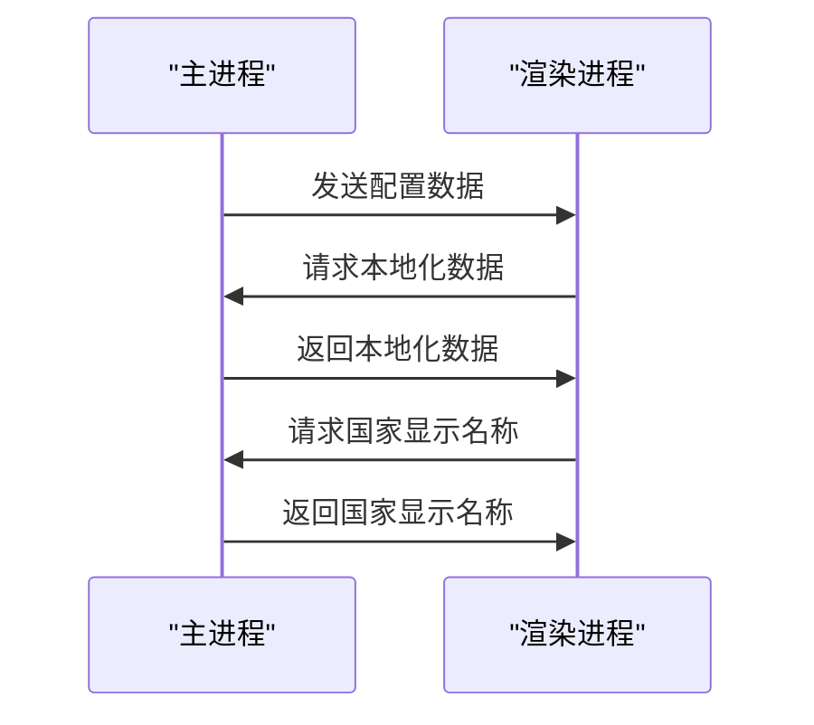
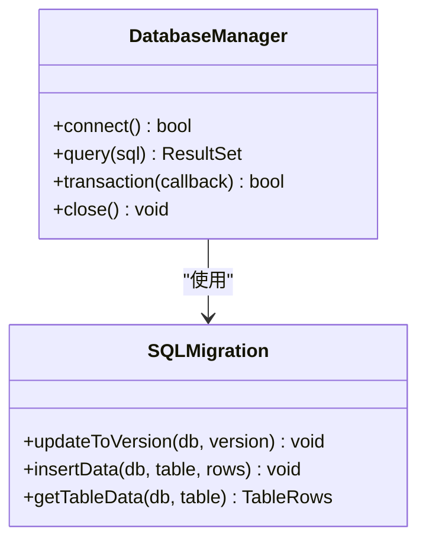
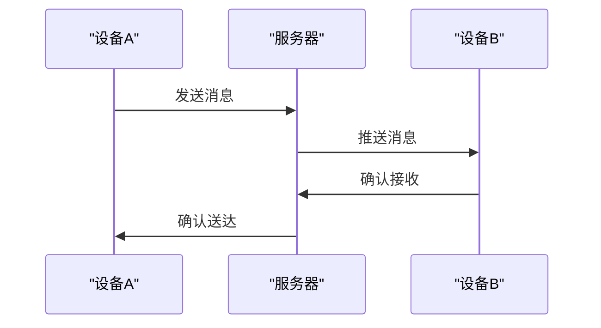
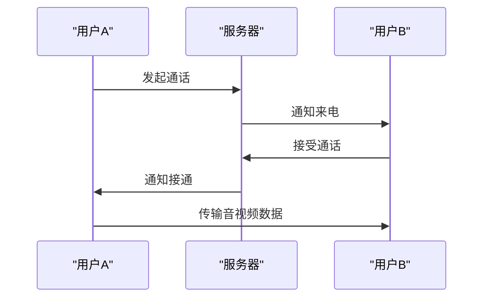
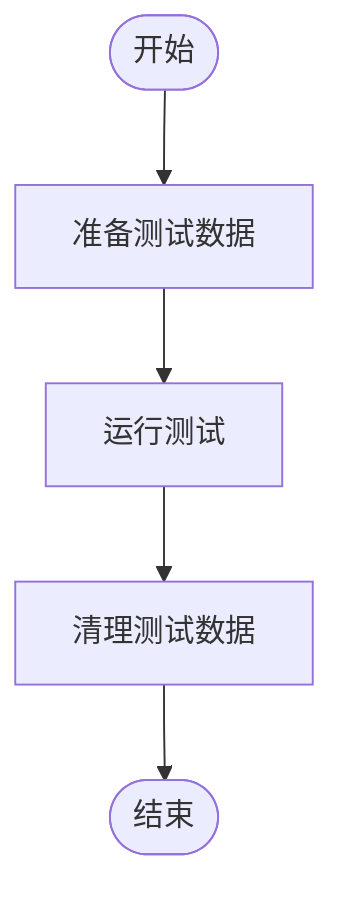
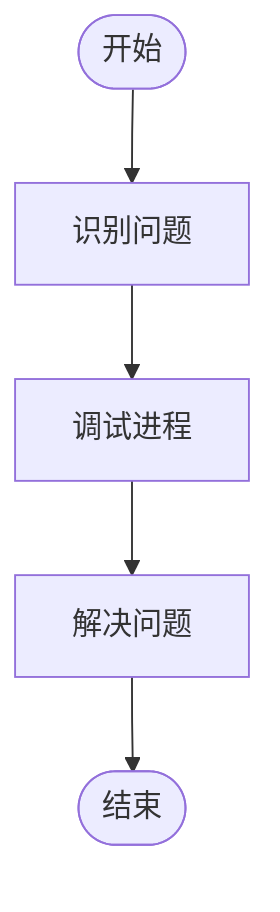

# 集成测试

<cite>
**本文档中引用的文件**  
- [main.main.ts](file://app/main.main.ts)
- [integration_test.preload.ts](file://ts/test-electron/backup/integration_test.preload.ts)
- [conversations_test.preload.ts](file://ts/test-electron/models/conversations_test.preload.ts)
- [messages_test.preload.ts](file://ts/test-electron/models/messages_test.preload.ts)
- [migrations_test.node.ts](file://ts/test-node/sql/migrations_test.node.ts)
- [helpers.node.ts](file://ts/test-node/sql/helpers.node.ts)
- [test.js](file://test/test.js)
- [setup-test-node.js](file://test/setup-test-node.js)
</cite>

## 目录
1. [简介](#简介)
2. [测试环境设置](#测试环境设置)
3. [主进程与渲染进程的IPC通信测试](#主进程与渲染进程的ipc通信测试)
4. [数据库操作测试](#数据库操作测试)
5. [消息同步测试](#消息同步测试)
6. [通话功能集成测试](#通话功能集成测试)
7. [数据准备与清理策略](#数据准备与清理策略)
8. [常见问题与调试](#常见问题与调试)
9. [结论](#结论)

## 简介
Signal-Desktop的集成测试文档旨在详细说明如何测试多个组件之间的交互，特别是主进程与渲染进程之间的IPC通信。本文档将解释测试数据库操作、消息同步和通话功能集成的方法，并提供来自实际代码库的具体示例，如SQL迁移测试和消息接收集成测试。此外，文档还将记录测试环境设置、数据准备和清理策略，并解决常见问题如跨进程调试、数据库事务管理和异步操作协调。

**Section sources**
- [main.main.ts](file://app/main.main.ts#L2845-L2890)
- [test.js](file://test/test.js#L1-L50)

## 测试环境设置
Signal-Desktop的测试环境设置包括初始化测试工具、配置测试参数和准备测试数据。测试环境的设置确保了测试的一致性和可重复性。

**Diagram sources**
- [setup-test-node.js](file://test/setup-test-node.js#L1-L54)
- [test.js](file://test/test.js#L1-L50)

**Section sources**
- [setup-test-node.js](file://test/setup-test-node.js#L1-L54)
- [test.js](file://test/test.js#L1-L50)

## 主进程与渲染进程的IPC通信测试
主进程与渲染进程之间的IPC通信是Signal-Desktop的核心功能之一。通过IPC通信，主进程可以与渲染进程进行数据交换和事件通知。

**Diagram sources**
- [main.main.ts](file://app/main.main.ts#L2845-L2890)

**Section sources**
- [main.main.ts](file://app/main.main.ts#L2845-L2890)

## 数据库操作测试
数据库操作测试确保Signal-Desktop的数据库操作正确无误。测试包括SQL迁移、数据插入和查询等操作。

**Diagram sources**
- [migrations_test.node.ts](file://ts/test-node/sql/migrations_test.node.ts#L1-L800)
- [helpers.node.ts](file://ts/test-node/sql/helpers.node.ts#L1-L120)

**Section sources**
- [migrations_test.node.ts](file://ts/test-node/sql/migrations_test.node.ts#L1-L800)
- [helpers.node.ts](file://ts/test-node/sql/helpers.node.ts#L1-L120)

## 消息同步测试
消息同步测试验证Signal-Desktop的消息同步功能，确保消息在不同设备之间正确同步。

**Diagram sources**
- [messages_test.preload.ts](file://ts/test-electron/models/messages_test.preload.ts#L1-L727)

**Section sources**
- [messages_test.preload.ts](file://ts/test-electron/models/messages_test.preload.ts#L1-L727)

## 通话功能集成测试
通话功能集成测试确保Signal-Desktop的通话功能正常工作，包括音频和视频通话。

**Diagram sources**
- [integration_test.preload.ts](file://ts/test-electron/backup/integration_test.preload.ts#L1-L95)

**Section sources**
- [integration_test.preload.ts](file://ts/test-electron/backup/integration_test.preload.ts#L1-L95)

## 数据准备与清理策略
数据准备与清理策略确保每次测试都在干净的环境中进行，避免测试数据的干扰。

**Diagram sources**
- [integration_test.preload.ts](file://ts/test-electron/backup/integration_test.preload.ts#L1-L95)
- [conversations_test.preload.ts](file://ts/test-electron/models/conversations_test.preload.ts#L1-L235)

**Section sources**
- [integration_test.preload.ts](file://ts/test-electron/backup/integration_test.preload.ts#L1-L95)
- [conversations_test.preload.ts](file://ts/test-electron/models/conversations_test.preload.ts#L1-L235)

## 常见问题与调试
常见问题与调试部分提供了解决跨进程调试、数据库事务管理和异步操作协调等问题的建议。

**Diagram sources**
- [main.main.ts](file://app/main.main.ts#L2845-L2890)
- [test.js](file://test/test.js#L1-L50)

**Section sources**
- [main.main.ts](file://app/main.main.ts#L2845-L2890)
- [test.js](file://test/test.js#L1-L50)

## 结论
本文档详细介绍了Signal-Desktop的集成测试方法，包括测试环境设置、主进程与渲染进程的IPC通信测试、数据库操作测试、消息同步测试、通话功能集成测试、数据准备与清理策略以及常见问题与调试。通过这些测试，可以确保Signal-Desktop的各个组件之间的交互正确无误，从而提供稳定可靠的服务。