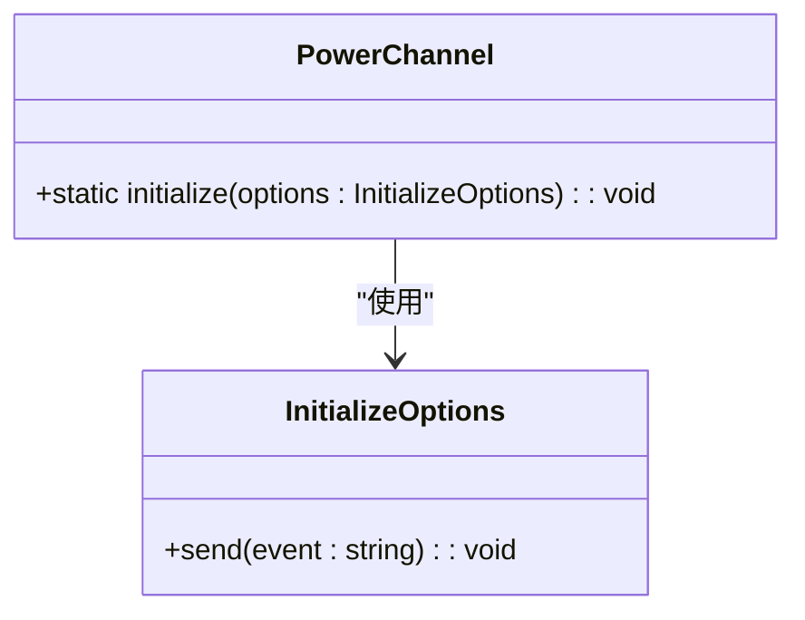
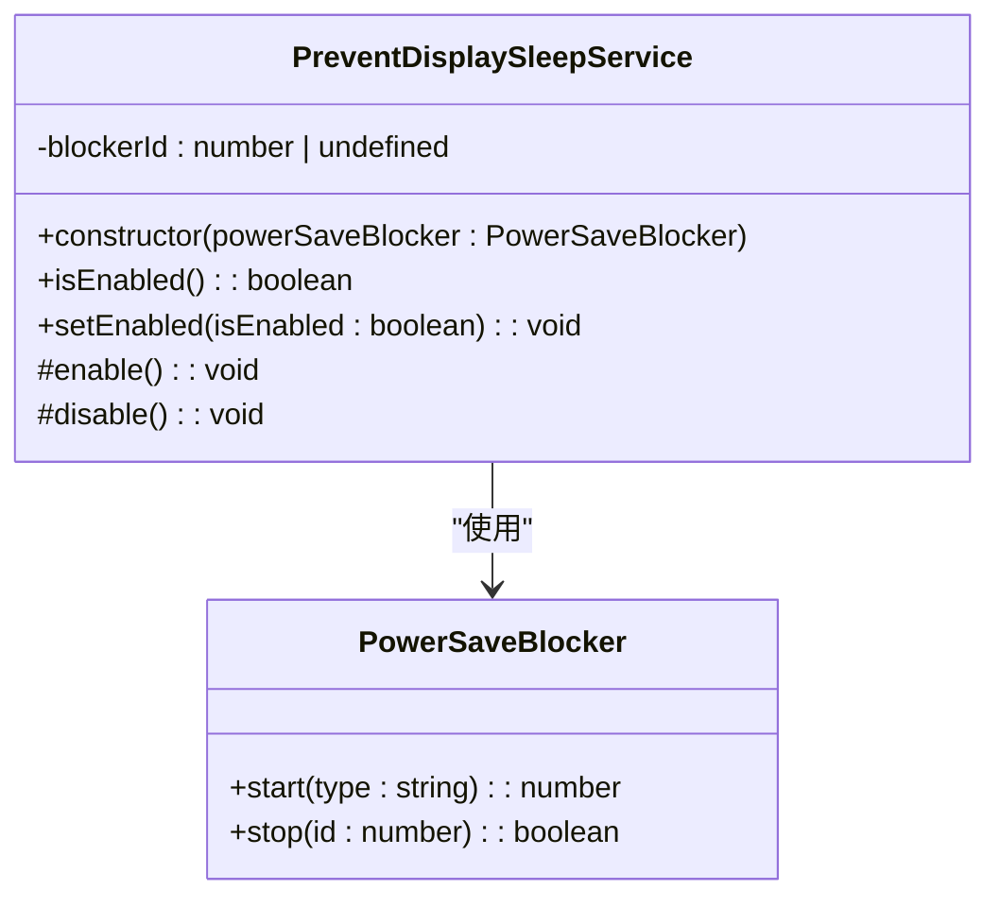
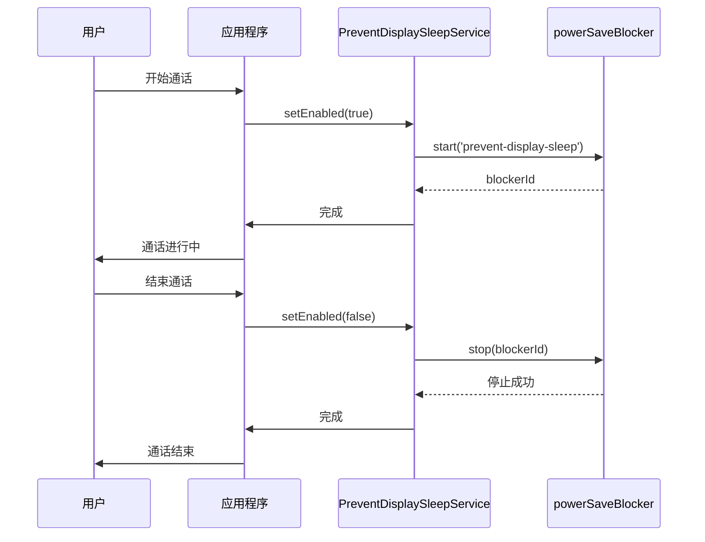

# 电源管理

<cite>
**本文档引用的文件**  
- [powerChannel.main.ts](file://ts/main/powerChannel.main.ts)
- [PreventDisplaySleepService.std.ts](file://app/PreventDisplaySleepService.std.ts)
- [main.main.ts](file://app/main.main.ts)
</cite>

## 目录
1. [简介](#简介)
2. [电源状态监听机制](#电源状态监听机制)
3. [电源请求管理](#电源请求管理)
4. [关键操作期间的系统唤醒保持](#关键操作期间的系统唤醒保持)
5. [资源释放机制](#资源释放机制)
6. [常见问题与解决方案](#常见问题与解决方案)
7. [最佳实践](#最佳实践)

## 简介
Signal-Desktop应用程序通过集成操作系统电源管理功能，确保在关键操作（如通话或文件传输）期间防止显示睡眠和系统休眠。本文档详细说明了电源状态监听、电源请求管理和资源释放机制的实现方式，并提供实际代码示例和最佳实践建议。

## 电源状态监听机制

Signal-Desktop使用Electron的`powerMonitor`模块来监听系统的电源状态变化。`PowerChannel`类负责初始化这些监听器，并在发生特定事件时向主进程发送通知。



**图示来源**  
- [powerChannel.main.ts](file://ts/main/powerChannel.main.ts#L1-L29)

**本节来源**  
- [powerChannel.main.ts](file://ts/main/powerChannel.main.ts#L1-L29)

## 电源请求管理

`PreventDisplaySleepService`类封装了对Electron的`powerSaveBlocker` API的调用，用于控制是否阻止显示器进入睡眠模式。该服务通过启用和禁用电源保存阻止器来管理电源请求。



**图示来源**  
- [PreventDisplaySleepService.std.ts](file://app/PreventDisplaySleepService.std.ts#L9-L46)

**本节来源**  
- [PreventDisplaySleepService.std.ts](file://app/PreventDisplaySleepService.std.ts#L9-L46)

## 关键操作期间的系统唤醒保持

在进行通话或文件传输等关键操作时，Signal-Desktop会激活`PreventDisplaySleepService`以防止系统进入睡眠状态。这确保了通信的连续性和数据传输的完整性。



**图示来源**  
- [PreventDisplaySleepService.std.ts](file://app/PreventDisplaySleepService.std.ts#L18-L29)
- [main.main.ts](file://app/main.main.ts#L192-L194)

**本节来源**  
- [PreventDisplaySleepService.std.ts](file://app/PreventDisplaySleepService.std.ts#L18-L29)
- [main.main.ts](file://app/main.main.ts#L192-L194)

## 资源释放机制

为了防止资源泄漏，`PreventDisplaySleepService`在禁用时会停止相应的电源保存阻止器并清除其ID。这种机制确保了即使在异常情况下也能正确释放资源。

```mermaid
flowchart TD
A[调用setEnabled(false)] --> B{blockerId是否已定义?}
B --> |否| C[直接返回]
B --> |是| D[调用powerSaveBlocker.stop(blockerId)]
D --> E[删除blockerId]
E --> F[完成]
```

**图示来源**  
- [PreventDisplaySleepService.std.ts](file://app/PreventDisplaySleepService.std.ts#L38-L45)

**本节来源**  
- [PreventDisplaySleepService.std.ts](file://app/PreventDisplaySleepService.std.ts#L38-L45)

## 常见问题与解决方案

### 电源请求未释放
如果电源请求未能正确释放，可能导致系统无法正常进入睡眠状态。解决方案包括确保在所有可能的退出路径上调用`setEnabled(false)`，并在异常处理中包含资源清理逻辑。

### 系统无法进入睡眠状态
当多个组件同时请求阻止睡眠时，需要协调它们的生命周期。建议使用集中式的电源管理服务，并在不再需要时立即释放请求。

**本节来源**  
- [PreventDisplaySleepService.std.ts](file://app/PreventDisplaySleepService.std.ts#L38-L45)
- [main.main.ts](file://app/main.main.ts#L192-L194)

## 最佳实践

### 资源管理
始终确保在不再需要时释放电源请求，避免长时间持有不必要的阻止器。

### 电池优化
仅在必要时才阻止系统睡眠，例如在进行实时通信或大文件传输时。

### 用户体验平衡
考虑用户的设备使用场景，在保证功能的同时尽量减少对系统性能的影响。

**本节来源**  
- [PreventDisplaySleepService.std.ts](file://app/PreventDisplaySleepService.std.ts#L18-L29)
- [main.main.ts](file://app/main.main.ts#L192-L194)