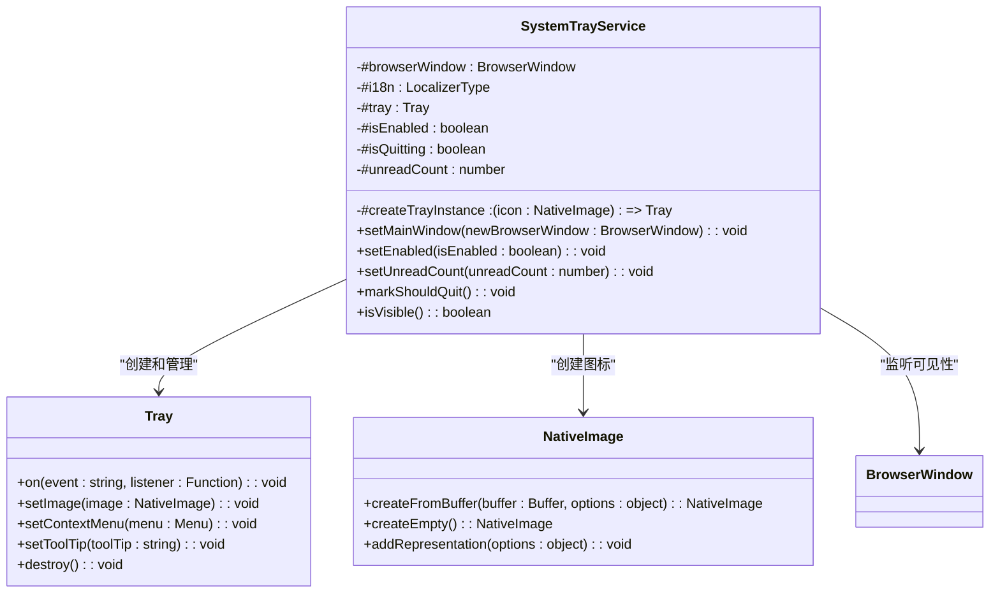
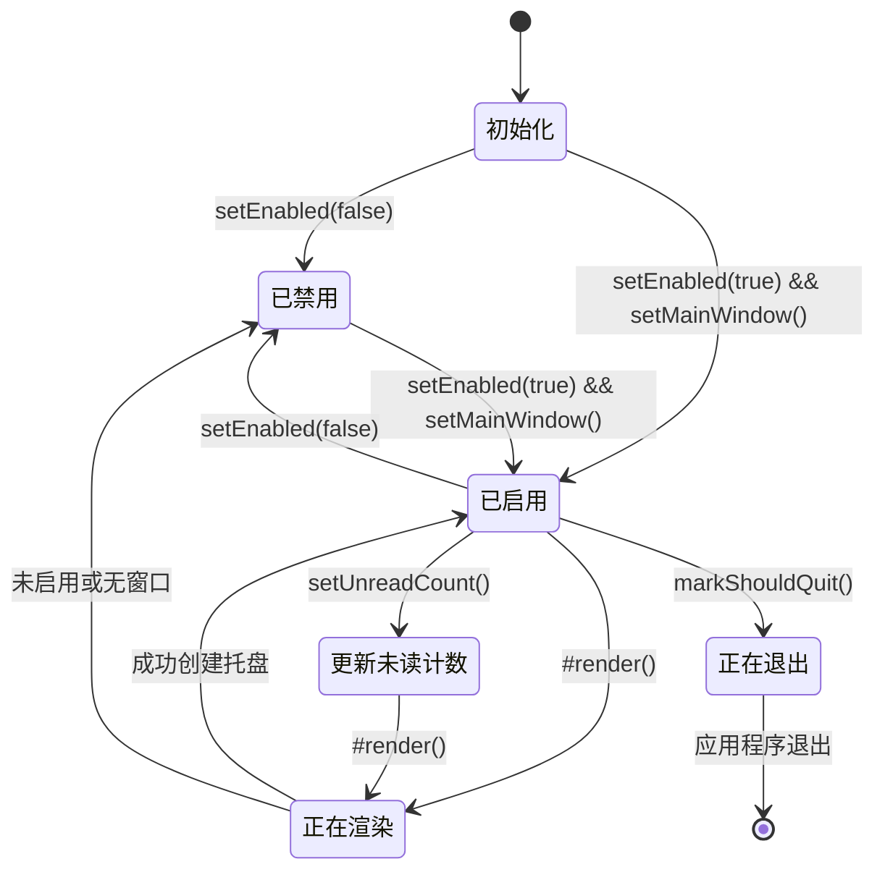
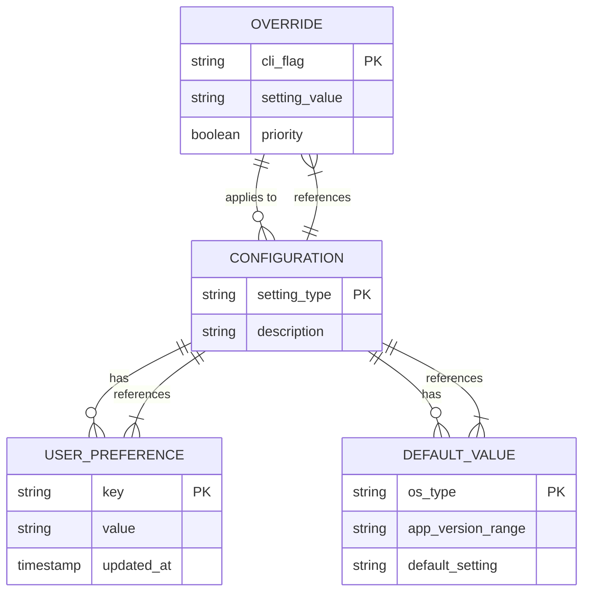
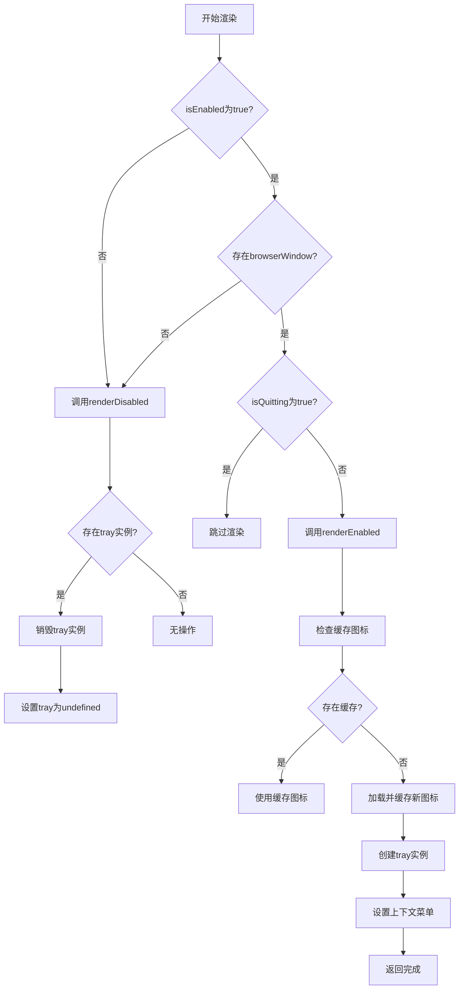
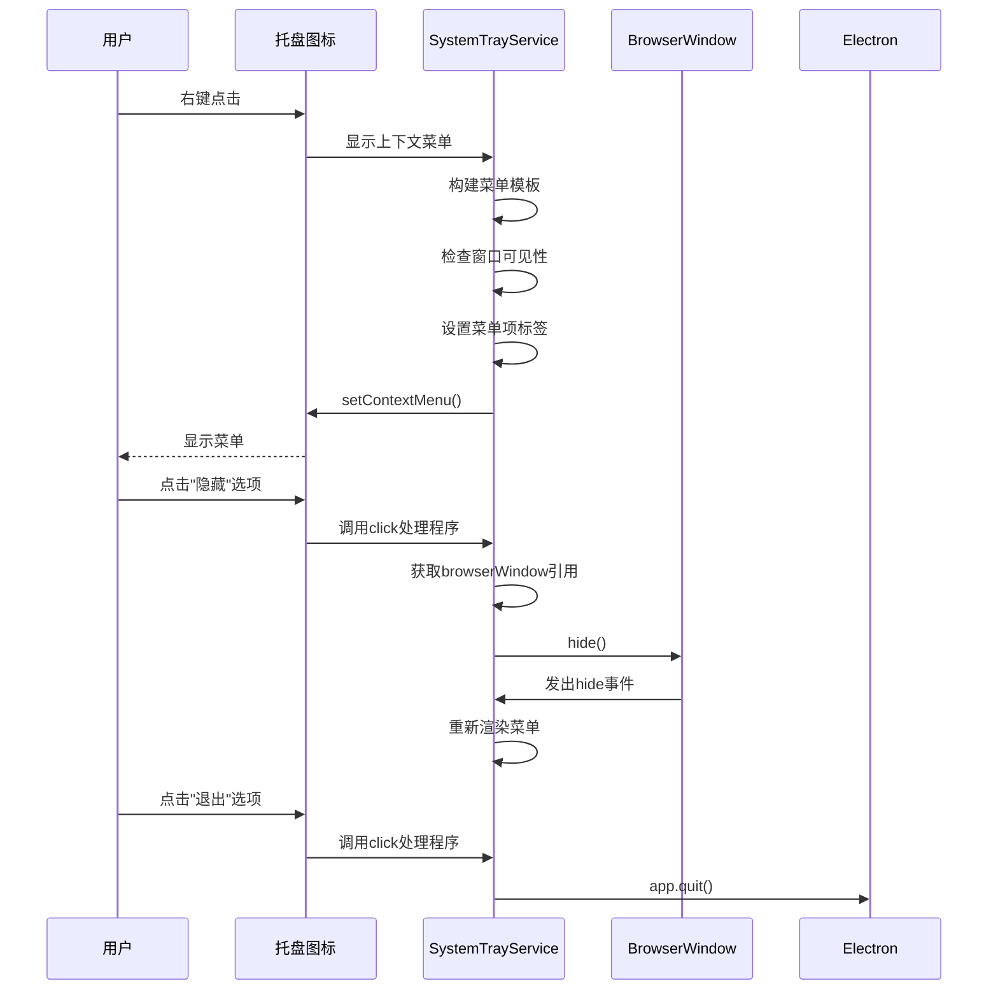
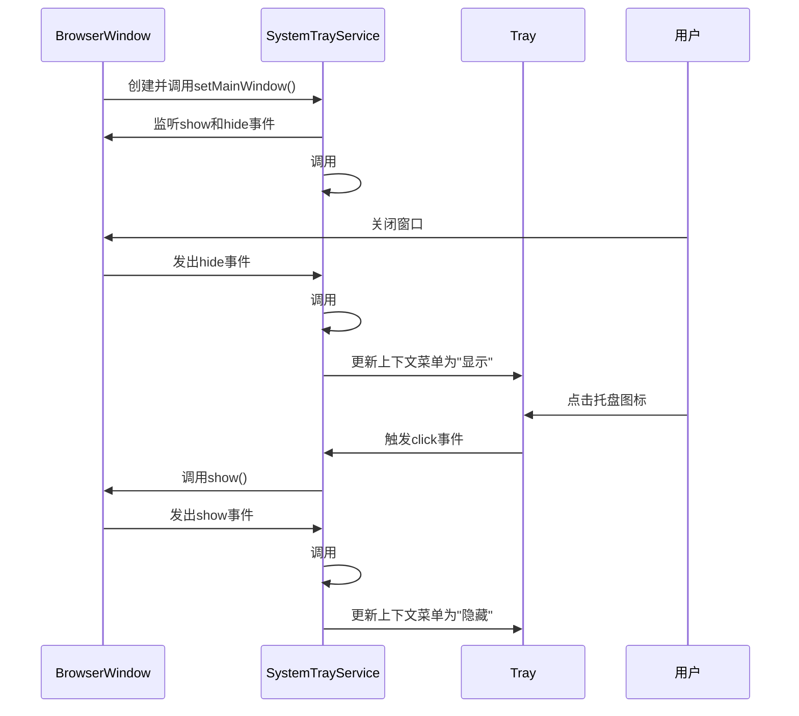

# 系统托盘

<cite>
**本文档中引用的文件**  
- [SystemTrayService.main.ts](file://app/SystemTrayService.main.ts)
- [SystemTraySettingCache.node.ts](file://app/SystemTraySettingCache.node.ts)
- [main.main.ts](file://app/main.main.ts)
- [Settings.std.ts](file://ts/types/Settings.std.ts)
- [SystemTraySetting.std.ts](file://ts/types/SystemTraySetting.std.ts)
</cite>

## 目录
1. [简介](#简介)
2. [实现机制](#实现机制)
3. [状态管理](#状态管理)
4. [用户交互模式](#用户交互模式)
5. [配置选项](#配置选项)
6. [显示/隐藏逻辑](#显示隐藏逻辑)
7. [右键菜单集成](#右键菜单集成)
8. [点击事件处理](#点击事件处理)
9. [与主窗口通信机制](#与主窗口通信机制)
10. [常见问题及解决方案](#常见问题及解决方案)
11. [最佳实践](#最佳实践)

## 简介
Signal-Desktop的系统托盘功能为用户提供了一种便捷的方式来管理应用程序的可见性和状态。该功能允许用户将应用程序最小化到系统托盘，通过托盘图标快速访问应用程序，并在不显示主窗口的情况下接收通知。系统托盘服务基于Electron框架的Tray API实现，支持跨平台操作，包括Windows和Linux系统。

**Section sources**
- [SystemTrayService.main.ts](file://app/SystemTrayService.main.ts#L1-L361)
- [SystemTraySettingCache.node.ts](file://app/SystemTraySettingCache.node.ts#L1-L92)

## 实现机制
系统托盘功能的核心实现位于`SystemTrayService`类中，该类负责管理Electron的Tray实例。服务通过监听主窗口的可见性状态来动态更新托盘图标的显示和行为。当启用系统托盘功能时，服务会创建一个Tray实例，并根据未读消息数量更新图标。

托盘图标的创建和销毁由`#createTray()`和`#renderDisabled()`方法管理。图标资源根据平台和显示缩放因子进行优化，Windows和macOS使用响应式图标（包含多个分辨率表示），而Linux使用静态图标。图标缓存机制通过`TrayIconCache` Map实现，避免重复加载相同的图标资源。



**Diagram sources**
- [SystemTrayService.main.ts](file://app/SystemTrayService.main.ts#L28-L245)
- [SystemTrayService.main.ts](file://app/SystemTrayService.main.ts#L301-L345)

**Section sources**
- [SystemTrayService.main.ts](file://app/SystemTrayService.main.ts#L28-L245)
- [SystemTrayService.main.ts](file://app/SystemTrayService.main.ts#L301-L345)

## 状态管理
系统托盘的状态管理通过多个私有属性实现，包括`#isEnabled`、`#isQuitting`、`#unreadCount`等。`#isEnabled`标志控制托盘图标是否应该显示，`#isQuitting`用于在应用程序退出时避免双重销毁，`#unreadCount`跟踪未读消息数量以更新图标。

状态更新通过`#render()`方法协调，该方法根据当前状态决定是渲染启用的托盘还是禁用状态。当未读计数改变时，`setUnreadCount()`方法被调用，触发重新渲染以更新图标。托盘图标的可见性状态与主窗口的可见性同步，通过监听`show`和`hide`事件实现。



**Diagram sources**
- [SystemTrayService.main.ts](file://app/SystemTrayService.main.ts#L32-L35)
- [SystemTrayService.main.ts](file://app/SystemTrayService.main.ts#L122-L128)

**Section sources**
- [SystemTrayService.main.ts](file://app/SystemTrayService.main.ts#L32-L35)
- [SystemTrayService.main.ts](file://app/SystemTrayService.main.ts#L95-L103)

## 用户交互模式
系统托盘提供两种主要的用户交互模式：点击托盘图标和右键菜单操作。点击托盘图标会切换主窗口的可见性状态，如果窗口可见则隐藏，如果隐藏则显示。右键菜单提供"显示/隐藏"和"退出"选项，为用户提供更精细的控制。

交互模式的设计考虑了不同平台的兼容性。在Linux系统上，当使用应用指示器时，点击事件可能被忽略，因此右键菜单成为主要的交互方式。为了确保窗口在显示时位于最前面，使用`focusAndForceToTop()`函数通过临时设置`alwaysOnTop`属性来解决GNOME等桌面环境中的窗口层级问题。

```mermaid
flowchart TD
A[用户交互] --> B{交互类型}
B --> |点击图标| C[切换窗口可见性]
B --> |右键点击| D[显示上下文菜单]
C --> E{窗口是否可见}
E --> |是| F[隐藏窗口]
E --> |否| G[显示窗口并置顶]
D --> H[显示"显示/隐藏"选项]
D --> I[显示"退出"选项]
H --> J{当前状态}
J --> |窗口可见| K[显示"隐藏"标签]
J --> |窗口隐藏| L[显示"显示"标签]
I --> M[点击退出]
M --> N[调用app.quit()]
G --> O[调用focusAndForceToTop]
O --> P[设置alwaysOnTop=true]
P --> Q[调用window.focus()]
Q --> R[设置alwaysOnTop=false]
```

**Diagram sources**
- [SystemTrayService.main.ts](file://app/SystemTrayService.main.ts#L220-L231)
- [SystemTrayService.main.ts](file://app/SystemTrayService.main.ts#L155-L195)
- [SystemTrayService.main.ts](file://app/SystemTrayService.main.ts#L353-L359)

**Section sources**
- [SystemTrayService.main.ts](file://app/SystemTrayService.main.ts#L220-L231)
- [SystemTrayService.main.ts](file://app/SystemTrayService.main.ts#L155-L195)

## 配置选项
系统托盘的配置通过`SystemTraySetting`枚举和`SystemTraySettingCache`类管理。支持的配置选项包括：
- `DoNotUseSystemTray`: 不使用系统托盘
- `MinimizeToSystemTray`: 最小化到系统托盘
- `MinimizeToAndStartInSystemTray`: 最小化到系统托盘并从托盘启动
- `Uninitialized`: 未初始化状态

配置可以通过命令行参数`--start-in-tray`或`--use-tray-icon`覆盖，也可以通过应用程序设置持久化存储。`SystemTraySettingCache`类负责缓存和获取配置值，优先级顺序为：命令行参数 > 持久化设置 > 默认值。



**Diagram sources**
- [SystemTraySetting.std.ts](file://ts/types/SystemTraySetting.std.ts#L7-L12)
- [SystemTraySettingCache.node.ts](file://app/SystemTraySettingCache.node.ts#L19-L91)
- [Settings.std.ts](file://ts/types/Settings.std.ts#L42-L57)

**Section sources**
- [SystemTraySetting.std.ts](file://ts/types/SystemTraySetting.std.ts#L7-L12)
- [SystemTraySettingCache.node.ts](file://app/SystemTraySettingCache.node.ts#L46-L78)

## 显示/隐藏逻辑
托盘图标的显示和隐藏逻辑由`#render()`方法控制，该方法根据`#isEnabled`标志和关联的`BrowserWindow`实例决定是否显示托盘。只有当服务启用且存在主窗口时，托盘图标才会被创建和显示。

显示逻辑的优先级顺序如下：
1. 检查`#isEnabled`是否为true
2. 检查是否存在关联的`BrowserWindow`
3. 检查`#isQuitting`标志以避免在退出时创建托盘
4. 根据未读计数选择适当的图标

隐藏逻辑在`#renderDisabled()`方法中实现，该方法销毁现有的托盘实例并清除引用。当窗口关闭或服务被禁用时，此逻辑确保托盘图标从系统托盘中移除。



**Diagram sources**
- [SystemTrayService.main.ts](file://app/SystemTrayService.main.ts#L122-L128)
- [SystemTrayService.main.ts](file://app/SystemTrayService.main.ts#L199-L207)

**Section sources**
- [SystemTrayService.main.ts](file://app/SystemTrayService.main.ts#L122-L128)
- [SystemTrayService.main.ts](file://app/SystemTrayService.main.ts#L77-L90)

## 右键菜单集成
右键菜单集成通过`tray.setContextMenu()`方法实现，创建包含"显示/隐藏"和"退出"选项的菜单。菜单项的标签根据主窗口的当前可见性动态更新，确保用户界面的一致性。

菜单项的点击事件处理程序使用箭头函数捕获当前的`this`上下文，确保能够访问服务实例的私有属性。"显示/隐藏"选项的点击处理程序会重新获取`#browserWindow`引用，以防在菜单打开期间窗口发生变化。



**Diagram sources**
- [SystemTrayService.main.ts](file://app/SystemTrayService.main.ts#L155-L195)
- [SystemTrayService.main.ts](file://app/SystemTrayService.main.ts#L50-L75)

**Section sources**
- [SystemTrayService.main.ts](file://app/SystemTrayService.main.ts#L155-L195)

## 点击事件处理
点击事件处理通过`tray.on('click', ...)`监听器实现，提供与右键菜单功能相同的窗口切换行为。点击处理程序检查关联的`BrowserWindow`实例，如果存在则根据其可见性状态执行显示或隐藏操作。

为了确保窗口在显示时获得焦点并位于最前面，使用`focusAndForceToTop()`辅助函数。该函数通过临时设置`alwaysOnTop`属性来解决某些桌面环境（如GNOME）中的窗口层级问题，确保用户体验的一致性。

```mermaid
flowchart TD
A[托盘点击事件] --> B{存在browserWindow?}
B --> |否| C[无操作]
B --> |是| D{窗口是否可见}
D --> |是| E[调用window.hide()]
D --> |否| F[调用window.show()]
F --> G[调用focusAndForceToTop]
G --> H[设置alwaysOnTop=true]
H --> I[调用window.focus()]
I --> J[设置alwaysOnTop=false]
J --> K[完成]
```

**Diagram sources**
- [SystemTrayService.main.ts](file://app/SystemTrayService.main.ts#L220-L231)
- [SystemTrayService.main.ts](file://app/SystemTrayService.main.ts#L353-L359)

**Section sources**
- [SystemTrayService.main.ts](file://app/SystemTrayService.main.ts#L220-L231)

## 与主窗口通信机制
系统托盘服务与主窗口的通信机制基于事件监听和状态同步。服务通过`setMainWindow()`方法建立与主窗口的连接，监听`show`和`hide`事件以更新托盘图标的上下文菜单。

当主窗口的可见性状态改变时，`#render()`方法被调用，重新构建上下文菜单以反映当前状态。这种双向通信确保了用户界面的一致性，无论用户是通过托盘图标、任务栏还是其他方式与应用程序交互。



**Diagram sources**
- [SystemTrayService.main.ts](file://app/SystemTrayService.main.ts#L50-L75)
- [SystemTrayService.main.ts](file://app/SystemTrayService.main.ts#L122-L128)

**Section sources**
- [SystemTrayService.main.ts](file://app/SystemTrayService.main.ts#L50-L75)

## 常见问题及解决方案
### 托盘图标不显示
**问题原因**：
- 系统不支持系统托盘（如macOS）
- 配置设置为不使用系统托盘
- 主窗口未正确关联
- 应用程序正在退出

**解决方案**：
1. 检查操作系统是否支持系统托盘（仅Windows和Linux支持）
2. 验证`system-tray-setting`配置是否启用
3. 确保`setMainWindow()`被正确调用
4. 检查`markShouldQuit()`是否在退出前被调用

### 右键菜单响应延迟
**问题原因**：
- 图标加载和缓存耗时
- 主进程繁忙
- 桌面环境性能问题

**解决方案**：
1. 确保图标资源已预加载和缓存
2. 优化主进程性能，减少阻塞操作
3. 使用更简单的菜单结构

### 窗口无法置顶
**问题原因**：
- 桌面环境（如GNOME）的窗口管理策略
- 窗口焦点被其他应用程序抢占

**解决方案**：
1. 使用`focusAndForceToTop()`函数的临时`alwaysOnTop`技巧
2. 确保在显示窗口后立即调用`focus()`

**Section sources**
- [SystemTrayService.main.ts](file://app/SystemTrayService.main.ts#L138-L149)
- [SystemTrayService.main.ts](file://app/SystemTrayService.main.ts#L353-L359)
- [SystemTraySettingCache.node.ts](file://app/SystemTraySettingCache.node.ts#L56-L78)

## 最佳实践
### 资源管理
- 使用`TrayIconCache`避免重复加载相同的图标资源
- 在`#renderDisabled()`中及时销毁托盘实例以释放资源
- 使用`markShouldQuit()`避免在退出时双重销毁

### 跨平台兼容性
- 为Linux使用静态图标，为Windows/macOS使用响应式图标
- 处理Linux应用指示器对点击事件的限制
- 考虑不同桌面环境的窗口管理行为差异

### 用户体验优化
- 确保上下文菜单标签准确反映当前状态
- 使用工具提示提供额外信息
- 实现平滑的窗口显示/隐藏过渡
- 考虑无障碍访问需求

**Section sources**
- [SystemTrayService.main.ts](file://app/SystemTrayService.main.ts#L301-L345)
- [SystemTrayService.main.ts](file://app/SystemTrayService.main.ts#L202-L207)
- [SystemTrayService.main.ts](file://app/SystemTrayService.main.ts#L233-L234)