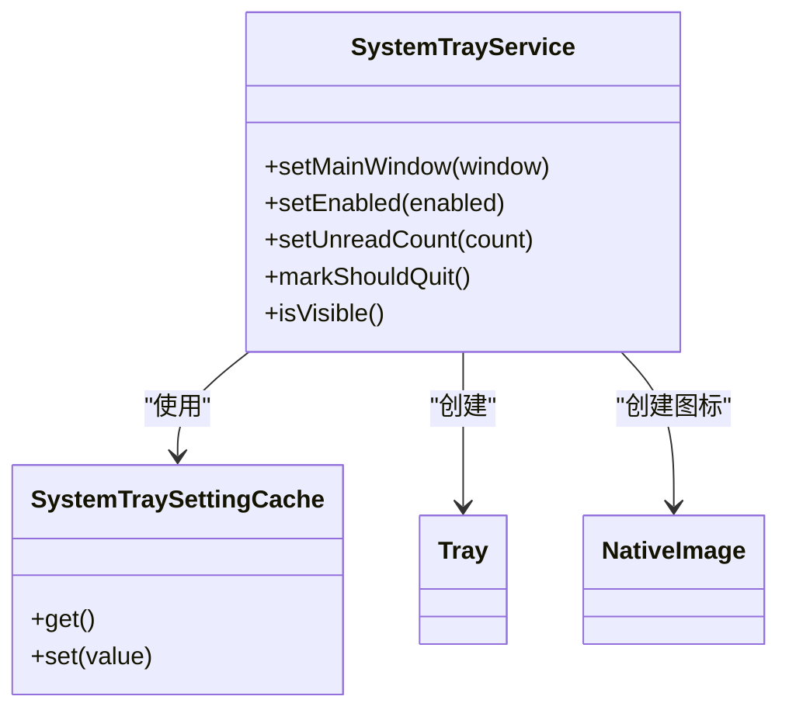
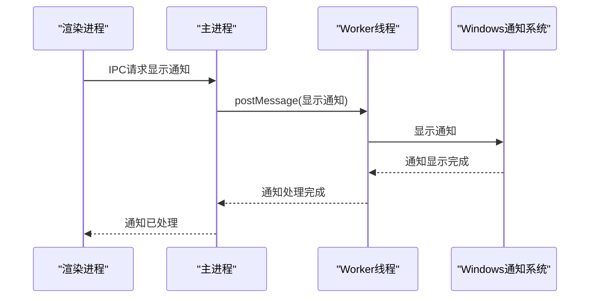
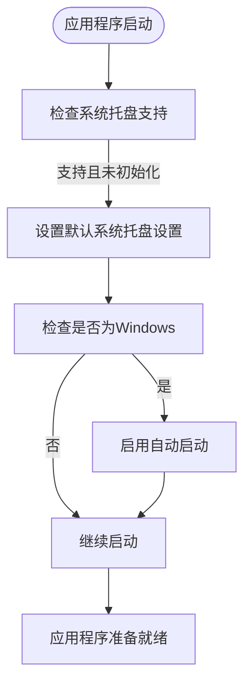
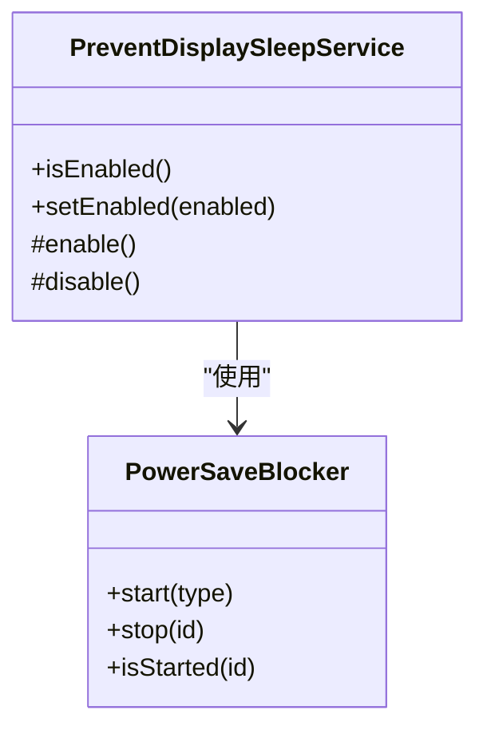
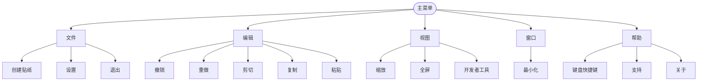
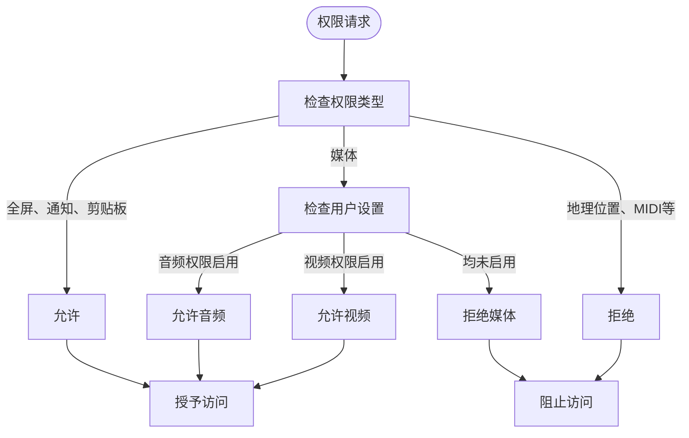

# 系统集成

<cite>
**本文档中引用的文件**  
- [SystemTrayService.main.ts](file://app/SystemTrayService.main.ts)
- [SystemTraySettingCache.node.ts](file://app/SystemTraySettingCache.node.ts)
- [WindowsNotifications.main.ts](file://app/WindowsNotifications.main.ts)
- [WindowsNotificationsWorker.node.ts](file://app/WindowsNotificationsWorker.node.ts)
- [menu.std.ts](file://app/menu.std.ts)
- [startup_config.main.ts](file://app/startup_config.main.ts)
- [permissions.std.ts](file://app/permissions.std.ts)
- [PreventDisplaySleepService.std.ts](file://app/PreventDisplaySleepService.std.ts)
- [main.main.ts](file://app/main.main.ts)
- [Settings.std.ts](file://ts/types/Settings.std.ts)
- [SystemTraySetting.std.ts](file://ts/types/SystemTraySetting.std.ts)
- [Preferences.dom.tsx](file://ts/components/Preferences.dom.tsx)
</cite>

## 目录
1. [系统托盘集成](#系统托盘集成)
2. [通知系统集成](#通知系统集成)
3. [自动启动集成](#自动启动集成)
4. [电源管理集成](#电源管理集成)
5. [菜单集成](#菜单集成)
6. [权限管理](#权限管理)
7. [常见问题与解决方案](#常见问题与解决方案)
8. [最佳实践指南](#最佳实践指南)

## 系统托盘集成

Signal-Desktop通过`SystemTrayService`类实现系统托盘功能，该服务管理Electron的`Tray`实例，处理与主窗口的可见性状态关联的逻辑。系统托盘支持Windows和Linux平台，但默认情况下在Linux生产版本中禁用。

系统托盘行为由`SystemTraySetting`枚举控制，包含四种状态：
- `Uninitialized`：未初始化状态
- `DoNotUseSystemTray`：不使用系统托盘
- `MinimizeToSystemTray`：最小化到系统托盘
- `MinimizeToAndStartInSystemTray`：最小化到并从系统托盘启动

用户可以通过命令行参数`--start-in-tray`或`--use-tray-icon`来配置托盘行为。托盘图标会根据未读消息数量动态变化，支持0、1-9和9+三种状态的图标显示。

托盘上下文菜单包含"显示/隐藏"和"退出"选项，允许用户通过右键点击托盘图标来控制应用程序窗口的可见性。

**图示来源**
- [SystemTrayService.main.ts](file://app/SystemTrayService.main.ts#L28-L361)
- [SystemTraySettingCache.node.ts](file://app/SystemTraySettingCache.node.ts#L19-L92)

**本节来源**
- [SystemTrayService.main.ts](file://app/SystemTrayService.main.ts#L28-L361)
- [SystemTraySettingCache.node.ts](file://app/SystemTraySettingCache.node.ts#L19-L92)
- [Settings.std.ts](file://ts/types/Settings.std.ts#L33-L57)

## 通知系统集成

Signal-Desktop在Windows平台上实现了原生通知系统，使用`WindowsNotifications`模块通过Worker线程与Windows通知API进行交互。通知系统使用Application User Model ID (AUMID)来标识应用程序，确保通知正确显示。

通知实现分为两个主要组件：
1. 主进程中的`WindowsNotifications.main.ts`：处理IPC通信，接收来自渲染进程的通知请求
2. Worker线程中的`WindowsNotificationsWorker.node.ts`：实际调用Windows通知API显示通知

通知系统支持清除所有通知的功能，并通过`renderWindowsToast`函数生成符合Windows通知格式的XML内容。通知使用`Notifier`类来管理，每个通知都有唯一的ID标识，确保通知的正确更新和移除。

**图示来源**
- [WindowsNotifications.main.ts](file://app/WindowsNotifications.main.ts#L1-L79)
- [WindowsNotificationsWorker.node.ts](file://app/WindowsNotificationsWorker.node.ts#L1-L84)

**本节来源**
- [WindowsNotifications.main.ts](file://app/WindowsNotifications.main.ts#L1-L79)
- [WindowsNotificationsWorker.node.ts](file://app/WindowsNotificationsWorker.node.ts#L1-L84)
- [startup_config.main.ts](file://app/startup_config.main.ts#L18-L22)

## 自动启动集成

Signal-Desktop支持在Windows和macOS上配置自动启动功能。当应用程序首次运行时，如果系统托盘功能受支持且设置为未初始化状态，应用程序会自动配置为在登录时启动。

自动启动逻辑在`main.main.ts`文件中实现，当检测到Windows平台时，会调用`app.setLoginItemSettings`方法启用自动启动。此功能与系统托盘设置紧密关联，特别是在Windows上，启用自动启动时通常会同时启用"最小化到并从系统托盘启动"选项。

自动启动设置可以通过用户偏好设置进行修改，应用程序会监听系统托盘设置的变化并相应地更新登录项设置。

**图示来源**
- [main.main.ts](file://app/main.main.ts#L2110-L2153)
- [Settings.std.ts](file://ts/types/Settings.std.ts#L20-L21)

**本节来源**
- [main.main.ts](file://app/main.main.ts#L2110-L2153)
- [Settings.std.ts](file://ts/types/Settings.std.ts#L20-L21)

## 电源管理集成

Signal-Desktop通过`PreventDisplaySleepService`类实现电源管理功能，防止在通话或屏幕共享期间显示器进入睡眠状态。该服务使用Electron的`powerSaveBlocker` API来阻止显示睡眠。

服务通过`setEnabled`方法控制电源阻止器的状态，当启用时调用`powerSaveBlocker.start('prevent-display-sleep')`创建阻止器ID，当禁用时调用`powerSaveBlocker.stop()`停止阻止器并清除ID。

电源管理服务设计为幂等的，确保不会创建多个阻止器实例，同时在禁用时正确清理资源。这种实现确保了在需要时保持显示器唤醒，而在不需要时释放系统资源。

**图示来源**
- [PreventDisplaySleepService.std.ts](file://app/PreventDisplaySleepService.std.ts#L9-L47)

**本节来源**
- [PreventDisplaySleepService.std.ts](file://app/PreventDisplaySleepService.std.ts#L9-L47)
- [ts/test-node/app/PreventDisplaySleepService_test.std.ts](file://ts/test-node/app/PreventDisplaySleepService_test.std.ts#L1-L105)

## 菜单集成

Signal-Desktop的菜单系统通过`menu.std.ts`文件实现，创建跨平台的应用程序菜单。菜单结构根据操作系统平台进行调整，确保符合各平台的用户界面规范。

菜单包含以下主要部分：
- **文件菜单**：包含创建贴纸、设置和退出选项
- **编辑菜单**：标准的编辑操作（撤销、重做、剪切、复制、粘贴等）
- **视图菜单**：缩放控制、全屏切换和开发者工具
- **窗口菜单**：窗口最小化控制
- **帮助菜单**：键盘快捷键、联系支持和关于信息

在macOS上，菜单结构会进行特殊调整，添加特定于macOS的应用程序菜单，包含"隐藏"、"隐藏其他"和"退出"等选项，同时调整文件菜单以包含"关闭"选项而非"退出"。

**图示来源**
- [menu.std.ts](file://app/menu.std.ts#L1-L402)

**本节来源**
- [menu.std.ts](file://app/menu.std.ts#L1-L402)

## 权限管理

Signal-Desktop通过`permissions.std.ts`文件实现权限管理，控制应用程序对系统功能的访问。权限策略基于最小权限原则，只授予必要的权限。

支持的权限包括：
- **允许的权限**：全屏、通知、剪贴板写入
- **默认关闭，用户可启用的权限**：媒体（麦克风和摄像头）
- **不允许的权限**：地理位置、MIDI、外部链接打开、指针锁定

权限处理程序通过`installPermissionsHandler`函数安装，该函数设置会话的权限请求处理程序。对于媒体权限，会根据用户配置的`mediaPermissions`和`mediaCameraPermissions`设置来决定是否授予访问麦克风和摄像头的权限。

**图示来源**
- [permissions.std.ts](file://app/permissions.std.ts#L14-L80)

**本节来源**
- [permissions.std.ts](file://app/permissions.std.ts#L14-L80)

## 常见问题与解决方案

### 权限处理问题
**问题**：用户无法访问麦克风或摄像头
**解决方案**：检查用户是否在设置中启用了媒体权限。应用程序默认禁用媒体权限，需要用户手动启用。

### 后台运行问题
**问题**：应用程序在最小化后无法在后台运行
**解决方案**：确保系统托盘设置已正确配置。在Windows和Linux上，需要启用"最小化到系统托盘"选项才能实现后台运行。

### 资源管理问题
**问题**：应用程序在后台运行时消耗过多资源
**解决方案**：检查电源管理设置，确保`PreventDisplaySleepService`仅在需要时启用。在通话或屏幕共享结束后及时禁用电源阻止器。

### 系统托盘不显示
**问题**：系统托盘图标不显示
**解决方案**：检查操作系统是否支持系统托盘功能。在Linux上，某些桌面环境可能不完全支持系统托盘。同时检查应用程序设置中的系统托盘选项是否已启用。

**本节来源**
- [SystemTrayService.main.ts](file://app/SystemTrayService.main.ts#L28-L361)
- [PreventDisplaySleepService.std.ts](file://app/PreventDisplaySleepService.std.ts#L9-L47)
- [permissions.std.ts](file://app/permissions.std.ts#L14-L80)

## 最佳实践指南

### 用户体验最佳实践
1. **渐进式功能启用**：首次运行时提供合理的默认设置，如Windows上自动启用自动启动和系统托盘。
2. **清晰的用户反馈**：在状态变化时提供视觉或日志反馈，如托盘服务启用/禁用时记录日志。
3. **跨平台一致性**：在不同平台上保持核心功能的一致性，同时遵循各平台的UI规范。

### 系统兼容性最佳实践
1. **特性检测**：在使用系统功能前检查平台支持情况，如使用`isSystemTraySupported`函数检测系统托盘支持。
2. **优雅降级**：当特定功能不受支持时提供替代方案或明确的错误信息。
3. **版本兼容性**：考虑不同操作系统版本的差异，如Windows 7的通知分组支持问题。

### 资源管理最佳实践
1. **按需启用功能**：只在需要时启用资源密集型功能，如电源阻止器。
2. **及时清理资源**：在功能不再需要时及时释放系统资源，如销毁托盘实例。
3. **内存效率**：使用缓存机制提高性能，如托盘图标缓存。

**本节来源**
- [SystemTrayService.main.ts](file://app/SystemTrayService.main.ts#L28-L361)
- [PreventDisplaySleepService.std.ts](file://app/PreventDisplaySleepService.std.ts#L9-L47)
- [Settings.std.ts](file://ts/types/Settings.std.ts#L33-L57)
- [menu.std.ts](file://app/menu.std.ts#L1-L402)