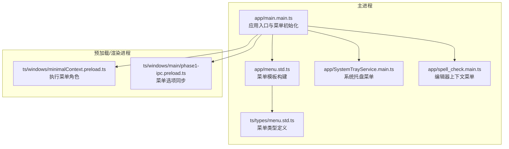
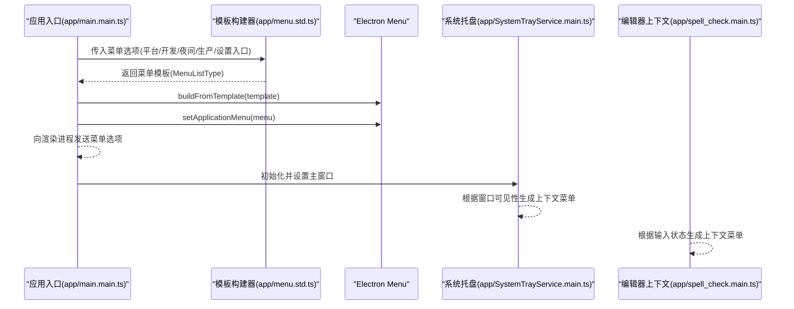
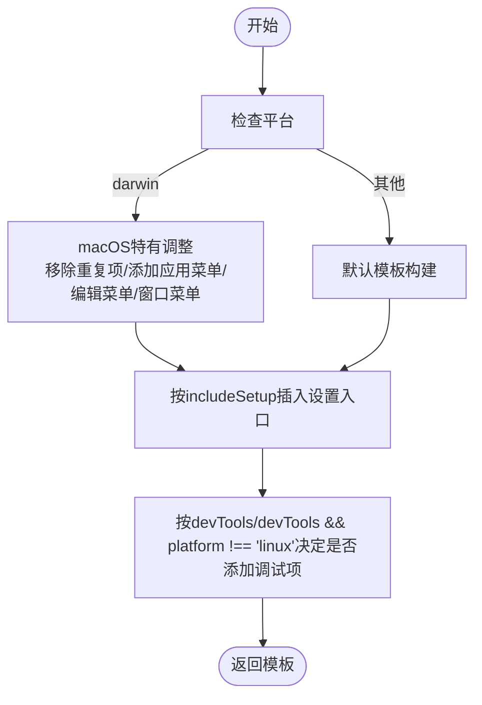
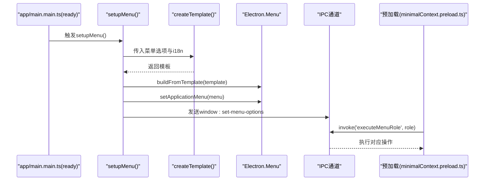
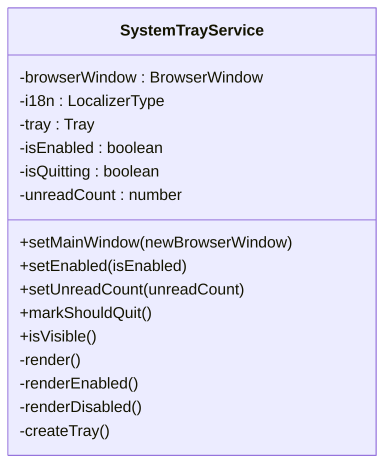
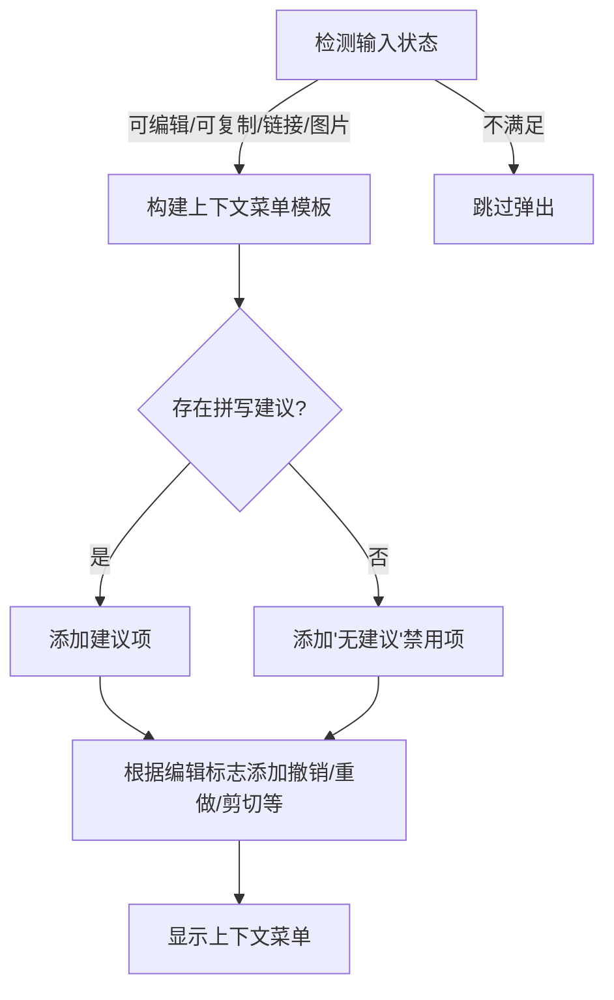
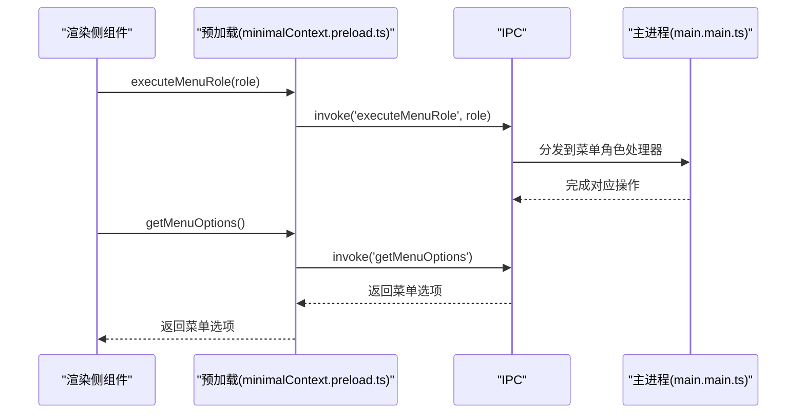
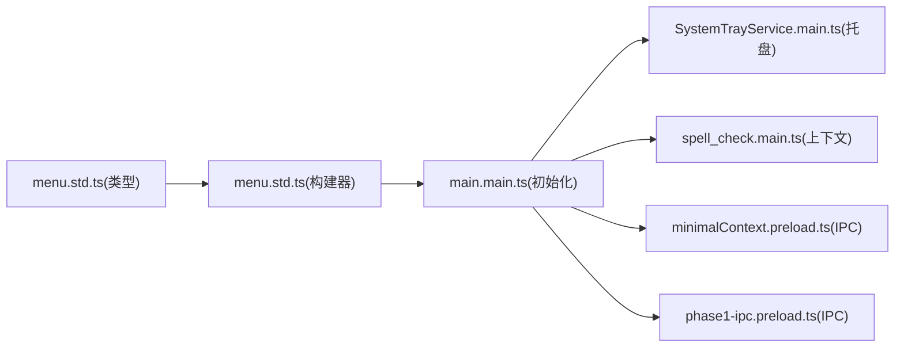

# 菜单集成

<cite>
**本文引用的文件**
- [app/menu.std.ts](file://app/menu.std.ts)
- [app/main.main.ts](file://app/main.main.ts)
- [ts/types/menu.std.ts](file://ts/types/menu.std.ts)
- [app/SystemTrayService.main.ts](file://app/SystemTrayService.main.ts)
- [app/spell_check.main.ts](file://app/spell_check.main.ts)
- [ts/windows/minimalContext.preload.ts](file://ts/windows/minimalContext.preload.ts)
- [ts/windows/main/phase1-ipc.preload.ts](file://ts/windows/main/phase1-ipc.preload.ts)
- [ts/test-node/app/menu_test.node.ts](file://ts/test-node/app/menu_test.node.ts)
</cite>

## 目录
1. [简介](#简介)
2. [项目结构](#项目结构)
3. [核心组件](#核心组件)
4. [架构总览](#架构总览)
5. [详细组件分析](#详细组件分析)
6. [依赖关系分析](#依赖关系分析)
7. [性能考量](#性能考量)
8. [故障排查指南](#故障排查指南)
9. [结论](#结论)
10. [附录](#附录)

## 简介
本文件面向Signal-Desktop的菜单集成，系统化阐述应用菜单（主菜单、上下文菜单、系统托盘菜单）的实现机制与管理方式。重点覆盖：
- 主菜单模板的构建与跨平台适配（含macOS特有菜单）
- 菜单项的点击回调与快捷键绑定
- 与应用状态的同步（如开发模式、夜间版、生产版、是否包含设置入口）
- 系统托盘菜单的动态生成与图标状态更新
- 上下文菜单（编辑器右键菜单）的弹出与行为
- 常见问题与最佳实践

## 项目结构
菜单相关代码主要分布在以下位置：
- 主菜单与模板：app/menu.std.ts、ts/types/menu.std.ts
- 应用入口与菜单初始化：app/main.main.ts
- 系统托盘菜单：app/SystemTrayService.main.ts
- 编辑器上下文菜单：app/spell_check.main.ts
- 预加载层IPC交互：ts/windows/minimalContext.preload.ts、ts/windows/main/phase1-ipc.preload.ts
- 测试用例：ts/test-node/app/menu_test.node.ts

图表来源
- [app/main.main.ts](file://app/main.main.ts#L2369-L2433)
- [app/menu.std.ts](file://app/menu.std.ts#L1-L262)
- [ts/types/menu.std.ts](file://ts/types/menu.std.ts#L1-L40)
- [app/SystemTrayService.main.ts](file://app/SystemTrayService.main.ts#L1-L120)
- [app/spell_check.main.ts](file://app/spell_check.main.ts#L103-L147)
- [ts/windows/minimalContext.preload.ts](file://ts/windows/minimalContext.preload.ts#L30-L68)
- [ts/windows/main/phase1-ipc.preload.ts](file://ts/windows/main/phase1-ipc.preload.ts#L98-L130)

章节来源
- [app/main.main.ts](file://app/main.main.ts#L2369-L2433)
- [app/menu.std.ts](file://app/menu.std.ts#L1-L262)
- [ts/types/menu.std.ts](file://ts/types/menu.std.ts#L1-L40)

## 核心组件
- 菜单模板构建器：根据运行时参数（平台、是否开发、是否夜间版、是否生产版、是否包含设置入口等）生成主菜单模板；在macOS上进行额外调整。
- 应用入口菜单初始化：在应用ready后调用模板构建器，生成Electron Menu并设置为应用级菜单，同时向渲染进程发送菜单选项以供前端同步状态。
- 系统托盘服务：根据窗口可见性动态切换“显示/隐藏”菜单项，支持未读数图标变化与点击事件。
- 编辑器上下文菜单：基于输入法状态与选择内容动态生成右键菜单，支持拼写建议、撤销/重做、剪切/复制/粘贴等。
- 预加载层IPC：提供执行菜单角色（如撤销、重做、最小化、全屏等）与查询菜单选项的能力。

章节来源
- [app/menu.std.ts](file://app/menu.std.ts#L1-L262)
- [app/main.main.ts](file://app/main.main.ts#L2369-L2433)
- [app/SystemTrayService.main.ts](file://app/SystemTrayService.main.ts#L1-L120)
- [app/spell_check.main.ts](file://app/spell_check.main.ts#L103-L147)
- [ts/windows/minimalContext.preload.ts](file://ts/windows/minimalContext.preload.ts#L30-L68)
- [ts/windows/main/phase1-ipc.preload.ts](file://ts/windows/main/phase1-ipc.preload.ts#L98-L130)

## 架构总览
主菜单的生命周期从应用ready开始，经过模板构建、菜单装配、事件路由到渲染进程，最终形成完整的菜单体系。系统托盘与上下文菜单作为补充，分别在窗口状态变化与编辑器交互时动态呈现。

图表来源
- [app/main.main.ts](file://app/main.main.ts#L2369-L2433)
- [app/menu.std.ts](file://app/menu.std.ts#L1-L262)
- [app/SystemTrayService.main.ts](file://app/SystemTrayService.main.ts#L122-L197)
- [app/spell_check.main.ts](file://app/spell_check.main.ts#L103-L147)

## 详细组件分析

### 主菜单模板与跨平台适配
- 模板构成：包含“文件/编辑/视图/窗口/帮助”五大部分，部分子项根据平台与环境条件动态增删。
- 平台差异：
  - macOS：移除帮助菜单中的“关于”与分隔符；移除文件菜单中的“偏好设置/退出”，并在文件菜单末尾添加“关闭”；在最左侧插入Signal Desktop应用菜单；编辑菜单追加“语音”子菜单；窗口菜单替换为macOS风格。
  - 其他平台：按默认布局生成，必要时在“视图”菜单中加入“强制更新”项（非Linux）。
- 设置入口：当includeSetup为真时，在“文件”菜单顶部插入“新设备设置/独立设置/导入本地备份”等入口（按版本类型与开发模式决定）。
- 快捷键绑定：使用统一的命令组合（如CmdOrCtrl+/, CmdOrCtrl+=/-/0等），确保跨平台一致性。

图表来源
- [app/menu.std.ts](file://app/menu.std.ts#L1-L262)
- [app/menu.std.ts](file://app/menu.std.ts#L264-L401)

章节来源
- [app/menu.std.ts](file://app/menu.std.ts#L1-L262)
- [app/menu.std.ts](file://app/menu.std.ts#L264-L401)
- [ts/types/menu.std.ts](file://ts/types/menu.std.ts#L1-L40)
- [ts/test-node/app/menu_test.node.ts](file://ts/test-node/app/menu_test.node.ts#L158-L217)

### 菜单初始化与事件处理（主进程）
- 初始化流程：应用ready后调用setupMenu，组装菜单选项（开发/调试/夜间/生产/平台/动作回调），构建模板并设置为应用菜单；同时通过IPC向渲染进程发送菜单选项，以便前端同步状态。
- 菜单项事件：对于内置role（如undo/redo/cut/copy/paste/pasteAndMatchStyle/delete/selectAll/reload/toggleDevTools/togglefullscreen/minimize/close/quit），由Electron自动处理；对于自定义click回调（如打开设置、缩放、键盘快捷键对话框等），由主进程动作函数处理。
- 渲染进程协作：预加载层提供executeMenuRole与getMenuOptions等IPC接口，用于在渲染侧执行菜单角色或查询当前菜单选项。

图表来源
- [app/main.main.ts](file://app/main.main.ts#L2369-L2433)
- [app/menu.std.ts](file://app/menu.std.ts#L1-L262)
- [ts/windows/minimalContext.preload.ts](file://ts/windows/minimalContext.preload.ts#L30-L68)

章节来源
- [app/main.main.ts](file://app/main.main.ts#L2369-L2433)
- [ts/windows/minimalContext.preload.ts](file://ts/windows/minimalContext.preload.ts#L30-L68)

### 系统托盘菜单与图标状态
- 动态生成：根据窗口可见性在托盘上下文菜单中切换“显示/隐藏”；点击托盘图标也支持显示/隐藏窗口。
- 图标更新：根据未读计数动态选择不同图标资源，Linux平台使用单一尺寸并忽略缩放因子，其他平台使用多倍率位图。
- 生命周期：启用/禁用、设置主窗口、未读计数变更均触发重新渲染；退出前标记避免重复销毁。

图表来源
- [app/SystemTrayService.main.ts](file://app/SystemTrayService.main.ts#L1-L120)
- [app/SystemTrayService.main.ts](file://app/SystemTrayService.main.ts#L122-L197)
- [app/SystemTrayService.main.ts](file://app/SystemTrayService.main.ts#L199-L236)
- [app/SystemTrayService.main.ts](file://app/SystemTrayService.main.ts#L238-L361)

章节来源
- [app/SystemTrayService.main.ts](file://app/SystemTrayService.main.ts#L1-L120)
- [app/SystemTrayService.main.ts](file://app/SystemTrayService.main.ts#L122-L197)
- [app/SystemTrayService.main.ts](file://app/SystemTrayService.main.ts#L199-L236)
- [app/SystemTrayService.main.ts](file://app/SystemTrayService.main.ts#L238-L361)

### 编辑器上下文菜单（拼写检查）
- 弹出条件：当输入区域可编辑、可复制、链接或图片时弹出；若检测到拼写错误，优先提供字典建议，否则显示“无建议”占位。
- 菜单项：根据编辑标志（可撤销/可重做/可剪切）动态启用相应菜单项；支持撤销/重做/剪切/复制/粘贴等常用编辑操作。
- 行为：点击建议项会替换当前选区的拼写；键盘方向键用于导航，回车确认，Esc关闭。

图表来源
- [app/spell_check.main.ts](file://app/spell_check.main.ts#L103-L147)

章节来源
- [app/spell_check.main.ts](file://app/spell_check.main.ts#L103-L147)

### 预加载层菜单角色执行与菜单选项查询
- 执行菜单角色：预加载层封装executeMenuRole，通过ipcRenderer.invoke('executeMenuRole', role)将角色转发至主进程处理，主进程根据role分派到对应操作（如撤销、重做、最小化、全屏等）。
- 查询菜单选项：预加载层提供getMenuOptions，用于渲染侧获取当前菜单选项（开发/调试/夜间/生产/平台等），便于前端UI同步。

图表来源
- [ts/windows/minimalContext.preload.ts](file://ts/windows/minimalContext.preload.ts#L30-L68)
- [app/main.main.ts](file://app/main.main.ts#L3218-L3268)

章节来源
- [ts/windows/minimalContext.preload.ts](file://ts/windows/minimalContext.preload.ts#L30-L68)
- [app/main.main.ts](file://app/main.main.ts#L3218-L3268)

## 依赖关系分析
- 类型依赖：菜单模板类型定义位于ts/types/menu.std.ts，主菜单构建器与应用入口均依赖该类型。
- 运行时依赖：应用入口在ready后调用菜单构建器；系统托盘服务依赖主窗口状态；编辑器上下文菜单依赖输入法与选择状态。
- IPC依赖：预加载层通过IPC与主进程交互，实现菜单角色执行与菜单选项查询。

图表来源
- [ts/types/menu.std.ts](file://ts/types/menu.std.ts#L1-L40)
- [app/menu.std.ts](file://app/menu.std.ts#L1-L262)
- [app/main.main.ts](file://app/main.main.ts#L2369-L2433)
- [app/SystemTrayService.main.ts](file://app/SystemTrayService.main.ts#L1-L120)
- [app/spell_check.main.ts](file://app/spell_check.main.ts#L103-L147)
- [ts/windows/minimalContext.preload.ts](file://ts/windows/minimalContext.preload.ts#L30-L68)
- [ts/windows/main/phase1-ipc.preload.ts](file://ts/windows/main/phase1-ipc.preload.ts#L98-L130)

章节来源
- [ts/types/menu.std.ts](file://ts/types/menu.std.ts#L1-L40)
- [app/menu.std.ts](file://app/menu.std.ts#L1-L262)
- [app/main.main.ts](file://app/main.main.ts#L2369-L2433)
- [app/SystemTrayService.main.ts](file://app/SystemTrayService.main.ts#L1-L120)
- [app/spell_check.main.ts](file://app/spell_check.main.ts#L103-L147)
- [ts/windows/minimalContext.preload.ts](file://ts/windows/minimalContext.preload.ts#L30-L68)
- [ts/windows/main/phase1-ipc.preload.ts](file://ts/windows/main/phase1-ipc.preload.ts#L98-L130)

## 性能考量
- 模板构建成本低：模板为静态数组，仅在应用ready时构建一次，后续通过状态同步减少重复计算。
- 托盘图标缓存：系统托盘服务对图标进行缓存，避免频繁读取磁盘与重建图像对象。
- IPC调用轻量：预加载层的executeMenuRole与getMenuOptions均为轻量IPC调用，避免阻塞主线程。
- 跨平台差异：macOS菜单结构调整为一次性操作，不会频繁变更；Linux平台不支持多倍率图标，采用单一尺寸以降低开销。

## 故障排查指南
- 菜单项灰色不可用
  - 可能原因：菜单项依赖的前置条件未满足（如拼写建议为空时“无建议”项被禁用；编辑标志限制撤销/重做/剪切等）。
  - 解决方案：检查输入状态与编辑标志，确保满足启用条件；在渲染侧通过getMenuOptions同步菜单状态。
  - 参考路径
    - [app/spell_check.main.ts](file://app/spell_check.main.ts#L103-L147)
    - [ts/windows/minimalContext.preload.ts](file://ts/windows/minimalContext.preload.ts#L30-L68)

- 快捷键冲突
  - 可能原因：多个菜单项绑定相同快捷键；或与系统/浏览器快捷键冲突。
  - 解决方案：在模板中为不同功能分配唯一快捷键；在macOS上遵循平台约定（如CmdOrCtrl+W关闭窗口）；避免与系统热键冲突。
  - 参考路径
    - [app/menu.std.ts](file://app/menu.std.ts#L1-L262)
    - [app/menu.std.ts](file://app/menu.std.ts#L264-L401)

- 菜单显示异常
  - 可能原因：includeSetup导致“文件”菜单项顺序异常；macOS菜单结构调整未生效。
  - 解决方案：确认includeSetup与平台参数正确传递；检查模板构建逻辑与updateForMac分支。
  - 参考路径
    - [app/menu.std.ts](file://app/menu.std.ts#L226-L262)
    - [app/menu.std.ts](file://app/menu.std.ts#L264-L401)
    - [ts/test-node/app/menu_test.node.ts](file://ts/test-node/app/menu_test.node.ts#L158-L217)

- 托盘图标不更新或闪烁
  - 可能原因：未读计数未变更；图标缓存未命中；Linux平台缩放因子处理不当。
  - 解决方案：调用setUnreadCount更新未读数；确认图标缓存键值；Linux平台使用最大缩放因子选择合适尺寸。
  - 参考路径
    - [app/SystemTrayService.main.ts](file://app/SystemTrayService.main.ts#L92-L103)
    - [app/SystemTrayService.main.ts](file://app/SystemTrayService.main.ts#L301-L345)

- 菜单选项不同步
  - 可能原因：渲染侧未接收window:set-menu-options或未调用getMenuOptions。
  - 解决方案：确保主进程在设置菜单后发送菜单选项；渲染侧定期或按需调用getMenuOptions刷新UI。
  - 参考路径
    - [app/main.main.ts](file://app/main.main.ts#L2425-L2432)
    - [ts/windows/main/phase1-ipc.preload.ts](file://ts/windows/main/phase1-ipc.preload.ts#L98-L130)

## 结论
Signal-Desktop的菜单系统通过清晰的模板构建与主进程初始化流程，实现了跨平台一致的菜单体验；配合系统托盘与编辑器上下文菜单，提供了完善的桌面应用交互能力。通过IPC桥接与状态同步，前端能够实时反映菜单状态，提升用户体验与可维护性。

## 附录
- 最佳实践
  - 菜单结构设计：保持层级简洁，常用功能置于显眼位置；区分平台差异，遵循各平台UI规范。
  - 用户体验优化：为关键操作提供快捷键；在渲染侧同步菜单状态，避免用户误以为某功能可用。
  - 跨平台兼容性：针对macOS、Windows、Linux分别测试菜单行为；托盘图标在Linux平台使用单一尺寸策略。
  - 错误处理：对模板构建失败、菜单项缺失等情况进行防御式编程；在测试中覆盖不同平台与配置组合。