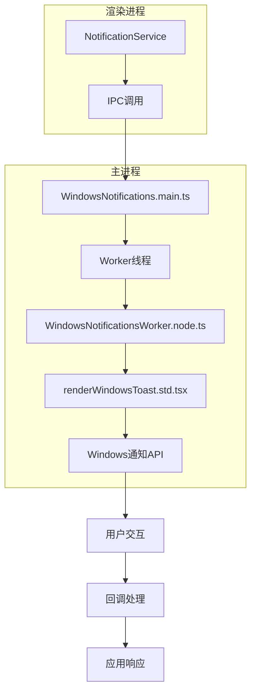
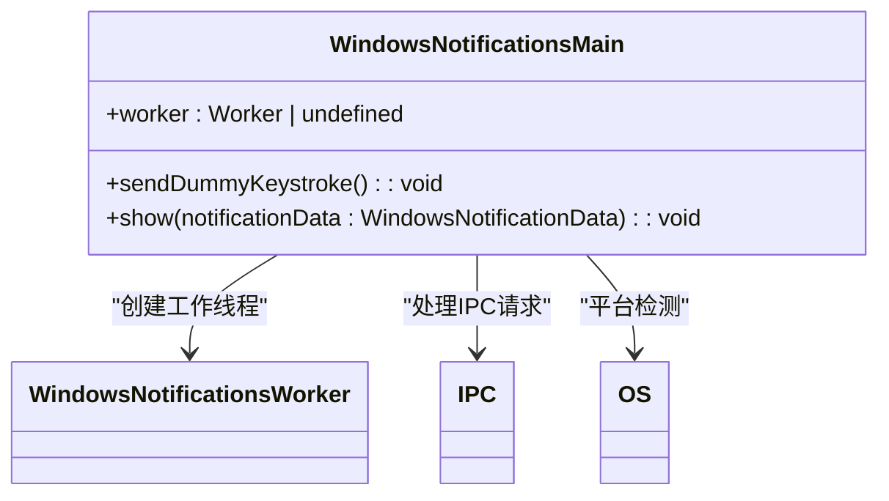
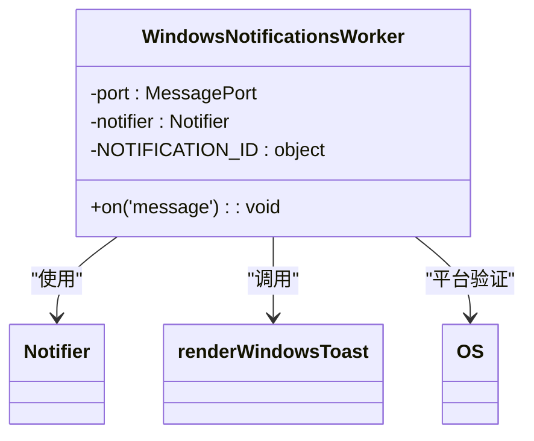
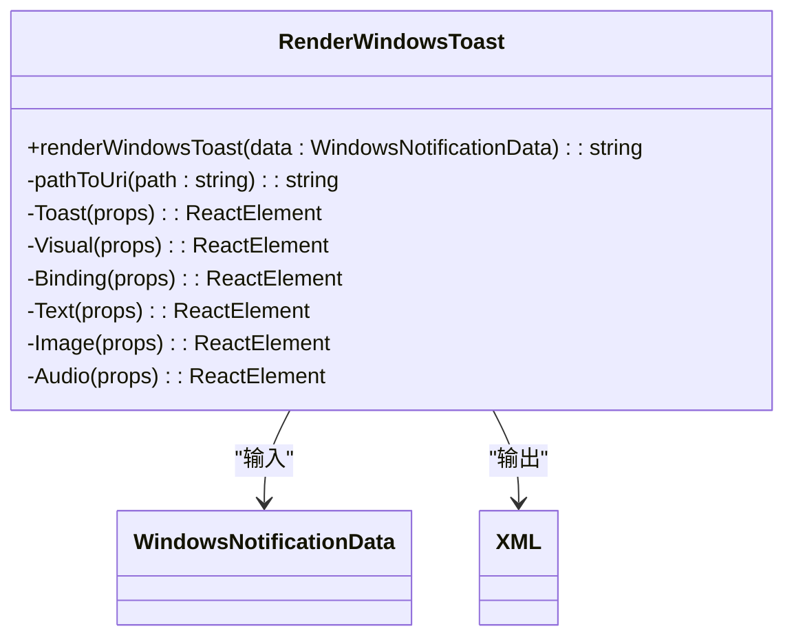
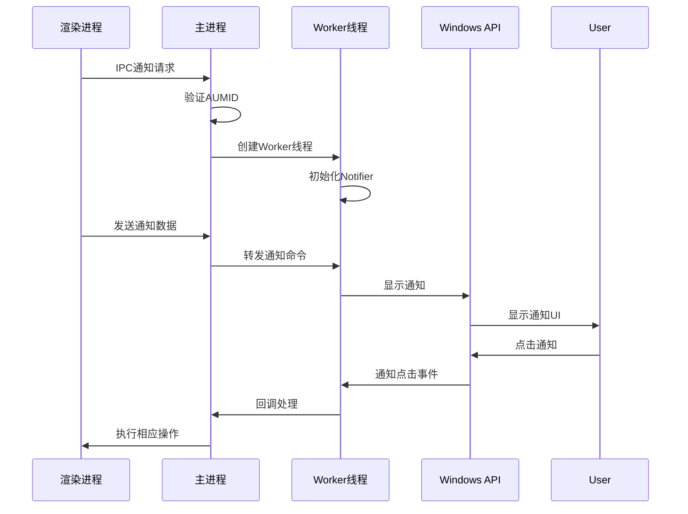
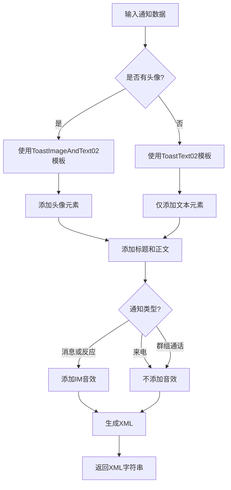
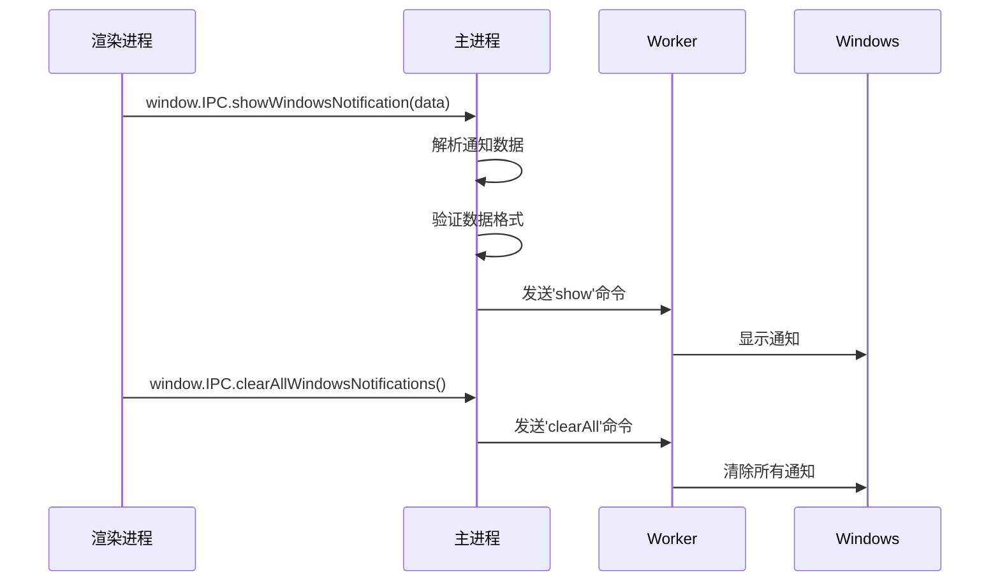

# 通知系统

<cite>
**本文档引用的文件**  
- [WindowsNotifications.main.ts](file://app/WindowsNotifications.main.ts)
- [renderWindowsToast.std.tsx](file://app/renderWindowsToast.std.tsx)
- [WindowsNotificationsWorker.node.ts](file://app/WindowsNotificationsWorker.node.ts)
- [notifications.std.ts](file://ts/types/notifications.std.ts)
- [notifications.preload.ts](file://ts/services/notifications.preload.ts)
</cite>

## 目录
1. [简介](#简介)
2. [通知系统架构](#通知系统架构)
3. [核心组件分析](#核心组件分析)
4. [通知生命周期管理](#通知生命周期管理)
5. [通知通道与权限处理](#通知通道与权限处理)
6. [通知内容格式化](#通知内容格式化)
7. [与渲染进程通信机制](#与渲染进程通信机制)
8. [常见问题与解决方案](#常见问题与解决方案)
9. [最佳实践](#最佳实践)
10. [附录](#附录)

## 简介

Signal-Desktop的通知系统为Windows平台提供了完整的桌面通知功能，包括消息通知、来电提醒、群组通话通知等。该系统采用Electron框架构建，通过主进程与渲染进程的协作实现跨平台通知功能。Windows通知系统特别设计了独立的工作线程来处理通知显示，确保主线程的响应性能。

通知系统的核心目标是为用户提供及时、安全且隐私保护的通信提醒，同时遵循Windows操作系统的通知规范。系统支持多种通知类型，包括普通消息、反应消息、来电、群组通话等，并根据用户设置和隐私偏好进行个性化展示。

**Section sources**
- [WindowsNotifications.main.ts](file://app/WindowsNotifications.main.ts#L1-L78)
- [notifications.preload.ts](file://ts/services/notifications.preload.ts#L150-L349)

## 通知系统架构

Signal-Desktop的Windows通知系统采用分层架构设计，将通知的创建、显示和交互处理分离到不同的进程和线程中。这种设计确保了系统的稳定性和性能，避免了通知处理对主应用的影响。



**Diagram sources**
- [WindowsNotifications.main.ts](file://app/WindowsNotifications.main.ts#L1-L78)
- [WindowsNotificationsWorker.node.ts](file://app/WindowsNotificationsWorker.node.ts#L1-L83)

**Section sources**
- [WindowsNotifications.main.ts](file://app/WindowsNotifications.main.ts#L1-L78)
- [WindowsNotificationsWorker.node.ts](file://app/WindowsNotificationsWorker.node.ts#L1-L83)

## 核心组件分析

### WindowsNotifications.main.ts

`WindowsNotifications.main.ts`是通知系统在主进程中的入口文件，负责初始化通知工作线程并处理来自渲染进程的IPC请求。该文件在Windows平台上创建一个独立的Worker线程来处理通知显示，避免阻塞主进程。



**Diagram sources**
- [WindowsNotifications.main.ts](file://app/WindowsNotifications.main.ts#L1-L78)

**Section sources**
- [WindowsNotifications.main.ts](file://app/WindowsNotifications.main.ts#L1-L78)

### WindowsNotificationsWorker.node.ts

`WindowsNotificationsWorker.node.ts`是运行在独立Worker线程中的通知处理器，负责实际的通知显示和管理。该组件使用`@indutny/simple-windows-notifications`库与Windows通知API交互，确保通知的正确显示和生命周期管理。



**Diagram sources**
- [WindowsNotificationsWorker.node.ts](file://app/WindowsNotificationsWorker.node.ts#L1-L83)

**Section sources**
- [WindowsNotificationsWorker.node.ts](file://app/WindowsNotificationsWorker.node.ts#L1-L83)

### renderWindowsToast.std.tsx

`renderWindowsToast.std.tsx`负责生成Windows通知的XML模板，将通知数据转换为符合Windows通知规范的XML格式。该组件使用React的`renderToStaticMarkup`函数将JSX转换为静态HTML/XML字符串。



**Diagram sources**
- [renderWindowsToast.std.tsx](file://app/renderWindowsToast.std.tsx#L1-L101)

**Section sources**
- [renderWindowsToast.std.tsx](file://app/renderWindowsToast.std.tsx#L1-L101)

## 通知生命周期管理

Signal-Desktop的通知系统实现了完整的通知生命周期管理，包括通知的创建、显示、交互和清除。系统设计确保任何时候只显示一个通知，避免通知泛滥影响用户体验。

```mermaid
flowchart TD
A[创建通知] --> B[解析通知数据]
B --> C[验证数据格式]
C --> D[发送到Worker线程]
D --> E[清除现有通知]
E --> F[生成XML模板]
F --> G[显示新通知]
G --> H{用户交互?}
H --> |是| I[处理点击事件]
H --> |否| J[超时自动消失]
I --> K[执行相应操作]
K --> L[关闭通知]
M[清除所有通知] --> N[调用notifier.remove()]
```

通知的生命周期从`NotificationService.notify()`方法开始，经过IPC通信传递到主进程，再由Worker线程处理显示。当新的通知到来时，系统会自动清除之前的通知，确保用户不会被多个通知困扰。

**Section sources**
- [WindowsNotificationsWorker.node.ts](file://app/WindowsNotificationsWorker.node.ts#L45-L47)
- [notifications.preload.ts](file://ts/services/notifications.preload.ts#L184-L185)

## 通知通道与权限处理

Signal-Desktop的通知系统通过AUMID（Application User Model ID）标识应用程序，确保通知正确关联到Signal应用。AUMID在应用启动时从`startup_config.main.js`获取，并传递给通知工作线程。

系统通过Electron的IPC机制处理通知权限，主进程接收来自渲染进程的通知请求，并在Windows平台上创建相应的通知。通知权限由用户在应用设置中控制，系统尊重用户的隐私选择。



**Diagram sources**
- [WindowsNotifications.main.ts](file://app/WindowsNotifications.main.ts#L9-L10)
- [WindowsNotificationsWorker.node.ts](file://app/WindowsNotificationsWorker.node.ts#L32-L33)

**Section sources**
- [WindowsNotifications.main.ts](file://app/WindowsNotifications.main.ts#L9-L35)
- [WindowsNotificationsWorker.node.ts](file://app/WindowsNotificationsWorker.node.ts#L32-L33)

## 通知内容格式化

`renderWindowsToast.std.tsx`组件负责将通知数据格式化为Windows通知系统可识别的XML格式。该组件根据通知类型和内容动态生成相应的XML模板，支持文本、图像和音频等多种元素。

通知内容格式化遵循Windows通知模板规范，使用`ToastImageAndText02`或`ToastText02`模板。当有头像时使用带图像的模板，否则使用纯文本模板。通知还包含适当的音频提示，增强用户体验。



**Section sources**
- [renderWindowsToast.std.tsx](file://app/renderWindowsToast.std.tsx#L47-L100)
- [notifications.std.ts](file://ts/types/notifications.std.ts#L6-L13)

## 与渲染进程通信机制

Signal-Desktop的通知系统通过Electron的IPC（进程间通信）机制实现主进程与渲染进程的通信。这种设计将通知显示逻辑与应用业务逻辑分离，提高了系统的安全性和稳定性。

主进程通过`ipcMain.handle()`监听来自渲染进程的通知请求，而渲染进程通过`window.IPC`调用主进程的方法。这种双向通信机制确保了通知系统的可靠性和响应性。



**Diagram sources**
- [WindowsNotifications.main.ts](file://app/WindowsNotifications.main.ts#L58-L78)
- [notifications.preload.ts](file://ts/services/notifications.preload.ts#L186-L193)

**Section sources**
- [WindowsNotifications.main.ts](file://app/WindowsNotifications.main.ts#L58-L78)
- [notifications.preload.ts](file://ts/services/notifications.preload.ts#L186-L193)

## 常见问题与解决方案

### 通知不显示

**可能原因：**
- Windows通知权限被禁用
- 应用未正确注册AUMID
- Worker线程创建失败
- 通知数据格式错误

**解决方案：**
1. 检查Windows系统设置中的通知权限
2. 确认`startup_config.main.js`中AUMID配置正确
3. 检查主进程日志中的错误信息
4. 验证通知数据是否符合`WindowsNotificationDataSchema`规范

### 权限请求失败

**可能原因：**
- 用户在应用设置中禁用了通知
- Electron IPC通信异常
- Worker线程未正确初始化

**解决方案：**
1. 引导用户在应用设置中启用通知
2. 检查IPC通道是否正常工作
3. 确保Worker线程在Windows平台上正确创建

### 通知点击无响应

**可能原因：**
- URL处理程序未正确注册
- 通知的launch属性格式错误
- 主进程未正确处理点击事件

**解决方案：**
1. 检查`signalRoutes.std.js`中的路由配置
2. 验证通知XML中的launch属性
3. 确认主进程能够正确处理协议链接

**Section sources**
- [WindowsNotifications.main.ts](file://app/WindowsNotifications.main.ts#L61-L66)
- [WindowsNotificationsWorker.node.ts](file://app/WindowsNotificationsWorker.node.ts#L53-L56)
- [renderWindowsToast.std.tsx](file://app/renderWindowsToast.std.tsx#L62-L87)

## 最佳实践

### 通知频率控制

为避免打扰用户，Signal-Desktop实施了严格的通知频率控制策略：
- 合并短时间内收到的多条消息通知
- 尊重用户的"免打扰"设置
- 提供通知设置选项，让用户控制通知频率

### 用户隐私保护

系统高度重视用户隐私，实施了多项保护措施：
- 提供多种通知内容显示级别（仅显示名称、显示名称和消息、不显示内容）
- 敏感信息在通知中进行模糊处理
- 遵循最小权限原则，仅请求必要的通知权限

### 跨平台通知一致性

为确保用户体验的一致性，Signal-Desktop在不同平台上实现了相似的通知行为：
- 统一的通知类型和交互模式
- 一致的音频提示和视觉反馈
- 相同的隐私设置和控制选项

**Section sources**
- [notifications.preload.ts](file://ts/services/notifications.preload.ts#L553-L567)
- [Preferences.dom.tsx](file://ts/components/Preferences.dom.tsx#L1481-L1538)

## 附录

### 通知类型枚举

```typescript
enum NotificationType {
  IncomingCall = 'IncomingCall',
  IncomingGroupCall = 'IncomingGroupCall',
  IsPresenting = 'IsPresenting',
  Message = 'Message',
  Reaction = 'Reaction',
  MinimizedToTray = 'MinimizedToTray',
}
```

### 通知数据结构

```typescript
interface WindowsNotificationData {
  avatarPath?: string;
  body: string;
  heading: string;
  token: string;
  type: NotificationType;
}
```

**Section sources**
- [notifications.std.ts](file://ts/types/notifications.std.ts#L6-L25)