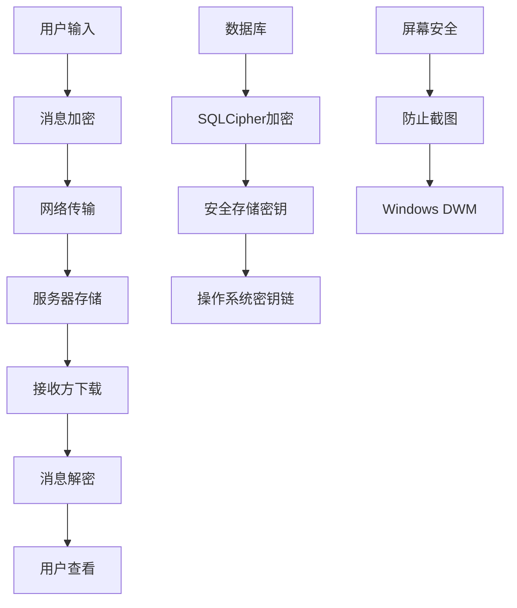

# 项目概述

<cite>
**本文档中引用的文件**   
- [README.md](file://README.md)
- [package.json](file://package.json)
- [app/main.main.ts](file://app/main.main.ts)
- [ts/environment.std.ts](file://ts/environment.std.ts)
- [app/config.main.ts](file://app/config.main.ts)
- [ts/types/Calling.std.ts](file://ts/types/Calling.std.ts)
- [ts/services/calling.preload.ts](file://ts/services/calling.preload.ts)
- [app/attachments.node.ts](file://app/attachments.node.ts)
- [ts/util/privacy.node.ts](file://ts/util/privacy.node.ts)
</cite>

## 目录
1. [简介](#简介)
2. [项目结构](#项目结构)
3. [核心功能](#核心功能)
4. [架构概述](#架构概述)
5. [详细组件分析](#详细组件分析)
6. [隐私与安全特性](#隐私与安全特性)
7. [系统架构图](#系统架构图)
8. [常见用例](#常见用例)
9. [结论](#结论)

## 简介

Signal-Desktop 是一个基于 Electron 框架构建的安全消息桌面应用程序，为 Windows、macOS 和 Linux 用户提供与移动设备同步的私密通信服务。该项目作为 Signal 移动应用的桌面扩展，通过端到端加密技术确保用户通信的隐私性和安全性。Signal-Desktop 的核心设计理念是"隐私优先"，所有消息、语音/视频通话和文件传输都经过加密处理，即使是服务提供商也无法访问通信内容。

该应用程序链接到 Android 或 iOS 上的 Signal 应用，允许用户在计算机上发送和接收加密消息。项目采用 GNU AGPLv3 开源许可证，体现了其对透明度和用户自由的承诺。Signal-Desktop 不仅提供基本的消息传递功能，还支持语音和视频通话、文件共享、群组聊天等高级功能，同时保持了简洁直观的用户界面。

**Section sources**
- [README.md](file://README.md#L1-L46)

## 项目结构

Signal-Desktop 项目采用模块化结构，将不同功能的代码组织在独立的目录中。项目根目录包含主要的配置文件和入口点，如 `package.json` 定义了项目依赖和脚本，`tsconfig.json` 配置了 TypeScript 编译选项。`app` 目录存放 Electron 主进程代码，包括 `main.main.ts` 这个主入口文件，负责应用程序的初始化和窗口管理。

`ts` 目录包含 TypeScript 源代码，按功能划分为多个子目录，如 `components` 存放 UI 组件，`services` 包含核心服务逻辑，`types` 定义类型接口。`_locales` 目录支持多语言本地化，包含 80 多种语言的翻译文件。`stylesheets` 目录管理应用程序的样式表，使用 SCSS 和 Tailwind CSS 进行界面设计。`protos` 目录包含 Protocol Buffer 定义文件，用于定义通信协议和数据结构。

这种清晰的目录结构有助于团队协作和代码维护，使开发者能够快速定位特定功能的实现代码。项目还包含 `config` 目录用于环境配置，`scripts` 目录存放构建和自动化脚本，以及 `sticker-creator` 等特定功能模块。

**Section sources**
- [package.json](file://package.json#L1-L714)
- [project_structure](file://project_structure#L1-L100)

## 核心功能

Signal-Desktop 提供了一系列核心通信功能，所有功能都建立在端到端加密的基础之上。消息传递功能支持文本消息、表情符号、群组聊天和消息撤回。应用程序实现了 Signal 协议，确保每条消息都经过加密，只有发送方和接收方能够解密内容。语音和视频通话功能通过 WebRTC 技术实现，支持一对一和群组通话，通话质量根据网络状况自动调整。

文件共享功能允许用户安全地传输各种类型的文件，所有附件在传输前都会被加密。应用程序还支持消失消息功能，用户可以设置消息在阅读后自动删除的时间。多平台同步功能确保用户在桌面和移动设备之间的无缝切换，所有设备上的消息历史保持同步。

这些功能通过 Electron 框架在桌面环境中实现，利用 Chromium 渲染引擎显示用户界面，同时通过 Node.js 访问本地系统资源。Signal-Desktop 还集成了系统通知、快捷键和文件关联等桌面特性，提供原生应用般的用户体验。

**Section sources**
- [README.md](file://README.md#L1-L46)
- [package.json](file://package.json#L1-L714)

## 架构概述

Signal-Desktop 采用典型的 Electron 应用架构，分为主进程和渲染进程。主进程负责管理应用程序生命周期、创建窗口和处理系统级操作，而渲染进程运行在 Chromium 浏览器环境中，负责用户界面的显示和交互。两个进程通过 IPC（进程间通信）机制进行通信，确保安全性和性能。

应用程序使用 React 作为前端框架，结合 Redux 进行状态管理，实现高效的 UI 更新。后端服务通过 Node.js 模块提供，包括数据库操作、加密解密、网络通信等功能。数据持久化使用 SQLite 数据库，所有数据在存储前都经过加密处理。网络通信基于 WebSocket 协议，与 Signal 服务器进行实时消息同步。

这种架构设计既利用了 Web 技术的灵活性和丰富的生态系统，又通过原生代码访问提供了桌面应用所需的性能和功能。TypeScript 的使用增强了代码的可维护性和类型安全性，而模块化设计使得功能扩展和维护更加容易。

**Section sources**
- [app/main.main.ts](file://app/main.main.ts#L1-L800)
- [package.json](file://package.json#L1-L714)

## 详细组件分析

### 主进程分析

主进程是 Signal-Desktop 的核心，由 `app/main.main.ts` 文件定义。它负责应用程序的初始化、窗口管理和系统集成。主进程通过 Electron 的 `app` 模块监听应用程序事件，如 `ready` 事件表示 Electron 已完成初始化，可以创建窗口。`BrowserWindow` 类用于创建和管理应用程序窗口，支持自定义窗口大小、位置和外观。

主进程还处理系统托盘集成、文件协议处理和崩溃报告等功能。通过 `ipcMain` 模块，主进程可以接收来自渲染进程的消息并作出响应。`systemPreferences` 模块用于检测系统主题设置，实现深色/浅色模式的自动切换。`powerSaveBlocker` 用于防止在通话期间系统进入睡眠状态。

**Section sources**
- [app/main.main.ts](file://app/main.main.ts#L1-L800)

### 渲染进程分析

渲染进程运行在独立的 Chromium 实例中，负责用户界面的呈现。它使用 React 框架构建组件化的 UI，通过 Redux 管理应用状态。渲染进程通过 `ipcRenderer` 模块与主进程通信，请求执行需要原生权限的操作，如文件系统访问或系统通知。

前端代码组织在 `ts/components` 目录中，按功能划分组件。`ts/hooks` 目录包含自定义 React Hooks，用于封装可复用的逻辑。`ts/state` 目录管理 Redux store 的结构和 reducer。国际化支持通过 `react-intl` 实现，允许应用程序动态切换语言。

**Section sources**
- [ts/components](file://ts/components#L1-L100)
- [ts/hooks](file://ts/hooks#L1-L100)

### 加密与安全组件

Signal-Desktop 的安全核心是其加密实现，主要位于 `ts/AttachmentCrypto.node.ts` 和 `ts/textsecure` 目录中。`AttachmentCrypto` 模块负责附件的加密和解密，使用 AES-256 算法保护文件内容。`SignalProtocolStore` 实现了 Signal 协议的核心加密功能，包括密钥交换、消息加密和身份验证。

数据库加密使用 SQLCipher，通过 `@signalapp/sqlcipher` 原生模块实现。每个用户的数据库都有唯一的加密密钥，该密钥本身也经过加密存储。`safeStorage` API 用于安全地存储加密密钥，利用操作系统的密钥链服务（如 macOS 的 Keychain 或 Windows 的 Credential Manager）。

**Section sources**
- [ts/AttachmentCrypto.node.ts](file://ts/AttachmentCrypto.node.ts#L1-L100)
- [ts/textsecure](file://ts/textsecure#L1-L100)

## 隐私与安全特性

Signal-Desktop 将用户隐私放在首位，实施了多层次的安全保护措施。端到端加密确保只有通信双方能够解密消息内容，即使是 Signal 服务器也无法访问明文数据。所有消息、通话和文件都经过加密处理，密钥由用户设备本地生成和存储。

屏幕安全功能（Content Protection）在 Windows 上防止屏幕截图和录屏软件捕获应用程序内容，保护用户隐私。`safeStorage` 模块利用操作系统的安全存储机制保护数据库加密密钥，防止未经授权的访问。日志记录系统自动红acted 敏感信息，如电话号码、群组 ID 和文件路径，确保日志文件不会泄露用户隐私。

应用程序还实现了最小权限原则，只请求必要的系统权限，并提供详细的隐私设置选项。用户可以控制消息通知的显示内容、启用消失消息功能、管理设备链接等。这些特性共同构成了一个全面的隐私保护体系，使 Signal-Desktop 成为注重隐私用户的理想选择。



**Diagram sources **
- [app/main.main.ts](file://app/main.main.ts#L1-L800)
- [ts/util/privacy.node.ts](file://ts/util/privacy.node.ts#L1-L100)

## 系统架构图

Signal-Desktop 的架构采用主进程-渲染进程模式，这是 Electron 应用程序的标准架构。主进程作为应用程序的"大脑"，负责管理窗口、处理系统事件和执行需要原生权限的操作。渲染进程作为"界面"，在独立的 Chromium 实例中运行，提供现代化的 Web 用户界面。

两个进程通过 IPC 机制进行通信，主进程通过 `ipcMain` 监听消息，渲染进程通过 `ipcRenderer` 发送消息。这种分离设计提高了安全性，因为渲染进程运行在沙箱环境中，无法直接访问系统资源。当需要执行文件操作或系统调用时，渲染进程必须通过 IPC 请求主进程代为执行。

数据流从用户界面开始，通过 IPC 传递到主进程，然后通过网络模块发送到 Signal 服务器。接收的消息从服务器通过主进程传递到渲染进程，最终显示在用户界面上。这种架构确保了数据的安全性和应用程序的稳定性。

```mermaid
graph LR
subgraph "主进程"
A[App] --> B[BrowserWindow]
B --> C[IPC Main]
C --> D[Network]
D --> E[Database]
E --> F[Encryption]
end
subgraph "渲染进程"
G[React UI] --> H[IPC Renderer]
H --> I[Redux Store]
I --> J[React Components]
end
C < --> H
D --> |WebSocket| K[Signal Server]
F --> |AES-256| E
```

**Diagram sources **
- [app/main.main.ts](file://app/main.main.ts#L1-L800)
- [ts/services/calling.preload.ts](file://ts/services/calling.preload.ts#L1-L100)

## 常见用例

### 消息传递

用户启动 Signal-Desktop 后，应用程序连接到 Signal 服务器并同步消息历史。发送消息时，文本内容通过 Signal 协议加密，然后通过 WebSocket 发送到服务器。接收方的客户端收到消息后自动解密并显示。群组消息使用发送者密钥（Sender Keys）机制，确保高效的大规模加密通信。

### 语音/视频通话

用户点击通话按钮时，应用程序通过 `@signalapp/ringrtc` 模块建立 WebRTC 连接。主进程处理媒体设备访问权限，渲染进程显示视频流。通话信令通过 Signal 服务器中继，但实际媒体流在客户端之间直接传输（P2P），确保通话内容的私密性。应用程序支持回声消除、噪声抑制等音频处理功能。

### 文件共享

用户拖放文件到聊天窗口时，`Attachments` 模块将文件复制到应用程序的附件目录。`AttachmentCrypto` 模块使用随机生成的密钥加密文件内容，然后将加密后的文件上传到服务器。接收方下载加密文件后，使用共享密钥解密并保存到本地。所有文件传输都经过端到端加密，确保文件内容的安全。

**Section sources**
- [ts/services/calling.preload.ts](file://ts/services/calling.preload.ts#L1-L100)
- [app/attachments.node.ts](file://app/attachments.node.ts#L1-L343)

## 结论

Signal-Desktop 作为一个基于 Electron 的安全消息应用程序，成功地将移动应用的隐私保护特性扩展到桌面平台。通过采用主进程-渲染进程架构，它既利用了 Web 技术的灵活性，又通过原生代码访问提供了必要的性能和功能。端到端加密、屏幕安全和最小权限原则等安全特性，使其成为注重隐私用户的可靠选择。

项目的模块化设计和清晰的代码结构，使得功能扩展和维护相对容易。TypeScript 的使用增强了代码的可维护性和类型安全性，而丰富的测试套件确保了代码质量。未来的发展可能包括更多桌面特定功能的集成，如系统级通知、文件拖放增强和多显示器支持优化。

Signal-Desktop 不仅是一个功能齐全的消息应用程序，更是一个隐私保护技术的典范，展示了如何在提供便捷通信服务的同时，最大限度地保护用户隐私和数据安全。